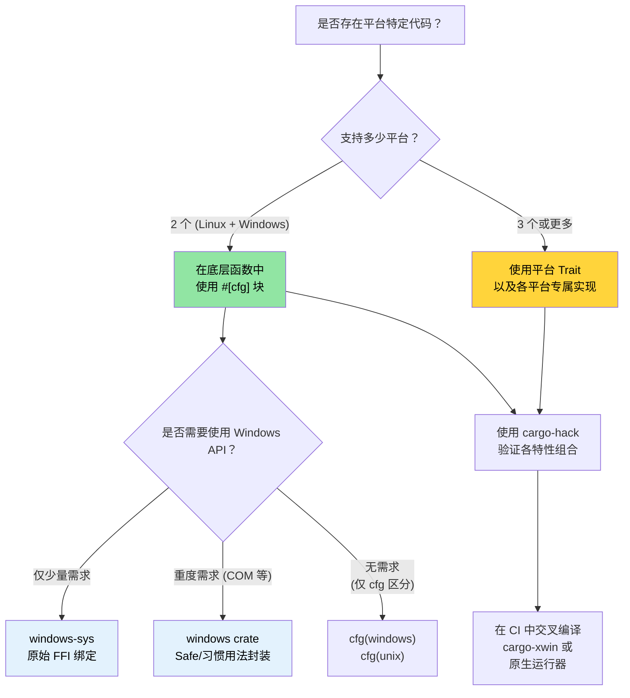

[English Original](../en/ch10-windows-and-conditional-compilation.md)

# Windows 与条件编译 🟡

> **你将学到：**
> - Windows 支持模式：`windows-sys`/`windows` crate 以及 `cargo-xwin`
> - 使用 `#[cfg]` 进行条件编译 —— 由编译器检查，而非预处理器
> - 平台抽象架构：何时使用 `#[cfg]` 块就足够，何时需要使用 Trait
> - 如何在 Linux 上为 Windows 进行交叉编译
>
> **相关章节：** [`no_std` 与特性验证](ch09-no-std-and-feature-verification.md) — `cargo-hack` 与特性验证 · [交叉编译](ch02-cross-compilation-one-source-many-target.md) — 通用的交叉构建设置 · [构建脚本](ch01-build-scripts-buildrs-in-depth.md) — 由 `build.rs` 发出的 `cfg` 标志

### Windows 支持 — 平台抽象

Rust 的 `#[cfg()]` 属性和 Cargo 特性 (Features) 使得单一代码库能够整洁地支持 Linux 和 Windows。本项目已在 `platform::run_command` 中展示了这种模式：

```rust
// 本项目中的真实模式 —— 平台特定的 shell 调用
pub fn exec_cmd(cmd: &str, timeout_secs: Option<u64>) -> Result<CommandResult, CommandError> {
    #[cfg(windows)]
    let mut child = Command::new("cmd")
        .args(["/C", cmd])
        .stdout(Stdio::piped())
        .stderr(Stdio::piped())
        .spawn()?;

    #[cfg(not(windows))]
    let mut child = Command::new("sh")
        .args(["-c", cmd])
        .stdout(Stdio::piped())
        .stderr(Stdio::piped())
        .spawn()?;

    // ... 后续部分是平台无关的 ...
}
```

**可用的 `cfg` 断言：**

```rust
// 操作系统
#[cfg(target_os = "linux")]         // 仅限 Linux
#[cfg(target_os = "windows")]       // 仅限 Windows
#[cfg(target_os = "macos")]         // 仅限 macOS
#[cfg(unix)]                        // Linux, macOS, BSDs 等
#[cfg(windows)]                     // Windows (简写)

// 架构
#[cfg(target_arch = "x86_64")]      // x86 64 位
#[cfg(target_arch = "aarch64")]     // ARM 64 位
#[cfg(target_arch = "x86")]         // x86 32 位

// 指针宽度（架构无关的替代方案）
#[cfg(target_pointer_width = "64")] // 任何 64 位平台
#[cfg(target_pointer_width = "32")] // 任何 32 位平台

// 环境 / C 库
#[cfg(target_env = "gnu")]          // glibc
#[cfg(target_env = "musl")]         // musl libc
#[cfg(target_env = "msvc")]         // Windows 上的 MSVC 

// 字节序
#[cfg(target_endian = "little")]
#[cfg(target_endian = "big")]

// 组合使用 any(), all(), not()
#[cfg(all(target_os = "linux", target_arch = "x86_64"))]
#[cfg(any(target_os = "linux", target_os = "macos"))]
#[cfg(not(windows))]
```

### `windows-sys` 与 `windows` Crate

用于直接调用 Windows API：

```toml
# Cargo.toml — 使用 windows-sys 进行原始 FFI 调用（更轻量，无抽象）
[target.'cfg(windows)'.dependencies]
windows-sys = { version = "0.59", features = [
    "Win32_Foundation",
    "Win32_System_Services",
    "Win32_System_Registry",
    "Win32_System_Power",
] }
# 注意：windows-sys 的发布不遵循语义化版本兼容 (0.48 → 0.52 → 0.59)。
# 建议锁定到特定的次要版本 —— 每次发布都可能删除或重命名 API 绑定。
# 在开始新项目前，请前往 https://github.com/microsoft/windows-rs 查看最新版本。

# 或者使用 windows crate 以获得安全封装（更重，但更易用）
# windows = { version = "0.59", features = [...] }
```

```rust
// src/platform/windows.rs
#[cfg(windows)]
mod win {
    use windows_sys::Win32::System::Power::{
        GetSystemPowerStatus, SYSTEM_POWER_STATUS,
    };

    pub fn get_battery_status() -> Option<u8> {
        let mut status = SYSTEM_POWER_STATUS::default();
        // SAFETY: GetSystemPowerStatus 会向提供的缓冲区写入数据。
        // 该缓冲区的大小和对齐方式正确。
        let ok = unsafe { GetSystemPowerStatus(&mut status) };
        if ok != 0 {
            Some(status.BatteryLifePercent)
        } else {
            None
        }
    }
}
```

**`windows-sys` vs `windows` crate：**

| 维度 | `windows-sys` | `windows` |
|--------|---------------|----------|
| API 风格 | 原始 FFI (`unsafe` 调用) | Safe Rust 封装 |
| 二进制体积 | 极小 (仅包含 extern 声明) | 较大 (包含封装代码) |
| 编译时间 | 快 | 慢 |
| 易用性 | C 风格，需手动维护安全性 | 符合 Rust 习惯 |
| 错误处理 | 原始 `BOOL` / `HRESULT` | `Result<T, windows::core::Error>` |
| 适用场景 | 性能关键、轻量级封装 | 应用程序代码、追求开发效率 |

### 在 Linux 上为 Windows 交叉编译

```bash
# 方案 1: MinGW (GNU ABI)
rustup target add x86_64-pc-windows-gnu
sudo apt install gcc-mingw-w64-x86-64
cargo build --target x86_64-pc-windows-gnu
# 生成 .exe 文件 —— 可在 Windows 运行，链接至 msvcrt

# 方案 2: 通过 xwin 编译 MSVC ABI (实现完全的 MSVC 兼容)
cargo install cargo-xwin
cargo xwin build --target x86_64-pc-windows-msvc
# 会自动下载微软的 CRT 和 SDK 头文件

# 方案 3: 基于 Zig 的交叉编译
cargo zigbuild --target x86_64-pc-windows-gnu
```

**Windows 上的 GNU 与 MSVC ABI：**

| 维度 | `x86_64-pc-windows-gnu` | `x86_64-pc-windows-msvc` |
|--------|-------------------------|---------------------------|
| 链接器 | MinGW `ld` | MSVC `link.exe` 或 `lld-link` |
| C 运行时 | `msvcrt.dll` (通用) | `ucrtbase.dll` (现代) |
| C++ 互操作 | GCC ABI | MSVC ABI |
| 在 Linux 交叉编译 | 容易 (MinGW) | 支持 (`cargo-xwin`) |
| Windows API 支持 | 完整 | 完整 |
| 调试信息格式 | DWARF | PDB |
| 推荐用于 | 简单工具、CI 构建 | 深度 Windows 集成 |

### 条件编译模式

**模式 1：平台特定的模块选择**

```rust
// src/platform/mod.rs — 为每个 OS 编译不同的模块
#[cfg(target_os = "linux")]
mod linux;
#[cfg(target_os = "linux")]
pub use linux::*;

#[cfg(target_os = "windows")]
mod windows;
#[cfg(target_os = "windows")]
pub use windows::*;

// 两个模块都实现了相同的公共 API：
// pub fn get_cpu_temperature() -> Result<f64, PlatformError>
// pub fn list_pci_devices() -> Result<Vec<PciDevice>, PlatformError>
```

**模式 2：特性门控 (Feature-gated) 的平台支持**

```toml
# Cargo.toml
[features]
default = ["linux"]
linux = []              # Linux 特有的硬件访问
windows = ["dep:windows-sys"]  # Windows 特有的 API

[target.'cfg(windows)'.dependencies]
windows-sys = { version = "0.59", features = [...], optional = true }
```

```rust
// 如果试图在未开启特性时为 Windows 构建，则报错：
#[cfg(all(target_os = "windows", not(feature = "windows")))]
compile_error!("请启用 'windows' 特性以构建 Windows 版本");
```

**模式 3：基于 Trait 的平台抽象**

```rust
/// 硬件访问的平台无关接口。
pub trait HardwareAccess {
    type Error: std::error::Error;

    fn read_cpu_temperature(&self) -> Result<f64, Self::Error>;
    fn read_gpu_temperature(&self, gpu_index: u32) -> Result<f64, Self::Error>;
    fn list_pci_devices(&self) -> Result<Vec<PciDevice>, Self::Error>;
    fn send_ipmi_command(&self, cmd: &IpmiCmd) -> Result<IpmiResponse, Self::Error>;
}

#[cfg(target_os = "linux")]
pub struct LinuxHardware;

#[cfg(target_os = "linux")]
impl HardwareAccess for LinuxHardware {
    type Error = LinuxHwError;

    fn read_cpu_temperature(&self) -> Result<f64, Self::Error> {
        // 从 /sys/class/thermal/thermal_zone0/temp 读取
        let raw = std::fs::read_to_string("/sys/class/thermal/thermal_zone0/temp")?;
        Ok(raw.trim().parse::<f64>()? / 1000.0)
    }
    // ...
}

#[cfg(target_os = "windows")]
pub struct WindowsHardware;

#[cfg(target_os = "windows")]
impl HardwareAccess for WindowsHardware {
    type Error = WindowsHwError;

    fn read_cpu_temperature(&self) -> Result<f64, Self::Error> {
        // 通过 WMI (Win32_TemperatureProbe) 或 Open Hardware Monitor 读取
        todo!("WMI 温度查询待实现")
    }
    // ...
}

/// 创建对应的平台实现
pub fn create_hardware() -> impl HardwareAccess {
    #[cfg(target_os = "linux")]
    { LinuxHardware }
    #[cfg(target_os = "windows")]
    { WindowsHardware }
}
```

### 平台抽象架构

对于针对多个平台的项目，建议将代码组织为三个层面：

```text
┌──────────────────────────────────────────────────┐
│ 应用逻辑 (平台无关)                               │
│  diag_tool, accel_diag, network_diag, event_log 等│
│  仅依赖于平台抽象 Trait                            │
├──────────────────────────────────────────────────┤
│ 平台抽象层 (Trait 定义)                           │
│  trait HardwareAccess { ... }                     │
│  trait CommandRunner { ... }                      │
│  trait FileSystem { ... }                         │
├──────────────────────────────────────────────────┤
│ 平台具体实现 (受 cfg 保护)                         │
│  ┌──────────────┐  ┌──────────────┐              │
│  │ Linux 实现    │  │ Windows 实现  │              │
│  │ /sys, /proc  │  │ WMI, 注册表  │              │
│  │ ipmitool     │  │ ipmiutil     │              │
│  │ lspci        │  │ devcon       │              │
│  └──────────────┘  └──────────────┘              │
└──────────────────────────────────────────────────┘
```

**测试抽象层**：在单元测试中模拟 (Mock) 平台 Trait：

```rust
#[cfg(test)]
mod tests {
    use super::*;

    struct MockHardware {
        cpu_temp: f64,
        gpu_temps: Vec<f64>,
    }

    impl HardwareAccess for MockHardware {
        type Error = std::io::Error;

        fn read_cpu_temperature(&self) -> Result<f64, Self::Error> {
            Ok(self.cpu_temp)
        }

        fn read_gpu_temperature(&self, index: u32) -> Result<f64, Self::Error> {
            self.gpu_temps.get(index as usize)
                .copied()
                .ok_or_else(|| std::io::Error::new(
                    std::io::ErrorKind::NotFound,
                    format!("未找到 GPU {index}")
                ))
        }

        fn list_pci_devices(&self) -> Result<Vec<PciDevice>, Self::Error> {
            Ok(vec![]) // 模拟返回空列表
        }

        fn send_ipmi_command(&self, _cmd: &IpmiCmd) -> Result<IpmiResponse, Self::Error> {
            Ok(IpmiResponse::default())
        }
    }

    #[test]
    fn test_thermal_check_with_mock() {
        let hw = MockHardware {
            cpu_temp: 75.0,
            gpu_temps: vec![82.0, 84.0],
        };
        let result = run_thermal_diagnostic(&hw);
        assert!(result.is_ok());
    }
}
```

### 应用：Linux 优先，Windows 就绪

本项目已经部分实现了 Windows 就绪。可以使用 [`cargo-hack`](ch09-no-std-and-feature-verification.md) 验证所有特性组合，并利用 [交叉编译](ch02-cross-compilation-one-source-many-target.md) 在 Linux 上测试 Windows 版本：

**现状：**
- `platform::run_command` 已使用 `#[cfg(windows)]` 进行 shell 选择。
- 测试代码已使用 `#[cfg(windows)]` / `#[cfg(not(windows))]` 区分平台特定的测试命令。

**建议的 Windows 支持演进路径：**

```text
阶段 1：提取平台抽象 Trait (当前 → 2 周)
  ├─ 在 core_lib 中定义 HardwareAccess Trait
  ├─ 将当前的 Linux 代码封装进 LinuxHardware 实现中
  └─ 所有诊断模块依赖于 Trait，而非 Linux 特有的实现

阶段 2：增加 Windows 存根 (Stubs) (2 周)
  ├─ 实现 WindowsHardware，暂留 TODO 存根
  ├─ 在 CI 中增加 x86_64-pc-windows-msvc 编译检查
  └─ 确保测试可以在所有平台上通过 MockHardware 运行

阶段 3：Windows 具体实现 (持续进行)
  ├─ IPMI 实现：通过 ipmiutil.exe 或 OpenIPMI Windows 驱动
  ├─ GPU 实现：通过 accel-mgmt (accel-api.dll) —— 接口与 Linux 保持一致
  ├─ PCIe 实现：通过 Windows Setup API (SetupDiEnumDeviceInfo)
  └─ NIC 实现：通过 WMI (Win32_NetworkAdapter)
```

**在 CI 中增加跨平台构建：**

```yaml
# 添加到 CI 矩阵
- target: x86_64-pc-windows-msvc
  os: windows-latest
  name: windows-x86_64
```

这可以确保即便在 Windows 实现完全闭环前，代码也能在 Windows 环境下编译通过 —— 从而尽早发现 `cfg` 错误。

> **关键洞察**：抽象层在第一天不必追求完美。可以先在底层函数中直接使用 `#[cfg]` 块（如现在的 `exec_cmd`），当有两三个平台实现时，再考虑重构为 Trait。过早的抽象反而比简单的 `#[cfg]` 块更糟糕。

### 条件编译决策树



### 🏋️ 练习

#### 🟢 练习 1：平台相关的条件模块

创建一个模块，并分别实现 `get_hostname()` 函数的 `#[cfg(unix)]` 和 `#[cfg(windows)]` 版本。验证其可以通过 `cargo check` 以及 `cargo check --target x86_64-pc-windows-msvc`。

<details>
<summary>答案</summary>

```rust
// src/hostname.rs
#[cfg(unix)]
pub fn get_hostname() -> String {
    use std::fs;
    fs::read_to_string("/etc/hostname")
        .unwrap_or_else(|_| "unknown".to_string())
        .trim()
        .to_string()
}

#[cfg(windows)]
pub fn get_hostname() -> String {
    use std::env;
    env::var("COMPUTERNAME").unwrap_or_else(|_| "unknown".to_string())
}

#[cfg(test)]
mod tests {
    use super::*;

    #[test]
    fn hostname_is_not_empty() {
        let name = get_hostname();
        assert!(!name.is_empty());
    }
}
```

```bash
# 验证 Linux 编译情况
cargo check

# 验证 Windows 编译情况（交叉检查）
rustup target add x86_64-pc-windows-msvc
cargo check --target x86_64-pc-windows-msvc
```
</details>

#### 🟡 练习 2：使用 cargo-xwin 交叉编译 Windows 版本

在 Linux 环境下安装 `cargo-xwin`，并为 `x86_64-pc-windows-msvc` 构建一个简单的二进制文件。验证输出是否为 `.exe`。

<details>
<summary>答案</summary>

```bash
cargo install cargo-xwin
rustup target add x86_64-pc-windows-msvc

cargo xwin build --release --target x86_64-pc-windows-msvc
# 会自动下载 Windows SDK 头文件和库

file target/x86_64-pc-windows-msvc/release/my-binary.exe
# 输出示例：PE32+ executable (console) x86-64, for MS Windows

# 你也可以通过 Wine 进行测试：
wine target/x86_64-pc-windows-msvc/release/my-binary.exe
```
</details>

### 关键收获

- 先在底层函数中使用 `#[cfg]` 块；仅在三个或更多平台的实现逻辑发生分叉时才考虑重构为 Trait。
- `windows-sys` 提供原始 FFI 接口；`windows` crate 则提供符合 Rust 习惯的安全封装。
- `cargo-xwin` 允许你在 Linux 上交叉编译至 Windows MSVC ABI —— 无需真实的 Windows 机器。
- 即使只在 Linux 上运行，也建议在 CI 中对 `--target x86_64-pc-windows-msvc` 进行编译检查。
- 将 `#[cfg]` 与 Cargo 特性结合使用，以实现可选的平台支持（如 `feature = "windows"`）。

---
