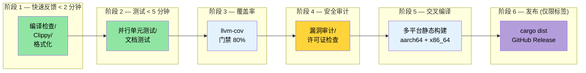

[English Original](../en/ch11-putting-it-all-together-a-production-cic.md)

# 综合实践 — 生产级 CI/CD 流水线 🟡

> **你将学到：**
> - 构建多阶段 GitHub Actions CI 工作流 (检查 → 测试 → 覆盖率 → 安全 → 交叉编译 → 发布)
> - 使用 `rust-cache` 的缓存策略及 `save-if` 微调
> - 分离日常 push 与按计划运行 (Nightly) 的 Miri 和 sanitizer 任务
> - 使用 `Makefile.toml` 和 pre-commit 钩子实现任务自动化
> - 使用 `cargo-dist` 实现自动化发布
>
> **相关章节：** [构建脚本](ch01-build-scripts-buildrs-in-depth.md) · [交叉编译](ch02-cross-compilation-one-source-many-target.md) · [基准测试](ch03-benchmarking-measuring-what-matters.md) · [覆盖率](ch04-code-coverage-seeing-what-tests-miss.md) · [Miri/Sanitizer](ch05-miri-valgrind-and-sanitizers-verifying-u.md) · [依赖管理](ch06-dependency-management-and-supply-chain-s.md) · [发布配置](ch07-release-profiles-and-binary-size.md) · [编译期工具](ch08-compile-time-and-developer-tools.md) · [`no_std`](ch09-no-std-and-feature-verification.md) · [Windows](ch10-windows-and-conditional-compilation.md)

单一工具固然有用，但能将它们有机结合并在每次 push 时自动运行的流水线则具有革命性意义。本章将第 1 章至第 10 章涉及的工具整合为一个完整的 CI/CD 工作流。

### 完整的 GitHub Actions 工作流

在一个工作流文件中并行运行所有验证阶段：

```yaml
# .github/workflows/ci.yml
name: CI

on:
  push:
    branches: [main]
  pull_request:
    branches: [main]

env:
  CARGO_TERM_COLOR: always
  CARGO_ENCODED_RUSTFLAGS: "-Dwarnings"  # 将警告视为错误 (仅限顶层 crate)
  # 注意：与 RUSTFLAGS 不同，CARGO_ENCODED_RUSTFLAGS 不会影响构建脚本或过程宏，
  # 从而避免了因第三方库的警告导致构建失败。
  # 如果你想对构建脚本也强制执行此规则，请改用 RUSTFLAGS="-Dwarnings"。

jobs:
  # ─── 阶段 1: 快速反馈 (< 2 分钟) ───
  check:
    name: 检查 + Clippy + 格式化
    runs-on: ubuntu-latest
    steps:
      - uses: actions/checkout@v4
      - uses: dtolnay/rust-toolchain@stable
        with:
          components: clippy, rustfmt

      - uses: Swatinem/rust-cache@v2  # 缓存依赖

      - name: 检查 Cargo.lock
        run: cargo fetch --locked

      - name: 检查文档
        run: RUSTDOCFLAGS='-Dwarnings' cargo doc --workspace --all-features --no-deps

      - name: 检查编译
        run: cargo check --workspace --all-targets --all-features

      - name: Clippy 静态检查
        run: cargo clippy --workspace --all-targets --all-features -- -D warnings

      - name: 代码格式化
        run: cargo fmt --all -- --check

  # ─── 阶段 2: 测试 (< 5 分钟) ───
  test:
    name: 测试 (${{ matrix.os }})
    needs: check
    strategy:
      matrix:
        os: [ubuntu-latest, windows-latest]
    runs-on: ${{ matrix.os }}
    steps:
      - uses: actions/checkout@v4
      - uses: dtolnay/rust-toolchain@stable
      - uses: Swatinem/rust-cache@v2

      - name: 运行单元测试
        run: cargo test --workspace

      - name: 运行文档测试
        run: cargo test --workspace --doc

  # ─── 阶段 3: 交叉编译 (< 10 分钟) ───
  cross:
    name: 交叉编译 (${{ matrix.target }})
    needs: check
    strategy:
      matrix:
        include:
          - target: x86_64-unknown-linux-musl
            os: ubuntu-latest
          - target: aarch64-unknown-linux-gnu
            os: ubuntu-latest
            use_cross: true
    runs-on: ${{ matrix.os }}
    steps:
      - uses: actions/checkout@v4
      - uses: dtolnay/rust-toolchain@stable
        with:
          targets: ${{ matrix.target }}

      - name: 安装 musl-tools
        if: contains(matrix.target, 'musl')
        run: sudo apt-get install -y musl-tools

      - name: 安装 cross
        if: matrix.use_cross
        uses: taiki-e/install-action@cross

      - name: 构建 (原生)
        if: "!matrix.use_cross"
        run: cargo build --release --target ${{ matrix.target }}

      - name: 构建 (使用 cross)
        if: matrix.use_cross
        run: cross build --release --target ${{ matrix.target }}

      - name: 上传产物
        uses: actions/upload-artifact@v4
        with:
          name: binary-${{ matrix.target }}
          path: target/${{ matrix.target }}/release/diag_tool

  # ─── 阶段 4: 覆盖率 (< 10 分钟) ───
  coverage:
    name: 代码覆盖率
    needs: check
    runs-on: ubuntu-latest
    steps:
      - uses: actions/checkout@v4
      - uses: dtolnay/rust-toolchain@stable
        with:
          components: llvm-tools-preview
      - uses: taiki-e/install-action@cargo-llvm-cov

      - name: 生成覆盖率数据
        run: cargo llvm-cov --workspace --lcov --output-path lcov.info

      - name: 强制执行最低覆盖率门禁
        run: cargo llvm-cov --workspace --fail-under-lines 75

      - name: 上传至 Codecov
        uses: codecov/codecov-action@v4
        with:
          files: lcov.info
          token: ${{ secrets.CODECOV_TOKEN }}

  # ─── 阶段 5: 安全验证 (< 15 分钟) ───
  miri:
    name: Miri 验证
    needs: check
    runs-on: ubuntu-latest
    steps:
      - uses: actions/checkout@v4
      - uses: dtolnay/rust-toolchain@nightly
        with:
          components: miri

      - name: 运行 Miri
        run: cargo miri test --workspace
        env:
          MIRIFLAGS: "-Zmiri-backtrace=full"

  # ─── 阶段 6: 基准测试 (仅限 PR, < 10 分钟) ───
  bench:
    name: 基准测试
    if: github.event_name == 'pull_request'
    needs: check
    runs-on: ubuntu-latest
    steps:
      - uses: actions/checkout@v4
      - uses: dtolnay/rust-toolchain@stable

      - name: 运行基准测试
        run: cargo bench -- --output-format bencher | tee bench.txt

      - name: 与基准线对比
        uses: benchmark-action/github-action-benchmark@v1
        with:
          tool: 'cargo'
          output-file-path: bench.txt
          github-token: ${{ secrets.GITHUB_TOKEN }}
          alert-threshold: '115%'
          comment-on-alert: true
```

**流水线执行流程：**

```text
                    ┌─────────┐
                    │  check  │  ← clippy + fmt + cargo check (2 min)
                    └────┬────┘
           ┌─────────┬──┴──┬──────────┬──────────┐
           ▼         ▼     ▼          ▼          ▼
       ┌──────┐  ┌──────┐ ┌────────┐ ┌──────┐ ┌──────┐
       │ test │  │cross │ │coverage│ │ miri │ │bench │
       │ (2×) │  │ (2×) │ │        │ │      │ │(PR)  │
       └──────┘  └──────┘ └────────┘ └──────┘ └──────┘
         3 min    8 min     8 min     12 min    5 min

总耗时：约 14 分钟 (在 check 门禁后的并行阶段)
```

### CI 缓存策略

[`Swatinem/rust-cache@v2`](https://github.com/Swatinem/rust-cache) 是 Rust CI 的标准缓存 Action。它可以缓存 `~/.cargo` 和 `target/` 目录，但大型工作区需要进行一定的微调：

```yaml
# 基础用法 (即上述代码中使用的)
- uses: Swatinem/rust-cache@v2

# 针对大型工作区的微调策略：
- uses: Swatinem/rust-cache@v2
  with:
    # 为每个任务设置独立前缀 —— 防止测试产物污染构建缓存
    prefix-key: "v1-rust"
    key: ${{ matrix.os }}-${{ matrix.target || 'default' }}
    # 仅在 main 分支保存缓存 (PR 分支仅读取不写入)
    save-if: ${{ github.ref == 'refs/heads/main' }}
    # 缓存 Cargo 注册表 + Git 下载内容 + target 目录
    cache-targets: true
    cache-all-crates: true
```

**缓存失效的常见陷阱：**

| 问题 | 修复方法 |
|---------|-----|
| 缓存无限增长 (>5 GB) | 设置 `prefix-key: "v2-rust"` 以强制清理旧缓存 |
| 不同特性 (features) 互相污染 | 使用 `key: ${{ hashFiles('**/Cargo.lock') }}` |
| PR 缓存覆盖了主分支缓存 | 设置 `save-if: ${{ github.ref == 'refs/heads/main' }}` |
| 交叉编译目标导致体积膨胀 | 为不同的三元组 (target triple) 设置不同的 `key` |

**跨任务共享缓存：**

`check` 任务负责保存缓存；后续任务（`test`, `cross`, `coverage`）只需读取。通过在 `main` 分支上设置 `save-if`，PR 运行任务可以享受到缓存依赖带来的加速，且不会写回失效的缓存。

> **对大型工作区的实测收益**：从未启动构建需 ~4 分钟 → 缓存态构建需 ~45 秒。仅缓存 Action 这一项就在单次流水线运行中节省了约 25 分钟的累计 CI 时间。

### 使用 `cargo-make` 的 Makefile.toml

[`cargo-make`](https://sagiegurari.github.io/cargo-make/) 提供了一个跨平台的任务运行器（不同于 `make`/`Makefile`）：

```bash
# 安装
cargo install cargo-make
```

```toml
# 工作区根目录下的 Makefile.toml

[config]
default_to_workspace = false

# ─── 开发者工作流 ───

[tasks.dev]
description = "本地全量验证 (与 CI 检查项一致)"
dependencies = ["check", "test", "clippy", "fmt-check"]

[tasks.check]
command = "cargo"
args = ["check", "--workspace", "--all-targets"]

[tasks.test]
command = "cargo"
args = ["test", "--workspace"]

[tasks.clippy]
command = "cargo"
args = ["clippy", "--workspace", "--all-targets", "--", "-D", "warnings"]

[tasks.fmt]
command = "cargo"
args = ["fmt", "--all"]

[tasks.fmt-check]
command = "cargo"
args = ["fmt", "--all", "--", "--check"]

# ─── 覆盖率 ───

[tasks.coverage]
description = "生成 HTML 覆盖率报告"
install_crate = "cargo-llvm-cov"
command = "cargo"
args = ["llvm-cov", "--workspace", "--html", "--open"]

[tasks.coverage-ci]
description = "生成供 CI 上传使用的 LCOV 数据"
install_crate = "cargo-llvm-cov"
command = "cargo"
args = ["llvm-cov", "--workspace", "--lcov", "--output-path", "lcov.info"]

# ─── 基准测试 ───

[tasks.bench]
description = "运行所有基准测试"
command = "cargo"
args = ["bench"]

# ─── 交叉编译 ───

[tasks.build-musl]
description = "构建静态二进制 (musl)"
command = "cargo"
args = ["build", "--release", "--target", "x86_64-unknown-linux-musl"]

[tasks.build-arm]
description = "为 aarch64 构建 (需要 cross)"
command = "cross"
args = ["build", "--release", "--target", "aarch64-unknown-linux-gnu"]

[tasks.build-all]
description = "构建所有发布目标"
dependencies = ["build-musl", "build-arm"]

# ─── 安全验证 ───

[tasks.miri]
description = "在所有测试上运行 Miri"
toolchain = "nightly"
command = "cargo"
args = ["miri", "test", "--workspace"]

[tasks.audit]
description = "检查已知漏洞"
install_crate = "cargo-audit"
command = "cargo"
args = ["audit"]

# ─── 发布 ───

[tasks.release-dry]
description = "预览 cargo-release 的操作"
install_crate = "cargo-release"
command = "cargo"
args = ["release", "--workspace", "--dry-run"]
```

**使用方法：**

```bash
# 本地模拟 CI 流水线运行
cargo make dev

# 生成并查看覆盖率报告
cargo make coverage

# 为所有目标平台构建
cargo make build-all

# 运行 Miri 安全检查
cargo make miri

# 漏洞审计
cargo make audit
```

### Pre-Commit 钩子：自定义脚本与 `cargo-husky`

在问题进入 CI 之前就拦截它们。推荐方案是创建一个自定义 Git 钩子 —— 它简单、透明且无外部依赖：

```bash
#!/bin/sh
# .githooks/pre-commit

set -e

echo "=== 执行 Pre-commit 检查 ==="

# 先执行速度最快的检查
echo "→ 检查代码格式 (cargo fmt --check)"
cargo fmt --all -- --check

echo "→ 检查编译 (cargo check)"
cargo check --workspace --all-targets

echo "→ 静态分析 (cargo clippy)"
cargo clippy --workspace --all-targets -- -D warnings

echo "→ 快速单元测试 (cargo test --lib)"
cargo test --workspace --lib

echo "=== 所有检查已通过 ==="
```

```bash
# 启用钩子
git config core.hooksPath .githooks
chmod +x .githooks/pre-commit
```

**另一种选择：`cargo-husky`** (通过构建脚本自动安装钩子):

> ⚠️ **注意**：`cargo-husky` 自 2022 年以来未曾更新。它依然能用，但事实上已无人维护。对于新项目，建议采用上述自定义钩子的方式。

```toml
# Cargo.toml — 添加至根 crate 的 dev-dependencies
[dev-dependencies]
cargo-husky = { version = "1", default-features = false, features = [
    "precommit-hook",
    "run-cargo-check",
    "run-cargo-clippy",
    "run-cargo-fmt",
    "run-cargo-test",
] }
```

### 发布工作流：`cargo-release` 与 `cargo-dist`

**`cargo-release`** — 自动化执行版本提升、打标签以及发布操作：

```bash
# 安装
cargo install cargo-release
```

```toml
# 工作区根目录下的 release.toml
[workspace]
consolidate-commits = true
pre-release-commit-message = "chore: 发布版本 {{version}}"
tag-message = "v{{version}}"
tag-name = "v{{version}}"

# 禁止发布内部 crate 
[[package]]
name = "core_lib"
release = false

[[package]]
name = "diag_framework"
release = false

# 仅发布主要的二进制 crate
[[package]]
name = "diag_tool"
release = true
```

```bash
# 预览发布操作
cargo release patch --dry-run

# 执行发布 (提升版本号、提交更改、打标签、可选发布至 crates.io)
cargo release patch --execute
# 0.1.0 → 0.1.1

cargo release minor --execute
# 0.1.1 → 0.2.0
```

**`cargo-dist`** — 为 GitHub Releases 生成可下载的离线二进制包：

```bash
# 安装
cargo install cargo-dist

# 初始化 (生成 CI 工作流及元数据)
cargo dist init

# 预览构建计划
cargo dist plan

# 执行发布构建 (通常由 CI 任务在 push tag 时执行)
cargo dist build
```

```toml
# 由 `cargo dist init` 添加至 Cargo.toml 的部分
[workspace.metadata.dist]
cargo-dist-version = "0.28.0"
ci = "github"
targets = [
    "x86_64-unknown-linux-gnu",
    "x86_64-unknown-linux-musl",
    "aarch64-unknown-linux-gnu",
    "x86_64-pc-windows-msvc",
]
install-path = "CARGO_HOME"
```

这会生成一个 GitHub Actions 工作流，在 push 标签时会自动执行：
1. 为所有目标平台构建二进制文件。
2. 创建 GitHub Release 并上传 `.tar.gz` / `.zip` 压缩包。
3. 生成 Shell/PowerShell 安装脚本。
4. 发布到 crates.io (若已配置)。

### 亲身尝试 — 总结性练习

本练习将贯穿之前每一章。你将为一个全新的 Rust 工作区构建完整的工程化流水线：

1. **创建一个新工作区**，包含两个 crate：库 (`core_lib`) 和二进制 (`cli`)。添加一个 `build.rs`，利用 `SOURCE_DATE_EPOCH` 嵌入 Git 哈希和构建时间戳 (第 1 章)。

2. **设置交叉编译**，针对 `x86_64-unknown-linux-musl` 和 `aarch64-unknown-linux-gnu`。验证两个目标均可通过 `cargo zigbuild` 或 `cross` 成功构建 (第 2 章)。

3. **添加基准测试**，使用 Criterion 或 Divan 测量 `core_lib` 某个函数的性能。本地运行并记录基准线 (第 3 章)。

4. **测量代码覆盖率**，使用 `cargo llvm-cov`。设置 80% 的最低门槛并确保其通过 (第 4 章)。

5. **运行 Miri 测试** 与 `cargo +nightly careful test`。如果你编写了 `unsafe` 代码，请确保对应测试能覆盖到它 (第 5 章)。

6. **配置 `cargo-deny`**，在 `deny.toml` 中禁用 `openssl` 并强制执行 MIT/Apache-2.0 许可证准则 (第 6 章)。

7. **优化发布配置**，启用 `lto = "thin"`, `strip = true` 和 `codegen-units = 1`。使用 `cargo bloat` 对比优化前后的二进制体积变化 (第 7 章)。

8. **添加特性验证**。为一个可选依赖项创建特性标志，并使用 `cargo hack --each-feature` 确保其能独立编译 (第 9 章)。

9. **编写 GitHub Actions 工作流** (参考本章)，包含上述 6 个阶段。添加微调后的 `Swatinem/rust-cache@v2`。

**达标标准**：Push 代码到 GitHub → 所有的 CI 阶段均显示绿色 → `cargo dist plan` 输出了正确的发布目标。恭喜，你已经拥有了一个生产级的 Rust 流水线。

### CI 流水线架构



### 关键收获

- 将 CI 划分为并行阶段：先执行快速反馈任务，慢速任务放在门禁之后。
- 为 `Swatinem/rust-cache@v2` 使用 `save-if: ${{ github.ref == 'refs/heads/main' }}` 可防止 PR 导致缓存失效。
- 使用 `schedule:` (Nightly) 触发器执行 Miri 或繁重的 sanitizer 任务。
- `Makefile.toml` (`cargo make`) 将多工具工作流打包为单一本地命令。
- `cargo-dist` 实现了跨平台发布的模版化 —— 不再需要手动编写海量的平台矩阵 YAML。

---
