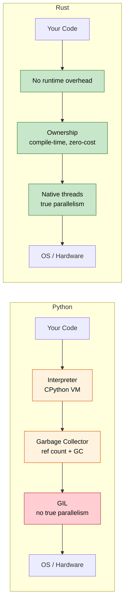

## Speaker Intro and General Approach / 讲师介绍与整体方法

- Speaker intro / 讲师介绍
    - Principal Firmware Architect in Microsoft SCHIE (Silicon and Cloud Hardware Infrastructure Engineering) team / Microsoft SCHIE（Silicon and Cloud Hardware Infrastructure Engineering）团队首席固件架构师
    - Industry veteran with expertise in security, systems programming (firmware, operating systems, hypervisors), CPU and platform architecture, and C++ systems / 在安全、系统编程（固件、操作系统、虚拟机监控器）、CPU 与平台架构以及 C++ 系统方面经验丰富
    - Started programming in Rust in 2017 (@AWS EC2), and have been in love with the language ever since / 2017 年在 AWS EC2 开始使用 Rust，此后长期深度投入
- This course is intended to be as interactive as possible / 本课程尽量采用高互动式教学
    - Assumption: You know Python and its ecosystem / 前提：你熟悉 Python 及其生态
    - Examples deliberately map Python concepts to Rust equivalents / 示例会刻意把 Python 概念映射到 Rust 对应概念
    - **Please feel free to ask clarifying questions at any point of time** / **任何时候都欢迎提出澄清性问题**

---

## The Case for Rust for Python Developers / Rust 对 Python 开发者的价值

> **What you'll learn / 你将学到：** Why Python developers are adopting Rust, real-world performance wins (Dropbox, Discord, Pydantic), when Rust is the right choice vs staying with Python, and the core philosophical differences between the two languages.
>
> 为什么越来越多 Python 开发者开始采用 Rust、真实世界中的性能收益（Dropbox、Discord、Pydantic）、何时应选择 Rust 而不是继续使用 Python，以及这两门语言在核心设计理念上的差异。
>
> **Difficulty / 难度：** 🟢 Beginner / 初级

### Performance: From Minutes to Milliseconds / 性能：从分钟到毫秒

Python is famously slow for CPU-bound work. Rust provides C-level performance with a high-level feel.

Python 在 CPU 密集型任务上出了名地慢。Rust 则在保留高级语言体验的同时，提供接近 C 的性能。

```python
# Python - ~2 seconds for 10 million calls
import time

def fibonacci(n: int) -> int:
    if n <= 1:
        return n
    a, b = 0, 1
    for _ in range(2, n + 1):
        a, b = b, a + b
    return b

start = time.perf_counter()
results = [fibonacci(n % 30) for n in range(10_000_000)]
elapsed = time.perf_counter() - start
print(f"Elapsed: {elapsed:.2f}s")  # ~2s on typical hardware
```

```rust
// Rust - ~0.07 seconds for the same 10 million calls
use std::time::Instant;

fn fibonacci(n: u64) -> u64 {
    if n <= 1 {
        return n;
    }
    let (mut a, mut b) = (0u64, 1u64);
    for _ in 2..=n {
        let temp = b;
        b = a + b;
        a = temp;
    }
    b
}

fn main() {
    let start = Instant::now();
    let results: Vec<u64> = (0..10_000_000).map(|n| fibonacci(n % 30)).collect();
    println!("Elapsed: {:.2?}", start.elapsed());  // ~0.07s
}
```

> Note / 说明: Rust should be run in release mode (`cargo run --release`) for a fair performance comparison.
>
> 为了公平比较性能，Rust 应使用 release 模式运行（`cargo run --release`）。
>
> **Why the difference? / 为什么差距这么大？** Python dispatches every `+` through a dictionary lookup, unboxes integers from heap objects, and checks types at every operation. Rust compiles `fibonacci` directly to a handful of x86 `add`/`mov` instructions - the same code a C compiler would produce.
>
> Python 中每次 `+` 运算都要经过字典查找、从堆对象中拆箱整数，并在每一步执行类型检查。Rust 则会把 `fibonacci` 直接编译成少量 x86 `add`/`mov` 指令，本质上就是 C 编译器会生成的那类代码。

### Memory Safety Without a Garbage Collector / 没有垃圾回收器的内存安全

Python's reference-counting GC has known issues: circular references, unpredictable `__del__` timing, and memory fragmentation. Rust eliminates these at compile time.

Python 的引用计数 GC 有几个已知问题：循环引用、`__del__` 调用时机不可预测，以及内存碎片。Rust 在编译期就能避免这些问题。

```python
# Python - circular reference that CPython's ref counter can't free
class Node:
    def __init__(self, value):
        self.value = value
        self.parent = None
        self.children = []

    def add_child(self, child):
        self.children.append(child)
        child.parent = self  # Circular reference!

# These two nodes reference each other - ref count never reaches 0.
# CPython's cycle detector will *eventually* clean them up,
# but you can't control when, and it adds GC pause overhead.
root = Node("root")
child = Node("child")
root.add_child(child)
```

```rust
// Rust - ownership prevents circular references by design
struct Node {
    value: String,
    children: Vec<Node>,  // Children are OWNED - no cycles possible
}

impl Node {
    fn new(value: &str) -> Self {
        Node {
            value: value.to_string(),
            children: Vec::new(),
        }
    }

    fn add_child(&mut self, child: Node) {
        self.children.push(child);  // Ownership transfers here
    }
}

fn main() {
    let mut root = Node::new("root");
    let child = Node::new("child");
    root.add_child(child);
    // When root is dropped, all children are dropped too.
    // Deterministic, zero overhead, no GC.
}
```

> **Key insight / 核心洞见：** In Rust, the child doesn't hold a reference back to the parent. If you truly need cross-references (like a graph), you use explicit mechanisms like `Rc<RefCell<T>>` or indices - making the complexity visible and intentional.
>
> 在 Rust 中，子节点默认不会反向持有父节点引用。如果你确实需要交叉引用（例如图结构），就必须显式使用 `Rc<RefCell<T>>` 或索引等方式，让复杂性显性化、可审查。

***

## Common Python Pain Points That Rust Addresses / Rust 能解决的常见 Python 痛点

### 1. Runtime Type Errors / 运行时类型错误

The most common Python production bug: passing the wrong type to a function. Type hints help, but they aren't enforced.

Python 生产环境里最常见的问题之一，就是把错误类型传给函数。类型提示能提供帮助，但它们本身并不具备强制力。

```python
# Python - type hints are suggestions, not rules
def process_user(user_id: int, name: str) -> dict:
    return {"id": user_id, "name": name.upper()}

# These all "work" at the call site - fail at runtime
process_user("not-a-number", 42)        # TypeError at .upper()
process_user(None, "Alice")             # Works until you use user_id as int

# Even with mypy, you can still bypass types:
data = json.loads('{"id": "oops"}')     # Always returns Any
process_user(data["id"], data["name"])  # mypy can't catch this
```

```rust
// Rust - the compiler catches all of these before the program runs
fn process_user(user_id: i64, name: &str) -> User {
    User {
        id: user_id,
        name: name.to_uppercase(),
    }
}

// process_user("not-a-number", 42);     // Compile error: expected i64, found &str
// process_user(None, "Alice");           // Compile error: expected i64, found Option
// Extra arguments are always a compile error.

// Deserializing JSON is type-safe too:
#[derive(Deserialize)]
struct UserInput {
    id: i64,     // Must be a number in the JSON
    name: String, // Must be a string in the JSON
}
let input: UserInput = serde_json::from_str(json_str)?; // Returns Err if types mismatch
process_user(input.id, &input.name); // Guaranteed correct types
```

### 2. None: The Billion Dollar Mistake (Python Edition) / None：Python 版的“十亿美元错误”

`None` can appear anywhere a value is expected. Python has no compile-time way to prevent `AttributeError: 'NoneType' object has no attribute ...`.

在 Python 中，`None` 可以出现在任何本应出现值的位置。Python 没有编译期机制来阻止 `AttributeError: 'NoneType' object has no attribute ...` 这类错误。

```python
# Python - None sneaks in everywhere
def find_user(user_id: int) -> dict | None:
    users = {1: {"name": "Alice"}, 2: {"name": "Bob"}}
    return users.get(user_id)

user = find_user(999)         # Returns None
print(user["name"])           # TypeError: 'NoneType' object is not subscriptable

# Even with Optional type hint, nothing enforces the check:
from typing import Optional
def get_name(user_id: int) -> Optional[str]:
    return None

name: Optional[str] = get_name(1)
print(name.upper())          # AttributeError - mypy warns, runtime doesn't care
```

```rust
// Rust - None is impossible unless explicitly handled
fn find_user(user_id: i64) -> Option<User> {
    let users = HashMap::from([
        (1, User { name: "Alice".into() }),
        (2, User { name: "Bob".into() }),
    ]);
    users.get(&user_id).cloned()
}

let user = find_user(999);  // Returns None variant of Option<User>
// println!("{}", user.name);  // Compile error: Option<User> has no field `name`

// You MUST handle the None case:
match find_user(999) {
    Some(user) => println!("{}", user.name),
    None => println!("User not found"),
}

// Or use combinators:
let name = find_user(999)
    .map(|u| u.name)
    .unwrap_or_else(|| "Unknown".to_string());
```

### 3. The GIL: Python's Concurrency Ceiling / GIL：Python 并发能力的天花板

Python's Global Interpreter Lock means threads don't run Python code in parallel. `threading` is only useful for I/O-bound work; CPU-bound work requires `multiprocessing` (with its serialization overhead) or C extensions.

Python 的全局解释器锁（GIL）意味着多个线程无法真正并行执行 Python 代码。`threading` 主要适用于 I/O 密集型任务；如果是 CPU 密集型任务，通常要依赖 `multiprocessing`（同时承担序列化开销）或 C 扩展。

```python
# Python - threads DON'T speed up CPU work because of the GIL
import threading
import time

def cpu_work(n):
    total = 0
    for i in range(n):
        total += i * i
    return total

start = time.perf_counter()
threads = [threading.Thread(target=cpu_work, args=(10_000_000,)) for _ in range(4)]
for t in threads:
    t.start()
for t in threads:
    t.join()
elapsed = time.perf_counter() - start
print(f"4 threads: {elapsed:.2f}s")  # About the SAME as 1 thread! GIL prevents parallelism.

# multiprocessing "works" but serializes data between processes:
from multiprocessing import Pool
with Pool(4) as p:
    results = p.map(cpu_work, [10_000_000] * 4)  # ~4x faster, but pickle overhead
```

```rust
// Rust - true parallelism, no GIL, no serialization overhead
use std::thread;

fn cpu_work(n: u64) -> u64 {
    (0..n).map(|i| i * i).sum()
}

fn main() {
    let start = std::time::Instant::now();
    let handles: Vec<_> = (0..4)
        .map(|_| thread::spawn(|| cpu_work(10_000_000)))
        .collect();

    let results: Vec<u64> = handles.into_iter()
        .map(|h| h.join().unwrap())
        .collect();

    println!("4 threads: {:.2?}", start.elapsed());  // ~4x faster than single thread
}
```

> **With Rayon / 使用 Rayon：** parallelism is even simpler.
>
> 借助 Rayon，并行写法会更简单：
>
> ```rust
> use rayon::prelude::*;
> let results: Vec<u64> = inputs.par_iter().map(|&n| cpu_work(n)).collect();
> ```

### 4. Deployment and Distribution Pain / 部署与分发的痛点

Python deployment is notoriously difficult: venvs, system Python conflicts, `pip install` failures, C extension wheels, Docker images with full Python runtime.

Python 部署一直以复杂著称：虚拟环境、系统 Python 冲突、`pip install` 失败、C 扩展 wheel、以及带完整 Python 运行时的 Docker 镜像。

```python
# Python deployment checklist:
# 1. Which Python version? 3.9? 3.10? 3.11? 3.12?
# 2. Virtual environment: venv, conda, poetry, pipenv?
# 3. C extensions: need compiler? manylinux wheels?
# 4. System dependencies: libssl, libffi, etc.?
# 5. Docker: full python:3.12 image is 1.0 GB
# 6. Startup time: 200-500ms for import-heavy apps

# Docker image: ~1 GB
# FROM python:3.12-slim
# COPY requirements.txt .
# RUN pip install -r requirements.txt
# COPY . .
# CMD ["python", "app.py"]
```

```rust
// Rust deployment: single static binary, no runtime needed
// cargo build --release -> one binary, ~5-20 MB
// Copy it anywhere - no Python, no venv, no dependencies

// Docker image: ~5 MB (from scratch or distroless)
// FROM scratch
// COPY target/release/my_app /my_app
// CMD ["/my_app"]

// Startup time: <1ms
// Cross-compile: cargo build --target x86_64-unknown-linux-musl
```

***

## When to Choose Rust Over Python / 何时选择 Rust 而不是 Python

### Choose Rust When / 在这些场景下选择 Rust：
- **Performance is critical**: Data pipelines, real-time processing, compute-heavy services / **性能关键**：数据流水线、实时处理、计算密集型服务
- **Correctness matters**: Financial systems, safety-critical code, protocol implementations / **正确性关键**：金融系统、安全关键代码、协议实现
- **Deployment simplicity**: Single binary, no runtime dependencies / **部署简洁**：单一二进制，无运行时依赖
- **Low-level control**: Hardware interaction, OS integration, embedded systems / **需要底层控制**：硬件交互、操作系统集成、嵌入式系统
- **True concurrency**: CPU-bound parallelism without GIL workarounds / **真正并发**：不依赖绕过 GIL 的 CPU 并行
- **Memory efficiency**: Reduce cloud costs for memory-intensive services / **内存效率**：降低内存密集型服务的云成本
- **Long-running services**: Where predictable latency matters (no GC pauses) / **长时间运行的服务**：需要稳定延迟，没有 GC 停顿

### Stay with Python When / 在这些场景下继续使用 Python：
- **Rapid prototyping**: Exploratory data analysis, scripts, one-off tools / **快速原型开发**：探索式数据分析、脚本、一次性工具
- **ML/AI workflows**: PyTorch, TensorFlow, scikit-learn ecosystem / **ML/AI 工作流**：PyTorch、TensorFlow、scikit-learn 生态
- **Glue code**: Connecting APIs, data transformation scripts / **胶水代码**：串接 API、数据转换脚本
- **Team expertise**: When Rust learning curve doesn't justify benefits / **团队经验因素**：Rust 学习成本大于收益时
- **Time to market**: When development speed trumps execution speed / **上市速度更重要**：开发速度优先于执行速度
- **Interactive work**: Jupyter notebooks, REPL-driven development / **交互式工作流**：Jupyter、REPL 驱动开发
- **Scripting**: Automation, sys-admin tasks, quick utilities / **脚本任务**：自动化、系统管理、快速小工具

### Consider Both (Hybrid Approach with PyO3) / 可以考虑混合方案（结合 PyO3）：
- **Compute-heavy code in Rust**: Called from Python via PyO3/maturin / **把重计算代码写在 Rust 中**，通过 PyO3/maturin 从 Python 调用
- **Business logic and orchestration in Python**: Familiar, productive / **业务逻辑和编排保留在 Python**，保持熟悉和高效率
- **Gradual migration**: Identify hotspots, replace with Rust extensions / **渐进式迁移**：先识别热点，再用 Rust 扩展替换
- **Best of both**: Python's ecosystem + Rust's performance / **两者结合**：Python 的生态加上 Rust 的性能

***

## Real-World Impact: Why Companies Choose Rust / 真实世界影响：为什么公司选择 Rust

### Dropbox: Storage Infrastructure / Dropbox：存储基础设施
- **Before (Python)**: High CPU usage, memory overhead in sync engine / **之前（Python）**：同步引擎 CPU 占用高、内存开销大
- **After (Rust)**: 10x performance improvement, 50% memory reduction / **之后（Rust）**：性能提升 10 倍，内存减少 50%
- **Result**: Millions saved in infrastructure costs / **结果**：节省了数百万基础设施成本

### Discord: Voice/Video Backend / Discord：语音视频后端
- **Before (Python -> Go)**: GC pauses causing audio drops / **之前（Python -> Go）**：GC 停顿导致音频卡顿
- **After (Rust)**: Consistent low-latency performance / **之后（Rust）**：持续稳定的低延迟表现
- **Result**: Better user experience, reduced server costs / **结果**：用户体验更好，服务器成本更低

### Cloudflare: Edge Workers / Cloudflare：边缘 Workers
- **Why Rust**: WebAssembly compilation, predictable performance at edge / **为什么选 Rust**：便于编译为 WebAssembly，边缘场景下性能可预测
- **Result**: Workers run with microsecond cold starts / **结果**：Worker 冷启动达到微秒级

### Pydantic V2 / Pydantic V2
- **Before**: Pure Python validation - slow for large payloads / **之前**：纯 Python 校验，大型负载下速度较慢
- **After**: Rust core (via PyO3) - **5-50x faster** validation / **之后**：用 Rust 核心（通过 PyO3）实现，校验速度提升 **5-50 倍**
- **Result**: Same Python API, dramatically faster execution / **结果**：保持同样的 Python API，但执行速度显著提升

### Why This Matters for Python Developers / 这对 Python 开发者意味着什么：
1. **Complementary skills**: Rust and Python solve different problems / **技能互补**：Rust 和 Python 解决不同类别的问题
2. **PyO3 bridge**: Write Rust extensions callable from Python / **PyO3 桥梁**：可编写可被 Python 调用的 Rust 扩展
3. **Performance understanding**: Learn why Python is slow and how to fix hotspots / **性能理解**：理解 Python 为什么慢，以及如何优化热点
4. **Career growth**: Systems programming expertise increasingly valuable / **职业成长**：系统编程能力越来越有价值
5. **Cloud costs**: 10x faster code = significantly lower infrastructure spend / **云成本**：10 倍性能提升往往意味着显著更低的基础设施开销

***

## Language Philosophy Comparison / 语言设计理念对比

### Python Philosophy / Python 的理念
- **Readability counts**: Clean syntax, "one obvious way to do it" / **可读性优先**：语法简洁，强调“显而易见的一种方式”
- **Batteries included**: Extensive standard library, rapid prototyping / **自带电池**：标准库丰富，适合快速原型
- **Duck typing**: "If it walks like a duck and quacks like a duck..." / **鸭子类型**：“如果它走起来像鸭子、叫起来像鸭子……”
- **Developer velocity**: Optimize for writing speed, not execution speed / **开发效率优先**：优先提升编写速度，而非执行速度
- **Dynamic everything**: Modify classes at runtime, monkey-patching, metaclasses / **高度动态**：运行时修改类、猴子补丁、元类

### Rust Philosophy / Rust 的理念
- **Performance without sacrifice**: Zero-cost abstractions, no runtime overhead / **不牺牲性能**：零成本抽象、没有运行时负担
- **Correctness first**: If it compiles, entire categories of bugs are impossible / **正确性优先**：如果能编译通过，整类 bug 就不可能存在
- **Explicit over implicit**: No hidden behavior, no implicit conversions / **显式优于隐式**：没有隐藏行为，也没有隐式转换
- **Ownership**: Resources have exactly one owner - memory, files, sockets / **所有权**：资源总有明确所有者，例如内存、文件、socket
- **Fearless concurrency**: The type system prevents data races at compile time / **无畏并发**：类型系统在编译期阻止数据竞争



***

## Quick Reference: Rust vs Python / 速查：Rust 与 Python 对比

| **Concept / 概念** | **Python** | **Rust** | **Key Difference / 关键差异** |
|-------------|-----------|----------|-------------------|
| Typing / 类型系统 | Dynamic (`duck typing`) / 动态类型 | Static (compile-time) / 静态类型（编译期） | Errors caught before runtime / 错误在运行前就被捕获 |
| Memory / 内存管理 | Garbage collected (ref counting + cycle GC) / 垃圾回收（引用计数 + 循环 GC） | Ownership system / 所有权系统 | Zero-cost, deterministic cleanup / 零成本、确定性清理 |
| None/null / 空值 | `None` anywhere / `None` 可随处出现 | `Option<T>` | Compile-time None safety / 编译期 None 安全 |
| Error handling / 错误处理 | `raise`/`try`/`except` | `Result<T, E>` | Explicit, no hidden control flow / 显式表达，没有隐藏控制流 |
| Mutability / 可变性 | Everything mutable / 一切默认可变 | Immutable by default / 默认不可变 | Opt-in to mutation / 必须显式选择可变 |
| Speed / 速度 | Interpreted (~10-100x slower) / 解释执行 | Compiled (C/C++ speed) / 编译执行（接近 C/C++） | Orders of magnitude faster / 通常快几个数量级 |
| Concurrency / 并发 | GIL limits threads / GIL 限制线程并发 | No GIL, `Send`/`Sync` traits / 无 GIL，依靠 `Send`/`Sync` | True parallelism by default / 默认支持真正并行 |
| Dependencies / 依赖管理 | `pip install` / `poetry add` | `cargo add` | Built-in dependency management / 内建依赖管理 |
| Build system / 构建系统 | setuptools/poetry/hatch | Cargo | Single unified tool / 统一工具链 |
| Packaging / 打包配置 | `pyproject.toml` | `Cargo.toml` | Similar declarative config / 都是声明式配置 |
| REPL / 交互环境 | `python` interactive | No REPL (use tests/`cargo run`) / 无标准 REPL | Compile-first workflow / 先编译后运行的工作流 |
| Type hints / 类型提示 | Optional, not enforced / 可选且不强制 | Required, compiler-enforced / 必需且由编译器强制 | Types are not decorative / 类型不是装饰品 |

---

## Exercises / 练习

<details>
<summary><strong>Exercise: Mental Model Check / 练习：心智模型检查</strong> (click to expand / 点击展开)</summary>

**Challenge / 挑战：** For each Python snippet, predict what Rust would require differently. Don't write code - just describe the constraint.

对下面每个 Python 片段，判断在 Rust 中会有哪些不同要求。不要写代码，只描述约束。

1. `x = [1, 2, 3]; y = x; x.append(4)` - What happens in Rust?  
   `x = [1, 2, 3]; y = x; x.append(4)`：在 Rust 中会发生什么？
2. `data = None; print(data.upper())` - How does Rust prevent this?  
   `data = None; print(data.upper())`：Rust 如何阻止这种情况？
3. `import threading; shared = []; threading.Thread(target=shared.append, args=(1,)).start()` - What does Rust demand?  
   `import threading; shared = []; threading.Thread(target=shared.append, args=(1,)).start()`：Rust 会要求你做什么？

<details>
<summary>Solution / 参考答案</summary>

1. **Ownership move / 所有权移动**: `let y = x;` moves `x` - `x.push(4)` is a compile error. You'd need `let y = x.clone();` or borrow with `let y = &x;`.  
   `let y = x;` 会移动 `x`，因此后续 `x.push(4)` 会成为编译错误。你需要显式 `clone()`，或者改为借用 `&x`。
2. **No null / 没有 null**: `data` can't be `None` unless it's `Option<String>`. You must `match` or use `.unwrap()` / `if let` - no surprise `NoneType` errors.  
   除非类型是 `Option<String>`，否则 `data` 不可能是 `None`。你必须显式 `match`，或使用 `.unwrap()` / `if let` 等方式处理。
3. **Send + Sync / `Send` 与 `Sync`**: The compiler requires `shared` to be wrapped in `Arc<Mutex<Vec<i32>>>`. Forgetting the lock = compile error, not a race condition.  
   编译器会要求 `shared` 被包装为 `Arc<Mutex<Vec<i32>>>` 之类的安全共享结构。漏掉锁不会变成竞态条件，而是直接编译不过。

**Key takeaway / 关键结论：** Rust shifts runtime failures to compile-time errors. The "friction" you feel is the compiler catching real bugs.

Rust 把许多运行时失败前移成编译期错误。你感受到的“阻力”，本质上是编译器在替你抓住真实 bug。

</details>
</details>

***
