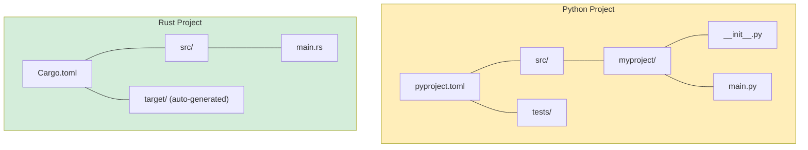

## Installation and Setup

> **What you'll learn:** How to install Rust and its toolchain, the Cargo build system vs pip/Poetry, IDE setup, your first `Hello, world!` program, and essential Rust keywords mapped to Python equivalents.
>
> **Difficulty:** 🟢 Beginner

### Installing Rust
```bash
# Install Rust via rustup (Linux/macOS/WSL)
curl --proto '=https' --tlsv1.2 -sSf https://sh.rustup.rs | sh

# Verify installation
rustc --version     # Rust compiler
cargo --version     # Build tool + package manager (like pip + setuptools combined)

# Update Rust
rustup update
```

### Rust Tools vs Python Tools

| Purpose | Python | Rust |
|---------|--------|------|
| Language runtime | `python` (interpreter) | `rustc` (compiler, rarely called directly) |
| Package manager | `pip` / `poetry` / `uv` | `cargo` (built-in) |
| Project config | `pyproject.toml` | `Cargo.toml` |
| Lock file | `poetry.lock` / `requirements.txt` | `Cargo.lock` |
| Virtual env | `venv` / `conda` | Not needed (deps are per-project) |
| Formatter | `black` / `ruff format` | `rustfmt` (built-in: `cargo fmt`) |
| Linter | `ruff` / `flake8` / `pylint` | `clippy` (built-in: `cargo clippy`) |
| Type checker | `mypy` / `pyright` | Built into compiler (always on) |
| Test runner | `pytest` | `cargo test` (built-in) |
| Docs | `sphinx` / `mkdocs` | `cargo doc` (built-in) |
| REPL | `python` / `ipython` | None (use `cargo test` or Rust Playground) |

### IDE Setup

**VS Code** (recommended)：
```text
Extensions to install:
- rust-analyzer        -> Essential: IDE features, type hints, completions
- Even Better TOML     -> Syntax highlighting for Cargo.toml
- CodeLLDB             -> Debugger support

# Python equivalent mapping:
# rust-analyzer ~= Pylance (but with 100% type coverage, always)
# cargo clippy  ~= ruff (but checks correctness, not just style)
```

***

## Your First Rust Program

### Python Hello World
```python
# hello.py - just run it
print("Hello, World!")

# Run:
# python hello.py
```

### Rust Hello World
```rust
// src/main.rs - must be compiled first
fn main() {
    println!("Hello, World!");   // println! is a macro (note the !)
}

// Build and run:
// cargo run
```

### Key Differences for Python Developers

```text
Python:                              Rust:
--------                             -----
- No main() needed                   - fn main() is the entry point
- Indentation = blocks               - Curly braces {} = blocks
- print() is a function              - println!() is a macro (the ! matters)
- No semicolons                      - Semicolons end statements
- No type declarations               - Types inferred but always known
- Interpreted (run directly)         - Compiled (cargo build, then run)
- Errors at runtime                  - Most errors at compile time
```

### Creating Your First Project
```bash
# Python                              # Rust
mkdir myproject                        cargo new myproject
cd myproject                           cd myproject
python -m venv .venv                   # No virtual env needed
source .venv/bin/activate              # No activation needed
# Create files manually               # src/main.rs already created

# Python project structure:            Rust project structure:
# myproject/                           myproject/
# ├── pyproject.toml                   ├── Cargo.toml        (like pyproject.toml)
# ├── src/                             ├── src/
# │   └── myproject/                   │   └── main.rs       (entry point)
# │       ├── __init__.py              └── (no __init__.py needed)
# │       └── main.py
# └── tests/
#     └── test_main.py
```



> **Key difference:** Rust projects are simpler - no `__init__.py`, no virtual environments, no `setup.py` vs `setup.cfg` vs `pyproject.toml` confusion. Just `Cargo.toml` + `src/`.

***

## Cargo vs pip/Poetry

### Project Configuration

```toml
# Python - pyproject.toml
[project]
name = "myproject"
version = "0.1.0"
requires-python = ">=3.10"
dependencies = [
    "requests>=2.28",
    "pydantic>=2.0",
]

[project.optional-dependencies]
dev = ["pytest", "ruff", "mypy"]
```

```toml
# Rust - Cargo.toml
[package]
name = "myproject"
version = "0.1.0"
edition = "2021"          # Rust edition (like Python version)

[dependencies]
reqwest = "0.12"          # HTTP client (like requests)
serde = { version = "1.0", features = ["derive"] }  # Serialization (like pydantic)

[dev-dependencies]
# Test dependencies - only compiled for `cargo test`
```

### Common Cargo Commands
```bash
# Python equivalent                # Rust
pip install requests               cargo add reqwest
pip install -r requirements.txt    cargo build           # auto-installs deps
pip install -e .                   cargo build            # always "editable"
python -m pytest                   cargo test
python -m mypy .                   # Built into compiler - always runs
ruff check .                       cargo clippy
ruff format .                      cargo fmt
python main.py                     cargo run
python -c "..."                    # No equivalent - use cargo run or tests

# Rust-specific:
cargo new myproject                # Create new project
cargo build --release              # Optimized build (10-100x faster than debug)
cargo doc --open                   # Generate and browse API docs
cargo update                       # Update deps (like pip install --upgrade)
```

***

## Essential Rust Keywords for Python Developers

### Variable and Mutability Keywords

```rust
// let - declare a variable (like Python assignment, but immutable by default)
let name = "Alice";          // Python: name = "Alice" (but mutable)

// mut - opt into mutability
let mut count = 0;           // Python: count = 0 (always mutable)
count += 1;                  // Allowed because of `mut`

// const - compile-time constant
const MAX_SIZE: usize = 1024;   // Python: MAX_SIZE = 1024 (convention only)
```

### Ownership and Borrowing Keywords

```rust
// These have NO Python equivalents - they're Rust-specific concepts

// & - borrow (read-only reference)
fn print_name(name: &str) { }    // Python passes references always

// &mut - mutable borrow
fn append(list: &mut Vec<i32>) { }  // Python: always mutable

// move - transfer ownership
let s1 = String::from("hello");
let s2 = s1;    // s1 is MOVED to s2 - s1 is no longer valid
```

### Type Definition Keywords

```rust
// struct - like a Python dataclass or NamedTuple
struct Point {               // @dataclass
    x: f64,                  // class Point:
    y: f64,                  //     x: float
}                            //     y: float

// enum - like Python's enum but MUCH more powerful (carries data)
enum Shape {                 // No direct Python equivalent
    Circle(f64),             // Each variant can hold different data
    Rectangle(f64, f64),
}

// impl - attach methods to a type
impl Point {                 // class Point:
    fn distance(&self) -> f64 {  //     def distance(self) -> float:
        (self.x.powi(2) + self.y.powi(2)).sqrt()
    }
}

// trait - like Python's ABC or Protocol (PEP 544)
trait Drawable {             // class Drawable(Protocol):
    fn draw(&self);          //     def draw(self) -> None: ...
}
```

### Control Flow Keywords

```rust
// match - exhaustive pattern matching
match value {
    1 => println!("one"),
    2 | 3 => println!("two or three"),
    _ => println!("other"),          // _ = wildcard
}

// loop - infinite loop (like while True:)
loop {
    break;  // Must break to exit
}

// for - iteration
for item in collection.iter() {      // for item in collection:
    println!("{}", item);
}
```

---

## Exercises

<details>
<summary><strong>Exercise: First Rust Program</strong></summary>

**Challenge:** Create a new Rust project and write a program that:

1. Declares a variable `name` with your name (type `&str`)
2. Declares a mutable variable `count` starting at 0
3. Uses a `for` loop from 1..=5 to increment `count` and print `"Hello, {name}! (count: {count})"`
4. After the loop, print whether count is even or odd using a `match` expression

<details>
<summary>Solution</summary>

```bash
cargo new hello_rust && cd hello_rust
```

```rust
// src/main.rs
fn main() {
    let name = "Pythonista";
    let mut count = 0u32;

    for _ in 1..=5 {
        count += 1;
        println!("Hello, {name}! (count: {count})");
    }

    let parity = match count % 2 {
        0 => "even",
        _ => "odd",
    };
    println!("Final count {count} is {parity}");
}
```

**Key takeaways:**
- `let` is immutable by default (you need `mut` to change `count`)
- `1..=5` is inclusive range (Python's `range(1, 6)`)
- `match` is an expression that returns a value
- No `self`, no `if __name__ == "__main__"` - just `fn main()`

</details>
</details>

***
