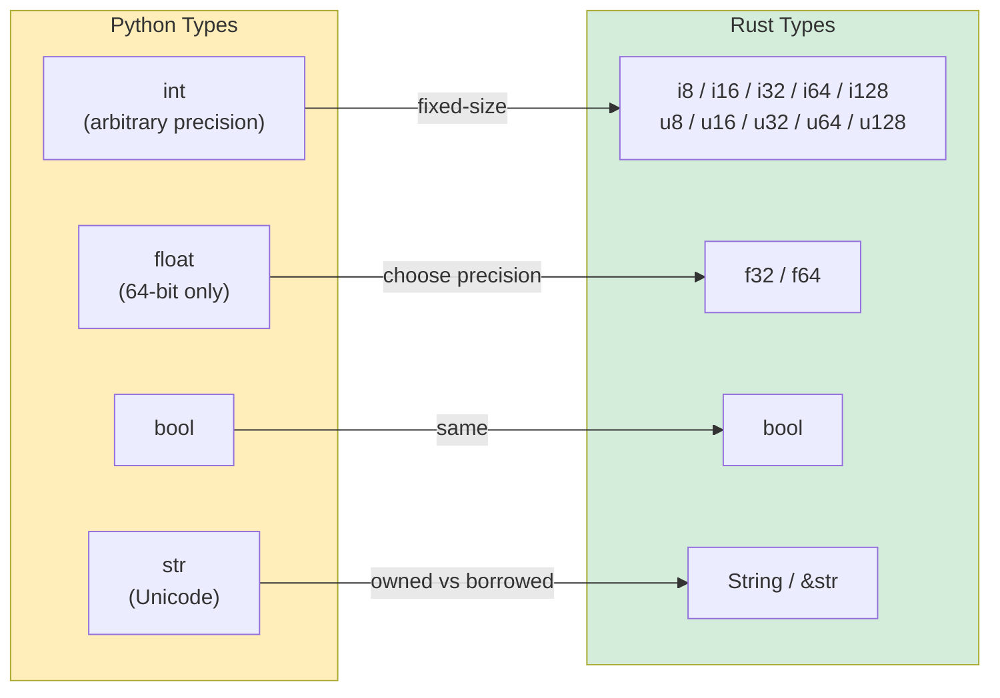

# 3. Built-in Types and Variables 🟢

> **What you'll learn:**
> - Immutable-by-default variables and explicit `mut`
> - Primitive numeric types vs Python's arbitrary-precision `int`
> - `String` vs `&str` (the "owned vs borrowed" distinction)
> - String formatting and debug printing
> - Rust's required, compiler-enforced type annotations

## Variables and Mutability

### Python Variable Declaration
```python
# Python — everything is mutable, dynamically typed
count = 0          # Mutable, type inferred as int
count = 5          # ✅ Works
count = "hello"    # ✅ Works — type can change! (dynamic typing)

# "Constants" are just convention:
MAX_SIZE = 1024    # Nothing prevents MAX_SIZE = 999 later
```

### Rust Variable Declaration
```rust
// Rust — immutable by default, statically typed
let count = 0;           // Immutable, type inferred as i32
// count = 5;            // ❌ Compile error: cannot assign twice to immutable variable
// count = "hello";      // ❌ Compile error: expected integer, found &str

let mut count = 0;       // Explicitly mutable
count = 5;               // ✅ Works
// count = "hello";      // ❌ Still can't change type

const MAX_SIZE: usize = 1024; // True constant — enforced by compiler
```

### Key Mental Shift for Python Developers

In Python, variables are **labels** that point to objects on the heap. In Rust, variables are **named storage locations** that **OWN** their values.

**Variable shadowing** is unique to Rust and very useful:
```rust
let input = "42";              // &str
let input = input.parse::<i32>().unwrap();  // Now it's i32 — new variable, same name
let input = input * 2;         // Now it's 84 — another new variable
```

In Python, you'd just reassign and lose the old type, but in Rust, each `let` creates a genuinely new binding.

---

## Primitive Types Comparison



### Numeric Types

| Python | Rust | Notes |
|--------|------|-------|
| `int` (arbitrary precision) | `i8`, `i16`, `i32`, `i64`, `i128`, `isize` | Rust integers have fixed size |
| `int` (unsigned: no separate type) | `u8`, `u16`, `u32`, `u64`, `u128`, `usize` | Explicit unsigned types |
| `float` (64-bit IEEE 754) | `f32`, `f64` | Python only has 64-bit float |
| `bool` | `bool` | Same concept |

### Size Types (usize and isize)

```rust
// usize — pointer-sized integer, used for indexing
let length: usize = vec![1, 2, 3].len();  // .len() returns usize
let index: usize = 0;                     // Array indices are always usize

// Mixing i32 and usize requires explicit conversion:
let i: i32 = 5;
let item = vec[i as usize]; // ✅ Explicit conversion
```

---

## String Types: String vs &str

Rust has **two** main string types where Python has one.

### Rust String Types
```rust
// 1. &str (string slice) — borrowed, immutable "view"
let name: &str = "Alice";           // Points to binary data (fixed length)

// 2. String (owned string) — heap-allocated, growable
let mut greeting = String::from("Hello, ");  // Owned, can be modified
greeting.push_str(name);
```

### Rule of Thumb:
- **&str** = "I'm looking at a string someone else owns" (read-only view)
- **String** = "I own this string and can modify it" (owned data)

---

## Printing and String Formatting

### Basic Output
```rust
println!("Hello, World!");
println!("Name: {} Age: {}", name, age);    // Positional {}
println!("Name: {name}, Age: {age}");       // Inline variables (like f-strings!)
```

### Debug Printing
```rust
// Rust — {:?} and {:#?} (like repr() and pprint)
println!("{:?}", vec![1, 2, 3]);       // "[1, 2, 3]"

#[derive(Debug)] // Make your types printable
struct Point { x: f64, y: f64 }
```

---

## Type Annotations

In Python, type hints are **documentation**. In Rust, types **ARE** the program — the compiler uses them to guarantee memory safety and eliminate null pointer errors.

```rust
// Rust — types are enforced by the compiler. No exceptions.
fn add(a: i32, b: i32) -> i32 {
    a + b
}

add(1, 2);         // ✅
// add("a", "b");  // ❌ Compile error: expected i32, found &str
```

---

## Exercises

<details>
<summary><strong>🏋️ Exercise: Temperature Converter</strong></summary>

**Challenge**: Write a function `celsius_to_fahrenheit(c: f64) -> f64` and a function `classify(temp_f: f64) -> &'static str` that returns "cold", "mild", or "hot" based on thresholds. Print the result for 0, 20, and 35 degrees Celsius.

<details>
<summary>🔑 Solution</summary>

```rust
fn celsius_to_fahrenheit(c: f64) -> f64 {
    c * 9.0 / 5.0 + 32.0
}

fn classify(temp_f: f64) -> &'static str {
    if temp_f < 50.0 { "cold" }
    else if temp_f < 77.0 { "mild" }
    else { "hot" }
}

fn main() {
    for c in [0.0, 20.0, 35.0] {
        let f = celsius_to_fahrenheit(c);
        println!("{c:.1}°C = {f:.1}°F — {}", classify(f));
    }
}
```

</details>
</details>

***
