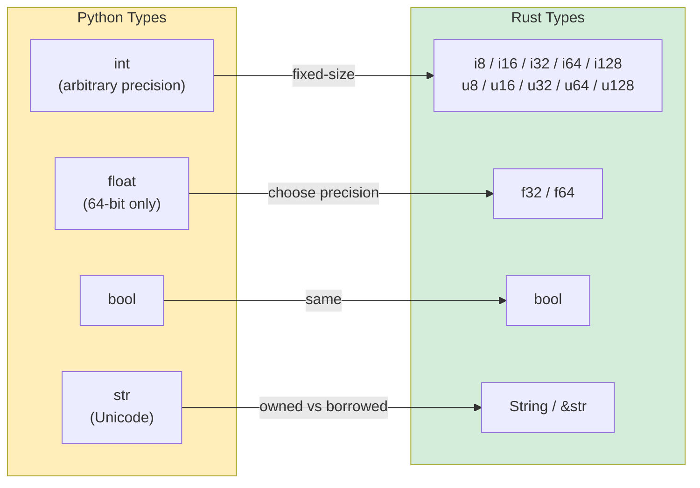

## Variables and Mutability

> **What you'll learn:** Immutable-by-default variables, explicit `mut`, primitive numeric types vs Python's arbitrary-precision `int`,
> `String` vs `&str` (the hardest early concept), string formatting, and Rust's required type annotations.
>
> **Difficulty:** 🟢 Beginner

### Python Variable Declaration
```python
# Python — everything is mutable, dynamically typed
count = 0          # Mutable, type inferred as int
count = 5          # ✅ Works
count = "hello"    # ✅ Works — type can change! (dynamic typing)

# "Constants" are just convention:
MAX_SIZE = 1024    # Nothing prevents MAX_SIZE = 999 later
```

### Rust Variable Declaration
```rust
// Rust — immutable by default, statically typed
let count = 0;           // Immutable, type inferred as i32
// count = 5;            // ❌ Compile error: cannot assign twice to immutable variable
// count = "hello";      // ❌ Compile error: expected integer, found &str

let mut count = 0;       // Explicitly mutable
count = 5;               // ✅ Works
// count = "hello";      // ❌ Still can't change type

const MAX_SIZE: usize = 1024; // True constant — enforced by compiler
```

### Key Mental Shift for Python Developers
```rust
// Python: variables are labels that point to objects
// Rust: variables are named storage locations that OWN their values

// Variable shadowing — unique to Rust, very useful
let input = "42";              // &str
let input = input.parse::<i32>().unwrap();  // Now it's i32 — new variable, same name
let input = input * 2;         // Now it's 84 — another new variable

// In Python, you'd just reassign and lose the old type:
# input = "42"
# input = int(input)   # Same name, different type — Python allows this too
# But in Rust, each `let` creates a genuinely new binding. The old one is gone.
```

### Practical Example: Counter
```python
# Python version
class Counter:
    def __init__(self):
        self.value = 0
    
    def increment(self):
        self.value += 1
    
    def get_value(self):
        return self.value

c = Counter()
c.increment()
print(c.get_value())  # 1
```

```rust
// Rust version
struct Counter {
    value: i64,
}

impl Counter {
    fn new() -> Self {
        Counter { value: 0 }
    }

    fn increment(&mut self) {     // &mut self = I will modify this
        self.value += 1;
    }

    fn get_value(&self) -> i64 {  // &self = I only read this
        self.value
    }
}

fn main() {
    let mut c = Counter::new();   // Must be `mut` to call increment()
    c.increment();
    println!("{}", c.get_value()); // 1
}
```

> **Key difference**: In Rust, `&mut self` in the method signature tells you (and the
> compiler) that `increment` modifies the counter. In Python, any method can mutate
> anything — you have to read the code to know.

***

## Primitive Types Comparison



### Numeric Types

| Python | Rust | Notes |
|--------|------|-------|
| `int` (arbitrary precision) | `i8`, `i16`, `i32`, `i64`, `i128`, `isize` | Rust integers have fixed size |
| `int` (unsigned: no separate type) | `u8`, `u16`, `u32`, `u64`, `u128`, `usize` | Explicit unsigned types |
| `float` (64-bit IEEE 754) | `f32`, `f64` | Python only has 64-bit float |
| `bool` | `bool` | Same concept |
| `complex` | No built-in (use `num` crate) | Rare in systems code |

```python
# Python — one integer type, arbitrary precision
x = 42                     # int — can grow to any size
big = 2 ** 1000            # Still works — thousands of digits
y = 3.14                   # float — always 64-bit
```

```rust
// Rust — explicit sizes, overflow is a compile/runtime error
let x: i32 = 42;           // 32-bit signed integer
let y: f64 = 3.14;         // 64-bit float (Python's float equivalent)
let big: i128 = 2_i128.pow(100); // 128-bit max — no arbitrary precision
// For arbitrary precision: use the `num-bigint` crate

// Underscores for readability (like Python's 1_000_000):
let million = 1_000_000;   // Same syntax as Python!

// Type suffix syntax:
let a = 42u8;              // u8
let b = 3.14f32;           // f32
```

### Size Types (Important!)

```rust
// usize and isize — pointer-sized integers, used for indexing
let length: usize = vec![1, 2, 3].len();  // .len() returns usize
let index: usize = 0;                     // Array indices are always usize

// In Python, len() returns int and indices are int — no distinction.
// In Rust, mixing i32 and usize requires explicit conversion:
let i: i32 = 5;
// let item = vec[i];    // ❌ Error: expected usize, found i32
let item = vec[i as usize]; // ✅ Explicit conversion
```

### Type Inference

```rust
// Rust infers types but they're FIXED — not dynamic
let x = 42;          // Compiler infers i32 (default integer type)
let y = 3.14;        // Compiler infers f64 (default float type)
let s = "hello";     // Compiler infers &str (string slice)
let v = vec![1, 2];  // Compiler infers Vec<i32>

// You can always be explicit:
let x: i64 = 42;
let y: f32 = 3.14;

// Unlike Python, the type can NEVER change after inference:
let x = 42;
// x = "hello";      // ❌ Error: expected integer, found &str
```

***

## String Types: String vs &str

This is one of the biggest surprises for Python developers. Rust has **two** main
string types where Python has one.

### Python String Handling
```python
# Python — one string type, immutable, reference counted
name = "Alice"          # str — immutable, heap allocated
greeting = f"Hello, {name}!"  # f-string formatting
chars = list(name)      # Convert to list of characters
upper = name.upper()    # Returns new string (immutable)
```

### Rust String Types
```rust
// Rust has TWO string types:

// 1. &str (string slice) — borrowed, immutable, like a "view" into string data
let name: &str = "Alice";           // Points to string data in the binary
                                     // Closest to Python's str, but it's a REFERENCE

// 2. String (owned string) — heap-allocated, growable, owned
let mut greeting = String::from("Hello, ");  // Owned, can be modified
greeting.push_str(name);
greeting.push('!');
// greeting is now "Hello, Alice!"
```

### When to Use Which?

```rust
// Think of it like this:
// &str  = "I'm looking at a string someone else owns"  (read-only view)
// String = "I own this string and can modify it"        (owned data)

// Function parameters: prefer &str (accepts both types)
fn greet(name: &str) -> String {          // accepts &str AND &String
    format!("Hello, {}!", name)           // format! creates a new String
}

let s1 = "world";                         // &str literal
let s2 = String::from("Rust");            // String

greet(s1);      // ✅ &str works directly
greet(&s2);     // ✅ &String auto-converts to &str (Deref coercion)
```

### Practical Examples

```python
# Python string operations
name = "alice"
upper = name.upper()               # "ALICE"
contains = "lic" in name           # True
parts = "a,b,c".split(",")         # ["a", "b", "c"]
joined = "-".join(["a", "b", "c"]) # "a-b-c"
stripped = "  hello  ".strip()     # "hello"
replaced = name.replace("a", "A") # "Alice"
```

```rust
// Rust equivalents
let name = "alice";
let upper = name.to_uppercase();           // String — new allocation
let contains = name.contains("lic");       // bool
let parts: Vec<&str> = "a,b,c".split(',').collect();  // Vec<&str>
let joined = ["a", "b", "c"].join("-");    // String
let stripped = "  hello  ".trim();         // &str — no allocation!
let replaced = name.replace("a", "A");     // String

// Key insight: some operations return &str (no allocation), others return String.
// .trim() returns a slice of the original — efficient!
// .to_uppercase() must create a new String — allocation required.
```

### Python Developers: Think of it This Way

```text
Python str     ≈ Rust &str     (you usually read strings)
Python str     ≈ Rust String   (when you need to own/modify)

Rule of thumb:
- Function parameters → use &str (most flexible)
- Struct fields       → use String (struct owns its data)
- Return values       → use String (caller needs to own it)
- String literals     → automatically &str
```

***

## Printing and String Formatting

### Basic Output
```python
# Python
print("Hello, World!")
print("Name:", name, "Age:", age)    # Space-separated
print(f"Name: {name}, Age: {age}")   # f-string
```

```rust
// Rust
println!("Hello, World!");
println!("Name: {} Age: {}", name, age);    // Positional {}
println!("Name: {name}, Age: {age}");       // Inline variables (Rust 1.58+, like f-strings!)
```

### Format Specifiers
```python
# Python formatting
print(f"{3.14159:.2f}")          # "3.14" — 2 decimal places
print(f"{42:05d}")               # "00042" — zero-padded
print(f"{255:#x}")               # "0xff" — hex
print(f"{42:>10}")               # "        42" — right-aligned
print(f"{'left':<10}|")          # "left      |" — left-aligned
```

```rust
// Rust formatting (very similar to Python!)
println!("{:.2}", 3.14159);         // "3.14" — 2 decimal places
println!("{:05}", 42);              // "00042" — zero-padded
println!("{:#x}", 255);             // "0xff" — hex
println!("{:>10}", 42);             // "        42" — right-aligned
println!("{:<10}|", "left");        // "left      |" — left-aligned
```

### Debug Printing
```python
# Python — repr() and pprint
print(repr([1, 2, 3]))             # "[1, 2, 3]"
from pprint import pprint
pprint({"key": [1, 2, 3]})         # Pretty-printed
```

```rust
// Rust — {:?} and {:#?}
println!("{:?}", vec![1, 2, 3]);       // "[1, 2, 3]" — Debug format
println!("{:#?}", vec![1, 2, 3]);      // Pretty-printed Debug format

// To make your types printable, derive Debug:
#[derive(Debug)]
struct Point { x: f64, y: f64 }

let p = Point { x: 1.0, y: 2.0 };
println!("{:?}", p);                   // "Point { x: 1.0, y: 2.0 }"
println!("{p:?}");                     // Same, with inline syntax
```

### Quick Reference

| Python | Rust | Notes |
|--------|------|-------|
| `print(x)` | `println!("{}", x)` or `println!("{x}")` | Display format |
| `print(repr(x))` | `println!("{:?}", x)` | Debug format |
| `f"Hello {name}"` | `format!("Hello {name}")` | Returns String |
| `print(x, end="")` | `print!("{x}")` | No newline (`print!` vs `println!`) |
| `print(x, file=sys.stderr)` | `eprintln!("{x}")` | Print to stderr |
| `sys.stdout.write(s)` | `print!("{s}")` | No newline |

***

## Type Annotations: Optional vs Required

### Python Type Hints (Optional, Not Enforced)
```python
# Python — type hints are documentation, not enforcement
def add(a: int, b: int) -> int:
    return a + b

add(1, 2)         # ✅
add("a", "b")     # ✅ Python doesn't care — returns "ab"
add(1, "2")       # ✅ Until it crashes at runtime: TypeError

# Union types, Optional
def find(key: str) -> int | None:
    ...

# Generic types
def first(items: list[int]) -> int | None:
    return items[0] if items else None

# Type aliases
UserId = int
Mapping = dict[str, list[int]]
```

### Rust Type Declarations (Required, Compiler-Enforced)
```rust
// Rust — types are enforced. Always. No exceptions.
fn add(a: i32, b: i32) -> i32 {
    a + b
}

add(1, 2);         // ✅
// add("a", "b");  // ❌ Compile error: expected i32, found &str

// Optional values use Option<T>
fn find(key: &str) -> Option<i32> {
    // Returns Some(value) or None
    Some(42)
}

// Generic types
fn first(items: &[i32]) -> Option<i32> {
    items.first().copied()
}

// Type aliases
type UserId = i64;
type Mapping = HashMap<String, Vec<i32>>;
```

> **Key insight**: In Python, type hints help your IDE and mypy but don't affect runtime.
> In Rust, types ARE the program — the compiler uses them to guarantee memory safety,
> prevent data races, and eliminate null pointer errors.
>
> 📌 **See also**: [Ch. 6 — Enums and Pattern Matching](ch06-enums-and-pattern-matching.md) shows how Rust's type system replaces Python's `Union` types and `isinstance()` checks.

---

## Exercises

<details>
<summary><strong>🏋️ Exercise: Temperature Converter</strong> (click to expand)</summary>

**Challenge**: Write a function `celsius_to_fahrenheit(c: f64) -> f64` and a function `classify(temp_f: f64) -> &'static str` that returns "cold", "mild", or "hot" based on thresholds. Print the result for 0, 20, and 35 degrees Celsius. Use string formatting.

<details>
<summary>🔑 Solution</summary>

```rust
fn celsius_to_fahrenheit(c: f64) -> f64 {
    c * 9.0 / 5.0 + 32.0
}

fn classify(temp_f: f64) -> &'static str {
    if temp_f < 50.0 { "cold" }
    else if temp_f < 77.0 { "mild" }
    else { "hot" }
}

fn main() {
    for c in [0.0, 20.0, 35.0] {
        let f = celsius_to_fahrenheit(c);
        println!("{c:.1}°C = {f:.1}°F — {}", classify(f));
    }
}
```

**Key takeaway**: Rust requires explicit `f64` (no implicit int→float), `for` iterates over arrays directly (no `range()`), and `if/else` blocks are expressions.

</details>
</details>

***


