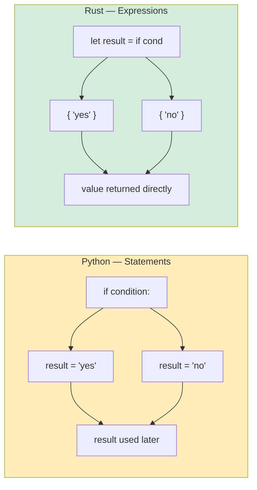

## Conditional Statements

> **What you'll learn:** `if`/`else` without parentheses (but with braces), `loop`/`while`/`for` vs Python's iteration model,
> expression blocks (everything returns a value), and function signatures with mandatory return types.
>
> **Difficulty:** 🟢 Beginner

### if/else

```python
# Python
if temperature > 100:
    print("Too hot!")
elif temperature < 0:
    print("Too cold!")
else:
    print("Just right")

# Ternary
status = "hot" if temperature > 100 else "ok"
```

```rust
// Rust — braces required, no colons, `else if` not `elif`
if temperature > 100 {
    println!("Too hot!");
} else if temperature < 0 {
    println!("Too cold!");
} else {
    println!("Just right");
}

// if is an EXPRESSION — returns a value (like Python ternary, but more powerful)
let status = if temperature > 100 { "hot" } else { "ok" };
```

### Important Differences
```rust
// 1. Condition must be a bool — no truthy/falsy
let x = 42;
// if x { }          // ❌ Error: expected bool, found integer
if x != 0 { }        // ✅ Explicit comparison required

// In Python, these are all truthy/falsy:
// if []:      → False    (empty list)
// if "":      → False    (empty string)
// if 0:       → False    (zero)
// if None:    → False

// In Rust, ONLY bool works in conditions:
let items: Vec<i32> = vec![];
// if items { }           // ❌ Error
if !items.is_empty() { }  // ✅ Explicit check

let name = "";
// if name { }             // ❌ Error
if !name.is_empty() { }    // ✅ Explicit check
```

***

## Loops and Iteration

### for Loops
```python
# Python
for i in range(5):
    print(i)

for item in ["a", "b", "c"]:
    print(item)

for i, item in enumerate(["a", "b", "c"]):
    print(f"{i}: {item}")

for key, value in {"x": 1, "y": 2}.items():
    print(f"{key} = {value}")
```

```rust
// Rust
for i in 0..5 {                           // range(5) → 0..5
    println!("{}", i);
}

for item in ["a", "b", "c"] {             // Direct iteration
    println!("{}", item);
}

for (i, item) in ["a", "b", "c"].iter().enumerate() {  // enumerate()
    println!("{}: {}", i, item);
}

// HashMap iteration
use std::collections::HashMap;
let map = HashMap::from([("x", 1), ("y", 2)]);
for (key, value) in &map {                // & borrows the map
    println!("{} = {}", key, value);
}
```

### Range Syntax
```rust
Python:              Rust:               Notes:
range(5)             0..5                Half-open (excludes end)
range(1, 10)         1..10               Half-open
range(1, 11)         1..=10              Inclusive (includes end)
range(0, 10, 2)      (0..10).step_by(2)  Step (method, not syntax)
```

### while Loops
```python
# Python
count = 0
while count < 5:
    print(count)
    count += 1

# Infinite loop
while True:
    data = get_input()
    if data == "quit":
        break
```

```rust
// Rust
let mut count = 0;
while count < 5 {
    println!("{}", count);
    count += 1;
}

// Infinite loop — use `loop`, not `while true`
loop {
    let data = get_input();
    if data == "quit" {
        break;
    }
}

// loop can return a value! (unique to Rust)
let result = loop {
    let input = get_input();
    if let Ok(num) = input.parse::<i32>() {
        break num;  // `break` with a value — like return for loops
    }
    println!("Not a number, try again");
};
```

### List Comprehensions vs Iterator Chains
```python
# Python — list comprehensions
squares = [x ** 2 for x in range(10)]
evens = [x for x in range(20) if x % 2 == 0]
pairs = [(x, y) for x in range(3) for y in range(3)]
```

```rust
// Rust — iterator chains (.map, .filter, .collect)
let squares: Vec<i32> = (0..10).map(|x| x * x).collect();
let evens: Vec<i32> = (0..20).filter(|x| x % 2 == 0).collect();
let pairs: Vec<(i32, i32)> = (0..3)
    .flat_map(|x| (0..3).map(move |y| (x, y)))
    .collect();

// These are LAZY — nothing runs until .collect()
// Python comprehensions are eager (run immediately)
// Rust iterators can be more efficient for large datasets
```

***

## Expression Blocks

Everything in Rust is an expression (or can be). This is a big shift from Python,
where `if`/`for` are statements.

```python
# Python — if is a statement (except ternary)
if condition:
    result = "yes"
else:
    result = "no"

# Or ternary (limited to one expression):
result = "yes" if condition else "no"
```

```rust
// Rust — if is an expression (returns a value)
let result = if condition { "yes" } else { "no" };

// Blocks are expressions — the last line (without semicolon) is the return value
let value = {
    let x = 5;
    let y = 10;
    x + y    // No semicolon → this is the value of the block (15)
};

// match is an expression too
let description = match temperature {
    t if t > 100 => "boiling",
    t if t > 50 => "hot",
    t if t > 20 => "warm",
    _ => "cold",
};
```

The following diagram illustrates the core difference between Python's statement-based and Rust's expression-based control flow:



> **The semicolon rule**: In Rust, the last expression in a block **without a semicolon**
> is the block's return value. Adding a semicolon makes it a statement (returns `()`).
> This trips up Python developers initially — it's like an implicit `return`.

***

## Functions and Type Signatures

### Python Functions
```python
# Python — types optional, dynamic dispatch
def greet(name: str, greeting: str = "Hello") -> str:
    return f"{greeting}, {name}!"

# Default args, *args, **kwargs
def flexible(*args, **kwargs):
    pass

# First-class functions
def apply(f, x):
    return f(x)

result = apply(lambda x: x * 2, 5)  # 10
```

### Rust Functions
```rust
// Rust — types REQUIRED on function signatures, no defaults
fn greet(name: &str, greeting: &str) -> String {
    format!("{}, {}!", greeting, name)
}

// No default arguments — use builder pattern or Option
fn greet_with_default(name: &str, greeting: Option<&str>) -> String {
    let greeting = greeting.unwrap_or("Hello");
    format!("{}, {}!", greeting, name)
}

// No *args/**kwargs — use slices or structs
fn sum_all(numbers: &[i32]) -> i32 {
    numbers.iter().sum()
}

// First-class functions and closures
fn apply(f: fn(i32) -> i32, x: i32) -> i32 {
    f(x)
}

let result = apply(|x| x * 2, 5);  // 10
```

### Return Values
```python
# Python — return is explicit, None is implicit
def divide(a, b):
    if b == 0:
        return None  # Or raise an exception
    return a / b
```

```rust
// Rust — last expression is the return value (no semicolon)
fn divide(a: f64, b: f64) -> Option<f64> {
    if b == 0.0 {
        None              // Early return (could also write `return None;`)
    } else {
        Some(a / b)       // Last expression — implicit return
    }
}
```

### Multiple Return Values
```python
# Python — return a tuple
def min_max(numbers):
    return min(numbers), max(numbers)

lo, hi = min_max([3, 1, 4, 1, 5])
```

```rust
// Rust — return a tuple (same concept!)
fn min_max(numbers: &[i32]) -> (i32, i32) {
    let min = *numbers.iter().min().unwrap();
    let max = *numbers.iter().max().unwrap();
    (min, max)
}

let (lo, hi) = min_max(&[3, 1, 4, 1, 5]);
```

### Methods: self vs &self vs &mut self
```rust
// In Python, `self` is always a mutable reference to the object.
// In Rust, you choose:

impl MyStruct {
    fn new() -> Self { ... }                // No self — "static method" / "classmethod"
    fn read_only(&self) { ... }             // &self — borrows immutably (can't modify)
    fn modify(&mut self) { ... }            // &mut self — borrows mutably (can modify)
    fn consume(self) { ... }                // self — takes ownership (object is moved)
}

// Python equivalent:
// class MyStruct:
//     @classmethod
//     def new(cls): ...                    # No instance needed
//     def read_only(self): ...             # All three are the same in Python:
//     def modify(self): ...                # Python self is always mutable
//     def consume(self): ...               # Python never "consumes" self
```

---

## Exercises

<details>
<summary><strong>🏋️ Exercise: FizzBuzz with Expressions</strong> (click to expand)</summary>

**Challenge**: Write FizzBuzz for 1..=30 using Rust's expression-based `match`. Each number should print "Fizz", "Buzz", "FizzBuzz", or the number. Use `match (n % 3, n % 5)` as the expression.

<details>
<summary>🔑 Solution</summary>

```rust
fn main() {
    for n in 1..=30 {
        let result = match (n % 3, n % 5) {
            (0, 0) => String::from("FizzBuzz"),
            (0, _) => String::from("Fizz"),
            (_, 0) => String::from("Buzz"),
            _ => n.to_string(),
        };
        println!("{result}");
    }
}
```

**Key takeaway**: `match` is an expression that returns a value — no need for `if/elif/else` chains. The `_` wildcard replaces Python's `case _:` default.

</details>
</details>

***

