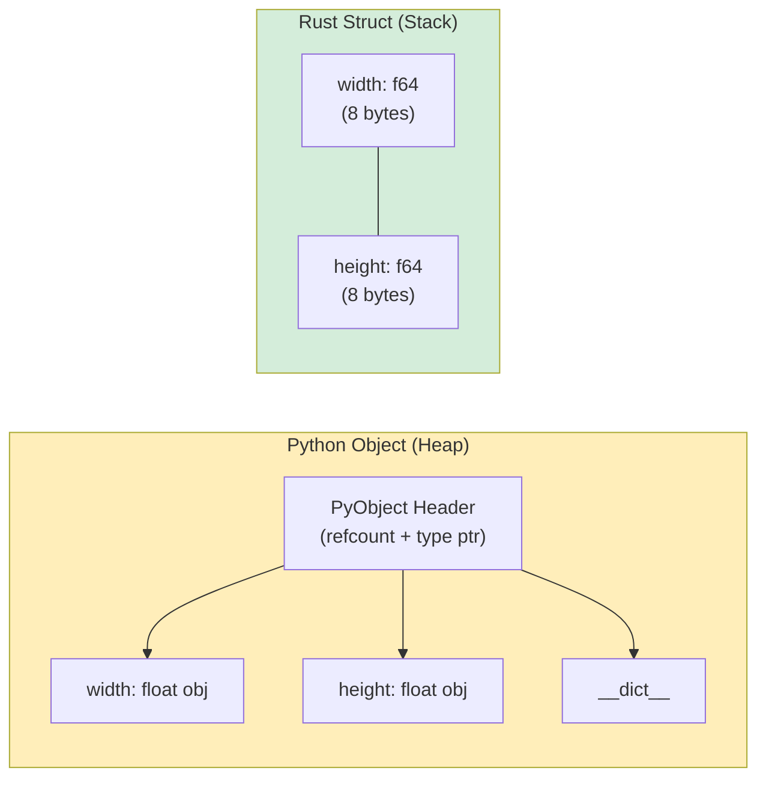

## Tuples and Destructuring

> **What you'll learn:** Rust tuples vs Python tuples, arrays and slices, structs (Rust's replacement for classes),
> `Vec<T>` vs `list`, `HashMap<K,V>` vs `dict`, and the newtype pattern for domain modeling.
>
> **Difficulty:** 🟢 Beginner

### Python Tuples
```python
# Python — tuples are immutable sequences
point = (3.0, 4.0)
x, y = point                    # Unpacking
print(f"x={x}, y={y}")

# Tuples can hold mixed types
record = ("Alice", 30, True)
name, age, active = record

# Named tuples for clarity
from typing import NamedTuple

class Point(NamedTuple):
    x: float
    y: float

p = Point(3.0, 4.0)
print(p.x)                      # Named access
```

### Rust Tuples
```rust
// Rust — tuples are fixed-size, typed, can hold mixed types
let point: (f64, f64) = (3.0, 4.0);
let (x, y) = point;              // Destructuring (same as Python unpacking)
println!("x={x}, y={y}");

// Mixed types
let record: (&str, i32, bool) = ("Alice", 30, true);
let (name, age, active) = record;

// Access by index (unlike Python, uses .0 .1 .2 syntax)
let first = record.0;            // "Alice"
let second = record.1;           // 30

// Python: record[0]
// Rust:   record.0      ← dot-index, not bracket-index
```

### When to Use Tuples vs Structs
```rust
// Tuples: quick grouping, function returns, temporary values
fn min_max(data: &[i32]) -> (i32, i32) {
    (*data.iter().min().unwrap(), *data.iter().max().unwrap())
}
let (lo, hi) = min_max(&[3, 1, 4, 1, 5]);

// Structs: named fields, clear intent, methods
struct Point { x: f64, y: f64 }

// Rule of thumb:
// - 2-3 same-type fields → tuple is fine
// - Named fields needed  → use struct
// - Methods needed       → use struct
// (Same guidance as Python: tuple vs namedtuple vs dataclass)
```

***

## Arrays and Slices

### Python Lists vs Rust Arrays
```python
# Python — lists are dynamic, heterogeneous
numbers = [1, 2, 3, 4, 5]       # Can grow, shrink, hold mixed types
numbers.append(6)
mixed = [1, "two", 3.0]         # Mixed types allowed
```

```rust
// Rust has TWO fixed-size vs dynamic concepts:

// 1. Array — fixed size, stack-allocated (no Python equivalent)
let numbers: [i32; 5] = [1, 2, 3, 4, 5]; // Size is part of the type!
// numbers.push(6);  // ❌ Arrays can't grow

// Initialize all elements to same value:
let zeros = [0; 10];            // [0, 0, 0, 0, 0, 0, 0, 0, 0, 0]

// 2. Slice — a view into an array or Vec (like Python slicing, but borrowed)
let slice: &[i32] = &numbers[1..4]; // [2, 3, 4] — a reference, not a copy!

// Python: numbers[1:4] creates a NEW list (copy)
// Rust:   &numbers[1..4] creates a VIEW (no copy, no allocation)
```

### Practical Comparison
```python
# Python slicing — creates copies
data = [10, 20, 30, 40, 50]
first_three = data[:3]          # New list: [10, 20, 30]
last_two = data[-2:]            # New list: [40, 50]
reversed_data = data[::-1]      # New list: [50, 40, 30, 20, 10]
```

```rust
// Rust slicing — creates views (references)
let data = [10, 20, 30, 40, 50];
let first_three = &data[..3];         // &[i32], view: [10, 20, 30]
let last_two = &data[3..];            // &[i32], view: [40, 50]

// No negative indexing — use .len()
let last_two = &data[data.len()-2..]; // &[i32], view: [40, 50]

// Reverse: use an iterator
let reversed: Vec<i32> = data.iter().rev().copied().collect();
```

***

## Structs vs Classes

### Python Classes
```python
# Python — class with __init__, methods, properties
from dataclasses import dataclass

@dataclass
class Rectangle:
    width: float
    height: float

    def area(self) -> float:
        return self.width * self.height

    def perimeter(self) -> float:
        return 2.0 * (self.width + self.height)

    def scale(self, factor: float) -> "Rectangle":
        return Rectangle(self.width * factor, self.height * factor)

    def __str__(self) -> str:
        return f"Rectangle({self.width} x {self.height})"

r = Rectangle(10.0, 5.0)
print(r.area())         # 50.0
print(r)                # Rectangle(10.0 x 5.0)
```

### Rust Structs
```rust
// Rust — struct + impl blocks (no inheritance!)
#[derive(Debug, Clone)]
struct Rectangle {
    width: f64,
    height: f64,
}

impl Rectangle {
    // "Constructor" — associated function (no self)
    fn new(width: f64, height: f64) -> Self {
        Rectangle { width, height }   // Field shorthand when names match
    }

    fn area(&self) -> f64 {
        self.width * self.height
    }

    fn perimeter(&self) -> f64 {
        2.0 * (self.width + self.height)
    }

    fn scale(&self, factor: f64) -> Rectangle {
        Rectangle::new(self.width * factor, self.height * factor)
    }
}

// Display trait = Python's __str__
impl std::fmt::Display for Rectangle {
    fn fmt(&self, f: &mut std::fmt::Formatter<'_>) -> std::fmt::Result {
        write!(f, "Rectangle({} x {})", self.width, self.height)
    }
}

fn main() {
    let r = Rectangle::new(10.0, 5.0);
    println!("{}", r.area());    // 50.0
    println!("{}", r);           // Rectangle(10 x 5)
}
```



> **Memory insight**: A Python `Rectangle` object has a 56-byte header + separate heap-allocated float objects. A Rust `Rectangle` is exactly 16 bytes on the stack — no indirection, no GC pressure.
>
> 📌 **See also**: [Ch. 10 — Traits and Generics](ch10-traits-and-generics.md) covers implementing traits like `Display`, `Debug`, and operator overloading for your structs.

### Key Mapping: Python Dunder Methods → Rust Traits

| Python | Rust | Purpose |
|--------|------|---------|
| `__str__` | `impl Display` | Human-readable string |
| `__repr__` | `#[derive(Debug)]` | Debug representation |
| `__eq__` | `#[derive(PartialEq)]` | Equality comparison |
| `__hash__` | `#[derive(Hash)]` | Hashable (for dict keys / HashSet) |
| `__lt__`, `__le__`, etc. | `#[derive(PartialOrd, Ord)]` | Ordering |
| `__add__` | `impl Add` | `+` operator |
| `__iter__` | `impl Iterator` | Iteration |
| `__len__` | `.len()` method | Length |
| `__enter__`/`__exit__` | RAII + `impl Drop` | Automatic cleanup; no direct equivalent of context manager's two-phase protocol |
| `__init__` | `fn new()` (convention) | Constructor |
| `__getitem__` | `impl Index` | Indexing with `[]` |
| `__contains__` | `.contains()` method | `in` operator |

### No Inheritance — Composition Instead
```python
# Python — inheritance
class Animal:
    def __init__(self, name: str):
        self.name = name
    def speak(self) -> str:
        raise NotImplementedError

class Dog(Animal):
    def speak(self) -> str:
        return f"{self.name} says Woof!"

class Cat(Animal):
    def speak(self) -> str:
        return f"{self.name} says Meow!"
```

```rust
// Rust — traits + composition (no inheritance)
trait Animal {
    fn name(&self) -> &str;
    fn speak(&self) -> String;
}

struct Dog { name: String }
struct Cat { name: String }

impl Animal for Dog {
    fn name(&self) -> &str { &self.name }
    fn speak(&self) -> String {
        format!("{} says Woof!", self.name)
    }
}

impl Animal for Cat {
    fn name(&self) -> &str { &self.name }
    fn speak(&self) -> String {
        format!("{} says Meow!", self.name)
    }
}

// Use trait objects for polymorphism (like Python's duck typing):
fn animal_roll_call(animals: &[&dyn Animal]) {
    for a in animals {
        println!("{}", a.speak());
    }
}
```

> **Mental model**: Python says "inherit behavior". Rust says "implement contracts".
> The result is similar, but Rust avoids the diamond problem and fragile base class issues.

***

## Vec vs list

`Vec<T>` is Rust's growable, heap-allocated array — the closest equivalent to Python's `list`.

### Creating Vectors
```python
# Python
numbers = [1, 2, 3]
empty = []
repeated = [0] * 10
from_range = list(range(1, 6))
```

```rust
// Rust
let numbers = vec![1, 2, 3];            // vec! macro (like a list literal)
let empty: Vec<i32> = Vec::new();        // Empty vec (type annotation needed)
let repeated = vec![0; 10];              // [0, 0, 0, 0, 0, 0, 0, 0, 0, 0]
let from_range: Vec<i32> = (1..6).collect(); // [1, 2, 3, 4, 5]
```

### Common Operations
```python
# Python list operations
nums = [1, 2, 3]
nums.append(4)                   # [1, 2, 3, 4]
nums.extend([5, 6])             # [1, 2, 3, 4, 5, 6]
nums.insert(0, 0)               # [0, 1, 2, 3, 4, 5, 6]
last = nums.pop()               # 6, nums = [0, 1, 2, 3, 4, 5]
length = len(nums)              # 6
nums.sort()                     # In-place sort
sorted_copy = sorted(nums)     # New sorted list
nums.reverse()                  # In-place reverse
contains = 3 in nums           # True
index = nums.index(3)          # Index of first 3
```

```rust
// Rust Vec operations
let mut nums = vec![1, 2, 3];
nums.push(4);                          // [1, 2, 3, 4]
nums.extend([5, 6]);                   // [1, 2, 3, 4, 5, 6]
nums.insert(0, 0);                     // [0, 1, 2, 3, 4, 5, 6]
let last = nums.pop();                 // Some(6), nums = [0, 1, 2, 3, 4, 5]
let length = nums.len();               // 6
nums.sort();                           // In-place sort
let mut sorted_copy = nums.clone();
sorted_copy.sort();                    // Sort a clone
nums.reverse();                        // In-place reverse
let contains = nums.contains(&3);      // true
let index = nums.iter().position(|&x| x == 3); // Some(index) or None
```

### Quick Reference

| Python | Rust | Notes |
|--------|------|-------|
| `lst.append(x)` | `vec.push(x)` | |
| `lst.extend(other)` | `vec.extend(other)` | |
| `lst.pop()` | `vec.pop()` | Returns `Option<T>` |
| `lst.insert(i, x)` | `vec.insert(i, x)` | |
| `lst.remove(x)` | `vec.iter().position(\|v\| v == &x).map(\|i\| vec.remove(i))` | Removes first match only (use `retain` to remove all) |
| `del lst[i]` | `vec.remove(i)` | Returns the removed element |
| `len(lst)` | `vec.len()` | |
| `x in lst` | `vec.contains(&x)` | |
| `lst.sort()` | `vec.sort()` | |
| `sorted(lst)` | Clone + sort, or iterator | |
| `lst[i]` | `vec[i]` | Panics if out of bounds |
| `lst.get(i, default)` | `vec.get(i)` | Returns `Option<&T>` |
| `lst[1:3]` | `&vec[1..3]` | Returns a slice (no copy) |

***

## HashMap vs dict

`HashMap<K, V>` is Rust's hash map — equivalent to Python's `dict`.

### Creating HashMaps
```python
# Python
scores = {"Alice": 100, "Bob": 85}
empty = {}
from_pairs = dict([("x", 1), ("y", 2)])
comprehension = {k: v for k, v in zip(keys, values)}
```

```rust
// Rust
use std::collections::HashMap;

let scores = HashMap::from([("Alice", 100), ("Bob", 85)]);
let empty: HashMap<String, i32> = HashMap::new();
let from_pairs: HashMap<&str, i32> = [("x", 1), ("y", 2)].into_iter().collect();
let comprehension: HashMap<_, _> = keys.iter().zip(values.iter()).collect();
```

### Common Operations
```python
# Python dict operations
d = {"a": 1, "b": 2}
d["c"] = 3                      # Insert
val = d["a"]                     # 1 (KeyError if missing)
val = d.get("z", 0)             # 0 (default if missing)
del d["b"]                       # Remove
exists = "a" in d               # True
keys = list(d.keys())           # ["a", "c"]
values = list(d.values())       # [1, 3]
items = list(d.items())         # [("a", 1), ("c", 3)]
length = len(d)                 # 2

# setdefault / defaultdict
from collections import defaultdict
word_count = defaultdict(int)
for word in words:
    word_count[word] += 1
```

```rust
// Rust HashMap operations
use std::collections::HashMap;

let mut d = HashMap::new();
d.insert("a", 1);
d.insert("b", 2);
d.insert("c", 3);                       // Insert or overwrite

let val = d["a"];                        // 1 (panics if missing)
let val = d.get("z").copied().unwrap_or(0); // 0 (safe access)
d.remove("b");                          // Remove
let exists = d.contains_key("a");       // true
let keys: Vec<_> = d.keys().collect();
let values: Vec<_> = d.values().collect();
let length = d.len();

// entry API = Python's setdefault / defaultdict pattern
let mut word_count: HashMap<&str, i32> = HashMap::new();
for word in words {
    *word_count.entry(word).or_insert(0) += 1;
}
```

### Quick Reference

| Python | Rust | Notes |
|--------|------|-------|
| `d[key] = val` | `d.insert(key, val)` | Returns `Option<V>` (old value) |
| `d[key]` | `d[&key]` | Panics if missing |
| `d.get(key)` | `d.get(&key)` | Returns `Option<&V>` |
| `d.get(key, default)` | `d.get(&key).unwrap_or(&default)` | |
| `key in d` | `d.contains_key(&key)` | |
| `del d[key]` | `d.remove(&key)` | Returns `Option<V>` |
| `d.keys()` | `d.keys()` | Iterator |
| `d.values()` | `d.values()` | Iterator |
| `d.items()` | `d.iter()` | Iterator of `(&K, &V)` |
| `len(d)` | `d.len()` | |
| `d.update(other)` | `d.extend(other)` | |
| `defaultdict(int)` | `.entry().or_insert(0)` | Entry API |
| `d.setdefault(k, v)` | `d.entry(k).or_insert(v)` | Entry API |

***

### Other Collections

| Python | Rust | Notes |
|--------|------|-------|
| `set()` | `HashSet<T>` | `use std::collections::HashSet;` |
| `collections.deque` | `VecDeque<T>` | `use std::collections::VecDeque;` |
| `heapq` | `BinaryHeap<T>` | Max-heap by default |
| `collections.OrderedDict` | `IndexMap` (crate) | HashMap doesn't preserve order |
| `sortedcontainers.SortedList` | `BTreeSet<T>` / `BTreeMap<K,V>` | Tree-based, sorted |

---

## Exercises

<details>
<summary><strong>🏋️ Exercise: Word Frequency Counter</strong> (click to expand)</summary>

**Challenge**: Write a function that takes a `&str` sentence and returns a `HashMap<String, usize>` of word frequencies (case-insensitive). In Python this is `Counter(s.lower().split())`. Translate it to Rust.

<details>
<summary>🔑 Solution</summary>

```rust
use std::collections::HashMap;

fn word_frequencies(text: &str) -> HashMap<String, usize> {
    let mut counts = HashMap::new();
    for word in text.split_whitespace() {
        let key = word.to_lowercase();
        *counts.entry(key).or_insert(0) += 1;
    }
    counts
}

fn main() {
    let text = "the quick brown fox jumps over the lazy fox";
    let freq = word_frequencies(text);
    for (word, count) in &freq {
        println!("{word}: {count}");
    }
}
```

**Key takeaway**: `HashMap::entry().or_insert()` is Rust's equivalent of Python's `defaultdict` or `Counter`. The `*` dereference is needed because `or_insert` returns `&mut usize`.

</details>
</details>

***


