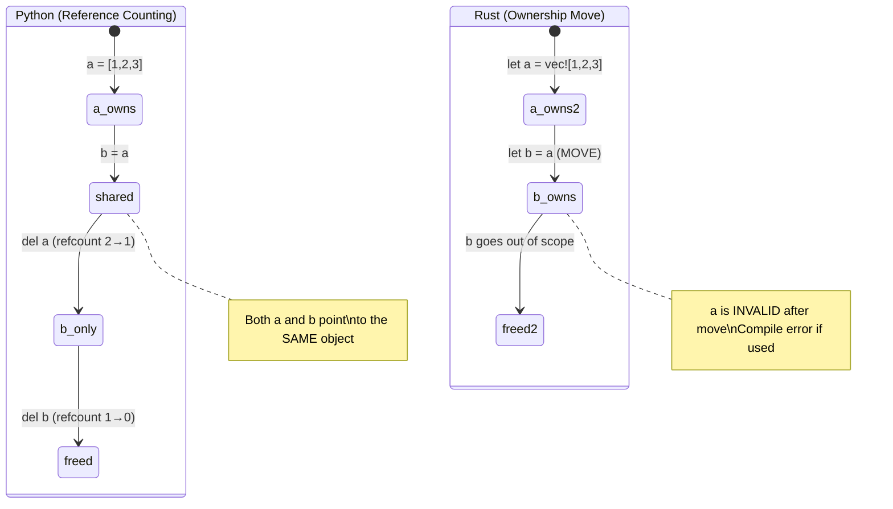
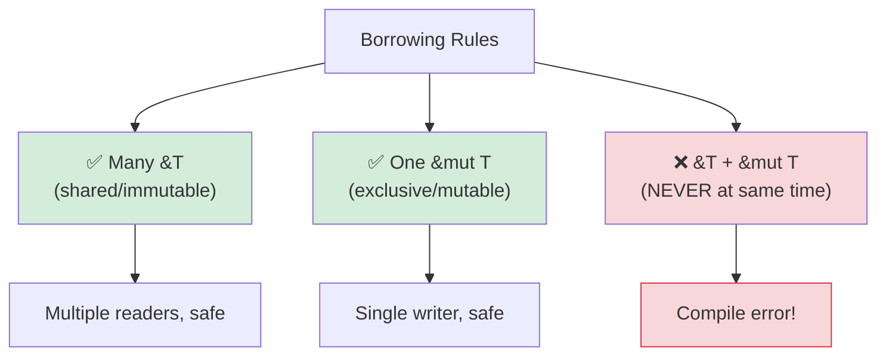

## Understanding Ownership

> **What you'll learn:** Why Rust has ownership (no GC!), move semantics vs Python's reference counting,
> borrowing (`&` and `&mut`), lifetime basics, and smart pointers (`Box`, `Rc`, `Arc`).
>
> **Difficulty:** 🟡 Intermediate

This is the hardest concept for Python developers. In Python, you never think about
who "owns" data — the garbage collector handles it. In Rust, every value has exactly
one owner, and the compiler tracks this at compile time.

### Python: Shared References Everywhere
```python
# Python — everything is a reference, gc cleans up
a = [1, 2, 3]
b = a              # b and a point to the SAME list
b.append(4)
print(a)            # [1, 2, 3, 4] — surprise! a changed too

# Who owns the list? Both a and b reference it.
# The garbage collector frees it when no references remain.
# You never think about this.
```

### Rust: Single Ownership
```rust
// Rust — every value has exactly ONE owner
let a = vec![1, 2, 3];
let b = a;           // Ownership MOVES from a to b
// println!("{:?}", a); // ❌ Compile error: value used after move

// a no longer exists. b is the sole owner.
println!("{:?}", b); // ✅ [1, 2, 3]

// When b goes out of scope, the Vec is freed. Deterministic. No GC.
```

### The Three Ownership Rules
```rust
1. Each value has exactly ONE owner variable.
2. When the owner goes out of scope, the value is dropped (freed).
3. Ownership can be transferred (moved) but not duplicated (unless Clone).
```

### Move Semantics — The Biggest Python Shock
```python
# Python — assignment copies the reference, not the data
def process(data):
    data.append(42)
    # Original list is modified!

my_list = [1, 2, 3]
process(my_list)
print(my_list)       # [1, 2, 3, 42] — modified by process!
```

```rust
// Rust — passing to a function MOVES ownership (for non-Copy types)
fn process(mut data: Vec<i32>) -> Vec<i32> {
    data.push(42);
    data  // Must return it to give ownership back!
}

let my_vec = vec![1, 2, 3];
let my_vec = process(my_vec);  // Ownership moves in and back out
println!("{:?}", my_vec);      // [1, 2, 3, 42]

// Or better — borrow instead of moving:
fn process_borrowed(data: &mut Vec<i32>) {
    data.push(42);
}

let mut my_vec = vec![1, 2, 3];
process_borrowed(&mut my_vec);  // Lend it temporarily
println!("{:?}", my_vec);       // [1, 2, 3, 42] — still ours
```

### Ownership Visualized

```text
Python:                              Rust:

  a ──────┐                           a ──→ [1, 2, 3]
           ├──→ [1, 2, 3]
  b ──────┘                           After: let b = a;

  (a and b share one object)          a  (invalid, moved)
  (refcount = 2)                      b ──→ [1, 2, 3]
                                      (only b owns the data)

  del a → refcount = 1                drop(b) → data freed
  del b → refcount = 0 → freed        (deterministic, no GC)
```



***

## Move Semantics vs Reference Counting

### Copy vs Move
```rust
// Simple types (integers, floats, bools, chars) are COPIED, not moved
let x = 42;
let y = x;    // x is COPIED to y (both valid)
println!("{x} {y}");  // ✅ 42 42

// Heap-allocated types (String, Vec, HashMap) are MOVED
let s1 = String::from("hello");
let s2 = s1;  // s1 is MOVED to s2
// println!("{s1}");  // ❌ Error: value used after move

// To explicitly copy heap data, use .clone()
let s1 = String::from("hello");
let s2 = s1.clone();  // Deep copy
println!("{s1} {s2}");  // ✅ hello hello (both valid)
```

### Python Developer's Mental Model
```text
Python:                    Rust:
─────────                  ─────
int, float, bool           Copy types (i32, f64, bool, char)
→ shared refs to immutable  → bitwise copied on assignment
  objects (no real copy)     (always independent values)
                           (Note: Python caches small ints; Rust copies are always predictable)

list, dict, str            Move types (Vec, HashMap, String)
→ shared reference         → ownership transfer (different behavior!)
→ gc cleans up             → owner drops data
→ clone with list(x)       → clone with x.clone()
   or copy.deepcopy(x)
```

### When Python's Sharing Model Causes Bugs

```python
# Python — accidental aliasing
def remove_duplicates(items):
    seen = set()
    result = []
    for item in items:
        if item not in seen:
            seen.add(item)
            result.append(item)
    return result

original = [1, 2, 2, 3, 3, 3]
alias = original          # Alias, NOT a copy
unique = remove_duplicates(alias)
# original is still [1, 2, 2, 3, 3, 3] — but only because we didn't mutate
# If remove_duplicates modified the input, original would be affected too
```

```rust
use std::collections::HashSet;

// Rust — ownership prevents accidental aliasing
fn remove_duplicates(items: &[i32]) -> Vec<i32> {
    let mut seen = HashSet::new();
    items.iter()
        .filter(|&&item| seen.insert(item))
        .copied()
        .collect()
}

let original = vec![1, 2, 2, 3, 3, 3];
let unique = remove_duplicates(&original); // Borrows — can't modify
// original is guaranteed unchanged — compiler prevented mutation via &
```

***

## Borrowing and Lifetimes

### Borrowing = Lending a Book
```rust
Think of ownership like a physical book:

Python:  Everyone has a photocopy (shared references + GC)
Rust:    One person owns the book. Others can:
         - &book     = look at it (immutable borrow, many allowed)
         - &mut book = write in it (mutable borrow, exclusive)
         - book      = give it away (move)
```

### Borrowing Rules



```rust
// Rule 1: You can have MANY immutable borrows OR ONE mutable borrow (not both)

let mut data = vec![1, 2, 3];

// Multiple immutable borrows — fine
let a = &data;
let b = &data;
println!("{:?} {:?}", a, b);  // ✅

// Mutable borrow — must be exclusive
let c = &mut data;
c.push(4);
// println!("{:?}", a);  // ❌ Error: can't use immutable borrow while mutable exists

// This prevents data races at compile time!
// Python has no equivalent — it's why Python dict modified-during-iteration crashes at runtime.
```

### Lifetimes — A Brief Introduction
```rust
// Lifetimes answer: "How long does this reference live?"
// Usually the compiler infers them. You rarely write them explicitly.

// Simple case — compiler handles it:
fn first_word(s: &str) -> &str {
    s.split_whitespace().next().unwrap_or("")
}
// The compiler knows: the returned &str lives as long as the input &str

// When you need explicit lifetimes (rare):
fn longest<'a>(a: &'a str, b: &'a str) -> &'a str {
    if a.len() > b.len() { a } else { b }
}
// 'a says: "the return value lives as long as both inputs"
```

> **For Python developers**: Don't worry about lifetimes initially. The compiler will
> tell you when you need them, and 95% of the time it infers them automatically.
> Think of lifetime annotations as hints you give the compiler when it can't figure
> out the relationships on its own.

***

## Smart Pointers

For cases where single ownership is too restrictive, Rust provides smart pointers.
These are closer to Python's reference model — but explicit and opt-in.

```rust
// Box<T> — heap allocation with single owner (like Python's normal allocation)
let boxed = Box::new(42);  // Heap-allocated i32

// Rc<T> — reference counted (like Python's refcount!)
use std::rc::Rc;
let shared = Rc::new(vec![1, 2, 3]);
let clone1 = Rc::clone(&shared);  // Increment refcount
let clone2 = Rc::clone(&shared);  // Increment refcount
// All three point to the same Vec. When all are dropped, Vec is freed.
// Similar to Python's reference counting, but Rc does NOT handle cycles —
// use Weak<T> to break cycles (Python's GC handles cycles automatically)

// Arc<T> — atomic reference counting (Rc for multi-threaded code)
use std::sync::Arc;
let thread_safe = Arc::new(vec![1, 2, 3]);
// Use Arc when sharing across threads (Rc is single-threaded)

// RefCell<T> — runtime borrow checking (like Python's "anything goes" model)
use std::cell::RefCell;
let cell = RefCell::new(42);
*cell.borrow_mut() = 99;  // Mutable borrow at runtime (panics if double-borrowed)
```

### When to Use Each

| Smart Pointer | Python Analogy | Use Case |
|---------------|----------------|----------|
| `Box<T>` | Normal allocation | Large data, recursive types, trait objects |
| `Rc<T>` | Python's default refcount | Shared ownership, single-threaded |
| `Arc<T>` | Thread-safe refcount | Shared ownership, multi-threaded |
| `RefCell<T>` | Python's "just mutate it" | Interior mutability (escape hatch) |
| `Rc<RefCell<T>>` | Python's normal object model | Shared + mutable (graph structures) |

> **Key insight**: `Rc<RefCell<T>>` gives you Python-like semantics (shared, mutable data)
> but you have to opt in explicitly. Rust's default (owned, moved) is faster and avoids
> the overhead of reference counting. For graph-like structures with cycles, use `Weak<T>`
> to break reference loops — unlike Python, Rust's `Rc` has no cycle collector.

> 📌 **See also**: [Ch. 13 — Concurrency](ch13-concurrency.md) covers `Arc<Mutex<T>>` for multi-threaded shared state.

---

## Exercises

<details>
<summary><strong>🏋️ Exercise: Spot the Borrow Checker Error</strong> (click to expand)</summary>

**Challenge**: The following code has 3 borrow checker errors. Identify each one and fix them without using `.clone()`:

```rust
fn main() {
    let mut names = vec!["Alice".to_string(), "Bob".to_string()];
    let first = &names[0];
    names.push("Charlie".to_string());
    println!("First: {first}");

    let greeting = make_greeting(names[0]);
    println!("{greeting}");
}

fn make_greeting(name: String) -> String {
    format!("Hello, {name}!")
}
```

<details>
<summary>🔑 Solution</summary>

```rust
fn main() {
    let mut names = vec!["Alice".to_string(), "Bob".to_string()];
    let first = &names[0];
    println!("First: {first}"); // Use borrow BEFORE mutating
    names.push("Charlie".to_string()); // Now safe — no live immutable borrow

    let greeting = make_greeting(&names[0]); // Pass reference, not owned
    println!("{greeting}");
}

fn make_greeting(name: &str) -> String { // Accept &str, not String
    format!("Hello, {name}!")
}
```

**Errors fixed**:
1. **Immutable borrow + mutation**: `first` borrows `names`, then `push` mutates it. Fix: use `first` before pushing.
2. **Move out of Vec**: `names[0]` tries to move a String out of Vec (not allowed). Fix: borrow with `&names[0]`.
3. **Function takes ownership**: `make_greeting(String)` consumes the value. Fix: take `&str` instead.

</details>
</details>

***


