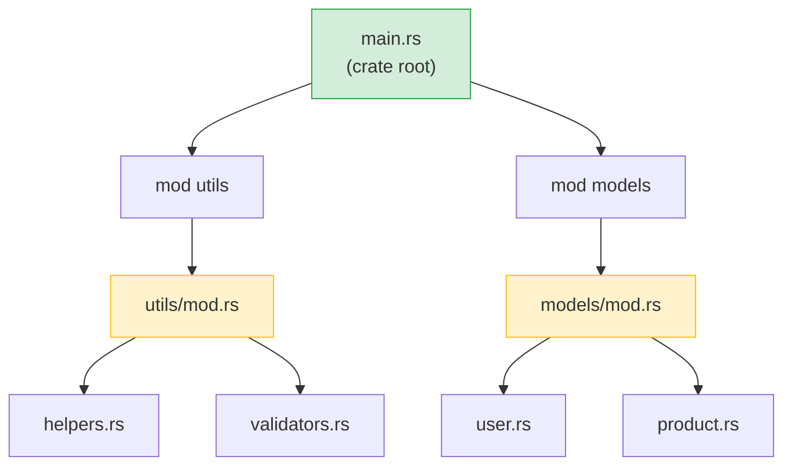

## Rust Modules vs Python Packages

> **What you'll learn:** `mod` and `use` vs `import`, visibility (`pub`) vs Python's convention-based privacy,
> Cargo.toml vs pyproject.toml, crates.io vs PyPI, and workspaces vs monorepos.
>
> **Difficulty:** 🟢 Beginner

### Python Module System
```python
# Python — files are modules, directories with __init__.py are packages

# myproject/
# ├── __init__.py          # Makes it a package
# ├── main.py
# ├── utils/
# │   ├── __init__.py      # Makes utils a sub-package
# │   ├── helpers.py
# │   └── validators.py
# └── models/
#     ├── __init__.py
#     ├── user.py
#     └── product.py

# Importing:
from myproject.utils.helpers import format_name
from myproject.models.user import User
import myproject.utils.validators as validators
```

### Rust Module System
```rust
// Rust — mod declarations create the module tree, files provide content

// src/
// ├── main.rs             # Crate root — declares modules
// ├── utils/
// │   ├── mod.rs           # Module declaration (like __init__.py)
// │   ├── helpers.rs
// │   └── validators.rs
// └── models/
//     ├── mod.rs
//     ├── user.rs
//     └── product.rs

// In src/main.rs:
mod utils;       // Tells Rust to look for src/utils/mod.rs
mod models;      // Tells Rust to look for src/models/mod.rs

use utils::helpers::format_name;
use models::user::User;

// In src/utils/mod.rs:
pub mod helpers;      // Declares and re-exports helpers.rs
pub mod validators;   // Declares and re-exports validators.rs
```



> **Python equivalent**: Think of `mod.rs` as `__init__.py` — it declares what the module exports. The crate root (`main.rs` / `lib.rs`) is like your top-level package `__init__.py`.

### Key Differences

| Concept | Python | Rust |
|---------|--------|------|
| Module = file | ✅ Automatic | Must declare with `mod` |
| Package = directory | `__init__.py` | `mod.rs` |
| Public by default | ✅ Everything | ❌ Private by default |
| Make public | `_prefix` convention | `pub` keyword |
| Import syntax | `from x import y` | `use x::y;` |
| Wildcard import | `from x import *` | `use x::*;` (discouraged) |
| Relative imports | `from . import sibling` | `use super::sibling;` |
| Re-export | `__all__` or explicit | `pub use inner::Thing;` |

### Visibility — Private by Default
```python
# Python — "we're all adults here"
class User:
    def __init__(self):
        self.name = "Alice"       # Public (by convention)
        self._age = 30            # "Private" (convention: single underscore)
        self.__secret = "shhh"    # Name-mangled (not truly private)

# Nothing stops you from accessing _age or even __secret
print(user._age)                  # Works fine
print(user._User__secret)        # Works too (name mangling)
```

```rust
// Rust — private is enforced by the compiler
pub struct User {
    pub name: String,      // Public — anyone can access
    age: i32,              // Private — only this module can access
}

impl User {
    pub fn new(name: &str, age: i32) -> Self {
        User { name: name.to_string(), age }
    }

    pub fn age(&self) -> i32 {   // Public getter
        self.age
    }

    fn validate(&self) -> bool { // Private method
        self.age > 0
    }
}

// Outside the module:
let user = User::new("Alice", 30);
println!("{}", user.name);        // ✅ Public
// println!("{}", user.age);      // ❌ Compile error: field is private
println!("{}", user.age());       // ✅ Public method (getter)
```

***

## Crates vs PyPI Packages

### Python Packages (PyPI)
```bash
# Python
pip install requests           # Install from PyPI
pip install "requests>=2.28"   # Version constraint
pip freeze > requirements.txt  # Lock versions
pip install -r requirements.txt # Reproduce environment
```

### Rust Crates (crates.io)
```bash
# Rust
cargo add reqwest              # Install from crates.io (adds to Cargo.toml)
cargo add reqwest@0.12         # Version constraint
# Cargo.lock is auto-generated — no manual step
cargo build                    # Downloads and compiles dependencies
```

### Cargo.toml vs pyproject.toml
```toml
# Rust — Cargo.toml
[package]
name = "my-project"
version = "0.1.0"
edition = "2021"

[dependencies]
serde = { version = "1.0", features = ["derive"] }  # With feature flags
reqwest = { version = "0.12", features = ["json"] }
tokio = { version = "1", features = ["full"] }
log = "0.4"

[dev-dependencies]
mockall = "0.13"
```

### Essential Crates for Python Developers

| Python Library | Rust Crate | Purpose |
|---------------|------------|---------|
| `requests` | `reqwest` | HTTP client |
| `json` (stdlib) | `serde_json` | JSON parsing |
| `pydantic` | `serde` | Serialization/validation |
| `pathlib` | `std::path` (stdlib) | Path handling |
| `os` / `shutil` | `std::fs` (stdlib) | File operations |
| `re` | `regex` | Regular expressions |
| `logging` | `tracing` / `log` | Logging |
| `click` / `argparse` | `clap` | CLI argument parsing |
| `asyncio` | `tokio` | Async runtime |
| `datetime` | `chrono` | Date and time |
| `pytest` | Built-in + `rstest` | Testing |
| `dataclasses` | `#[derive(...)]` | Data structures |
| `typing.Protocol` | Traits | Structural typing |
| `subprocess` | `std::process` (stdlib) | Run external commands |
| `sqlite3` | `rusqlite` | SQLite |
| `sqlalchemy` | `diesel` / `sqlx` | ORM / SQL toolkit |
| `fastapi` | `axum` / `actix-web` | Web framework |

***

## Workspaces vs Monorepos

### Python Monorepo (typical)
```text
# Python monorepo (various approaches, no standard)
myproject/
├── pyproject.toml           # Root project
├── packages/
│   ├── core/
│   │   ├── pyproject.toml   # Each package has its own config
│   │   └── src/core/...
│   ├── api/
│   │   ├── pyproject.toml
│   │   └── src/api/...
│   └── cli/
│       ├── pyproject.toml
│       └── src/cli/...
# Tools: poetry workspaces, pip -e ., uv workspaces — no standard
```

### Rust Workspace
```toml
# Rust — Cargo.toml at root
[workspace]
members = [
    "core",
    "api",
    "cli",
]

# Shared dependencies across workspace
[workspace.dependencies]
serde = { version = "1.0", features = ["derive"] }
tokio = { version = "1", features = ["full"] }
```

```text
# Rust workspace structure — standardized, built into Cargo
myproject/
├── Cargo.toml               # Workspace root
├── Cargo.lock               # Single lock file for all crates
├── core/
│   ├── Cargo.toml            # [dependencies] serde.workspace = true
│   └── src/lib.rs
├── api/
│   ├── Cargo.toml
│   └── src/lib.rs
└── cli/
    ├── Cargo.toml
    └── src/main.rs
```

```bash
# Workspace commands
cargo build                  # Build everything
cargo test                   # Test everything
cargo build -p core          # Build just the core crate
cargo test -p api            # Test just the api crate
cargo clippy --all           # Lint everything
```

> **Key insight**: Rust workspaces are first-class, built into Cargo. Python monorepos
> require third-party tools (poetry, uv, pants) with varying levels of support.
> In a Rust workspace, all crates share a single `Cargo.lock`, ensuring consistent
> dependency versions across the project.

---

## Exercises

<details>
<summary><strong>🏋️ Exercise: Module Visibility</strong> (click to expand)</summary>

**Challenge**: Given this module structure, predict which lines compile and which don't:

```rust
mod kitchen {
    fn secret_recipe() -> &'static str { "42 spices" }
    pub fn menu() -> &'static str { "Today's special" }

    pub mod staff {
        pub fn cook() -> String {
            format!("Cooking with {}", super::secret_recipe())
        }
    }
}

fn main() {
    println!("{}", kitchen::menu());             // Line A
    println!("{}", kitchen::secret_recipe());     // Line B
    println!("{}", kitchen::staff::cook());       // Line C
}
```

<details>
<summary>🔑 Solution</summary>

- **Line A**: ✅ Compiles — `menu()` is `pub`
- **Line B**: ❌ Compile error — `secret_recipe()` is private to `kitchen`
- **Line C**: ✅ Compiles — `staff::cook()` is `pub`, and `cook()` can access `secret_recipe()` via `super::` (child modules can access parent's private items)

**Key takeaway**: In Rust, child modules can see parent's privates (like Python's `_private` convention, but enforced). Outsiders cannot. This is the opposite of Python where `_private` is just a hint.

</details>
</details>

***

