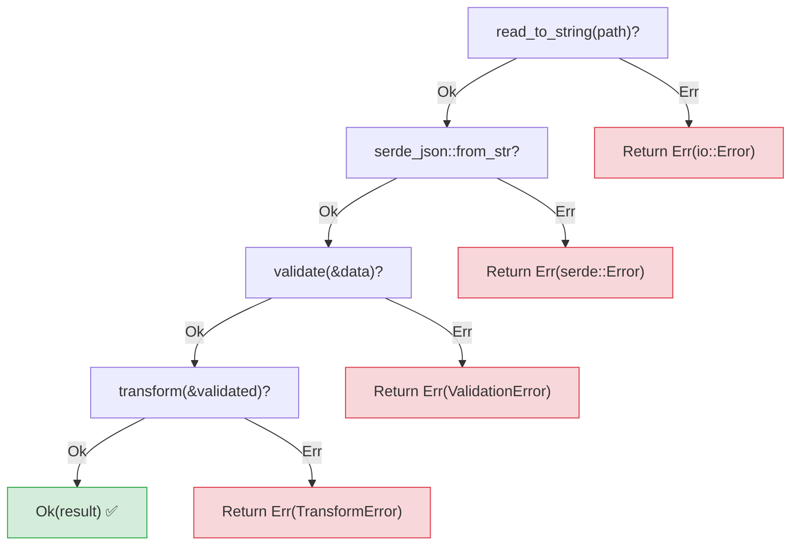
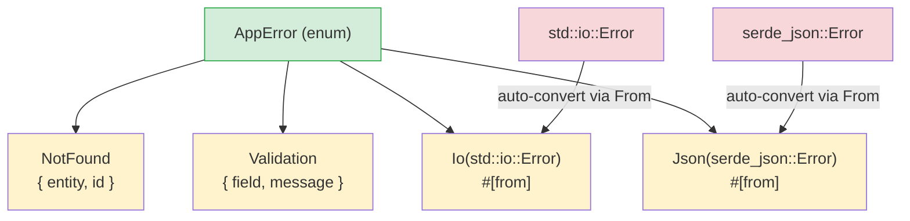

## Exceptions vs Result

> **What you'll learn:** `Result<T, E>` vs `try`/`except`, the `?` operator for concise error propagation,
> custom error types with `thiserror`, `anyhow` for applications, and why explicit errors prevent hidden bugs.
>
> **Difficulty:** 🟡 Intermediate

This is one of the biggest mindset changes for Python developers. Python uses exceptions
for error handling — errors can be thrown from anywhere and caught anywhere (or not at all).
Rust uses `Result<T, E>` — errors are values that must be explicitly handled.

### Python Exception Handling
```python
# Python — exceptions can be thrown from anywhere
import json

def load_config(path: str) -> dict:
    try:
        with open(path) as f:
            data = json.load(f)     # Can raise JSONDecodeError
            if "version" not in data:
                raise ValueError("Missing version field")
            return data
    except FileNotFoundError:
        print(f"Config file not found: {path}")
        return {}
    except json.JSONDecodeError as e:
        print(f"Invalid JSON: {e}")
        return {}
    # What other exceptions can this throw?
    # IOError? PermissionError? UnicodeDecodeError?
    # You can't tell from the function signature!
```

### Rust Result-Based Error Handling
```rust
// Rust — errors are return values, visible in the function signature
use std::fs;
use serde_json::Value;

fn load_config(path: &str) -> Result<Value, ConfigError> {
    let contents = fs::read_to_string(path)    // Returns Result
        .map_err(|e| ConfigError::FileError(e.to_string()))?;

    let data: Value = serde_json::from_str(&contents)  // Returns Result
        .map_err(|e| ConfigError::ParseError(e.to_string()))?;

    if data.get("version").is_none() {
        return Err(ConfigError::MissingField("version".to_string()));
    }

    Ok(data)
}

#[derive(Debug)]
enum ConfigError {
    FileError(String),
    ParseError(String),
    MissingField(String),
}
```

### Key Differences

```text
Python:                                 Rust:
─────────                               ─────
- Errors are exceptions (thrown)        - Errors are values (returned)
- Hidden control flow (stack unwinding) - Explicit control flow (? operator)
- Can't tell what errors from signature- MUST see errors in return type
- Uncaught exceptions crash at runtime - Unhandled Results produce compile warnings (always handle them)
- try/except is optional               - Handling Result is required
- Broad except catches everything      - match arms are exhaustive
```

### The Two Result Variants
```rust
// Result<T, E> has exactly two variants:
enum Result<T, E> {
    Ok(T),    // Success — contains the value (like Python's return value)
    Err(E),   // Failure — contains the error (like Python's raised exception)
}

// Using Result:
fn divide(a: f64, b: f64) -> Result<f64, String> {
    if b == 0.0 {
        Err("Division by zero".to_string())  // Like: raise ValueError("...")
    } else {
        Ok(a / b)                             // Like: return a / b
    }
}

// Handling Result — like try/except but explicit
match divide(10.0, 0.0) {
    Ok(result) => println!("Result: {result}"),
    Err(msg) => println!("Error: {msg}"),
}
```

***

## The ? Operator

The `?` operator is Rust's equivalent of letting exceptions propagate up the call stack,
but it's visible and explicit.

### Python — Implicit Propagation
```python
# Python — exceptions propagate silently up the call stack
def read_username() -> str:
    with open("config.txt") as f:      # FileNotFoundError propagates
        return f.readline().strip()    # IOError propagates

def greet():
    name = read_username()             # If this throws, greet() also throws
    print(f"Hello, {name}!")           # This is skipped on error

# The error propagation is INVISIBLE — you have to read the implementation
# to know what exceptions might escape.
```

### Rust — Explicit Propagation with ?
```rust
// Rust — ? propagates errors, but it's visible in the code AND the signature
use std::fs;
use std::io;

fn read_username() -> Result<String, io::Error> {
    let contents = fs::read_to_string("config.txt")?;  // ? = propagate on Err
    Ok(contents.lines().next().unwrap_or("").to_string())
}

fn greet() -> Result<(), io::Error> {
    let name = read_username()?;       // ? = if Err, return Err immediately
    println!("Hello, {name}!");        // Only reached on Ok
    Ok(())
}

// The ? says: "if this is Err, return it from THIS function immediately."
// It's like Python's exception propagation, but:
// 1. It's visible (you see the ?)
// 2. It's in the return type (Result<..., io::Error>)
// 3. The compiler ensures you handle it somewhere
```

### Chaining with ?
```python
# Python — multiple operations that might fail
def process_file(path: str) -> dict:
    with open(path) as f:                    # Might fail
        text = f.read()                       # Might fail
    data = json.loads(text)                   # Might fail
    validate(data)                            # Might fail
    return transform(data)                    # Might fail
    # Any of these can throw — and the exception type varies!
```

```rust
// Rust — same chain, but explicit
fn process_file(path: &str) -> Result<Data, AppError> {
    let text = fs::read_to_string(path)?;     // ? propagates io::Error
    let data: Value = serde_json::from_str(&text)?;  // ? propagates serde error
    let validated = validate(&data)?;          // ? propagates validation error
    let result = transform(&validated)?;       // ? propagates transform error
    Ok(result)
}
// Every ? is a potential early return — and they're all visible!
```



> Each `?` is an exit point — unlike Python's try/except where you can't see which line might throw without reading the docs.
>
> 📌 **See also**: [Ch. 15 — Migration Patterns](ch15-migration-patterns.md) covers translating Python try/except patterns to Rust in real codebases.

***

## Custom Error Types with thiserror



> The `#[from]` attribute auto-generates `impl From<io::Error> for AppError`, so `?` converts library errors into your app errors automatically.

### Python Custom Exceptions
```python
# Python — custom exception classes
class AppError(Exception):
    pass

class NotFoundError(AppError):
    def __init__(self, entity: str, id: int):
        self.entity = entity
        self.id = id
        super().__init__(f"{entity} with id {id} not found")

class ValidationError(AppError):
    def __init__(self, field: str, message: str):
        self.field = field
        super().__init__(f"Validation error on {field}: {message}")

# Usage:
def find_user(user_id: int) -> dict:
    if user_id not in users:
        raise NotFoundError("User", user_id)
    return users[user_id]
```

### Rust Custom Errors with thiserror
```rust
// Rust — error enums with thiserror (most popular approach)
// Cargo.toml: thiserror = "2"

use thiserror::Error;

#[derive(Debug, Error)]
enum AppError {
    #[error("{entity} with id {id} not found")]
    NotFound { entity: String, id: i64 },

    #[error("Validation error on {field}: {message}")]
    Validation { field: String, message: String },

    #[error("IO error: {0}")]
    Io(#[from] std::io::Error),        // Auto-convert from io::Error

    #[error("JSON error: {0}")]
    Json(#[from] serde_json::Error),   // Auto-convert from serde error
}

// Usage:
fn find_user(user_id: i64) -> Result<User, AppError> {
    users.get(&user_id)
        .cloned()
        .ok_or(AppError::NotFound {
            entity: "User".to_string(),
            id: user_id,
        })
}

// The #[from] attribute means ? auto-converts io::Error → AppError::Io
fn load_users(path: &str) -> Result<Vec<User>, AppError> {
    let data = fs::read_to_string(path)?;  // io::Error → AppError::Io automatically
    let users: Vec<User> = serde_json::from_str(&data)?;  // → AppError::Json
    Ok(users)
}
```

### Error Handling Quick Reference

| Python | Rust | Notes |
|--------|------|-------|
| `raise ValueError("msg")` | `return Err(AppError::Validation {...})` | Explicit return |
| `try: ... except:` | `match result { Ok(v) => ..., Err(e) => ... }` | Exhaustive |
| `except ValueError as e:` | `Err(AppError::Validation { .. }) =>` | Pattern match |
| `raise ... from e` | `#[from]` attribute or `.map_err()` | Error chaining |
| `finally:` | `Drop` trait (automatic) | Deterministic cleanup |
| `with open(...):` | Scope-based drop (automatic) | RAII pattern |
| Exception propagates silently | `?` propagates visibly | Always in return type |
| `isinstance(e, ValueError)` | `matches!(e, AppError::Validation {..})` | Type checking |

---

## Exercises

<details>
<summary><strong>🏋️ Exercise: Parse Config Value</strong> (click to expand)</summary>

**Challenge**: Write a function `parse_port(s: &str) -> Result<u16, String>` that:
1. Rejects empty strings with error `"empty input"`
2. Parses the string to `u16`, mapping the parse error to `"invalid number: {original_error}"`
3. Rejects ports below 1024 with `"port {n} is privileged"`

Call it with `""`, `"hello"`, `"80"`, and `"8080"` and print the results.

<details>
<summary>🔑 Solution</summary>

```rust
fn parse_port(s: &str) -> Result<u16, String> {
    if s.is_empty() {
        return Err("empty input".to_string());
    }
    let port: u16 = s.parse().map_err(|e| format!("invalid number: {e}"))?;
    if port < 1024 {
        return Err(format!("port {port} is privileged"));
    }
    Ok(port)
}

fn main() {
    for input in ["", "hello", "80", "8080"] {
        match parse_port(input) {
            Ok(port) => println!("✅ {input} → {port}"),
            Err(e) => println!("❌ {input:?} → {e}"),
        }
    }
}
```

**Key takeaway**: `?` with `.map_err()` is Rust's replacement for `try/except ValueError as e: raise ConfigError(...) from e`. Every error path is visible in the return type.

</details>
</details>

***


