## No GIL: True Parallelism

> **What you'll learn:** Why the GIL limits Python concurrency, Rust's `Send`/`Sync` traits for compile-time thread safety,
> `Arc<Mutex<T>>` vs Python `threading.Lock`, channels vs `queue.Queue`, and async/await differences.
>
> **Difficulty:** 🔴 Advanced

The GIL (Global Interpreter Lock) is Python's biggest limitation for CPU-bound work.
Rust has no GIL — threads run truly in parallel, and the type system prevents data races
at compile time.

```mermaid
gantt
    title CPU-bound Work: Python GIL vs Rust Threads
    dateFormat X
    axisFormat %s
    section Python (GIL)
        Thread 1 :a1, 0, 4
        Thread 2 :a2, 4, 8
        Thread 3 :a3, 8, 12
        Thread 4 :a4, 12, 16
    section Rust (no GIL)
        Thread 1 :b1, 0, 4
        Thread 2 :b2, 0, 4
        Thread 3 :b3, 0, 4
        Thread 4 :b4, 0, 4
```



> **Key insight**: Python threads run sequentially for CPU work (GIL serializes them). Rust threads run truly in parallel — 4 threads = ~4x speedup.
>
> 📌 **Prerequisite**: Make sure you're comfortable with [Ch. 7 — Ownership and Borrowing](ch07-ownership-and-borrowing.md) before tackling this chapter. `Arc`, `Mutex`, and move closures all build on ownership concepts.

### Python's GIL Problem
```python
# Python — threads don't help for CPU-bound work
import threading
import time

counter = 0

def increment(n):
    global counter
    for _ in range(n):
        counter += 1  # NOT thread-safe! But GIL "protects" simple operations

threads = [threading.Thread(target=increment, args=(1_000_000,)) for _ in range(4)]
start = time.perf_counter()
for t in threads:
    t.start()
for t in threads:
    t.join()
elapsed = time.perf_counter() - start

print(f"Counter: {counter}")    # Might not be 4,000,000!
print(f"Time: {elapsed:.2f}s")  # About the SAME as single-threaded (GIL)

# For true parallelism, Python requires multiprocessing:
from multiprocessing import Pool
with Pool(4) as pool:
    results = pool.map(cpu_work, data)  # Separate processes, pickle overhead
```

### Rust — True Parallelism, Compile-Time Safety
```rust
use std::sync::atomic::{AtomicI64, Ordering};
use std::sync::Arc;
use std::thread;

fn main() {
    let counter = Arc::new(AtomicI64::new(0));

    let handles: Vec<_> = (0..4).map(|_| {
        let counter = Arc::clone(&counter);
        thread::spawn(move || {
            for _ in 0..1_000_000 {
                counter.fetch_add(1, Ordering::Relaxed);
            }
        })
    }).collect();

    for h in handles {
        h.join().unwrap();
    }

    println!("Counter: {}", counter.load(Ordering::Relaxed)); // Always 4,000,000
    // Runs on ALL cores — true parallelism, no GIL
}
```

***

## Thread Safety: Type System Guarantees

### Python — Runtime Errors
```python
# Python — data races caught at runtime (or not at all)
import threading

shared_list = []

def append_items(items):
    for item in items:
        shared_list.append(item)  # "Thread-safe" due to GIL for append
        # But complex operations are NOT safe:
        # if item not in shared_list:
        #     shared_list.append(item)  # RACE CONDITION!

# Using Lock for safety:
lock = threading.Lock()
def safe_append(items):
    for item in items:
        with lock:
            if item not in shared_list:
                shared_list.append(item)
# Forgetting the lock? No compiler warning. Bug discovered in production.
```

### Rust — Compile-Time Errors
```rust
use std::sync::{Arc, Mutex};
use std::thread;

fn main() {
    // Trying to share a Vec across threads without protection:
    // let shared = vec![];
    // thread::spawn(move || shared.push(1));
    // ❌ Compile error: Vec is not Send/Sync without protection

    // With Mutex (Rust's equivalent of threading.Lock):
    let shared = Arc::new(Mutex::new(Vec::new()));

    let handles: Vec<_> = (0..4).map(|i| {
        let shared = Arc::clone(&shared);
        thread::spawn(move || {
            let mut data = shared.lock().unwrap(); // Lock is REQUIRED to access
            data.push(i);
            // Lock is automatically released when `data` goes out of scope
            // No "forgetting to unlock" — RAII guarantees it
        })
    }).collect();

    for h in handles {
        h.join().unwrap();
    }

    println!("{:?}", shared.lock().unwrap()); // [0, 1, 2, 3] (order may vary)
}
```

### Send and Sync Traits
```rust
// Rust uses two marker traits to enforce thread safety:

// Send — "this type can be transferred to another thread"
// Most types are Send. Rc<T> is NOT (use Arc<T> for threads).

// Sync — "this type can be referenced from multiple threads"
// Most types are Sync. Cell<T>/RefCell<T> are NOT (use Mutex<T>).

// The compiler checks these automatically:
// thread::spawn(move || { ... })
//   ↑ The closure's captures must be Send
//   ↑ Shared references must be Sync
//   ↑ If they're not → compile error

// Python has no equivalent. Thread safety bugs are discovered at runtime.
// Rust catches them at compile time. This is "fearless concurrency."
```

### Concurrency Primitives Comparison

| Python | Rust | Purpose |
|--------|------|---------|
| `threading.Lock()` | `Mutex<T>` | Mutual exclusion |
| `threading.RLock()` | `Mutex<T>` (no reentrant) | Reentrant lock (use differently) |
| `threading.RWLock` (N/A) | `RwLock<T>` | Multiple readers OR one writer |
| `threading.Event()` | `Condvar` | Condition variable |
| `queue.Queue()` | `mpsc::channel()` | Thread-safe channel |
| `multiprocessing.Pool` | `rayon::ThreadPool` | Thread pool |
| `concurrent.futures` | `rayon` / `tokio::spawn` | Task-based parallelism |
| `threading.local()` | `thread_local!` | Thread-local storage |
| N/A | `Atomic*` types | Lock-free counters and flags |

### Mutex Poisoning

If a thread **panics** while holding a `Mutex`, the lock becomes *poisoned*. Python has no equivalent — if a thread crashes holding a `threading.Lock()`, the lock stays stuck.

```rust
use std::sync::{Arc, Mutex};
use std::thread;

let data = Arc::new(Mutex::new(vec![1, 2, 3]));
let data2 = Arc::clone(&data);

let _ = thread::spawn(move || {
    let mut guard = data2.lock().unwrap();
    guard.push(4);
    panic!("oops!");  // Lock is now poisoned
}).join();

// Subsequent lock attempts return Err(PoisonError)
match data.lock() {
    Ok(guard) => println!("Data: {guard:?}"),
    Err(poisoned) => {
        println!("Lock was poisoned! Recovering...");
        let guard = poisoned.into_inner();
        println!("Recovered: {guard:?}");  // [1, 2, 3, 4]
    }
}
```

### Atomic Ordering (brief note)

The `Ordering` parameter on atomic operations controls memory visibility guarantees:

| Ordering | When to use |
|----------|-------------|
| `Relaxed` | Simple counters where ordering doesn't matter |
| `Acquire`/`Release` | Producer-consumer: writer uses `Release`, reader uses `Acquire` |
| `SeqCst` | When in doubt — strictest ordering, most intuitive |

Python's `threading` module hides these details behind the GIL. In Rust, you choose explicitly — use `SeqCst` until profiling shows you need something weaker.

***

## async/await Comparison

Python and Rust both have `async`/`await` syntax, but they work very differently
under the hood.

### Python async/await
```python
# Python — asyncio for concurrent I/O
import asyncio
import aiohttp

async def fetch_url(session, url):
    async with session.get(url) as resp:
        return await resp.text()

async def main():
    urls = ["https://example.com", "https://httpbin.org/get"]

    async with aiohttp.ClientSession() as session:
        tasks = [fetch_url(session, url) for url in urls]
        results = await asyncio.gather(*tasks)

    for url, result in zip(urls, results):
        print(f"{url}: {len(result)} bytes")

asyncio.run(main())

# Python async is single-threaded (still GIL)!
# It only helps with I/O-bound work (waiting for network/disk).
# CPU-bound work in async still blocks the event loop.
```

### Rust async/await
```rust
// Rust — tokio for concurrent I/O (and CPU parallelism!)
use reqwest;
use tokio;
use futures::future::join_all;  // add `futures` to Cargo.toml

async fn fetch_url(url: &str) -> Result<String, reqwest::Error> {
    reqwest::get(url).await?.text().await
}

#[tokio::main]
async fn main() -> Result<(), Box<dyn std::error::Error>> {
    let urls = vec!["https://example.com", "https://httpbin.org/get"];

    let tasks: Vec<_> = urls.iter()
        .map(|url| tokio::spawn(fetch_url(url)))  // No GIL limitation
        .collect();                                 // Can use all CPU cores

    let results = futures::future::join_all(tasks).await;

    for (url, result) in urls.iter().zip(results) {
        match result {
            Ok(Ok(body)) => println!("{url}: {} bytes", body.len()),
            Ok(Err(e)) => println!("{url}: error {e}"),
            Err(e) => println!("{url}: task failed {e}"),
        }
    }

    Ok(())
}
```

### Key Differences

| Aspect | Python asyncio | Rust tokio |
|--------|---------------|------------|
| GIL | Still applies | No GIL |
| CPU parallelism | ❌ Single-threaded | ✅ Multi-threaded |
| Runtime | Built-in (asyncio) | External crate (tokio) |
| Ecosystem | aiohttp, asyncpg, etc. | reqwest, sqlx, etc. |
| Performance | Good for I/O | Excellent for I/O AND CPU |
| Error handling | Exceptions | `Result<T, E>` |
| Cancellation | `task.cancel()` | Drop the future |
| Color problem | Sync ↔ async boundary | Same issue exists |

### Simple Parallelism with Rayon
```python
# Python — multiprocessing for CPU parallelism
from multiprocessing import Pool

def process_item(item):
    return heavy_computation(item)

with Pool(8) as pool:
    results = pool.map(process_item, items)
```

```rust
// Rust — rayon for effortless CPU parallelism (one line change!)
use rayon::prelude::*;

// Sequential:
let results: Vec<_> = items.iter().map(|item| heavy_computation(item)).collect();

// Parallel (change .iter() to .par_iter() — that's it!):
let results: Vec<_> = items.par_iter().map(|item| heavy_computation(item)).collect();

// No pickle, no process overhead, no serialization.
// Rayon automatically distributes work across cores.
```

---

## 💼 Case Study: Parallel Image Processing Pipeline

A data science team processes 50,000 satellite images nightly. Their Python pipeline uses `multiprocessing.Pool`:

```python
# Python — multiprocessing for CPU-bound image work
import multiprocessing
from PIL import Image
import numpy as np

def process_image(path: str) -> dict:
    img = np.array(Image.open(path))
    # CPU-intensive: histogram equalization, edge detection, classification
    histogram = np.histogram(img, bins=256)[0]
    edges = detect_edges(img)       # ~200ms per image
    label = classify(edges)          # ~100ms per image
    return {"path": path, "label": label, "edge_count": len(edges)}

# Problem: each subprocess copies the full Python interpreter
# Memory: 50MB per worker × 16 workers = 800MB overhead
# Startup: 2-3 seconds to fork and pickle arguments
with multiprocessing.Pool(16) as pool:
    results = pool.map(process_image, image_paths)  # ~4.5 hours for 50k images
```

**Pain points**: 800MB memory overhead from forking, pickle serialization of arguments/results, GIL prevents using threads, error handling is opaque (exceptions in workers are hard to debug).

```rust
use rayon::prelude::*;
use image::GenericImageView;

struct ImageResult {
    path: String,
    label: String,
    edge_count: usize,
}

fn process_image(path: &str) -> Result<ImageResult, image::ImageError> {
    let img = image::open(path)?;
    // Application-specific functions (implement for your use case)
    let histogram = compute_histogram(&img);       // ~50ms (no numpy overhead)
    let edges = detect_edges(&img);                // ~40ms (SIMD-optimized)
    let label = classify(&edges);                  // ~20ms
    Ok(ImageResult {
        path: path.to_string(),
        label,
        edge_count: edges.len(),
    })
}

fn main() -> Result<(), Box<dyn std::error::Error>> {
    let paths: Vec<String> = load_image_paths()?;

    // Rayon automatically uses all CPU cores — no forking, no pickle, no GIL
    let results: Vec<ImageResult> = paths
        .par_iter()                                // Parallel iterator
        .filter_map(|p| process_image(p).ok())     // Skip errors gracefully
        .collect();                                // Collect in parallel

    println!("Processed {} images", results.len());
    Ok(())
}
// 50k images in ~35 minutes (vs 4.5 hours in Python)
// Memory: ~50MB total (shared threads, no forking)
```

**Results**:
| Metric | Python (multiprocessing) | Rust (rayon) |
|--------|------------------------|--------------|
| Time (50k images) | ~4.5 hours | ~35 minutes |
| Memory overhead | 800MB (16 workers) | ~50MB (shared) |
| Error handling | Opaque pickle errors | `Result<T, E>` at every step |
| Startup cost | 2–3s (fork + pickle) | None (threads) |

> **Key lesson**: For CPU-bound parallel work, Rust's threads + rayon replace Python's `multiprocessing` with zero serialization overhead, shared memory, and compile-time safety.

---

## Exercises

<details>
<summary><strong>🏋️ Exercise: Thread-Safe Counter</strong> (click to expand)</summary>

**Challenge**: In Python, you might use `threading.Lock` to protect a shared counter. Translate this to Rust: spawn 10 threads, each incrementing a shared counter 1000 times. Print the final value (should be 10000). Use `Arc<Mutex<u64>>`.

<details>
<summary>🔑 Solution</summary>

```rust
use std::sync::{Arc, Mutex};
use std::thread;

fn main() {
    let counter = Arc::new(Mutex::new(0u64));
    let mut handles = vec![];

    for _ in 0..10 {
        let counter = Arc::clone(&counter);
        handles.push(thread::spawn(move || {
            for _ in 0..1000 {
                let mut num = counter.lock().unwrap();
                *num += 1;
            }
        }));
    }

    for handle in handles {
        handle.join().unwrap();
    }

    println!("Final count: {}", *counter.lock().unwrap());
}
```

**Key takeaway**: `Arc<Mutex<T>>` is Rust's equivalent of Python's `lock = threading.Lock()` + shared variable — but Rust *won't compile* if you forget the `Arc` or `Mutex`. Python happily runs a racy program and gives you wrong answers silently.

</details>
</details>

***


