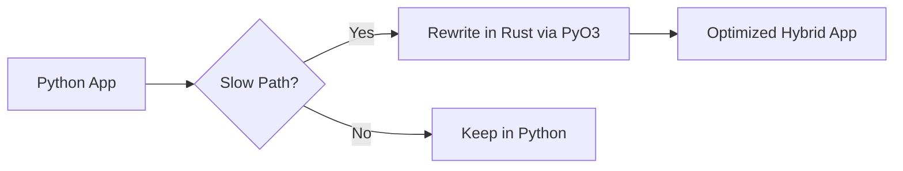

# 15. Migration Patterns 🟡

> **What you'll learn:**
> - Mapping Python common patterns to Rust
> - Decorators, Context Managers, and Dictionaries
> - Essential crates for common Python tasks
> - Incremental migration strategy

## Mapping Common Patterns

### 1. Dictionary → Struct
In Python, we often use `dict` as a generic data container. In Rust, use a `struct`.

```python
# Python
user = {"name": "Alice", "age": 30}
```

```rust
// Rust
struct User {
    name: String,
    age: u32,
}
```

### 2. Context Manager → RAII (Drop)
Python's `with` statement ensures cleanup. In Rust, cleanup happens automatically when a variable goes out of scope (the `Drop` trait).

```python
# Python
with open("file.txt") as f:
    data = f.read()
# File closes here
```

```rust
// Rust
{
    let mut file = File::open("file.txt")?;
    // Read file...
} // File closes automatically here!
```

### 3. Decorators → Wrapper Functions
Rust doesn't have `@decorator` syntax. Instead, use higher-order functions or macros.

```rust
fn logged<F, R>(f: F) -> R 
where F: FnOnce() -> R 
{
    println!("Starting...");
    let result = f();
    println!("Finished.");
    result
}
```

---

## Essential Crate Mapping

| Python Library | Rust Equivalent |
|----------------|-----------------|
| `json` | `serde_json` |
| `requests` | `reqwest` |
| `pandas` / `csv` | `polars` / `csv` |
| `pytest` | Built-in + `rstest` |
| `pydantic` | `serde` |
| `fastapi` | `axum` |

---

## Incremental Migration Strategy

You don't have to rewrite everything. The best way to move to Rust is **Incremental Adoption**:

1. **Profile**: Find the slowest part of your Python code using `cProfile` or `py-spy`.
2. **PyO3**: Write only that slow function in Rust.
3. **Bridge**: Call the Rust function from Python using `maturin`.
4. **Repeat**: Gradually move more logic to Rust as needed.



---

## Exercises

<details>
<summary><strong>🏋️ Exercise: Pattern Matching Migration</strong></summary>

**Challenge**: In Python, you might use `isinstance(x, (int, float))` to handle multiple types. How do you handle this "one of many types" pattern in Rust?

<details>
<summary>🔑 Solution</summary>

Use an `enum`. Enums in Rust are perfect for representing a value that can be one of several different "kinds". You then use `match` to handle each kind safely.

</details>
</details>

***
