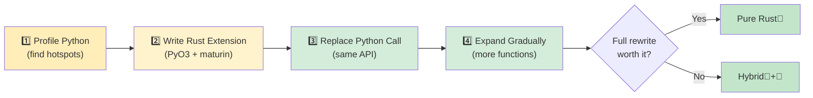

## Common Python Patterns in Rust

> **What you'll learn:** How to translate dict→struct, class→struct+impl, list comprehension→iterator chain,
> decorator→trait, and context manager→Drop/RAII. Plus essential crates and an incremental adoption strategy.
>
> **Difficulty:** 🟡 Intermediate

### Dictionary → Struct
```python
# Python — dict as data container (very common)
user = {
    "name": "Alice",
    "age": 30,
    "email": "alice@example.com",
    "active": True,
}
print(user["name"])
```

```rust
// Rust — struct with named fields
#[derive(Debug, Clone, serde::Serialize, serde::Deserialize)]
struct User {
    name: String,
    age: i32,
    email: String,
    active: bool,
}

let user = User {
    name: "Alice".into(),
    age: 30,
    email: "alice@example.com".into(),
    active: true,
};
println!("{}", user.name);
```

### Context Manager → RAII (Drop)
```python
# Python — context manager for resource cleanup
class FileManager:
    def __init__(self, path):
        self.file = open(path, 'w')

    def __enter__(self):
        return self.file

    def __exit__(self, *args):
        self.file.close()

with FileManager("output.txt") as f:
    f.write("hello")
# File automatically closed when exiting `with`
```

```rust
// Rust — RAII: Drop trait runs when value goes out of scope
use std::fs::File;
use std::io::Write;

fn write_file() -> std::io::Result<()> {
    let mut file = File::create("output.txt")?;
    file.write_all(b"hello")?;
    Ok(())
    // File automatically closed when `file` goes out of scope
    // No `with` needed — RAII handles it!
}
```

### Decorator → Higher-Order Function or Macro
```python
# Python — decorator for timing
import functools, time

def timed(func):
    @functools.wraps(func)
    def wrapper(*args, **kwargs):
        start = time.perf_counter()
        result = func(*args, **kwargs)
        elapsed = time.perf_counter() - start
        print(f"{func.__name__} took {elapsed:.4f}s")
        return result
    return wrapper

@timed
def slow_function():
    time.sleep(1)
```

```rust
// Rust — no decorators, use wrapper functions or macros
use std::time::Instant;

fn timed<F, R>(name: &str, f: F) -> R
where
    F: FnOnce() -> R,
{
    let start = Instant::now();
    let result = f();
    println!("{} took {:.4?}", name, start.elapsed());
    result
}

// Usage:
let result = timed("slow_function", || {
    std::thread::sleep(std::time::Duration::from_secs(1));
    42
});
```

### Iterator Pipeline (Data Processing)
```python
# Python — chain of transformations
import csv
from collections import Counter

def analyze_sales(filename):
    with open(filename) as f:
        reader = csv.DictReader(f)
        sales = [
            row for row in reader
            if float(row["amount"]) > 100
        ]
    by_region = Counter(sale["region"] for sale in sales)
    top_regions = by_region.most_common(5)
    return top_regions
```

```rust
// Rust — iterator chains with strong types
use std::collections::HashMap;

#[derive(Debug, serde::Deserialize)]
struct Sale {
    region: String,
    amount: f64,
}

fn analyze_sales(filename: &str) -> Vec<(String, usize)> {
    let data = std::fs::read_to_string(filename).unwrap();
    let mut reader = csv::Reader::from_reader(data.as_bytes());

    let mut by_region: HashMap<String, usize> = HashMap::new();
    for sale in reader.deserialize::<Sale>().flatten() {
        if sale.amount > 100.0 {
            *by_region.entry(sale.region).or_insert(0) += 1;
        }
    }

    let mut top: Vec<_> = by_region.into_iter().collect();
    top.sort_by(|a, b| b.1.cmp(&a.1));
    top.truncate(5);
    top
}
```

### Global Config / Singleton
```python
# Python — module-level singleton (common pattern)
# config.py
import json

class Config:
    _instance = None

    def __new__(cls):
        if cls._instance is None:
            cls._instance = super().__new__(cls)
            with open("config.json") as f:
                cls._instance.data = json.load(f)
        return cls._instance

config = Config()  # Module-level singleton
```

```rust
// Rust — OnceLock for lazy static initialization (Rust 1.70+)
use std::sync::OnceLock;
use serde_json::Value;

static CONFIG: OnceLock<Value> = OnceLock::new();

fn get_config() -> &'static Value {
    CONFIG.get_or_init(|| {
        let data = std::fs::read_to_string("config.json")
            .expect("Failed to read config");
        serde_json::from_str(&data)
            .expect("Failed to parse config")
    })
}

// Usage anywhere:
let db_host = get_config()["database"]["host"].as_str().unwrap();
```

***

## Essential Crates for Python Developers

### Data Processing & Serialization

| Task | Python | Rust Crate | Notes |
|------|--------|-----------|-------|
| JSON | `json` | `serde_json` | Type-safe serialization |
| CSV | `csv`, `pandas` | `csv` | Streaming, low memory |
| YAML | `pyyaml` | `serde_yaml` | Config files |
| TOML | `tomllib` | `toml` | Config files |
| Data validation | `pydantic` | `serde` + custom | Compile-time validation |
| Date/time | `datetime` | `chrono` | Full timezone support |
| Regex | `re` | `regex` | Very fast |
| UUID | `uuid` | `uuid` | Same concept |

### Web & Network

| Task | Python | Rust Crate | Notes |
|------|--------|-----------|-------|
| HTTP client | `requests` | `reqwest` | Async-first |
| Web framework | `FastAPI`/`Flask` | `axum` / `actix-web` | Very fast |
| WebSocket | `websockets` | `tokio-tungstenite` | Async |
| gRPC | `grpcio` | `tonic` | Full support |
| Database (SQL) | `sqlalchemy` | `sqlx` / `diesel` | Compile-time checked SQL |
| Redis | `redis-py` | `redis` | Async support |

### CLI & System

| Task | Python | Rust Crate | Notes |
|------|--------|-----------|-------|
| CLI args | `argparse`/`click` | `clap` | Derive macros |
| Colored output | `colorama` | `colored` | Terminal colors |
| Progress bar | `tqdm` | `indicatif` | Same UX |
| File watching | `watchdog` | `notify` | Cross-platform |
| Logging | `logging` | `tracing` | Structured, async-ready |
| Env vars | `os.environ` | `std::env` + `dotenvy` | .env support |
| Subprocess | `subprocess` | `std::process::Command` | Built-in |
| Temp files | `tempfile` | `tempfile` | Same name! |

### Testing

| Task | Python | Rust Crate | Notes |
|------|--------|-----------|-------|
| Test framework | `pytest` | Built-in + `rstest` | `cargo test` |
| Mocking | `unittest.mock` | `mockall` | Trait-based |
| Property testing | `hypothesis` | `proptest` | Similar API |
| Snapshot testing | `syrupy` | `insta` | Snapshot approval |
| Benchmarking | `pytest-benchmark` | `criterion` | Statistical |
| Code coverage | `coverage.py` | `cargo-tarpaulin` | LLVM-based |

***

## Incremental Adoption Strategy



> 📌 **See also**: [Ch. 14 — Unsafe Rust and FFI](ch14-unsafe-rust-and-ffi.md) covers the low-level FFI details needed for PyO3 bindings.

### Step 1: Identify Hotspots

```python
# Profile your Python code first
import cProfile
cProfile.run('main()')  # Find the CPU-intensive functions

# Or use py-spy for sampling profiler:
# py-spy top --pid <python-pid>
# py-spy record -o profile.svg -- python main.py
```

### Step 2: Write Rust Extension for Hotspot

```bash
# Create a Rust extension with maturin
cd my_python_project
maturin init --bindings pyo3

# Write the hot function in Rust (see PyO3 section above)
# Build and install:
maturin develop --release
```

### Step 3: Replace Python Call with Rust Call

```python
# Before:
result = python_hot_function(data)  # Slow

# After:
import my_rust_extension
result = my_rust_extension.hot_function(data)  # Fast!

# Same API, same tests, 10-100x faster
```

### Step 4: Expand Gradually

```rust
Week 1-2: Replace one CPU-bound function with Rust
Week 3-4: Replace data parsing/validation layer
Month 2:  Replace core data pipeline
Month 3+: Consider full Rust rewrite if benefits justify it

Key principle: keep Python for orchestration, use Rust for computation.
```

---

## 💼 Case Study: Accelerating a Data Pipeline with PyO3

A fintech startup has a Python data pipeline that processes 2GB of daily transaction CSV files. The critical bottleneck is a validation + transformation step:

```python
# Python — the slow part (~12 minutes for 2GB)
import csv
from decimal import Decimal
from datetime import datetime

def validate_and_transform(filepath: str) -> list[dict]:
    results = []
    with open(filepath) as f:
        reader = csv.DictReader(f)
        for row in reader:
            # Parse and validate each field
            amount = Decimal(row["amount"])
            if amount < 0:
                raise ValueError(f"Negative amount: {amount}")
            date = datetime.strptime(row["date"], "%Y-%m-%d")
            category = categorize(row["merchant"])  # String matching, ~50 rules

            results.append({
                "amount_cents": int(amount * 100),
                "date": date.isoformat(),
                "category": category,
                "merchant": row["merchant"].strip().lower(),
            })
    return results
# ~12 minutes for 15M rows. Tried pandas — got to ~8 minutes but 6GB RAM.
```

**Step 1**: Profile and identify the hotspot (CSV parsing + Decimal conversion + string matching = 95% of time).

**Step 2**: Write the Rust extension:

```rust
// src/lib.rs — PyO3 extension
use pyo3::prelude::*;
use pyo3::types::PyList;
use std::fs::File;
use std::io::BufReader;

#[derive(Debug)]
struct Transaction {
    amount_cents: i64,
    date: String,
    category: String,
    merchant: String,
}

fn categorize(merchant: &str) -> &'static str {
    // Aho-Corasick or simple rules — compiled once, blazing fast
    if merchant.contains("amazon") { "shopping" }
    else if merchant.contains("uber") || merchant.contains("lyft") { "transport" }
    else if merchant.contains("starbucks") { "food" }
    else { "other" }
}

#[pyfunction]
fn process_transactions(path: &str) -> PyResult<Vec<(i64, String, String, String)>> {
    let file = File::open(path).map_err(|e| pyo3::exceptions::PyIOError::new_err(e.to_string()))?;
    let mut reader = csv::Reader::from_reader(BufReader::new(file));

    let mut results = Vec::with_capacity(15_000_000); // Pre-allocate

    for record in reader.records() {
        let record = record.map_err(|e| pyo3::exceptions::PyValueError::new_err(e.to_string()))?;
        let amount_str = &record[0];
        let amount_cents = parse_amount_cents(amount_str)?;  // Your custom parser (no Decimal needed)
        let date = &record[1];  // Already in ISO format, just validate
        let merchant = record[2].trim().to_lowercase();
        let category = categorize(&merchant).to_string();

        results.push((amount_cents, date.to_string(), category, merchant));
    }
    Ok(results)
}

#[pymodule]
fn fast_pipeline(m: &Bound<'_, PyModule>) -> PyResult<()> {
    m.add_function(wrap_pyfunction!(process_transactions, m)?)?;
    Ok(())
}
```

**Step 3**: Replace one line in Python:

```python
# Before:
results = validate_and_transform("transactions.csv")  # 12 minutes

# After:
import fast_pipeline
results = fast_pipeline.process_transactions("transactions.csv")  # 45 seconds

# Same Python orchestration, same tests, same deployment
# Just one function replaced
```

**Results**:
| Metric | Python (csv + Decimal) | Rust (PyO3 + csv crate) |
|--------|----------------------|------------------------|
| Time (2GB / 15M rows) | 12 minutes | 45 seconds |
| Peak memory | 6GB (pandas) / 2GB (csv) | 200MB |
| Lines changed in Python | — | 1 (import + call) |
| Rust code written | — | ~60 lines |
| Tests passing | 47/47 | 47/47 (unchanged) |

> **Key lesson**: You don't need to rewrite your whole application. Find the 5% of code that takes 95% of the time, rewrite that in Rust with PyO3, and keep everything else in Python. The team went from "we need to add more servers" to "one server is enough."

---

## Exercises

<details>
<summary><strong>🏋️ Exercise: Migration Decision Matrix</strong> (click to expand)</summary>

**Challenge**: You have a Python web application with these components. For each one, decide: **Keep in Python**, **Rewrite in Rust**, or **PyO3 bridge**. Justify each choice.

1. Flask route handlers (request parsing, JSON responses)
2. Image thumbnail generation (CPU-bound, processes 10k images/day)
3. Database ORM queries (SQLAlchemy)
4. CSV parser for 2GB financial files (runs nightly)
5. Admin dashboard (Jinja2 templates)

<details>
<summary>🔑 Solution</summary>

| Component | Decision | Rationale |
|---|---|---|
| Flask route handlers | 🐍 Keep Python | I/O-bound, framework-heavy, low benefit from Rust |
| Image thumbnail generation | 🦀 PyO3 bridge | CPU-bound hot path, keep Python API, Rust internals |
| Database ORM queries | 🐍 Keep Python | SQLAlchemy is mature, queries are I/O-bound |
| CSV parser (2GB) | 🦀 PyO3 bridge or full Rust | CPU + memory bound, Rust's zero-copy parsing shines |
| Admin dashboard | 🐍 Keep Python | UI/template code, no performance concern |

**Key takeaway**: The migration sweet spot is CPU-bound, performance-critical code that has a clean boundary. Don't rewrite glue code or I/O-bound handlers — the gains don't justify the cost.

</details>
</details>

***


