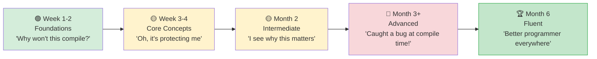

## Idiomatic Rust for Python Developers

> **What you'll learn:** Top 10 habits to build, common pitfalls with fixes, a structured 3-month learning path,
> the complete Python→Rust "Rosetta Stone" reference table, and recommended learning resources.
>
> **Difficulty:** 🟡 Intermediate



### Top 10 Habits to Build

1. **Use `match` on enums instead of `if isinstance()`**
   ```python
   # Python                              # Rust
   if isinstance(shape, Circle): ...     match shape { Shape::Circle(r) => ... }
   ```

2. **Let the compiler guide you** — Read error messages carefully. Rust's
   compiler is the best in any language. It tells you what's wrong AND how to fix it.

3. **Prefer `&str` over `String` in function parameters** — Accept the most
   general type. `&str` works with both `String` and string literals.

4. **Use iterators instead of index loops** — Iterator chains are more idiomatic
   and often faster than `for i in 0..vec.len()`.

5. **Embrace `Option` and `Result`** — Don't `.unwrap()` everything. Use `?`,
   `map`, `and_then`, `unwrap_or_else`.

6. **Derive traits liberally** — `#[derive(Debug, Clone, PartialEq)]` should be
   on most structs. It's free and makes testing easier.

7. **Use `cargo clippy` religiously** — It catches hundreds of style and correctness
   issues. Treat it like `ruff` for Rust.

8. **Don't fight the borrow checker** — If you're fighting it, you're probably
   structuring data wrong. Refactor to make ownership clear.

9. **Use enums for state machines** — Instead of string flags or booleans, use
   enums. The compiler ensures you handle every state.

10. **Clone first, optimize later** — When learning, use `.clone()` freely to
    avoid ownership complexity. Optimize only when profiling shows a need.

### Common Mistakes from Python Developers

| Mistake | Why | Fix |
|---------|-----|-----|
| `.unwrap()` everywhere | Panics at runtime | Use `?` or `match` |
| String instead of &str | Unnecessary allocation | Use `&str` for params |
| `for i in 0..vec.len()` | Not idiomatic | `for item in &vec` |
| Ignoring clippy warnings | Miss easy improvements | `cargo clippy` |
| Too many `.clone()` calls | Performance overhead | Refactor ownership |
| Giant main() function | Hard to test | Extract into lib.rs |
| Not using `#[derive()]` | Re-inventing the wheel | Derive common traits |
| Panicking on errors | Not recoverable | Return `Result<T, E>` |

***

## Performance Comparison

### Benchmark: Common Operations
```text
Operation              Python 3.12    Rust (release)    Speedup
─────────────────────  ────────────   ──────────────    ─────────
Fibonacci(40)          ~25s           ~0.3s             ~80x
Sort 10M integers      ~5.2s          ~0.6s             ~9x
JSON parse 100MB       ~8.5s          ~0.4s             ~21x
Regex 1M matches       ~3.1s          ~0.3s             ~10x
HTTP server (req/s)    ~5,000         ~150,000          ~30x
SHA-256 1GB file       ~12s           ~1.2s             ~10x
CSV parse 1M rows      ~4.5s          ~0.2s             ~22x
String concatenation   ~2.1s          ~0.05s            ~42x
```

> **Note**: Python with C extensions (NumPy, etc.) dramatically narrows the gap
> for numerical work. These benchmarks compare pure Python vs pure Rust.

### Memory Usage
```text
Python:                                 Rust:
─────────                               ─────
- Object header: 28 bytes/object       - No object header
- int: 28 bytes (even for 0)           - i32: 4 bytes, i64: 8 bytes
- str "hello": 54 bytes                - &str "hello": 16 bytes (ptr + len)
- list of 1000 ints: ~36 KB            - Vec<i32>: ~4 KB
  (8 KB pointers + 28 KB int objects)
- dict of 100 items: ~5.5 KB           - HashMap of 100: ~2.4 KB

Total for typical application:
- Python: 50-200 MB baseline           - Rust: 1-5 MB baseline
```

***

## Common Pitfalls and Solutions

### Pitfall 1: "The Borrow Checker Won't Let Me"
```rust
// Problem: trying to iterate and modify
let mut items = vec![1, 2, 3, 4, 5];
// for item in &items {
//     if *item > 3 { items.push(*item * 2); }  // ❌ Can't borrow mut while borrowed
// }

// Solution 1: collect changes, apply after
let additions: Vec<i32> = items.iter()
    .filter(|&&x| x > 3)
    .map(|&x| x * 2)
    .collect();
items.extend(additions);

// Solution 2: use retain/extend
items.retain(|&x| x <= 3);
```

### Pitfall 2: "Too Many String Types"
```rust
// When in doubt:
// - &str for function parameters
// - String for struct fields and return values
// - &str literals ("hello") work everywhere &str is expected

fn process(input: &str) -> String {    // Accept &str, return String
    format!("Processed: {}", input)
}
```

### Pitfall 3: "I Miss Python's Simplicity"
```rust
// Python one-liner:
// result = [x**2 for x in data if x > 0]

// Rust equivalent:
let result: Vec<i32> = data.iter()
    .filter(|&&x| x > 0)
    .map(|&x| x * x)
    .collect();

// It's more verbose, but:
// - Type-safe at compile time
// - 10-100x faster
// - No runtime type errors possible
// - Explicit about memory allocation (.collect())
```

### Pitfall 4: "Where's My REPL?"
```rust
// Rust has no REPL. Instead:
// 1. Use `cargo test` as your REPL — write small tests to try things
// 2. Use Rust Playground (play.rust-lang.org) for quick experiments
// 3. Use `dbg!()` macro for quick debug output
// 4. Use `cargo watch -x test` for auto-running tests on save

#[test]
fn playground() {
    // Use this as your "REPL" — run with `cargo test playground`
    let result = "hello world"
        .split_whitespace()
        .map(|w| w.to_uppercase())
        .collect::<Vec<_>>();
    dbg!(&result);  // Prints: [src/main.rs:5] &result = ["HELLO", "WORLD"]
}
```

***

## Learning Path and Resources

### Week 1-2: Foundations
- [ ] Install Rust, set up VS Code with rust-analyzer
- [ ] Complete chapters 1-4 of this guide (types, control flow)
- [ ] Write 5 small programs converting Python scripts to Rust
- [ ] Get comfortable with `cargo build`, `cargo test`, `cargo clippy`

### Week 3-4: Core Concepts
- [ ] Complete chapters 5-8 (structs, enums, ownership, modules)
- [ ] Rewrite a Python data processing script in Rust
- [ ] Practice with `Option<T>` and `Result<T, E>` until natural
- [ ] Read compiler error messages carefully — they're teaching you

### Month 2: Intermediate
- [ ] Complete chapters 9-12 (error handling, traits, iterators)
- [ ] Build a CLI tool with `clap` and `serde`
- [ ] Write a PyO3 extension for a Python project hotspot
- [ ] Practice iterator chains until they feel like comprehensions

### Month 3: Advanced
- [ ] Complete chapters 13-16 (concurrency, unsafe, testing)
- [ ] Build a web service with `axum` and `tokio`
- [ ] Contribute to an open-source Rust project
- [ ] Read "Programming Rust" (O'Reilly) for deeper understanding

### Recommended Resources
- **The Rust Book**: https://doc.rust-lang.org/book/ (official, excellent)
- **Rust by Example**: https://doc.rust-lang.org/rust-by-example/ (learn by doing)
- **Rustlings**: https://github.com/rust-lang/rustlings (exercises)
- **Rust Playground**: https://play.rust-lang.org/ (online compiler)
- **This Week in Rust**: https://this-week-in-rust.org/ (newsletter)
- **PyO3 Guide**: https://pyo3.rs/ (Python ↔ Rust bridge)
- **Comprehensive Rust** (Google): https://google.github.io/comprehensive-rust/

### Python → Rust Rosetta Stone

| Python | Rust | Chapter |
|--------|------|---------|
| `list` | `Vec<T>` | 5 |
| `dict` | `HashMap<K,V>` | 5 |
| `set` | `HashSet<T>` | 5 |
| `tuple` | `(T1, T2, ...)` | 5 |
| `class` | `struct` + `impl` | 5 |
| `@dataclass` | `#[derive(...)]` | 5, 12a |
| `Enum` | `enum` | 6 |
| `None` | `Option<T>` | 6 |
| `raise`/`try`/`except` | `Result<T,E>` + `?` | 9 |
| `Protocol` (PEP 544) | `trait` | 10 |
| `TypeVar` | Generics `<T>` | 10 |
| `__dunder__` methods | Traits (Display, Add, etc.) | 10 |
| `lambda` | `\|args\| body` | 12 |
| generator `yield` | `impl Iterator` | 12 |
| list comprehension | `.map().filter().collect()` | 12 |
| `@decorator` | Higher-order fn or macro | 12a, 15 |
| `asyncio` | `tokio` | 13 |
| `threading` | `std::thread` | 13 |
| `multiprocessing` | `rayon` | 13 |
| `unittest.mock` | `mockall` | 14a |
| `pytest` | `cargo test` + `rstest` | 14a |
| `pip install` | `cargo add` | 8 |
| `requirements.txt` | `Cargo.lock` | 8 |
| `pyproject.toml` | `Cargo.toml` | 8 |
| `with` (context mgr) | Scope-based `Drop` | 15 |
| `json.dumps/loads` | `serde_json` | 15 |

***

## Final Thoughts for Python Developers

```rust
What you'll miss from Python:
- REPL and interactive exploration
- Rapid prototyping speed
- Rich ML/AI ecosystem (PyTorch, etc.)
- "Just works" dynamic typing
- pip install and immediate use

What you'll gain from Rust:
- "If it compiles, it works" confidence
- 10-100x performance improvement
- No more runtime type errors
- No more None/null crashes
- True parallelism (no GIL!)
- Single binary deployment
- Predictable memory usage
- The best compiler error messages in any language

The journey:
Week 1:   "Why does the compiler hate me?"
Week 2:   "Oh, it's actually protecting me from bugs"
Month 1:  "I see why this matters"
Month 2:  "I caught a bug at compile time that would've been a production incident"
Month 3:  "I don't want to go back to untyped code"
Month 6:  "Rust has made me a better programmer in every language"
```

---

## Exercises

<details>
<summary><strong>🏋️ Exercise: Code Review Checklist</strong> (click to expand)</summary>

**Challenge**: Review this Rust code (written by a Python developer) and identify 5 idiomatic improvements:

```rust
fn get_name(names: Vec<String>, index: i32) -> String {
    if index >= 0 && (index as usize) < names.len() {
        return names[index as usize].clone();
    } else {
        return String::from("");
    }
}

fn main() {
    let mut result = String::from("");
    let names = vec!["Alice".to_string(), "Bob".to_string()];
    result = get_name(names.clone(), 0);
    println!("{}", result);
}
```

<details>
<summary>🔑 Solution</summary>

Five improvements:

```rust
// 1. Take &[String] not Vec<String> (don't take ownership of the whole vec)
// 2. Use usize for index (not i32 — indices are always non-negative)
// 3. Return Option<&str> instead of empty string (use the type system!)
// 4. Use .get() instead of bounds-checking manually
// 5. Don't clone() in main — pass a reference

fn get_name(names: &[String], index: usize) -> Option<&str> {
    names.get(index).map(|s| s.as_str())
}

fn main() {
    let names = vec!["Alice".to_string(), "Bob".to_string()];
    match get_name(&names, 0) {
        Some(name) => println!("{name}"),
        None => println!("Not found"),
    }
}
```

**Key takeaway**: Python habits that hurt in Rust: cloning everything (use borrows), using sentinel values like `""` (use `Option`), taking ownership when borrowing suffices, and using signed integers for indices.

</details>
</details>

***

*End of Rust for Python Programmers Training Guide*
