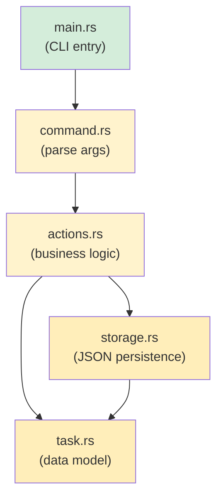

## Capstone Project: Build a CLI Task Manager

> **What you'll learn:** Tie together everything from the course by building a complete Rust CLI application
> that a Python developer would typically write with `argparse` + `json` + `pathlib`.
>
> **Difficulty:** 🔴 Advanced

This capstone project exercises concepts from every major chapter:
- **Ch. 3**: Types and variables (structs, enums)
- **Ch. 5**: Collections (`Vec`, `HashMap`)
- **Ch. 6**: Enums and pattern matching (task status, commands)
- **Ch. 7**: Ownership and borrowing (passing references)
- **Ch. 9**: Error handling (`Result`, `?`, custom errors)
- **Ch. 10**: Traits (`Display`, `FromStr`)
- **Ch. 11**: Type conversions (`From`, `TryFrom`)
- **Ch. 12**: Iterators and closures (filtering, mapping)
- **Ch. 8**: Modules (organized project structure)

***

## The Project: `rustdo`

A command-line task manager (like Python's `todo.txt` tools) that stores tasks in a JSON file.

### Python Equivalent (what you'd write in Python)

```python
#!/usr/bin/env python3
"""A simple CLI task manager — the Python version."""
import json
import sys
from pathlib import Path
from datetime import datetime
from enum import Enum

TASK_FILE = Path.home() / ".rustdo.json"

class Priority(Enum):
    LOW = "low"
    MEDIUM = "medium"
    HIGH = "high"

class Task:
    def __init__(self, id: int, title: str, priority: Priority, done: bool = False):
        self.id = id
        self.title = title
        self.priority = priority
        self.done = done
        self.created = datetime.now().isoformat()

def load_tasks() -> list[Task]:
    if not TASK_FILE.exists():
        return []
    data = json.loads(TASK_FILE.read_text())
    return [Task(**t) for t in data]

def save_tasks(tasks: list[Task]):
    TASK_FILE.write_text(json.dumps([t.__dict__ for t in tasks], indent=2))

# Commands: add, list, done, remove, stats
# ... (you know how this goes in Python)
```

### Your Rust Implementation

Build this step-by-step. Each step maps to concepts from specific chapters.

***

## Step 1: Define the Data Model (Ch. 3, 6, 10, 11)

```rust
// src/task.rs
use std::fmt;
use std::str::FromStr;
use serde::{Deserialize, Serialize};
use chrono::Local;

/// Task priority — maps to Python's Priority(Enum)
#[derive(Debug, Clone, Copy, PartialEq, Eq, Serialize, Deserialize)]
#[serde(rename_all = "lowercase")]
pub enum Priority {
    Low,
    Medium,
    High,
}

// Display trait (Python's __str__)
impl fmt::Display for Priority {
    fn fmt(&self, f: &mut fmt::Formatter<'_>) -> fmt::Result {
        match self {
            Priority::Low => write!(f, "low"),
            Priority::Medium => write!(f, "medium"),
            Priority::High => write!(f, "high"),
        }
    }
}

// FromStr trait (parsing "high" → Priority::High)
impl FromStr for Priority {
    type Err = String;

    fn from_str(s: &str) -> Result<Self, Self::Err> {
        match s.to_lowercase().as_str() {
            "low" | "l" => Ok(Priority::Low),
            "medium" | "med" | "m" => Ok(Priority::Medium),
            "high" | "h" => Ok(Priority::High),
            other => Err(format!("unknown priority: '{other}' (use low/medium/high)")),
        }
    }
}

/// A single task — maps to Python's Task class
#[derive(Debug, Clone, Serialize, Deserialize)]
pub struct Task {
    pub id: u32,
    pub title: String,
    pub priority: Priority,
    pub done: bool,
    pub created: String,
}

impl Task {
    pub fn new(id: u32, title: String, priority: Priority) -> Self {
        Self {
            id,
            title,
            priority,
            done: false,
            created: Local::now().format("%Y-%m-%dT%H:%M:%S").to_string(),
        }
    }
}

impl fmt::Display for Task {
    fn fmt(&self, f: &mut fmt::Formatter<'_>) -> fmt::Result {
        let status = if self.done { "✅" } else { "⬜" };
        let priority_icon = match self.priority {
            Priority::Low => "🟢",
            Priority::Medium => "🟡",
            Priority::High => "🔴",
        };
        write!(f, "{} {} [{}] {} ({})", status, self.id, priority_icon, self.title, self.created)
    }
}
```

> **Python comparison**: In Python you'd use `@dataclass` + `Enum`. In Rust, `struct` + `enum` + `derive` macros give you serialization, display, and parsing for free.

***

## Step 2: Storage Layer (Ch. 9, 7)

```rust
// src/storage.rs
use std::fs;
use std::path::PathBuf;
use crate::task::Task;

/// Get the path to the task file (~/.rustdo.json)
fn task_file_path() -> PathBuf {
    let home = dirs::home_dir().expect("Could not determine home directory");
    home.join(".rustdo.json")
}

/// Load tasks from disk — returns empty Vec if file doesn't exist
pub fn load_tasks() -> Result<Vec<Task>, Box<dyn std::error::Error>> {
    let path = task_file_path();
    if !path.exists() {
        return Ok(Vec::new());
    }
    let content = fs::read_to_string(&path)?;  // ? propagates io::Error
    let tasks: Vec<Task> = serde_json::from_str(&content)?;  // ? propagates serde error
    Ok(tasks)
}

/// Save tasks to disk
pub fn save_tasks(tasks: &[Task]) -> Result<(), Box<dyn std::error::Error>> {
    let path = task_file_path();
    let json = serde_json::to_string_pretty(tasks)?;
    fs::write(&path, json)?;
    Ok(())
}
```

> **Python comparison**: Python uses `Path.read_text()` + `json.loads()`. Rust uses `fs::read_to_string()` + `serde_json::from_str()`. Note the `?` — every error is explicit and propagated.

***

## Step 3: Command Enum (Ch. 6)

```rust
// src/command.rs
use crate::task::Priority;

/// All possible commands — one enum variant per action
pub enum Command {
    Add { title: String, priority: Priority },
    List { show_done: bool },
    Done { id: u32 },
    Remove { id: u32 },
    Stats,
    Help,
}

impl Command {
    /// Parse command-line arguments into a Command
    /// (In production, you'd use `clap` — this is educational)
    pub fn parse(args: &[String]) -> Result<Self, String> {
        match args.first().map(|s| s.as_str()) {
            Some("add") => {
                let title = args.get(1)
                    .ok_or("usage: rustdo add <title> [priority]")?
                    .clone();
                let priority = args.get(2)
                    .map(|p| p.parse::<Priority>())
                    .transpose()
                    .map_err(|e| e.to_string())?
                    .unwrap_or(Priority::Medium);
                Ok(Command::Add { title, priority })
            }
            Some("list") => {
                let show_done = args.get(1).map(|s| s == "--all").unwrap_or(false);
                Ok(Command::List { show_done })
            }
            Some("done") => {
                let id: u32 = args.get(1)
                    .ok_or("usage: rustdo done <id>")?
                    .parse()
                    .map_err(|_| "id must be a number")?;
                Ok(Command::Done { id })
            }
            Some("remove") => {
                let id: u32 = args.get(1)
                    .ok_or("usage: rustdo remove <id>")?
                    .parse()
                    .map_err(|_| "id must be a number")?;
                Ok(Command::Remove { id })
            }
            Some("stats") => Ok(Command::Stats),
            _ => Ok(Command::Help),
        }
    }
}
```

> **Python comparison**: Python uses `argparse` or `click`. This hand-rolled parser shows how `match` on enum-like patterns replaces Python's if/elif chains. For real projects, use the `clap` crate.

***

## Step 4: Business Logic (Ch. 5, 12, 7)

```rust
// src/actions.rs
use crate::task::{Task, Priority};
use crate::storage;

pub fn add_task(title: String, priority: Priority) -> Result<(), Box<dyn std::error::Error>> {
    let mut tasks = storage::load_tasks()?;
    let next_id = tasks.iter().map(|t| t.id).max().unwrap_or(0) + 1;
    let task = Task::new(next_id, title.clone(), priority);
    println!("Added: {task}");
    tasks.push(task);
    storage::save_tasks(&tasks)?;
    Ok(())
}

pub fn list_tasks(show_done: bool) -> Result<(), Box<dyn std::error::Error>> {
    let tasks = storage::load_tasks()?;
    let filtered: Vec<&Task> = tasks.iter()
        .filter(|t| show_done || !t.done)   // Iterator + closure (Ch. 12)
        .collect();

    if filtered.is_empty() {
        println!("No tasks! 🎉");
        return Ok(());
    }

    for task in &filtered {
        println!("  {task}");   // Uses Display trait (Ch. 10)
    }
    println!("\n{} task(s) shown", filtered.len());
    Ok(())
}

pub fn complete_task(id: u32) -> Result<(), Box<dyn std::error::Error>> {
    let mut tasks = storage::load_tasks()?;
    let task = tasks.iter_mut()
        .find(|t| t.id == id)                // Iterator::find (Ch. 12)
        .ok_or(format!("No task with id {id}"))?;
    task.done = true;
    println!("Completed: {task}");
    storage::save_tasks(&tasks)?;
    Ok(())
}

pub fn remove_task(id: u32) -> Result<(), Box<dyn std::error::Error>> {
    let mut tasks = storage::load_tasks()?;
    let len_before = tasks.len();
    tasks.retain(|t| t.id != id);            // Vec::retain (Ch. 5)
    if tasks.len() == len_before {
        return Err(format!("No task with id {id}").into());
    }
    println!("Removed task {id}");
    storage::save_tasks(&tasks)?;
    Ok(())
}

pub fn show_stats() -> Result<(), Box<dyn std::error::Error>> {
    let tasks = storage::load_tasks()?;
    let total = tasks.len();
    let done = tasks.iter().filter(|t| t.done).count();
    let pending = total - done;

    // Group by priority using iterators (Ch. 12)
    let high = tasks.iter().filter(|t| !t.done && t.priority == Priority::High).count();
    let medium = tasks.iter().filter(|t| !t.done && t.priority == Priority::Medium).count();
    let low = tasks.iter().filter(|t| !t.done && t.priority == Priority::Low).count();

    println!("📊 Task Statistics");
    println!("   Total:   {total}");
    println!("   Done:    {done} ✅");
    println!("   Pending: {pending}");
    println!("   🔴 High:   {high}");
    println!("   🟡 Medium: {medium}");
    println!("   🟢 Low:    {low}");
    Ok(())
}
```

> **Key Rust patterns used**: `iter().map().max()`, `iter().filter().collect()`, `iter_mut().find()`, `retain()`, `iter().filter().count()`. These replace Python's list comprehensions, `next(x for x in ...)`, and `Counter`.

***

## Step 5: Wire It Together (Ch. 8)

```rust
// src/main.rs
mod task;
mod storage;
mod command;
mod actions;

use command::Command;

fn main() {
    let args: Vec<String> = std::env::args().skip(1).collect();
    let command = match Command::parse(&args) {
        Ok(cmd) => cmd,
        Err(e) => {
            eprintln!("Error: {e}");
            std::process::exit(1);
        }
    };

    let result = match command {
        Command::Add { title, priority } => actions::add_task(title, priority),
        Command::List { show_done } => actions::list_tasks(show_done),
        Command::Done { id } => actions::complete_task(id),
        Command::Remove { id } => actions::remove_task(id),
        Command::Stats => actions::show_stats(),
        Command::Help => {
            print_help();
            Ok(())
        }
    };

    if let Err(e) = result {
        eprintln!("Error: {e}");
        std::process::exit(1);
    }
}

fn print_help() {
    println!("rustdo — a task manager for Pythonistas learning Rust\n");
    println!("USAGE:");
    println!("  rustdo add <title> [low|medium|high]   Add a task");
    println!("  rustdo list [--all]                    List pending tasks");
    println!("  rustdo done <id>                       Mark task complete");
    println!("  rustdo remove <id>                     Remove a task");
    println!("  rustdo stats                           Show statistics");
}
```



***

## Step 6: Cargo.toml Dependencies

```toml
[package]
name = "rustdo"
version = "0.1.0"
edition = "2021"

[dependencies]
serde = { version = "1", features = ["derive"] }
serde_json = "1"
chrono = "0.4"
dirs = "5"
```

> **Python equivalent**: This is your `pyproject.toml` `[project.dependencies]`. `cargo add serde serde_json chrono dirs` is like `pip install`.

***

## Step 7: Tests (Ch. 14)

```rust
// src/task.rs — add at the bottom
#[cfg(test)]
mod tests {
    use super::*;

    #[test]
    fn parse_priority() {
        assert_eq!("high".parse::<Priority>().unwrap(), Priority::High);
        assert_eq!("H".parse::<Priority>().unwrap(), Priority::High);
        assert_eq!("med".parse::<Priority>().unwrap(), Priority::Medium);
        assert!("invalid".parse::<Priority>().is_err());
    }

    #[test]
    fn task_display() {
        let task = Task::new(1, "Write Rust".to_string(), Priority::High);
        let display = format!("{task}");
        assert!(display.contains("Write Rust"));
        assert!(display.contains("🔴"));
        assert!(display.contains("⬜")); // Not done yet
    }

    #[test]
    fn task_serialization_roundtrip() {
        let task = Task::new(1, "Test".to_string(), Priority::Low);
        let json = serde_json::to_string(&task).unwrap();
        let recovered: Task = serde_json::from_str(&json).unwrap();
        assert_eq!(recovered.title, "Test");
        assert_eq!(recovered.priority, Priority::Low);
    }
}
```

> **Python equivalent**: `pytest` tests. Run with `cargo test` instead of `pytest`. No test discovery magic needed — `#[test]` marks test functions explicitly.

***

## Stretch Goals

Once you have the basic version working, try these enhancements:

1. **Add `clap` for argument parsing** — Replace the hand-rolled parser with `clap`'s derive macros:
   ```rust
   #[derive(Parser)]
   enum Command {
       Add { title: String, #[arg(default_value = "medium")] priority: Priority },
       List { #[arg(long)] all: bool },
       Done { id: u32 },
       Remove { id: u32 },
       Stats,
   }
   ```

2. **Add colored output** — Use the `colored` crate for terminal colors (like Python's `colorama`).

3. **Add due dates** — Add an `Option<NaiveDate>` field and filter overdue tasks.

4. **Add tags/categories** — Use `Vec<String>` for tags and filter with `.iter().any()`.

5. **Make it a library + binary** — Split into `lib.rs` + `main.rs` so the logic is reusable (Ch. 8 module pattern).

***

## What You Practiced

| Chapter | Concept | Where It Appeared |
|---------|---------|-------------------|
| Ch. 3 | Types and variables | `Task` struct fields, `u32`, `String`, `bool` |
| Ch. 5 | Collections | `Vec<Task>`, `retain()`, `push()` |
| Ch. 6 | Enums + match | `Priority`, `Command`, exhaustive matching |
| Ch. 7 | Ownership + borrowing | `&[Task]` vs `Vec<Task>`, `&mut` for completion |
| Ch. 8 | Modules | `mod task; mod storage; mod command; mod actions;` |
| Ch. 9 | Error handling | `Result<T, E>`, `?` operator, `.ok_or()` |
| Ch. 10 | Traits | `Display`, `FromStr`, `Serialize`, `Deserialize` |
| Ch. 11 | From/Into | `FromStr` for Priority, `.into()` for error conversion |
| Ch. 12 | Iterators | `filter`, `map`, `find`, `count`, `collect` |
| Ch. 14 | Testing | `#[test]`, `#[cfg(test)]`, assertion macros |

> 🎓 **Congratulations!** If you've built this project, you've used every major Rust concept covered in this book. You're no longer a Python developer learning Rust — you're a Rust developer who also knows Python.

***
