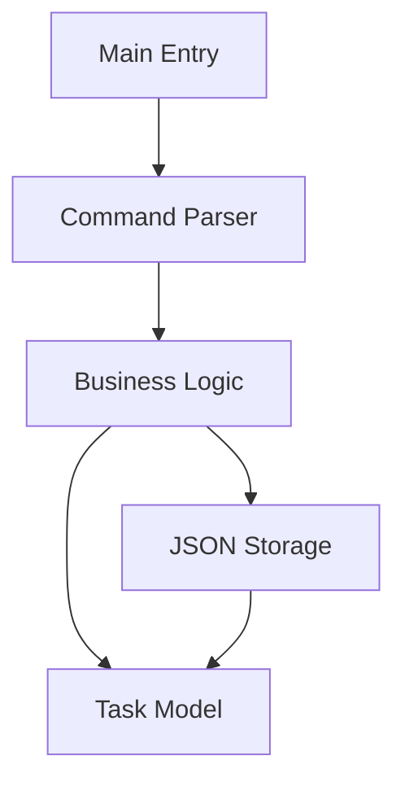

# 17. Capstone Project: Build a CLI Task Manager 🔴

> **What you'll learn:**
> - Tie together everything from the course
> - Build a complete Rust CLI application
> - Data modeling, storage, and business logic

## The Project: `rustdo`

In this final project, we will build a command-line task manager called `rustdo`. It will allow users to add, list, and complete tasks, storing them in a local JSON file.

### Features
1. **Add Task**: `rustdo add "Finish Rust book" high`
2. **List Tasks**: `rustdo list`
3. **Complete Task**: `rustdo done 1`
4. **Stats**: `rustdo stats` (Show total/pending tasks)

---

## Architecture Overview



### 1. The Model (`task.rs`)
Define a `Task` struct and a `Priority` enum. Use `serde` for JSON serialization.

### 2. The Storage (`storage.rs`)
Handle reading and writing the `tasks.json` file using `std::fs` and `serde_json`.

### 3. The Logic (`actions.rs`)
Functions to manipulate the task list (filter for pending, find by ID, etc.).

---

## Key Rust Concepts Applied

| Concept | Usage in Project |
|---------|------------------|
| **Structs/Enums** | Defining `Task` and `Priority`. |
| **Generics** | Using `Vec<Task>` to store items. |
| **Error Handling** | Using `Result` for file I/O and parsing. |
| **Traits** | Implementing `Display` to print tasks beautifully. |
| **Iterators** | Filtering the task list using `.filter()`. |

---

## Final Challenge: The "Rustdo" CLI

Your task is to implement the `main.rs` that wires these components together. Use `std::env::args()` to capture user input and a `match` statement to route to the correct action.

### Example Main Loop:
```rust
fn main() {
    let args: Vec<String> = std::env::args().collect();
    // 1. Parse args
    // 2. Load tasks from JSON
    // 3. Match command (add/list/done)
    // 4. Save changes back to JSON
}
```

---

## Project Conclusion

Congratulations! By completing this project, you have moved from **Python scripts** to a **compiled, type-safe Rust binary**. You've handled memory safety, error propagation, and efficient data processing.

**You are now ready to build real-world systems in Rust!** 🚀🦀

***
