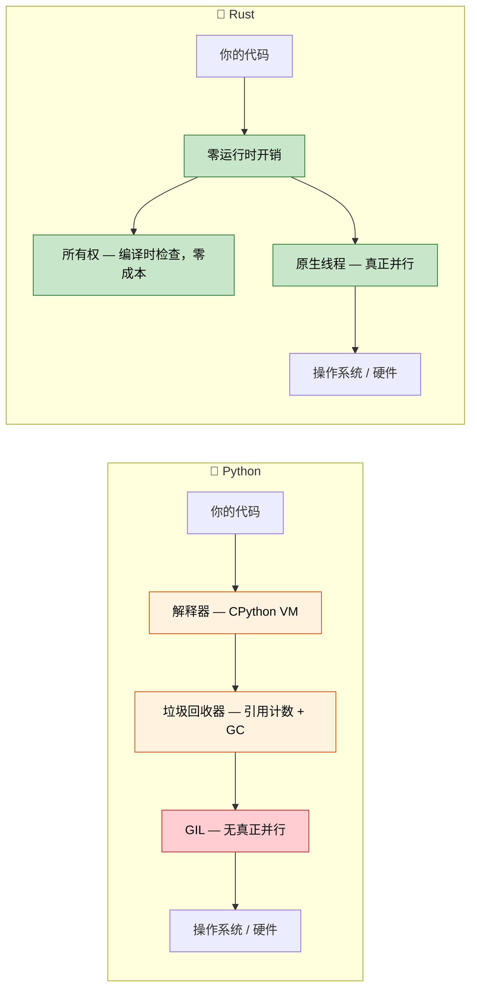

[English Original](../en/ch01-introduction-and-motivation.md)

## 讲师介绍与整体方法

- 讲师介绍
    - Microsoft SCHIE（Silicon and Cloud Hardware Infrastructure Engineering，硅与云硬件基础设施工程）团队首席固件架构师
    - 行业资深专家，专长于安全、系统编程（固件、操作系统、虚拟机管理程序）、CPU 与平台架构以及 C++ 系统
    - 2017 年在 AWS EC2 开始使用 Rust 编程，从此爱上了这门语言
- 本课程旨在尽可能保持高度互动
    - 前提假设：你熟悉 Python 及其生态系统
    - 示例会刻意将 Python 概念映射到 Rust 对应概念
    - **欢迎随时提出任何澄清性问题**

---

## Rust 对 Python 开发者的价值

> **你将学到：** 为什么 Python 开发者开始采用 Rust、真实世界中的性能收益（Dropbox、Discord、Pydantic）、何时应选择 Rust 而不是继续使用 Python，以及这两门语言在核心设计理念上的差异。
>
> **难度：** 🟢 初级

### 性能：从分钟到毫秒

Python 在处理 CPU 密集型任务时出了名的慢。Rust 则在提供高级语言体验的同时，具备接近 C 的原生性能。

```python
# Python — 处理 1000 万次调用约需 2 秒
import time

def fibonacci(n: int) -> int:
    if n <= 1:
        return n
    a, b = 0, 1
    for _ in range(2, n + 1):
        a, b = b, a + b
    return b

start = time.perf_counter()
results = [fibonacci(n % 30) for n in range(10_000_000)]
elapsed = time.perf_counter() - start
print(f"耗时: {elapsed:.2f}s")  # 在典型硬件上约为 2s
```

```rust
// Rust — 处理同样的 1000 万次调用约需 0.07 秒
use std::time::Instant;

fn fibonacci(n: u64) -> u64 {
    if n <= 1 {
        return n;
    }
    let (mut a, mut b) = (0u64, 1u64);
    for _ in 2..=n {
        let temp = b;
        b = a + b;
        a = temp;
    }
    b
}

fn main() {
    let start = Instant::now();
    let results: Vec<u64> = (0..10_000_000).map(|n| fibonacci(n % 30)).collect();
    println!("耗时: {:.2?}", start.elapsed());  // 约为 0.07s
}
```
> 注意：为了公平比较性能，Rust 应在发布模式下运行（`cargo run --release`）。
> **为什么差距这么大？** Python 的每一次 `+` 操作都要经过字典查找、从堆对象中解包整数，并在每次操作时进行类型检查。而 Rust 会将 `fibonacci` 直接编译成少量 x86 `add`/`mov` 指令 —— 这与 C 编译器生成的代码几乎一致。

### 没有垃圾回收器的内存安全

Python 的引用计数垃圾回收（GC）存在一些已知问题：循环引用、不可预测的 `__del__` 触发时机以及内存碎片。Rust 则在编译时消除了这些隐患。

```python
# Python — CPython 的引用计数器无法释放的循环引用
class Node:
    def __init__(self, value):
        self.value = value
        self.parent = None
        self.children = []

    def add_child(self, child):
        self.children.append(child)
        child.parent = self  # 循环引用！

# 这两个节点相互引用 —— 引用计数永远不会降为 0。
# CPython 的循环检测器最终会清理它们，
# 但你无法控制清理时机，且会带来 GC 停顿开销。
root = Node("root")
child = Node("child")
root.add_child(child)
```

```rust
// Rust — 架构设计上就防止了循环引用
struct Node {
    value: String,
    children: Vec<Node>,  // 子节点被“拥有” (OWNED) —— 不可能产生循环
}

impl Node {
    fn new(value: &str) -> Self {
        Node {
            value: value.to_string(),
            children: Vec::new(),
        }
    }

    fn add_child(&mut self, child: Node) {
        self.children.push(child);  // 所有权在此转移
    }
}

fn main() {
    let mut root = Node::new("root");
    let child = Node::new("child");
    root.add_child(child);
    // 当 root 被丢弃 (dropped) 时，所有子节点也会随之被丢弃。
    // 确定性、零开销、无需 GC。
}
```

> **核心洞见**：在 Rust 中，子节点不会持有指向父节点的引用。如果你确实需要交叉引用（如在图结构中），则必须显式使用 `Rc<RefCell<T>>` 或索引等机制 —— 从而使代码的复杂性显性化且可控。

***

## Rust 解决的常见 Python 痛点

### 1. 运行时类型错误

最常见的 Python 生产环境 Bug：向函数传递了错误的类型。类型提示 (Type hints) 虽然有帮助，但在运行时并不具备强制力。

```python
# Python — 类型提示只是建议，而非规则
def process_user(user_id: int, name: str) -> dict:
    return {"id": user_id, "name": name.upper()}

# 这些调用在调用方都能“正常运行” —— 但在运行时会崩溃
process_user("not-a-number", 42)        # TypeError: int 类型没有 .upper() 方法
process_user(None, "Alice")             # 静默将 None 存为 id —— Bug 隐藏到下游代码期望 int 时才爆发

# 即使用了 mypy，依然能通过各种方式绕过类型检查：
import json
data = json.loads('{"id": "oops", "name": "Alice"}') # 总是返回 Any
process_user(data["id"], data["name"])               # mypy 无法捕捉到这里的问题
```

```rust
// Rust — 编译器在程序运行前就会抓住这些错误
fn process_user(user_id: i64, name: &str) -> User {
    User {
        id: user_id,
        name: name.to_uppercase(),
    }
}

// process_user("not-a-number", 42);     // ❌ 编译错误：期望 i64，却是 &str
// process_user(None, "Alice");           // ❌ 编译错误：期望 i64，却是 Option
// 参数个数不对总是会导致编译错误。

// 反序列化 JSON 也是类型安全的：
#[derive(serde::Deserialize)]
struct UserInput {
    id: i64,      // JSON 中必须为数字
    name: String, // JSON 中必须为字符串
}
let input: UserInput = serde_json::from_str(json_str)?; // 类型不匹配则返回 Err
process_user(input.id, &input.name); // ✅ 保证类型正确
```

### 2. None：Python 版的“十亿美元错误”

在 Python 中，任何期望值的地方都可能出现 `None`。Python 无法在编译时防止 `AttributeError: 'NoneType' object has no attribute ...` 这样的错误。

```python
# Python — None 潜伏在每一个角落
def find_user(user_id: int) -> dict | None:
    users = {1: {"name": "Alice"}, 2: {"name": "Bob"}}
    return users.get(user_id)

user = find_user(999)         # 返回 None
print(user["name"])           # 💥 TypeError: 'NoneType' object is not subscriptable

# 即使有 Optional 类型提示，也没有东西强制执行检查：
from typing import Optional
def get_name(user_id: int) -> Optional[str]:
    return None

name: Optional[str] = get_name(1)
print(name.upper())          # 💥 AttributeError — mypy 虽然警告，但运行时无动于衷
```

```rust
// Rust — 除非显式处理，否则 None 是不可能出现的
fn find_user(user_id: i64) -> Option<User> {
    let users = std::collections::HashMap::from([
        (1, User { name: "Alice".into() }),
        (2, User { name: "Bob".into() }),
    ]);
    users.get(&user_id).cloned()
}

let user = find_user(999);  // 返回 Option<User> 的 None 变体 (variant)
// println!("{}", user.name);  // ❌ 编译错误：Option<User> 没有 name 字段

// 你必须显式处理 None 的情况：
match find_user(999) {
    Some(user) => println!("{}", user.name),
    None => println!("未找到用户"),
}

// 也可以使用组合算子：
let name = find_user(999)
    .map(|u| u.name)
    .unwrap_or_else(|| "未知用户".to_string());
```

### 3. GIL：Python 的并发天花板

Python 的全局解释器锁 (Global Interpreter Lock) 意味着其线程无法真正并行执行 Python 代码。`threading` 库只对 I/O 密集型工作有效；而处理 CPU 密集型任务则需要 `multiprocessing`（带有序列化开销）或 C 扩展。

```python
# Python — 线程由于 GIL 的存在并不能加速 CPU 密集型任务
import threading
import time

def cpu_work(n):
    total = 0
    for i in range(n):
        total += i * i
    return total

start = time.perf_counter()
threads = [threading.Thread(target=cpu_work, args=(10_000_000,)) for _ in range(4)]
for t in threads: t.start()
for t in threads: t.join()
elapsed = time.perf_counter() - start
print(f"4 线程耗时: {elapsed:.2f}s")  # 与单线程基本一致！GIL 阻止了真正并行。

# multiprocessing 虽然起效，但需要在进程间序列化数据：
from multiprocessing import Pool
with Pool(4) as p:
    results = p.map(cpu_work, [10_000_000] * 4)  # 约为 4 倍加速，但有 pickle 开销。
```

```rust
// Rust — 真正的并行，无 GIL，无序列化开销
use std::thread;

fn cpu_work(n: u64) -> u64 {
    (0..n).map(|i| i * i).sum()
}

fn main() {
    let start = std::time::Instant::now();
    let handles: Vec<_> = (0..4)
        .map(|_| thread::spawn(|| cpu_work(10_000_000)))
        .collect();

    let _results: Vec<u64> = handles.into_iter()
        .map(|h| h.join().unwrap())
        .collect();

    println!("4 线程耗时: {:.2?}", start.elapsed());  // 约为单线程 4 倍速
}
```

> **配合 Rayon** (Rust 的并行迭代器库)，实现并行会更简单：
> ```rust
> use rayon::prelude::*;
> let results: Vec<u64> = inputs.par_iter().map(|&n| cpu_work(n)).collect();
> ```

### 4. 部署与分发的重重阻碍

Python 部署出了名的困难：虚拟环境 (venvs)、系统 Python 版本冲突、`pip install` 各种报错、C 扩展的 Wheel 文件、以及带有庞大 Python 运行时的 Docker 镜像。

```python
# Python 部署检查表：
# 1. 哪个 Python 版本？ 3.10? 3.11? 3.12?
# 2. 虚拟环境：venv, conda, poetry, pipenv?
# 3. C 扩展：需要编译器吗？manylinux wheels 匹配吗？
# 4. 系统依赖：libssl, libffi 等？
# 5. Docker：python:3.12-slim 镜像大概 200MB 以上，完整版则接近 1GB
# 6. 启动时间：由于大量 import，通常需要 200-500ms
```

```rust
// Rust 部署：单一静态二进制文件，无需运行时
// cargo build --release → 生成单个二进制执行文件，通常在 5-20 MB
// 复制到任何地方即可 —— 无需 Python，无需 venv，无依赖报错

// Docker 镜像：从 scratch 或 distroless 基础镜像开始，通常只有几 MB
// FROM scratch
// COPY target/release/my_app /my_app
// CMD ["/my_app"]

// 启动时间：< 1ms
// 跨平台编译 (Cross-compile): cargo build --target x86_64-unknown-linux-musl
```

***

## 何时选择 Rust 而不是 Python

### 建议选择 Rust 的场景：
- **性能至关重要**：数据流水线、实时处理、计算密集型服务。
- **正确性极其重要**：金融系统、安全关键型代码、协议实现。
- **追求部署简便**：单个二进制文件，无运行时依赖。
- **底层控制**：硬件交互、操作系统集成、嵌入式系统。
- **真正的并发**：无需 GIL 绕过方案的 CPU 密集型并行。
- **内存效率**：降低内存密集型服务的云成本。
- **长时间运行的服务**：延迟可预测非常重要（无 GC 停顿）。

### 建议保留 Python 的场景：
- **快速原型开发**：探索性数据分析、脚本、一次性工具。
- **ML/AI 工作流**：PyTorch、TensorFlow、scikit-learn 生态系统。
- **胶水代码**：连接 API、数据转换脚本。
- **团队专业能力**：Rust 的学习曲线带来的收益不足以抵消其成本时。
- **上市时间优先**：开发速度比执行速度更重要时。
- **交互式工作**：Jupyter 笔记本、REPL 驱动开发。
- **自动化脚本**：运维自动化、系统管理任务、快速工具。

### 考虑结合使用（配合 PyO3 的混合方案）：
- **计算密集型代码用 Rust 编写**：通过 PyO3/maturin 从 Python 调用。
- **业务逻辑和编排用 Python 编写**：熟悉且高效。
- **渐进式迁移**：识别性能热点，并用 Rust 扩展替换。
- **取长补短**：Python 的生态系统 + Rust 的性能。

---

## 真实世界的影响：为什么大厂选择 Rust？

### Dropbox：存储基础设施
- **此前（Python）**：同步引擎中的 CPU 使用率高，内存开销大。
- **此后（Rust）**：性能提升 10 倍，内存占用减少 50%。
- **结果**：节省了数百万美元的基础设施成本。

### Discord：语音/视频后端
- **此前（Python → Go）**：GC 停顿导致音频掉帧。
- **此后（Rust）**：获得了极其稳定的低延迟性能。
- **结果**：由于用户体验更好，且服务器成本降低。

### Cloudflare：边缘计算 (Edge Workers)
- **原因**：WebAssembly 编译支持，边缘侧性能可预测。
- **结果**：Worker 的冷启动时间缩短到微秒级。

### Pydantic V2
- **此前**：纯 Python 验证 —— 处理大型负载时速度较慢。
- **此后**：Rust 核心（通过 PyO3）—— 验证速度提升 **5–50 倍**。
- **结果**：保持同样的 Python API，执行速度大幅提升。

### 这对 Python 开发者意味着什么：
1. **技能互补**：Rust 和 Python 解决不同的问题。
2. **PyO3 桥梁**：编写可从 Python 调用的 Rust 扩展。
3. **深入理解性能**：了解为什么 Python 慢，以及如何修复性能热点。
4. **职业成长**：系统编程专业知识的价值日益凸显。
5. **云端成本**：代码提速 10 倍 = 显著降低基础设施支出。

---

## 语言哲学对比

### Python 哲学
- **可读性至上**：语法简洁，“完成一件事应该只有一种显而易见的方法”。
- **内置电池 (Batteries included)**：内容丰富的标准库，支持快速原型开发。
- **鸭子类型 (Duck typing)**：“如果它走起来像鸭子，叫起来也像鸭子...”
- **开发效率**：针对编写速度而非执行速度进行优化。
- **动态特性**：运行时修改类、猴子补丁 (monkey-patching)、元类。

### Rust 哲学
- **高性能且不失安全**：零成本抽象，无运行时开销。
- **正确性第一**：只要能编译通过，整类 Bug 都不可能出现。
- **显式优于隐式**：无隐藏行为，无隐式类型转换。
- **所有权**：资源（内存、文件、套接字）有且仅有一个所有者。
- **无畏并发**：通过类型系统在编译时防止数据竞争。



---

## 快速对照：Rust vs Python

| **概念** | **Python** | **Rust** | **核心差异** |
|-------------|-----------|----------|-------------------|
| 类型系统 | 动态 (`duck typing`) | 静态（编译时） | Bug 在运行前就被抓住 |
| 内存管理 | 垃圾回收（引用计数 + 循环检测 GC） | 所有权系统 | 零成本、确定性的清理 |
| None/null | `None` 随处可见 | `Option<T>` | 编译时保证 None 安全 |
| 错误处理 | `raise`/`try`/`except` | `Result<T, E>` | 显式，无隐藏的控制流 |
| 可变性 | 切皆可变 | 默认不可变 | 手动开启可变性 |
| 速度 | 解释执行（约慢 10–100 倍） | 编译执行（C/C++ 级别的速度） | 数量级的性能提升 |
| 并发 | GIL 限制了线程 | 无 GIL，有 `Send`/`Sync` Trait | 默认即支持真正并行 |
| 依赖管理 | `pip install` / `poetry add` | `cargo add` | 内建的依赖管理工具 |
| 构建系统 | setuptools/poetry/hatch | Cargo | 统一的构建工具 |
| 配置方式 | `pyproject.toml` | `Cargo.toml` | 类似的声明式配置 |
| 交互式环境 | `python` 交互模式 | 无 REPL（使用测试或 `cargo run`） | 编译优先的工作流 |
| 类型提示 | 可选，不强制 | 必须提供，编译器强制 | 类型并非装饰品 |

---

## 练习

<details>
<summary><strong>🏋️ 练习：思维模型检查</strong>（点击展开）</summary>

**挑战**：对于以下每个 Python 代码片段，预测 Rust 会有何种不同的要求。不需要写代码 —— 只需要描述约束条件。

1. `x = [1, 2, 3]; y = x; x.append(4)` —— 在 Rust 中会发生什么？
2. `data = None; print(data.upper())` —— Rust 如何防止这种情况？
3. `import threading; shared = []; threading.Thread(target=shared.append, args=(1,)).start()` —— Rust 要求什么？

<details>
<summary>🔑 答案</summary>

1. **所有权转移 (Move)**：`let y = x;` 会转移 `x` 的所有权 —— 导致 `x.push(4)` 报编译错误。你需要使用 `let y = x.clone();` 或者通过 `let y = &x;` 进行借用。
2. **没有 Null**：除非声明为 `Option<String>`，否则 `data` 不能为空。你必须使用 `match` 或 `.unwrap()` / `if let` 来处理 —— 不会出现意外的 `NoneType` 错误。
3. **Send + Sync**：编译器要求 `shared` 必须被包裹在 `Arc<Mutex<Vec<i32>>>` 中。忘了加锁 = 编译错误，而不是出现竞争条件。

**核心要点**：Rust 将运行时故障转变为编译时错误。你感受到的“阻力”其实是编译器在帮你捉虫。

</details>
</details>

---
