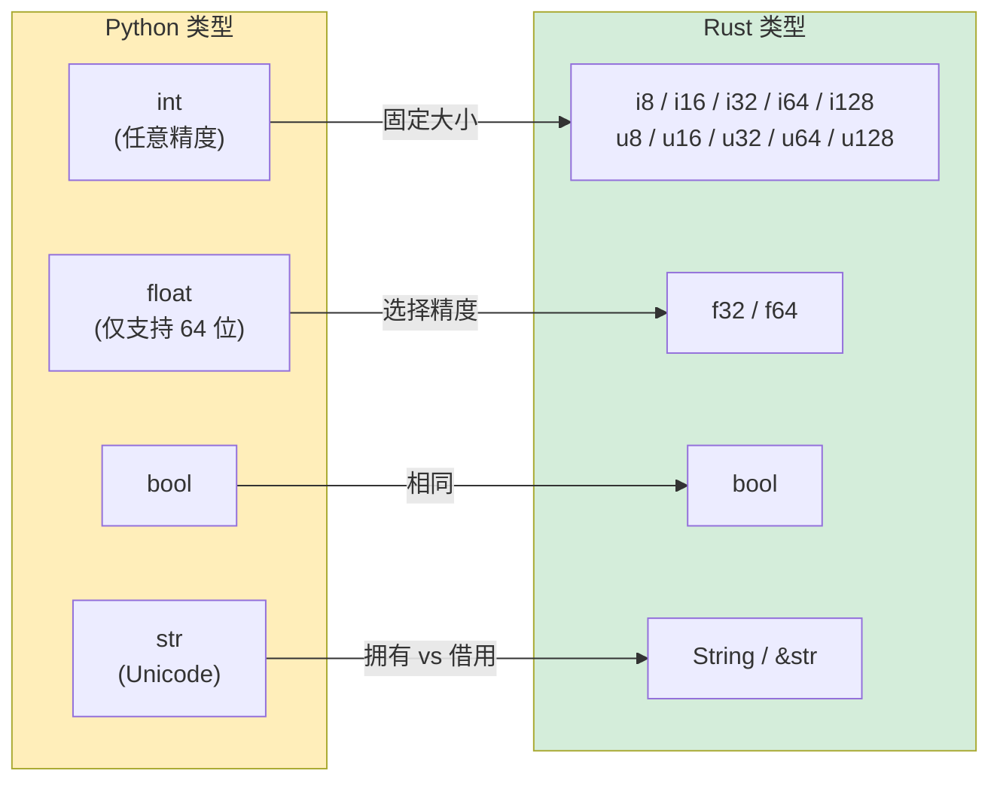

[English Original](../en/ch03-built-in-types-and-variables.md)

## 变量与可变性

> **你将学到：** 默认不可变的变量、显式使用 `mut`、原生数值类型与 Python 任意精度 `int` 的对比、`String` 与 `&str`（初学者最难理解的概念）、字符串格式化，以及 Rust 强制要求的类型注解。
>
> **难度：** 🟢 初级

### Python 变量声明
```python
# Python — 一切皆可变，动态类型
count = 0          # 可变，类型推导为 int
count = 5          # ✅ 可行
count = "hello"    # ✅ 可行 — 类型可以改变！(动态类型)

# “常量”仅是一种约定：
MAX_SIZE = 1024    # 后续没有任何东西能阻止 MAX_SIZE = 999
```

### Rust 变量声明
```rust
// Rust — 默认不可变，静态类型
let count = 0;           // 不可变，类型推导为 i32
// count = 5;            // ❌ 编译错误：不能对不可变变量进行二次赋值
// count = "hello";      // ❌ 编译错误：期望 integer，却是 &str

let mut count = 0;       // 显式声明为可变
count = 5;               // ✅ 可行
// count = "hello";      // ❌ 依然不能改变类型
```

### 给 Python 开发者的关键思维转变
```rust
// Python：变量是指向对象的标签 (labels)
// Rust：变量是命名的存储位置，且拥有 (OWN) 它们的值

// 变量遮蔽 (Variable shadowing) — Rust 特有且非常有用的功能
let input = "42";              // &str
let input = input.parse::<i32>().unwrap();  // 现在它是 i32 — 新变量，同名
let input = input * 2;         // 现在它是 84 — 又一个同名新变量

// 在 Python 中，你只需重新赋值并丢失旧类型：
# input = "42"
# input = int(input)   # 同名，不同类型 — Python 也允许这样做
# 但在 Rust 中，每个 `let` 都会创建一个全新的绑定。旧的绑定会被遮蔽。
```

### 实践示例：计数器
```python
# Python 版本
class Counter:
    def __init__(self):
        self.value = 0
    
    def increment(self):
        self.value += 1
    
    def get_value(self):
        return self.value

c = Counter()
c.increment()
print(c.get_value())  # 1
```

```rust
// Rust 版本
struct Counter {
    value: i64,
}

impl Counter {
    fn new() -> Self {
        Counter { value: 0 }
    }

    fn increment(&mut self) {     // &mut self = 我会修改此对象
        self.value += 1;
    }

    fn get_value(&self) -> i64 {  // &self = 我只读取此对象
        self.value
    }
}

fn main() {
    let mut c = Counter::new();   // 必须为 `mut` 才能调用 increment()
    c.increment();
    println!("{}", c.get_value()); // 1
}
```

> **关键差异**：在 Rust 中，方法签名中的 `&mut self` 会明确告诉你（以及编译器）`increment` 会修改计数器。而在 Python 中，任何方法都可以修改任何东西 —— 你必须通读代码才能确定。

---

## 原生类型对比



### 数值类型

| Python | Rust | 说明 |
|--------|------|-------|
| `int` (任意精度) | `i8`, `i16`, `i32`, `i64`, `i128`, `isize` | Rust 整数具有固定大小 |
| `int` (无符号：无独立类型) | `u8`, `u16`, `u32`, `u64`, `u128`, `usize` | 显式的无符号类型 |
| `float` (64 位 IEEE 754) | `f32`, `f64` | Python 仅有 64 位浮点数 |
| `bool` | `bool` | 概念相同 |
| `complex` | 无内建支持 (使用 `num` crate) | 在系统代码中很少见 |

```python
# Python — 只有一种整数类型，任意精度
x = 42                     # int — 可以增长到任意大小
big = 2 ** 1000            # 依然可行 — 拥有数千位数字
y = 3.14                   # float — 总是 64 位
```

```rust
// Rust — 显式大小，溢出会导致编译/运行时错误
let x: i32 = 42;           // 32 位有符号整数
let y: f64 = 3.14;         // 64 位浮点数 (等价于 Python 的 float)
let big: i128 = 2_i128.pow(100); // 最大支持 128 位 — 无内建的任意精度
// 如需任意精度：请使用 `num-bigint` crate

// 为了可读性使用下划线 (类似 Python 的 1_000_000):
let million = 1_000_000;   // 语法与 Python 一致！

// 类型后缀语法:
let a = 42u8;              // u8
let b = 3.14f32;           // f32
```

### 大小类型 (重要!)

```rust
// usize 和 isize — 指针大小的整数，用于索引
let length: usize = vec![1, 2, 3].len();  // .len() 返回 usize
let index: usize = 0;                     // 数组索引总是 usize

// 在 Python 中，len() 返回 int 且索引也是 int — 两者无区别。
// 在 Rust 中，混合使用 i32 和 usize 需要显式转换：
let i: i32 = 5;
// let item = vec[i];    // ❌ 错误：期望 usize，却是 i32
let item = vec[i as usize]; // ✅ 显式转换
```

### 类型推导

```rust
// Rust 虽然支持类型推导，但类型是固定的 (FIXED) — 而非动态
let x = 42;          // 编译器推导为 i32 (默认整数类型)
let y = 3.14;        // 编译器推导为 f64 (默认浮点类型)
let s = "hello";     // 编译器推导为 &str (字符串切片)
let v = vec![1, 2];  // 编译器推导为 Vec<i32>

// 你也可以始终显式声明:
let x: i64 = 42;
let y: f32 = 3.14;

// 与 Python 不同，推导出的类型永远不能改变:
let x = 42;
// x = "hello";      // ❌ 错误：期望整数，却是 &str
```

---

## 字符串类型：String vs &str

这是让 Python 开发者最意外的特性之一。Rust 有 **两种** 主要的字符串类型，而 Python 只有一种。

### Python 字符串处理
```python
# Python — 一种字符串类型，不可变且引用计数
name = "Alice"          # str — 不可变，且在堆上分配空间
greeting = f"Hello, {name}!"  # f-string 格式化
chars = list(name)      # 转换为字符列表
upper = name.upper()    # 返回新字符串（不可变）
```

### Rust 字符串类型
```rust
// Rust 有两种字符串类型:

// 1. &str (字符串切片) — 借用、不可变，类似对字符串数据的“视图” (view)
let name: &str = "Alice";           // 指向二进制文件中的字符串数据
                                     // 最接近 Python 的 str，但它是一个引用 (REFERENCE)

// 2. String (拥有所有权的字符串) — 在堆上分配、可增长且由程序“拥有”
let mut greeting = String::from("Hello, ");  // 拥有的字符串 (owned)，可修改
greeting.push_str(name);
greeting.push('!');
// greeting 现在是 "Hello, Alice!"
```

### 应该在何时使用哪个？

```rust
// 你可以这样理解:
// &str  = “我正在看一段别人拥有的字符串”  (只读视图)
// String = “我拥有这段字符串数据，可以随时修改它” (拥有的数据)

// 函数参数：倾向于使用 &str (因为它能同时接受两种类型)
fn greet(name: &str) -> String {          // 接受 &str 以及 &String
    format!("Hello, {}!", name)           // format! 宏会创建一个新 String
}

let s1 = "world";                         // &str 字面量
let s2 = String::from("Rust");            // String

greet(s1);      // ✅ &str 直接可行
greet(&s2);     // ✅ &String 会自动转换为 &str (解引用强制转换)
```

### 实践示例

```python
# Python 字符串操作
name = "alice"
upper = name.upper()               # "ALICE"
contains = "lic" in name           # True
parts = "a,b,c".split(",")         # ["a", "b", "c"]
joined = "-".join(["a", "b", "c"]) # "a-b-c"
stripped = "  hello  ".strip()     # "hello"
replaced = name.replace("a", "A") # "Alice"
```

```rust
// Rust 等价写法
let name = "alice";
let upper = name.to_uppercase();           // String — 发生了新内存分配
let contains = name.contains("lic");       // bool
let parts: Vec<&str> = "a,b,c".split(',').collect();  // Vec<&str>
let joined = ["a", "b", "c"].join("-");    // String
let stripped = "  hello  ".trim();         // &str — 无需新分配内存!
let replaced = name.replace("a", "A");     // String

// 核心洞见：有些操作返回 &str (无分配)，而有些操作返回 String。
// .trim() 返回原始字符串的一个切片 — 非常高效!
// .to_uppercase() 必须创建一个新 String — 必须进行内存分配。
```

### 给 Python 开发者的建议

```text
Python str     ≈ Rust &str     (当你只是读取字符串时)
Python str     ≈ Rust String   (当你需要拥有/修改字符串时)

经验法则:
- 函数参数 → 使用 &str (最灵活)
- 结构体字段 → 使用 String (结构体应该拥有它所持有的数据)
- 返回值 → 使用 String (调用者需要拥有返回的结果数据)
- 字符串字面量 → 自动即为 &str
```

---

## 打印与字符串格式化

### 基础输出
```python
# Python
print("Hello, World!")
print("Name:", name, "Age:", age)    # 空格分隔
print(f"Name: {name}, Age: {age}")   # f-string
```

```rust
// Rust
println!("Hello, World!");
println!("Name: {} Age: {}", name, age);    // 位置占位符 {}
println!("Name: {name}, Age: {age}");       // 内联变量 (Rust 1.58+ 支持，类似 f-strings!)
```

### 格式限定符
```python
# Python 格式化
print(f"{3.14159:.2f}")          # "3.14" — 保留 2 位小数
print(f"{42:05d}")               # "00042" — 零填充 (zero-padded)
print(f"{255:#x}")               # "0xff" — 十六进制
print(f"{42:>10}")               # "        42" — 右对齐
print(f"{'left':<10}|")          # "left      |" — 左对齐
```

```rust
// Rust 格式化 (与 Python 非常相似!)
println!("{:.2}", 3.14159);         // "3.14" — 保留 2 位小数
println!("{:05}", 42);              // "00042" — 零填充
println!("{:#x}", 255);             // "0xff" — 十六进制
println!("{:>10}", 42);             // "        42" — 右对齐
println!("{:<10}|", "left");        // "left      |" — 左对齐
```

### 调试打印 (Debug Printing)
```python
# Python — repr() 和 pprint
print(repr([1, 2, 3]))             # "[1, 2, 3]"
from pprint import pprint
pprint({"key": [1, 2, 3]})         # 雅观地打印 (Pretty-printed)
```

```rust
// Rust — {:?} 和 {:#?}
println!("{:?}", vec![1, 2, 3]);       // "[1, 2, 3]" — 使用 Debug 格式
println!("{:#?}", vec![1, 2, 3]);      // 使用 Pretty-printed Debug 格式

// 若要使你的自定义类型可打印，需要 derive Debug:
#[derive(Debug)]
struct Point { x: f64, y: f64 }

let p = Point { x: 1.0, y: 2.0 };
println!("{:?}", p);                   // "Point { x: 1.0, y: 2.0 }"
println!("{p:?}");                     // 同上，使用内联变量语法
```

### 快速参考

| Python | Rust | 说明 |
|--------|------|-------|
| `print(x)` | `println!("{}", x)` 或 `println!("{x}")` | Display 格式 |
| `print(repr(x))` | `println!("{:?}", x)` | Debug 格式 |
| `f"Hello {name}"` | `format!("Hello {name}")` | 返回 String |
| `print(x, end="")` | `print!("{x}")` | 不带换行 (`print!` vs `println!`) |
| `print(x, file=sys.stderr)` | `eprintln!("{x}")` | 打印到标准错误 (stderr) |
| `sys.stdout.write(s)` | `print!("{s}")` | 无换行 |

---

## 类型注解：可选还是必须

### Python 类型提示 (可选，且不具备强制性)
```python
# Python — 类型提示更多作为文档，而非强制约束
def add(a: int, b: int) -> int:
    return a + b

add(1, 2)         # ✅
add("a", "b")     # ✅ Python 并不在意 — 返回 "ab"
add(1, "2")       # ✅ 直到运行时崩溃：TypeError
```

### Rust 类型声明 (必须提供，且由编译器强制执行)
```rust
// Rust — 类型是强制的。始终、没有任何例外。
fn add(a: i32, b: i32) -> i32 {
    a + b
}

add(1, 2);         // ✅
// add("a", "b");  // ❌ 编译错误：期望 i32，却是 &str

// 可空值必须显式使用 Option<T>
fn find(key: &str) -> Option<i32> {
    // 返回 Some(value) 或 None
    Some(42)
}

// 泛型类型
fn first(items: &[i32]) -> Option<i32> {
    items.first().copied()
}

// 类型别名
type UserId = i64;
type Mapping = HashMap<String, Vec<i32>>;
```

> **核心洞见**：在 Python 中，类型提示虽然能帮助 IDE 和 mypy，但并不影响程序的实际运行。在 Rust 中，类型就是程序 —— 编译器利用类型来保证内存安全、防止数据竞争，并彻底消除空指针错误。
>
> 📌 **延伸阅读**: [第六章：枚举与模式匹配](ch06-enums-and-pattern-matching.md) 展示了 Rust 的类型系统如何取代 Python 的 `Union` 类型以及 `isinstance()` 检查。

---

## 练习

<details>
<summary><strong>🏋️ 练习：温度转换器</strong>（点击展开）</summary>

**挑战**：编写一个函数 `celsius_to_fahrenheit(c: f64) -> f64` 和一个函数 `classify(temp_f: f64) -> &'static str`，后者根据阈值返回 "cold"、"mild" 或 "hot"。为 0、20 和 35 摄氏度并打印出结果，并使用字符串格式化展示。

<details>
<summary>🔑 答案</summary>

```rust
fn celsius_to_fahrenheit(c: f64) -> f64 {
    c * 9.0 / 5.0 + 32.0
}

fn classify(temp_f: f64) -> &'static str {
    if temp_f < 50.0 { "cold" }
    else if temp_f < 77.0 { "mild" }
    else { "hot" }
}

fn main() {
    for c in [0.0, 20.0, 35.0] {
        let f = celsius_to_fahrenheit(c);
        println!("{c:.1}°C = {f:.1}°F — {}", classify(f));
    }
}
```

**核心要点**: Rust 要求显式的 `f64` 类型（没有隐式的 int 到 float 转换），`for` 可以直接迭代数组（不需要 `range()`），且 `if/else` 代码块是表达式。

</details>
</details>

---
