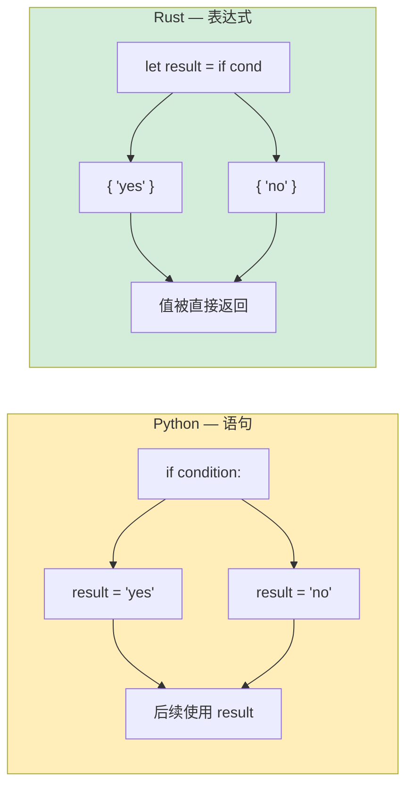

[English Original](../en/ch04-control-flow.md)

## 条件语句

> **你将学到：** 不需要括号（但需要花括号）的 `if`/`else`、`loop`/`while`/`for` 与 Python 迭代模型的对比、表达式块（一切皆可返回一个值），以及带有强制返回类型的函数签名。
>
> **难度：** 🟢 初级

### if/else

```python
# Python
if temperature > 100:
    print("太热了!")
elif temperature < 0:
    print("太冷了!")
else:
    print("刚好")

# 三元表达式
status = "热" if temperature > 100 else "正常"
```

```rust
// Rust — 需要花括号，不需要冒号，使用 `else if` 而非 `elif`
if temperature > 100 {
    println!("太热了!");
} else if temperature < 0 {
    println!("太冷了!");
} else {
    println!("刚好");
}

// if 是一个表达式 (EXPRESSION) — 会返回一个值 (类似 Python 三元表达式，但更强大)
let status = if temperature > 100 { "热" } else { "正常" };
```

### 重要差异
```rust
// 1. 条件必须是 bool 类型 — 不存在“真值/假值” (truthy/falsy) 概念
let x = 42;
// if x { }          // ❌ 错误：期望 bool，却是整数
if x != 0 { }        // ✅ 必须进行显式比较

// 在 Python 中，这些都被视为真值/假值:
// if []:      → False    (空列表)
// if "":      → False    (空字符串)
// if 0:       → False    (零)
// if None:    → False

// 在 Rust 中，条件中仅限使用 bool:
let items: Vec<i32> = vec![];
// if items { }           // ❌ 错误
if !items.is_empty() { }  // ✅ 显式检查

let name = "";
// if name { }             // ❌ 错误
if !name.is_empty() { }    // ✅ 显式检查
```

---

## 循环与迭代

### for 循环
```python
# Python
for i in range(5):
    print(i)

for item in ["a", "b", "c"]:
    print(item)

for i, item in enumerate(["a", "b", "c"]):
    print(f"{i}: {item}")

for key, value in {"x": 1, "y": 2}.items():
    print(f"{key} = {value}")
```

```rust
// Rust
for i in 0..5 {                           // range(5) → 0..5
    println!("{}", i);
}

for item in ["a", "b", "c"] {             // 直接迭代
    println!("{}", item);
}

for (i, item) in ["a", "b", "c"].iter().enumerate() {  // 使用 enumerate()
    println!("{}: {}", i, item);
}

// HashMap 迭代
use std::collections::HashMap;
let map = HashMap::from([("x", 1), ("y", 2)]);
for (key, value) in &map {                // & 符号用于借用 map
    println!("{} = {}", key, value);
}
```

### 范围语法 (Range Syntax)
```rust
Python:              Rust:               说明:
range(5)             0..5                左闭右开 (不含终点)
range(1, 10)         1..10               左闭右开
range(1, 11)         1..=10              全闭 (包含终点)
range(0, 10, 2)      (0..10).step_by(2)  步长 (是方法而非语法)
```

### while 循环
```python
# Python
count = 0
while count < 5:
    print(count)
    count += 1

# 无限循环
while True:
    data = get_input()
    if data == "quit":
        break
```

```rust
// Rust
let mut count = 0;
while count < 5 {
    println!("{}", count);
    count += 1;
}

// 无限循环 — 使用 `loop`，而非 `while true`
loop {
    let data = get_input();
    if data == "quit" {
        break;
    }
}

// loop 可以返回一个值! (这是 Rust 独有的特性)
let result = loop {
    let input = get_input();
    if let Ok(num) = input.parse::<i32>() {
        break num;  // `break` 后面带一个值 — 类似于循环的 return
    }
    println!("不是数字，请重试");
};
```

### 列表推导式 vs 迭代器链
```python
# Python — 列表推导式 (list comprehensions)
squares = [x ** 2 for x in range(10)]
evens = [x for x in range(20) if x % 2 == 0]
pairs = [(x, y) for x in range(3) for y in range(3)]
```

```rust
// Rust — 迭代器链 (.map, .filter, .collect)
let squares: Vec<i32> = (0..10).map(|x| x * x).collect();
let evens: Vec<i32> = (0..20).filter(|x| x % 2 == 0).collect();
let pairs: Vec<(i32, i32)> = (0..3)
    .flat_map(|x| (0..3).map(move |y| (x, y)))
    .collect();

// 这些是惰性的 (LAZY) — 在调用 .collect() 之前没有任何动作
// Python 的推导式是及早求值的 (EAGER，立即运行)
// Rust 迭代器在处理大数据集时通常更高效
```

---

## 表达式块 (Expression Blocks)

在 Rust 中，几乎一切也是表达式（或者说，可以被当作表达式）。而 Python 的 `if`/`for` 都是语句，这体现了两者的巨大差异。

```python
# Python — if 是语句 (除了三元表达式)
if condition:
    result = "yes"
else:
    result = "no"

# 或者三元表达式 (限制为只能由一个表达式组成):
result = "yes" if condition else "no"
```

```rust
// Rust — if 是一个表达式 (返回一个值)
let result = if condition { "yes" } else { "no" };

// 块也是表达式 — 没有分号的最后一行即为返回值 
let value = {
    let x = 5;
    let y = 10;
    x + y    // 没有分号 → 这就是这个代码块的值 (15)
};

// match 也是表达式 
let description = match temperature {
    t if t > 100 => "开水",
    t if t > 50 => "烫手",
    t if t > 20 => "温水",
    _ => "凉水",
};
```

下图展示了 Python 以“语句”为中心与 Rust 以“表达式”为中心的控制流核心区别：



> **分号规则**：在 Rust 块中，**没有分号** 的最后一行表达式会被当作该块的返回值。加上分号则使其变成了一个语句（其返回值是 `()`，即单元类型）。刚开始接触时这点可能会让 Python 开发者感到困惑 —— 它可以理解为是一种隐含的 `return`。

---

## 函数与函数签名

### Python 函数
```python
# Python — 类型是可选的且支持动态派发
def greet(name: str, greeting: str = "Hello") -> str:
    return f"{greeting}, {name}!"

# 支持变长位置参数 *args 和 关键字参数 **kwargs
def flexible(*args, **kwargs):
    pass

# 一等公民函数 (First-class functions)
def apply(f, x):
    return f(x)

result = apply(lambda x: x * 2, 5)  # 10
```

### Rust 函数
```rust
// Rust — 必须在签名中提供类型，不支持默认参数
fn greet(name: &str, greeting: &str) -> String {
    format!("{}, {}!", greeting, name)
}

// 不支持默认参数 — 此时可使用构建器模式或 Option
fn greet_with_default(name: &str, greeting: Option<&str>) -> String {
    let greeting = greeting.unwrap_or("Hello");
    format!("{}, {}!", greeting, name)
}

// 不支持 *args/**kwargs — 此时可使用切片或结构体代替
fn sum_all(numbers: &[i32]) -> i32 {
    numbers.iter().sum()
}

// 一等公民函数与闭包
fn apply(f: fn(i32) -> i32, x: i32) -> i32 {
    f(x)
}

let result = apply(|x| x * 2, 5);  // 10
```

### 返回值 (Return Values)
```python
# Python — return 是显式的，默认返回 None
def divide(a, b):
    if b == 0:
        return None  # 或者抛出一个异常
    return a / b
```

```rust
// Rust — 最后一行表达式 (无分号) 即为返回值
fn divide(a: f64, b: f64) -> Option<f64> {
    if b == 0.0 {
        None              // 提前返回 (也可以显式写成 `return None;`)
    } else {
        Some(a / b)       // 这是代码块的最后一行 — 隐式返回
    }
}
```

### 多个返回值
```python
# Python — 返回元组
def min_max(numbers):
    return min(numbers), max(numbers)

lo, hi = min_max([3, 1, 4, 1, 5])
```

```rust
// Rust — 通过元组实现多个返回值 (概念一致！)
fn min_max(numbers: &[i32]) -> (i32, i32) {
    let min = *numbers.iter().min().unwrap();
    let max = *numbers.iter().max().unwrap();
    (min, max)
}

let (lo, hi) = min_max(&[3, 1, 4, 1, 5]);
```

### 方法：self vs &self vs &mut self
```rust
// 在 Python 中，`self` 永远是其所在对象的可变引用。
// 在 Rust 中，你可以根据需求选择：

impl MyStruct {
    fn new() -> Self { ... }                // 没有 self 参数 — 相当于“静态方法”
    fn read_only(&self) { ... }             // &self — 以不可变方式借用 (禁止修改)
    fn modify(&mut self) { ... }            // &mut self — 以可变方式借用 (允许修改)
    fn consume(self) { ... }                // self — 夺取所有权 (对象发生了 MOVED)
}

// Python 等效对照:
// class MyStruct:
//     @classmethod
//     def new(cls): ...                    # 不需要实例参与
//     def read_only(self): ...             # 下面这三者在 Python 中都是同一个意思：
//     def modify(self): ...                # Python self 总是可变的
//     def consume(self): ...               # Python 从不会对 self 进行“消耗”
```

---

## 练习

<details>
<summary><strong>🏋️ 练习：使用表达式编写 FizzBuzz</strong>（点击展开）</summary>

**挑战**：使用 Rust 的表达式驱动 `match` 来实现 `1..=30` 的 FizzBuzz。每个数字应当打印 "Fizz"、"Buzz"、"FizzBuzz" 或数字本身。请使用 `match (n % 3, n % 5)` 作为表达式来处理逻辑。

<details>
<summary>🔑 答案</summary>

```rust
fn main() {
    for n in 1..=30 {
        let result = match (n % 3, n % 5) {
            (0, 0) => String::from("FizzBuzz"),
            (0, _) => String::from("Fizz"),
            (_, 0) => String::from("Buzz"),
            _ => n.to_string(),
        };
        println!("{result}");
    }
}
```

**核心要点**: `match` 是一个能够返回结果值的表达式 — 无需编写多层冗余的 `if/elif/else` 链。通配符 `_` 的用法等效于 Python 的 `case _:` 缺省分支。

</details>
</details>

---
