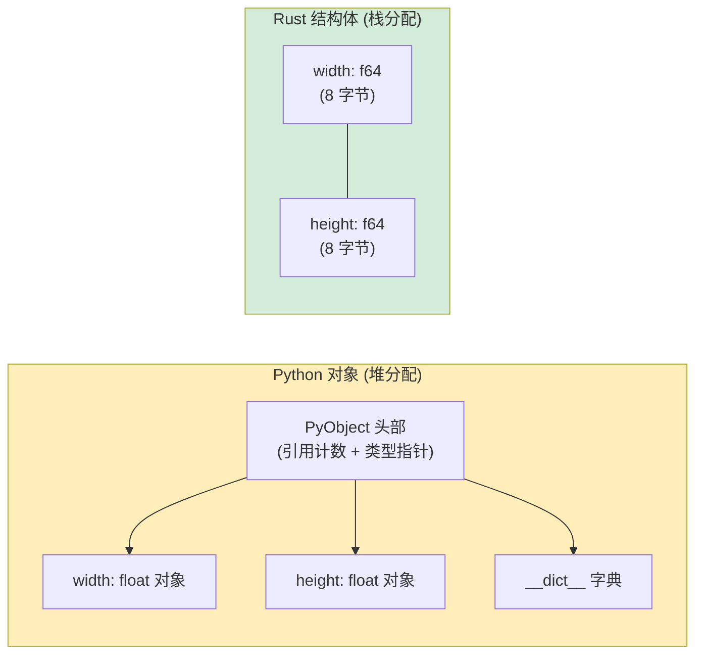

[English Original](../en/ch05-data-structures-and-collections.md)

## 元组与解构

> **你将学到：** Rust 元组与 Python 元组的对比、数组与切片、结构体 (Rust 中对类的一种替代实现)、`Vec<T>` 与 `list`、`HashMap<K,V>` 与 `dict`，以及用于领域建模的新类型模式 (newtype pattern)。
>
> **难度：** 🟢 初级

### Python 元组
```python
# Python — 元组是不可变的序列
point = (3.0, 4.0)
x, y = point                    # 解包 (Unpacking)
print(f"x={x}, y={y}")

# 元组可以保存混合类型
record = ("Alice", 30, True)
name, age, active = record

# 为了清晰起见使用具名元组 (Named tuples)
from typing import NamedTuple

class Point(NamedTuple):
    x: float
    y: float

p = Point(3.0, 4.0)
print(p.x)                      # 通过名称访问
```

### Rust 元组
```rust
// Rust — 元组是固定大小、强类型且可以保存混合类型的
let point: (f64, f64) = (3.0, 4.0);
let (x, y) = point;              // 解构 (等同于 Python 的解包)
println!("x={x}, y={y}");

// 混合类型
let record: (&str, i32, bool) = ("Alice", 30, true);
let (name, age, active) = record;

// 通过索引访问 (与 Python 不同，Rust 使用 .0 .1 .2 语法)
let first = record.0;            // "Alice"
let second = record.1;           // 30

// Python写法: record[0]
// Rust写法:   record.0      ← 注意是“点+索引”，而非“中括号+索引”
```

### 应该在何时使用元组 vs 结构体
```rust
// 元组：适用于快速组合、函数返回多个值、临时值
fn min_max(data: &[i32]) -> (i32, i32) {
    (*data.iter().min().unwrap(), *data.iter().max().unwrap())
}
let (lo, hi) = min_max(&[3, 1, 4, 1, 5]);

// 结构体：具名字段、意图明确、可关联方法
struct Point { x: f64, y: f64 }

// 经验法则：
// - 2 到 3 个相同类型的字段 → 元组即可
// - 需要具名字段来提高可读性 → 使用结构体
// - 需要关联方法 → 使用结构体
// (这与 Python 中选择 tuple vs namedtuple vs dataclass 的建议是一致的)
```

---

## 数组与切片

### Python 列表 vs Rust 数组
```python
# Python — 列表 (list) 是动态且异构的
numbers = [1, 2, 3, 4, 5]       # 可增长、缩小、保存混合类型
numbers.append(6)
mixed = [1, "two", 3.0]         # 允许混合类型
```

```rust
// Rust 在“固定大小”与“动态”之间定义了两个概念：

// 1. 数组 (Array) — 固定大小且在栈上分配 (Python 中无等价概念)
let numbers: [i32; 5] = [1, 2, 3, 4, 5]; // 长度也是类型的一部分！
// numbers.push(6);  // ❌ 数组不能增长

// 使用相同的值初始化所有元素：
let zeros = [0; 10];            // [0, 0, 0, 0, 0, 0, 0, 0, 0, 0]

// 2. 切片 (Slice) — 数组或 Vec 的视图 (类似 Python 的切片，但是一种借用)
let slice: &[i32] = &numbers[1..4]; // [2, 3, 4] — 这是一个引用而非拷贝！

// Python: numbers[1:4] 会创建一个全新的列表 (发生了数据拷贝)
// Rust:   &numbers[1..4] 会创建一个视图 (无拷贝，无内存分配)
```

### 实践对比
```python
# Python 切片 — 会创建拷贝
data = [10, 20, 30, 40, 50]
first_three = data[:3]          # 新列表: [10, 20, 30]
last_two = data[-2:]            # 新列表: [40, 50]
reversed_data = data[::-1]      # 新列表: [50, 40, 30, 20, 10]
```

```rust
// Rust 切片 — 会创建视图 (引用)
let data = [10, 20, 30, 40, 50];
let first_three = &data[..3];         // &[i32] 视图: [10, 20, 30]
let last_two = &data[3..];            // &[i32] 视图: [40, 50]

// 不支持负数索引 — 需要使用 .len()
let last_two = &data[data.len()-2..]; // &[i32] 视图: [40, 50]

// 反转：需要使用迭代器并进行 collect
let reversed: Vec<i32> = data.iter().rev().copied().collect();
```

---

## 结构体 vs 类 (Structs vs Classes)

### Python 类
```python
# Python — 带有 __init__、方法与各种特性的类
from dataclasses import dataclass

@dataclass
class Rectangle:
    width: float
    height: float

    def area(self) -> float:
        return self.width * self.height

    def perimeter(self) -> float:
        return 2.0 * (self.width + self.height)

    def scale(self, factor: float) -> "Rectangle":
        return Rectangle(self.width * factor, self.height * factor)

    def __str__(self) -> str:
        return f"Rectangle({self.width} x {self.height})"

r = Rectangle(10.0, 5.0)
print(r.area())         # 50.0
print(r)                # Rectangle(10.0 x 5.0)
```

### Rust 结构体
```rust
// Rust — 结构体 + impl 实现块 (不支持继承!)
#[derive(Debug, Clone)]
struct Rectangle {
    width: f64,
    height: f64,
}

impl Rectangle {
    // “构造函数” — 关联函数 (没有 self 参数)
    fn new(width: f64, height: f64) -> Self {
        Rectangle { width, height }   // 当名称一致时使用简写语法
    }

    fn area(&self) -> f64 {
        self.width * self.height
    }

    fn perimeter(&self) -> f64 {
        2.0 * (self.width + self.height)
    }

    fn scale(&self, factor: f64) -> Rectangle {
        Rectangle::new(self.width * factor, self.height * factor)
    }
}

// Display trait 等效于 Python 的 __str__
impl std::fmt::Display for Rectangle {
    fn fmt(&self, f: &mut std::fmt::Formatter<'_>) -> std::fmt::Result {
        write!(f, "Rectangle({} x {})", self.width, self.height)
    }
}

fn main() {
    let r = Rectangle::new(10.0, 5.0);
    println!("{}", r.area());    // 50.0
    println!("{}", r);           // Rectangle(10 x 5)
}
```



> **内存洞见**：Python 的 `Rectangle` 对象包含一个 56 字节的头部信息 + 独立在堆上分配的浮点对对象。而 Rust 的 `Rectangle` 在栈上正好只占 16 字节 —— 没有间接寻址，也没有 GC (垃圾回收) 的压力。
>
> 📌 **延伸阅读**: [第十章：Trait 与泛型](ch10-traits-and-generics.md) 涵盖了如何为结构体实现 `Display`、`Debug` 等 Trait，以及如何进行运算符重载。

### 关键映射：Python 魔术方法 → Rust Trait

| Python | Rust | 用途 |
|--------|------|---------|
| `__str__` | `impl Display` | 生成对人类可读的字符串 |
| `__repr__` | `#[derive(Debug)]` | 调试信息的展示 |
| `__eq__` | `#[derive(PartialEq)]` | 相等性比较 |
| `__hash__` | `#[derive(Hash)]` | 可生成哈希值 (作为 map 的键/用于 HashSet) |
| `__lt__`, `__le__`, 等 | `#[derive(PartialOrd, Ord)]` | 大小比较 (排序) |
| `__add__` | `impl Add` | 运算符 `+` |
| `__iter__` | `impl Iterator` | 迭代逻辑 |
| `__len__` | `.len()` 方法 | 获取长度 |
| `__enter__`/`__exit__` | RAII + `impl Drop` | 自动化清理；在 Rust 中没有上下文管理器的直接等价物 |
| `__init__` | `fn new()` (惯用名称) | 构造逻辑 |
| `__getitem__` | `impl Index` | 使用 `[]` 进行索引访问 |
| `__contains__` | `.contains()` 方法 | `in` 运算符的等效逻辑 |

### 不支持继承 — 改为组合实现
```python
# Python — 继承
class Animal:
    def __init__(self, name: str):
        self.name = name
    def speak(self) -> str:
        raise NotImplementedError

class Dog(Animal):
    def speak(self) -> str:
        return f"{self.name} says Woof!"

class Cat(Animal):
    def speak(self) -> str:
        return f"{self.name} says Meow!"
```

```rust
// Rust — Trait + 组合 (不支持继承)
trait Animal {
    fn name(&self) -> &str;
    fn speak(&self) -> String;
}

struct Dog { name: String }
struct Cat { name: String }

impl Animal for Dog {
    fn name(&self) -> &str { &self.name }
    fn speak(&self) -> String {
        format!("{} says Woof!", self.name)
    }
}

impl Animal for Cat {
    fn name(&self) -> &str { &self.name }
    fn speak(&self) -> String {
        format!("{} says Meow!", self.name)
    }
}

// 使用 Trait 对象来实现多态 (类似 Python 的鸭子类型):
fn animal_roll_call(animals: &[&dyn Animal]) {
    for a in animals {
        println!("{}", a.speak());
    }
}
```

> **思维模型**：Python 说“继承行为”。Rust 说“实现契约”。
> 两者的效果相似，但 Rust 避免了多重继承带来的菱形继承问题和脆弱基类风险。

---

## Vec vs list

`Vec<T>` 是 Rust 中可增长、堆分配的数组 —— 它是最接近 Python `list` 的概念。

### 创建 Vector
```python
# Python
numbers = [1, 2, 3]
empty = []
repeated = [0] * 10
from_range = list(range(1, 6))
```

```rust
// Rust
let numbers = vec![1, 2, 3];            // vec! 宏 (类似列表字面量)
let empty: Vec<i32> = Vec::new();        // 空 Vec (需要类型注解)
let repeated = vec![0; 10];              // [0, 0, 0, 0, 0, 0, 0, 0, 0, 0]
let from_range: Vec<i32> = (1..6).collect(); // [1, 2, 3, 4, 5]
```

### 常用操作
```python
# Python 列表操作
nums = [1, 2, 3]
nums.append(4)                   # [1, 2, 3, 4]
nums.extend([5, 6])             # [1, 2, 3, 4, 5, 6]
nums.insert(0, 0)               # [0, 1, 2, 3, 4, 5, 6]
last = nums.pop()               # 6, nums = [0, 1, 2, 3, 4, 5]
length = len(nums)              # 6
nums.sort()                     # 原地排序
sorted_copy = sorted(nums)     # 返回已排序的新列表
nums.reverse()                  # 原地反转
contains = 3 in nums           # True
index = nums.index(3)          # 第一个 3 的索引
```

```rust
// Rust Vec 操作
let mut nums = vec![1, 2, 3];
nums.push(4);                          // [1, 2, 3, 4]
nums.extend([5, 6]);                   // [1, 2, 3, 4, 5, 6]
nums.insert(0, 0);                     // [0, 1, 2, 3, 4, 5, 6]
let last = nums.pop();                 // Some(6), nums = [0, 1, 2, 3, 4, 5]
let length = nums.len();               // 6
nums.sort();                           // 原地排序
let mut sorted_copy = nums.clone();
sorted_copy.sort();                    // 通过克隆来实现返回新列表
nums.reverse();                        // 原地反转
let contains = nums.contains(&3);      // true
let index = nums.iter().position(|&x| x == 3); // Some(index) 或 None
```

### 快速对照表

| Python | Rust | 说明 |
|--------|------|-------|
| `lst.append(x)` | `vec.push(x)` | |
| `lst.extend(other)` | `vec.extend(other)` | |
| `lst.pop()` | `vec.pop()` | 返回 `Option<T>` |
| `lst.insert(i, x)` | `vec.insert(i, x)` | |
| `lst.remove(x)` | `vec.iter().position(\|v\| v == &x).map(\|i\| vec.remove(i))` | 指移除第一个匹配项 |
| `del lst[i]` | `vec.remove(i)` | 返回被移除的元素 |
| `len(lst)` | `vec.len()` | |
| `x in lst` | `vec.contains(&x)` | |
| `lst.sort()` | `vec.sort()` | |
| `sorted(lst)` | 克隆后排序，或使用迭代器 | |
| `lst[i]` | `vec[i]` | 如果索引越界会发生恐慌 (Panic) |
| `lst.get(i, default)` | `vec.get(i)` | 返回 `Option<&T>` |
| `lst[1:3]` | `&vec[1..3]` | 返回一个切片 (无拷贝) |

---

## HashMap vs dict

`HashMap<K, V>` 是 Rust 的哈希映射 —— 等同于 Python 的 `dict`。

### 创建 HashMap
```python
# Python
scores = {"Alice": 100, "Bob": 85}
empty = {}
from_pairs = dict([("x", 1), ("y", 2)])
comprehension = {k: v for k, v in zip(keys, values)}
```

```rust
// Rust
use std::collections::HashMap;

let scores = HashMap::from([("Alice", 100), ("Bob", 85)]);
let empty: HashMap<String, i32> = HashMap::new();
let from_pairs: HashMap<&str, i32> = [("x", 1), ("y", 2)].into_iter().collect();
let comprehension: HashMap<_, _> = keys.iter().zip(values.iter()).collect();
```

### 常用操作
```python
# Python dict 操作
d = {"a": 1, "b": 2}
d["c"] = 3                      # 插入
val = d["a"]                     # 1 (如果缺失会触发 KeyError)
val = d.get("z", 0)             # 0 (缺失则返回默认值)
del d["b"]                       # 移除
exists = "a" in d               # True
keys = list(d.keys())           # ["a", "c"]
values = list(d.values())       # [1, 3]
items = list(d.items())         # [("a", 1), ("c", 3)]
length = len(d)                 # 2

# setdefault / defaultdict
from collections import defaultdict
word_count = defaultdict(int)
for word in words:
    word_count[word] += 1
```

```rust
// Rust HashMap 操作
use std::collections::HashMap;

let mut d = HashMap::new();
d.insert("a", 1);
d.insert("b", 2);
d.insert("c", 3);                       // 插入或覆盖

let val = d["a"];                        // 1 (如果缺失则发生恐慌)
let val = d.get("z").copied().unwrap_or(0); // 0 (安全访问)
d.remove("b");                          // 移除
let exists = d.contains_key("a");       // true
let keys: Vec<_> = d.keys().collect();
let values: Vec<_> = d.values().collect();
let length = d.len();

// Entry API = Python 的 setdefault / defaultdict 模式
let mut word_count: HashMap<&str, i32> = HashMap::new();
for word in words {
    *word_count.entry(word).or_insert(0) += 1;
}
```

### 快速对照表

| Python | Rust | 说明 |
|--------|------|-------|
| `d[key] = val` | `d.insert(key, val)` | 返回 `Option<V>` (旧值) |
| `d[key]` | `d[&key]` | 缺失则发生恐慌 |
| `d.get(key)` | `d.get(&key)` | 返回 `Option<&V>` |
| `d.get(key, default)` | `d.get(&key).unwrap_or(&default)` | |
| `key in d` | `d.contains_key(&key)` | |
| `del d[key]` | `d.remove(&key)` | 返回 `Option<V>` |
| `d.keys()` | `d.keys()` | 迭代器 |
| `d.values()` | `d.values()` | 迭代器 |
| `d.items()` | `d.iter()` | `(&K, &V)` 的迭代器 |
| `len(d)` | `d.len()` | |
| `d.update(other)` | `d.extend(other)` | |
| `defaultdict(int)` | `.entry().or_insert(0)` | 使用 Entry API |
| `d.setdefault(k, v)` | `d.entry(k).or_insert(v)` | 使用 Entry API |

---

### 其他集合

| Python | Rust | 说明 |
|--------|------|-------|
| `set()` | `HashSet<T>` | `use std::collections::HashSet;` |
| `collections.deque` | `VecDeque<T>` | `use std::collections::VecDeque;` |
| `heapq` | `BinaryHeap<T>` | 默认是大顶堆 (Max-heap) |
| `collections.OrderedDict` | `IndexMap` (crate) | 默认的 HashMap 不保证顺序 |
| `sortedcontainers.SortedList` | `BTreeSet<T>` / `BTreeMap<K,V>` | 基于树结构，已排序 |

---

## 练习

<details>
<summary><strong>🏋️ 练习：词频统计器</strong>（点击展开）</summary>

**挑战**：编写一个函数，接受一段 `&str` 类型的句子，并返回一个存储词频的 `HashMap<String, usize>`（不区分大小写）。在 Python 中，这等效于 `Counter(s.lower().split())`。请用 Rust 实现它。

<details>
<summary>🔑 答案</summary>

```rust
use std::collections::HashMap;

fn word_frequencies(text: &str) -> HashMap<String, usize> {
    let mut counts = HashMap::new();
    for word in text.split_whitespace() {
        let key = word.to_lowercase();
        *counts.entry(key).or_insert(0) += 1;
    }
    counts
}

fn main() {
    let text = "the quick brown fox jumps over the lazy fox";
    let freq = word_frequencies(text);
    for (word, count) in &freq {
        println!("{word}: {count}");
    }
}
```

**核心要点**: `HashMap::entry().or_insert()` 相当于 Python 中的 `defaultdict` 或 `Counter`。由于 `or_insert` 返回的是 `&mut usize`，所以需要使用 `*` 进行解引用操作。

</details>
</details>

---
