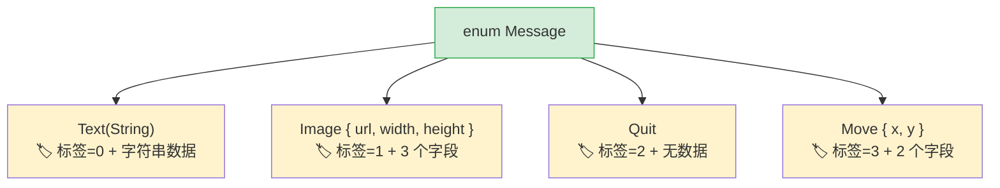

[English Original](../en/ch06-enums-and-pattern-matching.md)

## 代数数据类型 vs 联合类型

> **你将学到：** 带有数据的 Rust 枚举 (enum) 与 Python `Union` 类型的对比、穷尽式匹配 `match` 与 `match/case` 的区别、作为 `None` 在编译期替代方案的 `Option<T>`，以及守卫模式 (guard patterns)。
>
> **难度：** 🟡 中级

Python 3.10 引入了 `match` 语句和类型联合 (type unions)。而 Rust 的枚举则走得更远 —— 每个变体 (variant) 都可以携带不同的数据，且编译器会确保你处理了每一种情况。

### Python 联合类型与 Match
```python
# Python 3.10+ — 结构化模式匹配
from typing import Union
from dataclasses import dataclass

@dataclass
class Circle:
    radius: float

@dataclass
class Rectangle:
    width: float
    height: float

@dataclass
class Triangle:
    base: float
    height: float

Shape = Union[Circle, Rectangle, Triangle]  # 类型别名

def area(shape: Shape) -> float:
    match shape:
        case Circle(radius=r):
            return 3.14159 * r * r
        case Rectangle(width=w, height=h):
            return w * h
        case Triangle(base=b, height=h):
            return 0.5 * b * h
        # 如果你漏掉了一个案例，编译器不会发出警告！
        # 如果增加了一个新形状？你只能在代码库中全局搜索并在心里默默祈祷能找全所有的 match 代码块。
```

### Rust 枚举 — 携带数据的变体
```rust
// Rust — 枚举变体可以携带数据，编译器强制要求穷尽式匹配
enum Shape {
    Circle(f64),                // Circle 携带半径数据
    Rectangle(f64, f64),        // Rectangle 携带宽、高数据
    Triangle { base: f64, height: f64 }, // 也可以使用具名字段
}

fn area(shape: &Shape) -> f64 {
    match shape {
        Shape::Circle(r) => std::f64::consts::PI * r * r,
        Shape::Rectangle(w, h) => w * h,
        Shape::Triangle { base, height } => 0.5 * base * height,
        // ❌ 如果你增加了 Shape::Pentagon 但在这里忘了处理它，
        //    编译器会拒绝构建。无需全局搜索，编译器会告诉你。
    }
}
```

> **关键洞见**：Rust 的 `match` 是**穷尽式 (Exhaustive)** 的 —— 编译器会验证你是否处理了每一个变体。在枚举中增加一个新变体，编译器会准确地告诉你哪些 `match` 块需要更新。Python 的 `match` 则没有这种保障。

### 枚举替代了多种 Python 模式

```python
# Python — 几种可以被 Rust 枚举替代的模式：

# 1. 字符串常量
STATUS_PENDING = "pending"
STATUS_ACTIVE = "active"
STATUS_CLOSED = "closed"

# 2. Python Enum (不带数据)
from enum import Enum
class Status(Enum):
    PENDING = "pending"
    ACTIVE = "active"
    CLOSED = "closed"

# 3. 标签联合 (类 + 类型字段)
class Message:
    def __init__(self, kind, **data):
        self.kind = kind
        self.data = data
# Message(kind="text", content="hello")
# Message(kind="image", url="...", width=100)
```

```rust
// Rust — 一个枚举就能涵盖上述所有甚至更多场景

// 1. 简单枚举 (类似 Python 的 Enum)
enum Status {
    Pending,
    Active,
    Closed,
}

// 2. 携带数据的枚举 (标签联合 — 类型安全!)
enum Message {
    Text(String),
    Image { url: String, width: u32, height: u32 },
    Quit,                    // 不带数据
    Move { x: i32, y: i32 },
}
```



> **内存洞见**：Rust 的枚举是“标签联合 (tagged unions)” —— 编译器会存储一个判别标签 (discriminant tag) + 足够容纳最大变体的空间。Python 的等效实现 (`Union[str, dict, None]`) 则没有这种紧凑的表示方式。
>
> 📌 **延伸阅读**: [第九章：错误处理](ch09-error-handling.md) 大量使用了枚举 —— `Result<T, E>` 和 `Option<T>` 其实就是配合 `match` 使用的枚举。

```rust
fn process(msg: &Message) {
    match msg {
        Message::Text(content) => println!("文字内容: {content}"),
        Message::Image { url, width, height } => {
            println!("图片: {url} ({width}x{height})")
        }
        Message::Quit => println!("正在退出"),
        Message::Move { x, y } => println!("移动到 ({x}, {y})"),
    }
}
```

---

## 穷尽式模式匹配 (Exhaustive Pattern Matching)

### Python 的 match — 并非穷尽
```python
# Python — 通配符案例是可选的，编译器无法提供帮助
def describe(value):
    match value:
        case 0:
            return "zero"
        case 1:
            return "one"
        # 如果你忘了设置默认值，Python 会静默地返回 None。
        # 不会有任何警告或错误。

describe(42)  # 返回 None — 这是一个潜在的静默 bug
```

### Rust 的 match — 由编译器强制要求
```rust
// Rust — 必须处理每一种可能的情况
fn describe(value: i32) -> &'static str {
    match value {
        0 => "zero",
        1 => "one",
        // ❌ 编译错误：非穷尽模式：未涵盖 `i32::MIN..=-1_i32` 
        //    与 `2_i32..=i32::MAX` 
        _ => "other",   // _ = 通配符 (对于数值类型是必需的)
    }
}

// 对于枚举，不需要通配符 —— 编译器了解其所有的变体：
enum Color { Red, Green, Blue }

fn color_hex(c: Color) -> &'static str {
    match c {
        Color::Red => "#ff0000",
        Color::Green => "#00ff00",
        Color::Blue => "#0000ff",
        // 无需 _ — 所有变体都已覆盖
        // 如果以后增加了 Color::Yellow → 编译器会在此处直接报错
    }
}
```

### 模式匹配特性
```rust
// 多个值 (类似 Python 的 case 1 | 2 | 3:)
match value {
    1 | 2 | 3 => println!("小"),
    4..=9 => println!("中"),    // 范围模式
    _ => println!("大"),
}

// 守卫 (类似 Python 的 case x if x > 0:)
match temperature {
    t if t > 100 => println!("沸腾中"),
    t if t < 0 => println!("结冰中"),
    t => println!("正常: {t}°"),
}

// 嵌套解构
let point = (3, (4, 5));
match point {
    (0, _) => println!("在 y 轴上"),
    (_, (0, _)) => println!("y=0"),
    (x, (y, z)) => println!("x={x}, y={y}, z={z}"),
}
```

---

## 用于“None 安全”的 Option

`Option<T>` 是针对 Python 开发者最重要的 Rust 枚举。它提供了一个类型安全的方式来替代 `None`。

### Python 的 None

```python
# Python — None 作为一个值可以出现在任何地方
def find_user(user_id: int) -> dict | None:
    users = {1: {"name": "Alice"}}
    return users.get(user_id)

user = find_user(999)
# user 是 None — 但没有什么强迫你一定要检查！
print(user["name"])  # 💥 运行时产生 TypeError
```

### Rust Option

```rust
// Rust — Option<T> 会强制你处理 None 的情况
fn find_user(user_id: i64) -> Option<User> {
    let users = HashMap::from([(1, User { name: "Alice".into() })]);
    users.get(&user_id).cloned()
}

let user = find_user(999);
// user 是 Option<User> — 如果不处理 None 你就无法使用它

// 方式 1: match
match find_user(999) {
    Some(user) => println!("找到: {}", user.name),
    None => println!("未找到"),
}

// 方式 2: if let (类似 Python 的 if (x := expr) is not None)
if let Some(user) = find_user(1) {
    println!("找到: {}", user.name);
}

// 方式 3: unwrap_or
let name = find_user(999)
    .map(|u| u.name)
    .unwrap_or_else(|| "未知".to_string());

// 方式 4: ? 运算符 (仅用于返回 Option 的函数内部)
fn get_user_name(id: i64) -> Option<String> {
    let user = find_user(id)?;     // 如果没找到则提前返回 None
    Some(user.name)
}
```

### Option 常用方法 — Python 等效项

| 模式 | Python | Rust |
|---------|--------|------|
| 检查是否存在 | `if x is not None:` | `if let Some(x) = opt {` |
| 默认值 | `x or default` | `opt.unwrap_or(default)` |
| 延迟计算默认值 | `x or compute()` | `opt.unwrap_or_else(\|\| compute())` |
| 存在时执行转换 | `f(x) if x else None` | `opt.map(f)` |
| 链式查找 | `x and x.attr and x.attr.method()` | `opt.and_then(\|x\| x.method())` |
| 为 None 时直接崩溃 | 无法事前预防 | `opt.unwrap()` (发生恐慌) 或 `opt.expect("自定义信息")` |
| 获取或抛出错误 | `x if x else raise` | `opt.ok_or(Error)?` |

---

## 练习

<details>
<summary><strong>🏋️ 练习：几何形状面积计算器</strong>（点击展开）</summary>

**挑战**：定义一个枚举 `Shape`，包含三个变体：`Circle(f64)` (半径)、`Rectangle(f64, f64)` (宽、高) 和 `Triangle(f64, f64)` (底、高)。使用 `match` 为其实现一个 `fn area(&self) -> f64` 方法。分别创建这三种形状并打印它们的面积。

<details>
<summary>🔑 答案</summary>

```rust
use std::f64::consts::PI;

enum Shape {
    Circle(f64),
    Rectangle(f64, f64),
    Triangle(f64, f64),
}

impl Shape {
    fn area(&self) -> f64 {
        match self {
            Shape::Circle(r) => PI * r * r,
            Shape::Rectangle(w, h) => w * h,
            Shape::Triangle(b, h) => 0.5 * b * h,
        }
    }
}

fn main() {
    let shapes = [
        Shape::Circle(5.0),
        Shape::Rectangle(4.0, 6.0),
        Shape::Triangle(3.0, 8.0),
    ];
    for shape in &shapes {
        println!("面积为: {:.2}", shape.area());
    }
}
```

**核心要点**: Rust 的枚举替代了 Python 的 `Union[Circle, Rectangle, Triangle]` 以及 `isinstance()` 检查。编译器会保证你处理了每一个变体 —— 如果增加了一个新形状但没有更新 `area()` 方法，代码将无法通过编译。

</details>
</details>

---
