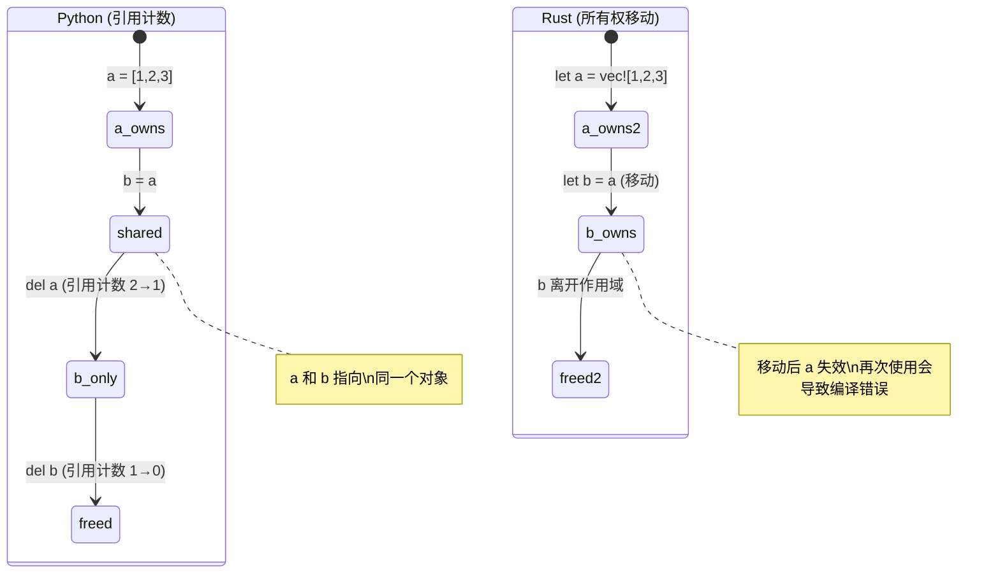
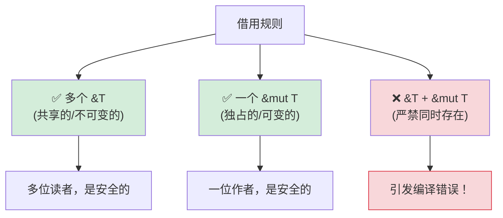

[English Original](../en/ch07-ownership-and-borrowing.md)

## 理解所有权

> **你将学到：** 为什么 Rust 拥有所有权机制（没有 GC！）、移动语义与 Python 引用计数的对比、借用（`&` 和 `&mut`）、生命周期基础，以及智能指针（`Box`、`Rc`、`Arc`）。
>
> **难度：** 🟡 中级

这是对 Python 开发者来说最具挑战性的概念。在 Python 中，你几乎从不需要考虑谁“拥有”数据 —— 垃圾回收器（GC）会处理好一切。而在 Rust 中，每个值都有且仅有一个所有者，编译器会在编译期对此进行追踪。

### Python：处处皆是共享引用
```python
# Python — 一切皆是引用，GC 负责清理
a = [1, 2, 3]
b = a              # b 和 a 指向同一个列表
b.append(4)
print(a)            # [1, 2, 3, 4] — 惊喜吗？a 也变了
# 谁拥有这个列表？a 和 b 都在引用它。
# 当没有引用剩余时，垃圾回收器会释放它。
# 你平时根本不用考虑这些。
```

### Rust：单一所有权
```rust
// Rust — 每个值都有且仅有一个所有者
let a = vec![1, 2, 3];
let b = a;           // 所有权从 a “移动”（MOVE）到了 b
// println!("{:?}", a); // ❌ 编译错误：值在发生移动后被再次使用

// a 不再存在。b 是唯一的所有者。
println!("{:?}", b); // ✅ [1, 2, 3]

// 当 b 离开作用域时，Vec 会被释放。这是确定性的，且无需 GC。
```

### 所有权三条铁律
```rust
1. 每个值都有且仅有一个被称为“所有者”的变量。
2. 当所有者离开作用域，值就会被丢弃（释放）。
3. 所有权可以转移（移动），但不能被复制（除非显式使用 Clone）。
```

### 移动语义 — 给 Python 开发者带来的最大冲击
```python
# Python — 赋值操作拷贝的是引用，而非数据
def process(data):
    data.append(42)
    # 原始列表被修改了！

my_list = [1, 2, 3]
process(my_list)
print(my_list)       # [1, 2, 3, 42] — 被 process 函数修改了！
```

```rust
// Rust — 传递给函数会“移动”所有权（对于非 Copy 类型）
fn process(mut data: Vec<i32>) -> Vec<i32> {
    data.push(42);
    data  // 必须将其返回，才能把所有权交还！
}

let my_vec = vec![1, 2, 3];
let my_vec = process(my_vec);  // 所有权移入函数，随后又移出
println!("{:?}", my_vec);      // [1, 2, 3, 42]

// 或者更优雅的做法 — 借用而非移动：
fn process_borrowed(data: &mut Vec<i32>) {
    data.push(42);
}

let mut my_vec = vec![1, 2, 3];
process_borrowed(&mut my_vec);  // 暂时“借”出去
println!("{:?}", my_vec);       // [1, 2, 3, 42] — 依然归我们所有
```

### 所有权可视化

```text
Python:                              Rust:

  a ──────┐                           a ──→ [1, 2, 3]
           ├──→ [1, 2, 3]
  b ──────┘                           执行 let b = a; 后：

  (a 和 b 共享同一个对象)              a  (已失效，发生了移动)
  (引用计数 = 2)                       b ──→ [1, 2, 3]
                                       (仅由 b 拥有数据)

  del a → 引用计数 = 1                 drop(b) → 数据被释放
  del b → 引用计数 = 0 → 释放           (确定性，无 GC)
```



---

## 移动语义 vs 引用计数

### 拷贝 vs 移动 (Copy vs Move)
```rust
// 简单数据类型（整数、浮点数、布尔值、字符）是发生了“拷贝”，而非“移动”
let x = 42;
let y = x;    // x 被拷贝给 y (两者均有效)
println!("{x} {y}");  // ✅ 42 42

// 堆分配类型 (String, Vec, HashMap) 则是发生了“移动”
let s1 = String::from("hello");
let s2 = s1;  // s1 被移动到了 s2
// println!("{s1}");  // ❌ 错误：数值在移动后被再次使用

// 如果显式拷贝堆上的数据，请使用 .clone()
let s1 = String::from("hello");
let s2 = s1.clone();  // 深拷贝
println!("{s1} {s2}");  // ✅ hello hello (两者均有效)
```

### Python 开发者的思维模型
```text
Python:                    Rust:
─────────                  ─────
int, float, bool           Copy 类型 (i32, f64, bool, char)
→ 对不可变对象的共享引用    → 在赋值时发生逐位拷贝 
  (并非真正的拷贝)          (始终是互相独立的数值)
                           (注意：Python 会缓存小整数；Rust 的拷贝则是始终可预测的)

list, dict, str            Move 类型 (Vec, HashMap, String)
→ 共享引用                  → 所有权转移 (行为不同!)
→ 由 GC 负责清理            → 由所有者丢弃数据 
→ 使用 list(x) 进行克隆     → 使用 x.clone() 进行克隆
   或使用 copy.deepcopy(x)
```

### 当 Python 的共享模型引发 Bug 时

```python
# Python — 意外的别名（Accidental Aliasing）
def remove_duplicates(items):
    seen = set()
    result = []
    for item in items:
        if item not in seen:
            seen.add(item)
            result.append(item)
    return result

original = [1, 2, 2, 3, 3, 3]
alias = original          # 别名，而非拷贝
unique = remove_duplicates(alias)
# original 依然是 [1, 2, 2, 3, 3, 3] — 仅仅是因为我们没有进行变动操作
# 如果 remove_duplicates 修改了输入，那么 original 也会被波及。
```

```rust
use std::collections::HashSet;

// Rust — 所有权机制防止了意外的别名错误
fn remove_duplicates(items: &[i32]) -> Vec<i32> {
    let mut seen = HashSet::new();
    items.iter()
        .filter(|&&item| seen.insert(item))
        .copied()
        .collect()
}

let original = vec![1, 2, 2, 3, 3, 3];
let unique = remove_duplicates(&original); // 借用 — 无法修改原始数据
// 原始数据 original 保证不会改变 — 编译器通过 & 符号防止了意外的改动
```

---

## 借用与生命周期

### 借入 (Borrowing) = 借一本书
```rust
可以把所有权想象成一本实体书：

Python:  每个人都持有一份影印本（共享引用 + GC）
Rust:    只有一个人拥有原著。其他人可以：
         - &书     = 翻看 (不可变借用，允许多人同时观看)
         - &mut 书 = 在里面写字 (可变借用，具有排他性)
         - 书      = 把书送走 (移动)
```

### 借用规则



```rust
// 规则 1：你可以拥有“多个不可变借用”或者“一个可变借用”（二者不可得兼）

let mut data = vec![1, 2, 3];

// 多个不可变借用 — 没问题
let a = &data;
let b = &data;
println!("{:?} {:?}", a, b);  // ✅

// 可变借用 — 必须具有排他性
let c = &mut data;
c.push(4);
// println!("{:?}", a);  // ❌ 错误：当存在可变借用时，无法再使用之前的不可变借用

// 这在编译期就防止了数据竞争！
// Python 则没有这样的对等规则 — 这也是为什么 Python 的“迭代期间修改字典”会导致运行时崩溃。
```

### 生命周期 (Lifetimes) — 简要引导
```rust
// 生命周期用于回答：“这个引用能存活多久？”
// 通常编译器会自动推导。你很少需要手动编写。

// 简单案例 — 编译器自动处理：
fn first_word(s: &str) -> &str {
    s.split_whitespace().next().unwrap_or("")
}
// 编译器了解：返回的 &str 会和输入的 &str 存活得一样久

// 当你需要显式生命周期（极少数情况）：
fn longest<'a>(a: &'a str, b: &'a str) -> &'a str {
    if a.len() > b.len() { a } else { b }
}
// 'a 表示：“返回值的存活时间与这两个输入存活得一样久”
```

> **给 Python 开发者的建议**：起初不用担心生命周期。当需要用到它们时，编译器会给予提示，而且 95% 的情况下编译器会自动推导。可以将生命周期标注视作你在编译器无法自行判定关系时给它的一些补全提示。

---

## 智能指针 (Smart Pointers)

在单一所有权过于受限的情况下，Rust 提供了“智能指针”。它们更接近 Python 的引用模型 —— 但需要你显式地选择使用。

```rust
// Box<T> — 堆分配，单一所有者 (类似 Python 的正常内存分配)
let boxed = Box::new(42);  // 在堆上分配的 i32

// Rc<T> — 引用计数 (类似 Python 的引用计数机制!)
use std::rc::Rc;
let shared = Rc::new(vec![1, 2, 3]);
let clone1 = Rc::clone(&shared);  // 增加引用计数
let clone2 = Rc::clone(&shared);  // 增加引用计数
// 这三个变量都指向同一个 Vec。当它们全部被丢弃时，Vec 会释放。
// 这类似于 Python 的引用计数，但 Rc 不处理循环引用 —— 
// 需要使用 Weak<T> 来打破循环（Python 的 GC 会自动处理循环引用）

// Arc<T> — 原子引用计数 (用于多线程场景下的 Rc)
use std::sync::Arc;
let thread_safe = Arc::new(vec![1, 2, 3]);
// 当跨线程共享数据时请使用 Arc (Rc 仅限单线程使用)

// RefCell<T> — 运行时借用检查 (类似 Python 的“万物皆可变”模型)
use std::cell::RefCell;
let cell = RefCell::new(42);
*cell.borrow_mut() = 99;  // 在运行时产生可变借用 (如果发生重复借用会崩溃)
```

### 应该在何时使用它们？

| 智能指针 | Python 类比 | 使用场景 |
|---------------|----------------|----------|
| `Box<T>` | 正常分配 | 大数据块、递归类型、Trait 对象 |
| `Rc<T>` | Python 默认引用计数 | 单线程环境下的共享所有权 |
| `Arc<T>` | 线程安全的引用计数 | 多线程环境下的共享所有权 |
| `RefCell<T>` | Python 的“直接修改”模式 | 内部可变性 (安全出口) |
| `Rc<RefCell<T>>` | Python 的常规对象模型 | 共享且可变的数据（如：图结构） |

> **关键洞见**：`Rc<RefCell<T>>` 赋予了你类似 Python 的语义（共享的、可变的数据），但你必须要显式地选择这种方式。Rust 默认的（拥有的、移动的）模式更快，且避开了引用计数的开销。对于包含循环引用的图状结构，请使用 `Weak<T>` 来打破引用环 —— 与 Python 不同，Rust 的 `Rc` 并不包含循环引用收集器 (Cycle Collector)。

> 📌 **延伸阅读**: [第 13 章：并发](ch13-concurrency.md) 涵盖了多线程共享状态所需的 `Arc<Mutex<T>>`。

---

## 练习

<details>
<summary><strong>🏋️ 练习：找出借用检查器错误</strong>（点击展开）</summary>

**挑战**：以下代码中包含 3 处借用检查器错误。请找出每一处，并尝试在不使用 `.clone()` 的情况下修复它们：

```rust
fn main() {
    let mut names = vec!["Alice".to_string(), "Bob".to_string()];
    let first = &names[0];
    names.push("Charlie".to_string());
    println!("第一个名字: {first}");

    let greeting = make_greeting(names[0]);
    println!("{greeting}");
}

fn make_greeting(name: String) -> String {
    format!("你好, {name}!")
}
```

<details>
<summary>🔑 答案</summary>

```rust
fn main() {
    let mut names = vec!["Alice".to_string(), "Bob".to_string()];
    let first = &names[0];
    println!("第一个名字: {first}"); // 在发生变动前使用借用内容
    names.push("Charlie".to_string()); // 现在安全了 — 因为之前没有现存的不可变借用

    let greeting = make_greeting(&names[0]); // 传递引用，而非所有权
    println!("{greeting}");
}

fn make_greeting(name: &str) -> String { // 接收 &str，而非 String
    format!("你好, {name}!")
}
```

**已修复的错误**:
1. **不可变借用 + 数据变动**: `first` 借用了 `names`，紧接着 `push` 操作修改了它。修复方法：在执行 push 之前使用 `first`。
2. **从 Vec 中移出数据**: `names[0]` 试图从 Vec 中移出一个 String（这是不被允许的）。修复方法：使用 `&names[0]` 来进行借用。
3. **函数夺取了所有权**: 原本的 `make_greeting(String)` 会消耗该值。修复方法：改用接收 `&str`。

</details>
</details>

---
