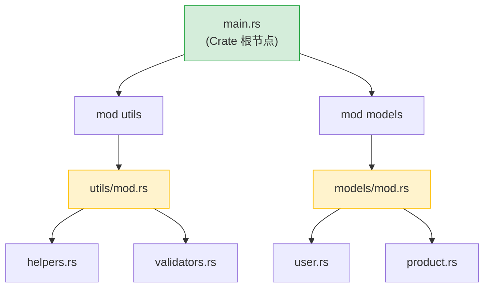

[English Original](../en/ch08-crates-and-modules.md)

## Rust 模块 vs Python 包

> **你将学到：** `mod` 和 `use` 与 `import` 的对比、可见性 (`pub`) 与 Python 基于约定的私有化、Cargo.toml 与 pyproject.toml、crates.io 与 PyPI，以及工作空间 (workspaces) 与单仓库 (monorepos) 的管理。
>
> **难度：** 🟢 初级

### Python 模块系统
```python
# Python — 文件即模块，带有 __init__.py 的目录即为包

# myproject/
# ├── __init__.py          # 使其成为一个包
# ├── main.py
# ├── utils/
# │   ├── __init__.py      # 使 utils 成为子包
# │   ├── helpers.py
# │   └── validators.py
# └── models/
#     ├── __init__.py
#     ├── user.py
#     └── product.py

# 导入方式：
from myproject.utils.helpers import format_name
from myproject.models.user import User
import myproject.utils.validators as validators
```

### Rust 模块系统
```rust
// Rust — mod 声明创建了模块树，文件则提供了具体内容

// src/
// ├── main.rs             # Crate 根节点 — 用于声明模块
// ├── utils/
// │   ├── mod.rs           # 模块声明 (等效于 __init__.py)
// │   ├── helpers.rs
// │   └── validators.rs
// └── models/
//     ├── mod.rs
//     ├── user.rs
//     └── product.rs

// 在 src/main.rs 中：
mod utils;       // 告诉 Rust 去 src/utils/mod.rs 寻找
mod models;      // 告诉 Rust 去 src/models/mod.rs 寻找

use utils::helpers::format_name;
use models::user::User;

// 在 src/utils/mod.rs 中：
pub mod helpers;      // 声明并导出 helpers.rs
pub mod validators;   // 声明并导出 validators.rs
```



> **Python 等效对照**：可以将 `mod.rs` 视作 `__init__.py` —— 它负责声明该模块导出的内容。而 Crate 的根节点（`main.rs` / `lib.rs`）则相当于顶层包的 `__init__.py`。

### 核心差异

| 概念 | Python | Rust |
|---------|--------|------|
| 模块 = 文件 | ✅ 自动生效 | 必须通过 `mod` 声明 |
| 包 = 目录 | `__init__.py` | `mod.rs` (或新版目录同名文件) |
| 默认公开 | ✅ 所有内容均为公开 | ❌ 默认均为私有 |
| 标记公开 | 使用 `_前缀` 约定 | 使用 `pub` 关键字 |
| 导入语法 | `from x import y` | `use x::y;` |
| 通配符导入 | `from x import *` | `use x::*;` (不推荐使用) |
| 相对导入 | `from . import sibling` | `use super::sibling;` |
| 重新导出 | 使用 `__all__` 或显式操作 | `pub use inner::Thing;` |

### 可见性 — 默认私有
```python
# Python — “大家都是成年人”
class User:
    def __init__(self):
        self.name = "Alice"       # 公开 (按约定)
        self._age = 30            # “私有” (约定：单下划线)
        self.__secret = "shhh"    # 名字修饰 (并非真正的私有)

# 没什么能阻止你访问 _age 甚至是 __secret
print(user._age)                  # 运行正常
print(user._User__secret)        # 也能跑通 (名字修饰)
```

```rust
// Rust — 私有性由编译器强制执行
pub struct User {
    pub name: String,      // 公开 — 任何人都可以访问
    age: i32,              // 私有 — 仅限当前模块访问
}

impl User {
    pub fn new(name: &str, age: i32) -> Self {
        User { name: name.to_string(), age }
    }

    pub fn age(&self) -> i32 {   // 公开的 Getter
        self.age
    }

    fn validate(&self) -> bool { // 私有方法
        self.age > 0
    }
}

// 在模块外部：
let user = User::new("Alice", 30);
println!("{}", user.name);        // ✅ 公开
// println!("{}", user.age);      // ❌ 编译错误：字段是私有的
println!("{}", user.age());       // ✅ 公开方法 (Getter)
```

---

## Crate vs PyPI 包

### Python 包 (PyPI)
```bash
# Python
pip install requests           # 从 PyPI 安装
pip install "requests>=2.28"   # 使用版本约束
pip freeze > requirements.txt  # 锁定版本
pip install -r requirements.txt # 复现环境
```

### Rust Crate (crates.io)
```bash
# Rust
cargo add reqwest              # 从 crates.io 安装（并添加到 Cargo.toml）
cargo add reqwest@0.12         # 使用版本约束
# Cargo.lock 会自动生成 — 无需手动操作
cargo build                    # 下载并编译依赖
```

### Cargo.toml vs pyproject.toml
```toml
# Rust — Cargo.toml
[package]
name = "my-project"
version = "0.1.0"
edition = "2021"

[dependencies]
serde = { version = "1.0", features = ["derive"] }  # 支持特性标志 (Features)
reqwest = { version = "0.12", features = ["json"] }
tokio = { version = "1", features = ["full"] }
log = "0.4"

[dev-dependencies]
mockall = "0.13"
```

### Python 开发者必备 Crate 对照表

| Python 库 | Rust Crate | 用途 |
|---------------|------------|---------|
| `requests` | `reqwest` | HTTP 客户端 |
| `json` (标准库) | `serde_json` | JSON 解析 |
| `pydantic` | `serde` | 序列化/验证 |
| `pathlib` | `std::path` (标准库) | 路径处理 |
| `os` / `shutil` | `std::fs` (标准库) | 文件操作 |
| `re` | `regex` | 正则表达式 |
| `logging` | `tracing` / `log` | 日志记录 |
| `click` / `argparse` | `clap` | 命令行参数解析 |
| `asyncio` | `tokio` | 异步运行时 |
| `datetime` | `chrono` | 日期与时间 |
| `pytest` | 内置支持 + `rstest` | 测试 |
| `dataclasses` | `#[derive(...)]` | 数据结构 |
| `typing.Protocol` | Traits | 结构化类型 |
| `subprocess` | `std::process` (标准库) | 运行外部命令 |
| `sqlite3` | `rusqlite` | SQLite |
| `sqlalchemy` | `diesel` / `sqlx` | ORM / SQL 工具包 |
| `fastapi` | `axum` / `actix-web` | Web 框架 |

---

## 工作空间 (Workspaces) vs 单仓库 (Monorepos)

### Python 单仓库 (典型结构)
```text
# Python 单仓库 (有多种方案，但缺乏标准)
myproject/
├── pyproject.toml           # 根项目配置
├── packages/
│   ├── core/
│   │   ├── pyproject.toml   # 每个包拥有各自的配置
│   │   └── src/core/...
│   ├── api/
│   │   ├── pyproject.toml
│   │   └── src/api/...
│   └── cli/
│       ├── pyproject.toml
│       └── src/cli/...
# 所用工具：poetry workspaces, pip -e ., uv workspaces — 尚无统一标准
```

### Rust 工作空间 (Workspace)
```toml
# Rust — 位于根目录的 Cargo.toml
[workspace]
members = [
    "core",
    "api",
    "cli",
]

# 在整个工作空间共享的依赖项
[workspace.dependencies]
serde = { version = "1.0", features = ["derive"] }
tokio = { version = "1", features = ["full"] }
```

```text
# Rust 工作空间结构 — 具有统一标准，且内置于 Cargo 中
myproject/
├── Cargo.toml               # 工作空间根配置
├── Cargo.lock               # 所有 Crate 共用同一个锁定文件
├── core/
│   ├── Cargo.toml            # [dependencies] serde.workspace = true
│   └── src/lib.rs
├── api/
│   ├── Cargo.toml
│   └── src/lib.rs
└── cli/
    ├── Cargo.toml
    └── src/main.rs
```

```bash
# 工作空间常用命令
cargo build                  # 构建所有内容
cargo test                   # 测试所有内容
cargo build -p core          # 仅构建 core crate
cargo test -p api            # 仅测试 api crate
cargo clippy --all           # 对所有内容进行 lint 检查
```

> **关键洞见**：Rust 工作空间是核心功能，直接内置于 Cargo 中。而 Python 的单仓库则需要第三方工具（如 poetry、uv、pants）且支持程度各异。在 Rust 工作空间中，所有 Crate 共享同一个 `Cargo.lock`，确保了整个项目中依赖版本的一致性。

---

## 练习

<details>
<summary><strong>🏋️ 练习：模块可见性</strong>（点击展开）</summary>

**挑战**：根据以下模块结构，预测哪些代码行可以编译通过，哪些不能：

```rust
mod kitchen {
    fn secret_recipe() -> &'static str { "42 种香料" }
    pub fn menu() -> &'static str { "今日特供" }

    pub mod staff {
        pub fn cook() -> String {
            format!("正在使用 {} 烹饪", super::secret_recipe())
        }
    }
}

fn main() {
    println!("{}", kitchen::menu());             // A 行
    println!("{}", kitchen::secret_recipe());     // B 行
    println!("{}", kitchen::staff::cook());       // C 行
}
```

<details>
<summary>🔑 答案</summary>

- **A 行**: ✅ 编译通过 — `menu()` 是 `pub` 公开的
- **B 行**: ❌ 编译错误 — `secret_recipe()` 对 `kitchen` 外部来说是私有的
- **C 行**: ✅ 编译通过 — `staff::cook()` 是 `pub` 公开的，且 `cook()` 可以通过 `super::` 访问 `secret_recipe()`（子模块可以访问其父模块的私有条目）

**核心要点**: 在 Rust 中，子模块可以看见父模块的私有内容（类似于 Python 的 `_private` 约定，但由编译器强制执行）。而外部人员则无法看见。这与 Python 不同，Python 的 `_private` 仅是一个提示建议。

</details>
</details>

---
