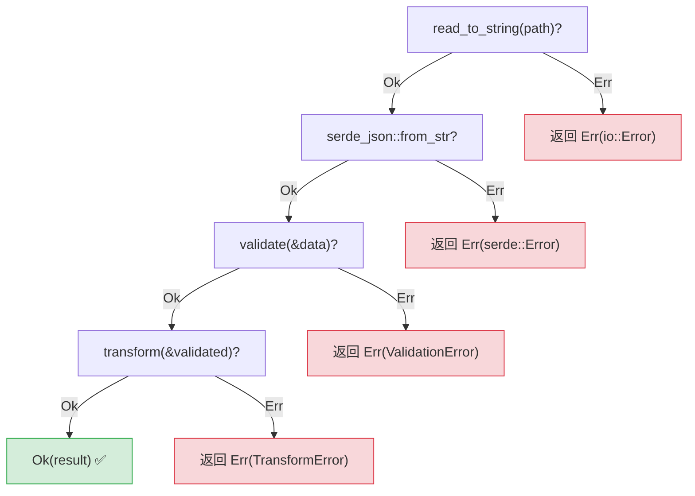
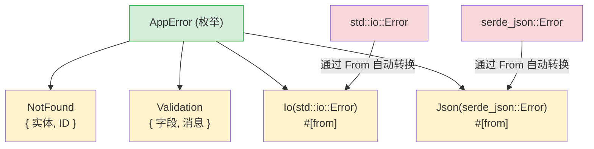

[English Original](../en/ch09-error-handling.md)

## 异常 vs Result

> **你将学到：** `Result<T, E>` 与 `try`/`except` 的对比、简洁传播错误的 `?` 运算符、使用 `thiserror` 定义自定义错误类型、面向应用程序的 `anyhow` 库，以及为什么显式错误可以防止隐藏的 Bug。
>
> **难度：** 🟡 中级

这是 Python 开发者面临的最大思维转变之一。Python 使用异常 (Exceptions) 来处理错误 —— 错误可以从任何地方抛出，并可以在任何地方被捕获（或者根本不被捕获）。而 Rust 使用 `Result<T, E>` —— 错误被视为必须显式处理的“值”。

### Python 异常处理
```python
# Python — 警告：异常可能从任何地方抛出
import json

def load_config(path: str) -> dict:
    try:
        with open(path) as f:
            data = json.load(f)     # 可能抛出 JSONDecodeError
            if "version" not in data:
                raise ValueError("缺少 version 字段")
            return data
    except FileNotFoundError:
        print(f"找不到配置文件: {path}")
        return {}
    except json.JSONDecodeError as e:
        print(f"无效的 JSON: {e}")
        return {}
    # 这段代码还可能抛出哪些异常？
    # IOError? PermissionError? UnicodeDecodeError?
    # 你无法从函数签名中看出来！
```

### Rust 基于 Result 的错误处理
```rust
// Rust — 错误是返回值，在函数签名中清晰可见
use std::fs;
use serde_json::Value;

fn load_config(path: &str) -> Result<Value, ConfigError> {
    let contents = fs::read_to_string(path)    // 返回 Result
        .map_err(|e| ConfigError::FileError(e.to_string()))?;

    let data: Value = serde_json::from_str(&contents)  // 返回 Result
        .map_err(|e| ConfigError::ParseError(e.to_string()))?;

    if data.get("version").is_none() {
        return Err(ConfigError::MissingField("version".to_string()));
    }

    Ok(data)
}

#[derive(Debug)]
enum ConfigError {
    FileError(String),
    ParseError(String),
    MissingField(String),
}
```

### 核心差异

```text
Python:                                 Rust:
─────────                               ─────
- 错误是异常 (抛出制)                    - 错误是值 (返回制)
- 隐式控制流 (堆栈展开)                  - 显式控制流 (? 运算符)
- 签名无法体现错误类型                   - 必须在返回类型中体现错误
- 未捕获异常会在运行时导致崩溃           - 未处理的 Result 会产生编译警告（且必须处理）
- 使用 try/except 是可选的              - 处理 Result 是强制要求的
- 宽泛的 except 会捕获所有异常           - match 分支是穷尽式的
```

### Result 的两种变体
```rust
// Result<T, E> 恰好有两个变体：
enum Result<T, E> {
    Ok(T),    // 成功 — 包含具体值 (类似 Python 的 return 返回值)
    Err(E),   // 失败 — 包含错误信息 (类似 Python 的 raise 抛出异常)
}

// 使用 Result：
fn divide(a: f64, b: f64) -> Result<f64, String> {
    if b == 0.0 {
        Err("除数不能为零".to_string())  // 类似: raise ValueError("...")
    } else {
        Ok(a / b)                       // 类似: return a / b
    }
}

// 处理 Result — 类似 try/except 但更显式：
match divide(10.0, 0.0) {
    Ok(result) => println!("结果: {result}"),
    Err(msg) => println!("错误: {msg}"),
}
```

---

## ? 运算符

`?` 运算符是 Rust 的一种机制，允许错误沿着调用堆栈向上传播，这与 Python 的异常抛出类似，但它是显式且清晰可见的。

### Python — 隐式传播
```python
# Python — 异常会在调用堆栈中静默传播
def read_username() -> str:
    with open("config.txt") as f:      # FileNotFoundError 向上冒泡
        return f.readline().strip()    # IOError 向上冒泡

def greet():
    name = read_username()             # 如果抛出错误，greet() 也会抛出
    print(f"你好, {name}!")           # 发生错误时跳过
# 错误传播是不可见的 — 你不得不通过阅读实现代码来了解到底会漏掉哪些异常。
```

### Rust — 使用 ? 的显式传播
```rust
// Rust — ? 用于传播错误，且在代码和签名中均清晰可见
use std::fs;
use std::io;

fn read_username() -> Result<String, io::Error> {
    let contents = fs::read_to_string("config.txt")?;  // ? = 遇到 Err 则传播
    Ok(contents.lines().next().unwrap_or("").to_string())
}

fn greet() -> Result<(), io::Error> {
    let name = read_username()?;       // ? = 若为 Err 则直接返回该错误
    println!("你好, {name}!");        // 仅在 Ok 时执行
    Ok(())
}
```
`?` 的意思是：“如果这是个 `Err`，请立即从**当前函数**返回该错误。”这类似于 Python 的异常冒泡，但不同点在于：
1. 它在代码中是**可见的**（你能看到 `?`）。
2. 它体现在**返回类型**中（`Result<..., io::Error>`）。
3. 编译器会确保你在某处对其进行了处理。

### 使用 ? 构建链式调用
```python
# Python — 多个可能失败的操作
def process_file(path: str) -> dict:
    with open(path) as f:                    # 可能失败
        text = f.read()                       # 可能失败
    data = json.loads(text)                   # 可能失败
    validate(data)                            # 可能失败
    return transform(data)                    # 可能失败
# 任何一环都可能抛出异常 — 且类型各异！
```

```rust
// Rust — 同样的链式调用，但每步都是显式的
fn process_file(path: &str) -> Result<Data, AppError> {
    let text = fs::read_to_string(path)?;     // ? 传播 io::Error
    let data: Value = serde_json::from_str(&text)?;  // ? 传播 serde 错误
    let validated = validate(&data)?;          // ? 传播验证错误
    let result = transform(&validated)?;       // ? 传播转换错误
    Ok(result)
}
// 每个 ? 都是一个潜在的提前返回点 — 且所有点都是可见的！
```



> 每个 `?` 都是退出点 — 这与 Python 的 `try/except` 不同，你不需要阅读文档就能一眼看出哪一行可能会抛出错误。
>
> 📌 **延伸阅读**: [第 15 章：迁移模式](ch15-migration-patterns.md) 涉及了在实际代码库中将 Python 的 try/except 模式翻译至 Rust 的具体案例。

---

## 使用 thiserror 自定义错误类型



> `#[from]` 属性会自动生成 `impl From<io::Error> for AppError`。因此，`?` 运算符会自动将库产生的错误转换为你应用程序自己的错误。

### Python 自定义异常
```python
# Python — 自定义异常类
class AppError(Exception):
    pass

class NotFoundError(AppError):
    def __init__(self, entity: str, id: int):
        self.entity = entity
        self.id = id
        super().__init__(f"未找到 id 为 {id} 的 {entity}")

class ValidationError(AppError):
    def __init__(self, field: str, message: str):
        self.field = field
        super().__init__(f"{field} 的验证错误: {message}")

# 使用方式：
def find_user(user_id: int) -> dict:
    if user_id not in users:
        raise NotFoundError("用户", user_id)
    return users[user_id]
```

### 使用 thiserror 的 Rust 自定义错误
```rust
// Rust — 使用 thiserror 库定义错误枚举 (最流行的方法)
// 在 Cargo.toml 中添加: thiserror = "2"

use thiserror::Error;

#[derive(Debug, Error)]
enum AppError {
    #[error("未找到 id 为 {id} 的 {entity}")]
    NotFound { entity: String, id: i64 },

    #[error("{field} 的验证错误: {message}")]
    Validation { field: String, message: String },

    #[error("IO 错误: {0}")]
    Io(#[from] std::io::Error),        // 自动将 io::Error 进行转换

    #[error("JSON 错误: {0}")]
    Json(#[from] serde_json::Error),   // 自动将 serde 错误进行转换
}

// 使用方式：
fn find_user(user_id: i64) -> Result<User, AppError> {
    users.get(&user_id)
        .cloned()
        .ok_or(AppError::NotFound {
            entity: "用户".to_string(),
            id: user_id,
        })
}

// 由于使用了 #[from] 属性，? 运算符会自动执行 io::Error → AppError::Io 的转换
fn load_users(path: &str) -> Result<Vec<User>, AppError> {
    let data = fs::read_to_string(path)?;  // io::Error 会自动转为 AppError::Io
    let users: Vec<User> = serde_json::from_str(&data)?;  // 自动转为 AppError::Json
    Ok(users)
}
```

### 错误处理快速参考表

| Python | Rust | 说明 |
|--------|------|-------|
| `raise ValueError("msg")` | `return Err(AppError::Validation {...})` | 显式返回 |
| `try: ... except:` | `match result { Ok(v) => ..., Err(e) => ... }` | 每一项都必须处理 |
| `except ValueError as e:` | `Err(AppError::Validation { .. }) =>` | 模式匹配 |
| `raise ... from e` | `#[from]` 属性或 `.map_err()` | 错误链式连接 |
| `finally:` | `Drop` trait (自动执行) | 确定性清理 |
| `with open(...):` | 基于作用域的 Drop (自动执行) | RAII 模式 |
| 异常会静默向上传递 | `?` 显式向上传播 | 始终体现于返回类型中 |
| `isinstance(e, ValueError)` | `matches!(e, AppError::Validation {..})` | 类型检查 |

---

## 练习

<details>
<summary><strong>🏋️ 练习：解析配置项中的端口号</strong>（点击展开）</summary>

**挑战**：编写一个函数 `parse_port(s: &str) -> Result<u16, String>`，要求：
1. 拒绝空字符串，报错信息为 `"输入内容不能为空"`。
2. 将字符串解析为 `u16`。如果解析失败，报错信息包含原始错误：`"无效数字: {原始错误信息}"`。
3. 拒绝 1024 以下的端口（特权端口），报错信息为 `"端口 {n} 是特权端口"`。

使用 `""`、`"hello"`、`"80"` 和 `"8080"` 作为输入调用该函数，并打印结果。

<details>
<summary>🔑 答案</summary>

```rust
fn parse_port(s: &str) -> Result<u16, String> {
    if s.is_empty() {
        return Err("输入内容不能为空".to_string());
    }
    let port: u16 = s.parse().map_err(|e| format!("无效数字: {e}"))?;
    if port < 1024 {
        return Err(format!("端口 {port} 是特权端口"));
    }
    Ok(port)
}

fn main() {
    for input in ["", "hello", "80", "8080"] {
        match parse_port(input) {
            Ok(port) => println!("✅ {input} → {port}"),
            Err(e) => println!("❌ {input:?} → {e}"),
        }
    }
}
```

**核心要点**: `?` 配合 `.map_err()` 是 Rust 中对 `try/except ValueError as e: raise ConfigError(...) from e` 模式的替代。所有的错误路径在返回类型中是一目了然的。

</details>
</details>

---
