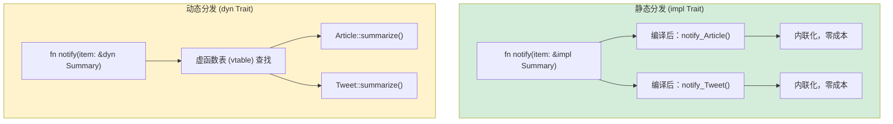

[English Original](../en/ch10-traits-and-generics.md)

## Trait vs 鸭子类型 (Duck Typing)

> **你将学到：** 作为显式协议的 Trait（与 Python 鸭子类型的对比）、`Protocol` (PEP 544) ≈ Trait、带有 `where` 子句的泛型类型约束、Trait 对象 (`dyn Trait`) 与静态分发的对比，以及常见的标准库 Trait。
>
> **难度：** 🟡 中级

这是 Rust 类型系统对 Python 开发者来说最为出彩的地方。Python 的“鸭子类型”认为：“如果它走起来像鸭子，叫起来也像鸭子，那它就是只鸭子。”而 Rust 的 Trait 则认为：“我会告诉你我在编译期到底需要哪些属于‘鸭子’的行为。”

### Python 鸭子类型
```python
# Python — 鸭子类型：任何拥有对应方法的对象都能运行
def total_area(shapes):
    """适用于任何带有 .area() 方法的对象。"""
    return sum(shape.area() for shape in shapes)

class Circle:
    def __init__(self, radius): self.radius = radius
    def area(self): return 3.14159 * self.radius ** 2

class Rectangle:
    def __init__(self, w, h): self.w, self.h = w, h
    def area(self): return self.w * self.h

# 在运行时正常工作 — 无需集成！
shapes = [Circle(5), Rectangle(3, 4)]
print(total_area(shapes))  # 90.54

# 但如果某个对象没有 .area() 方法呢？
class Dog:
    def bark(self): return "汪汪!"

total_area([Dog()])  # 💥 AttributeError: 'Dog' 对象没有 'area' 属性
# 错误发生在“运行时”，而非定义时
```

### Rust Trait — 显式的鸭子类型
```rust
// Rust — Trait 让“鸭子”协议变得显式化
trait HasArea {
    fn area(&self) -> f64;      // 任何实现该 Trait 的类型都拥有 .area() 方法
}

struct Circle { radius: f64 }
struct Rectangle { width: f64, height: f64 }

impl HasArea for Circle {
    fn area(&self) -> f64 {
        std::f64::consts::PI * self.radius * self.radius
    }
}

impl HasArea for Rectangle {
    fn area(&self) -> f64 {
        self.width * self.height
    }
}

// Trait 约束是显式的 — 编译器在编译期进行检查
fn total_area(shapes: &[&dyn HasArea]) -> f64 {
    shapes.iter().map(|s| s.area()).sum()
}

// 使用方式：
let shapes: Vec<&dyn HasArea> = vec![&Circle { radius: 5.0 }, &Rectangle { width: 3.0, height: 4.0 }];
println!("{}", total_area(&shapes));  // 90.54

// struct Dog;
// total_area(&[&Dog {}]);  // ❌ 编译错误：Dog 未实现 HasArea
```

> **关键洞见**：Python 的鸭子类型将错误推迟到了运行时。Rust 的 Trait 则在编译期就能捕捉到它们。同样的灵活性，但能更早地发现错误。

---

## Protocols (PEP 544) vs Traits

Python 3.8 引入了 `Protocol` (PEP 544) 用于结构化子类型（structural subtyping）—— 这是 Python 中最接近 Rust Trait 的概念。

### Python Protocol
```python
# Python — Protocol (结构化类型，类似 Rust Trait)
from typing import Protocol, runtime_checkable

@runtime_checkable
class Printable(Protocol):
    def to_string(self) -> str: ...

class User:
    def __init__(self, name: str):
        self.name = name
    def to_string(self) -> str:
        return f"User({self.name})"

class Product:
    def __init__(self, name: str, price: float):
        self.name = name
        self.price = price
    def to_string(self) -> str:
        return f"Product({self.name}, ${self.price:.2f})"

def print_all(items: list[Printable]) -> None:
    for item in items:
        print(item.to_string())

# 运行正常，因为 User 和 Product 都有 to_string() 方法
print_all([User("Alice"), Product("Widget", 9.99)])

# 但是：mypy 会检查它，而 Python 运行时并不会强制执行
# print_all([42])  # mypy 会警告，但 Python 照样运行且随后崩溃
```

### Rust Trait (等效，但具有强制性！)
```rust
// Rust — Trait 在编译期被强制执行
trait Printable {
    fn to_string(&self) -> String;
}

struct User { name: String }
struct Product { name: String, price: f64 }

impl Printable for User {
    fn to_string(&self) -> String {
        format!("User({})", self.name)
    }
}

impl Printable for Product {
    fn to_string(&self) -> String {
        format!("Product({}, ${:.2})", self.name, self.price)
    }
}

fn print_all(items: &[&dyn Printable]) {
    for item in items {
        println!("{}", item.to_string());
    }
}

// print_all(&[&42i32]);  // ❌ 编译错误：i32 未实现 Printable
```

### 特性对比表

| 特性 | Python Protocol | Rust Trait |
|---------|-----------------|------------|
| 结构化类型 (Structural typing) | ✅ (隐式的) | ❌ (显式的 `impl`) |
| 检查时机 | 运行时 (或 mypy) | 编译期 (始终执行) |
| 默认实现 | ❌ | ✅ |
| 能够为外部类型添加 | ❌ | ✅ (在受限范围内) |
| 多个协议 | ✅ | ✅ (多个 Trait) |
| 关联类型 | ❌ | ✅ |
| 泛型约束 | ✅ (配合 `TypeVar`) | ✅ (Trait Bounds) |

---

## 泛型约束

### Python 中的泛型
```python
# Python — 使用 TypeVar 定义泛型函数
from typing import TypeVar, Sequence

T = TypeVar('T')

def first(items: Sequence[T]) -> T | None:
    return items[0] if items else None

# 带有约束的 TypeVar
from typing import SupportsFloat
T = TypeVar('T', bound=SupportsFloat)

def average(items: Sequence[T]) -> float:
    return sum(float(x) for x in items) / len(items)
```

### 带有 Trait 约束的 Rust 泛型
```rust
// Rust — 泛型与 Trait 约束
fn first<T>(items: &[T]) -> Option<&T> {
    items.first()
}

// 带有 Trait 约束 — “T 必须实现这些 Trait”
fn average<T>(items: &[T]) -> f64
where
    T: Into<f64> + Copy,   // T 必须能转为 f64 且可拷贝
{
    let sum: f64 = items.iter().map(|&x| x.into()).sum();
    sum / items.len() as f64
}

// 多个约束 — “T 必须实现 Display 且实现 Debug 且实现 Clone”
fn log_and_clone<T: std::fmt::Display + std::fmt::Debug + Clone>(item: &T) -> T {
    println!("Display: {}", item);
    println!("Debug: {:?}", item);
    item.clone()
}

// 使用 impl Trait 简写 (适用于简单情况)
fn print_it(item: &impl std::fmt::Display) {
    println!("{}", item);
}
```

### 泛型快速参考

| Python | Rust | 说明 |
|--------|------|-------|
| `TypeVar('T')` | `<T>` | 无约束泛型 |
| `TypeVar('T', bound=X)` | `<T: X>` | 有约束泛型 |
| `Union[int, str]` | `enum` 或 Trait 对象 | Rust 无联合类型 |
| `Sequence[T]` | `&[T]` (切片) | 借用的序列 |
| `Callable[[A], R]` | `Fn(A) -> R` | 函数 Trait |
| `Optional[T]` | `Option<T>` | 内置枚举 |

---

## 常见的标准库 Trait

这些 Trait 相当于 Rust 版本的 Python “魔术方法” (dunder methods) —— 它们定义了类型在常见场景下的行为。

### Display 与 Debug (打印输出)
```rust
use std::fmt;

// Debug — 类似 __repr__ (可以通过 #[derive] 自动生成)
#[derive(Debug)]
struct Point { x: f64, y: f64 }
// 现在可以执行: println!("{:?}", point);

// Display — 类似 __str__ (必须手动实现)
impl fmt::Display for Point {
    fn fmt(&self, f: &mut fmt::Formatter<'_>) -> fmt::Result {
        write!(f, "({}, {})", self.x, self.y)
    }
}
// 现在可以执行: println!("{}", point);
```

### 比较类 Trait
```rust
// PartialEq — 类似 __eq__
// Eq — 全等 (f64 实现了 PartialEq 但不是 Eq，因为 NaN != NaN)
// PartialOrd — 类似 __lt__, __le__ 等
// Ord — 全序关系

#[derive(Debug, PartialEq, Eq, PartialOrd, Ord, Hash, Clone)]
struct Student {
    name: String,
    grade: i32,
}

// 现在 Student 实例可以进行：比较、排序、作为 HashMap 的键、克隆
let mut students = vec![
    Student { name: "小明".into(), grade: 85 },
    Student { name: "阿强".into(), grade: 92 },
];
students.sort();  // 使用 Ord — 先按名字排序，再按成绩排序 (遵循字段顺序)
```

### Iterator Trait
```rust
// 实现 Iterator — 类似 Python 的 __iter__/__next__
struct Countdown { value: i32 }

impl Iterator for Countdown {
    type Item = i32;       // 迭代器产生的类型

    fn next(&mut self) -> Option<Self::Item> {
        if self.value > 0 {
            self.value -= 1;
            Some(self.value + 1)
        } else {
            None             // 迭代结束
        }
    }
}

// 使用方式：
for n in (Countdown { value: 5 }) {
    println!("{n}");  // 5, 4, 3, 2, 1
}
```

### 常用 Trait 一览表

| Rust Trait | Python 等效项 | 用途 |
|-----------|-------------------|---------|
| `Display` | `__str__` | 面向用户的字符串表示 |
| `Debug` | `__repr__` | 面向开发者的调试字符串 |
| `Clone` | `copy.deepcopy` | 深拷贝 |
| `Copy` | (int/float 自动拷贝) | 简单类型的隐式拷贝 |
| `PartialEq` / `Eq` | `__eq__` | 相等性比较 |
| `PartialOrd` / `Ord` | `__lt__` 等 | 排序 |
| `Hash` | `__hash__` | 可哈希 (用于字典键) |
| `Default` | 默认 `__init__` | 提供默认值 |
| `From` / `Into` | `__init__` 重载 | 类型转换 |
| `Iterator` | `__iter__` / `__next__` | 迭代行为 |
| `Drop` | `__del__` / `__exit__` | 清理逻辑 |
| `Add`, `Sub`, `Mul` | `__add__` 等 | 运算符重载 |
| `Index` | `__getitem__` | 使用 `[]` 进行索引 |
| `Deref` | (无等效项) | 智能指针解引用 |
| `Send` / `Sync` | (无等效项) | 线程安全性标记 |



> **Python 对等说明**：Python *始终* 使用动态分发（运行时通过 `getattr` 查找）。Rust 默认使用静态分发（单态化 —— 编译器为每个具体类型生成专门的代码）。只有当你确定需要运行时多态时，才使用 `dyn Trait`。
>
> 📌 **延伸阅读**: [第 11 章：From/Into Trait](ch11-from-and-into-traits.md) 深入探讨了转换类 Trait (`From`, `Into`, `TryFrom`)。

---

### 关联类型 (Associated Types)

Rust 的 Trait 可以定义*关联类型* —— 这是一种占位类型，由每个实现者具体填充。Python 中没有完全对应的概念：

```rust
// Iterator 定义了一个关联类型 'Item'
trait Iterator {
    type Item;
    fn next(&mut self) -> Option<Self::Item>;
}

struct Countdown { remaining: u32 }

impl Iterator for Countdown {
    type Item = u32;  // 该迭代器产生 u32 类型的值
    fn next(&mut self) -> Option<u32> {
        if self.remaining > 0 {
            self.remaining -= 1;
            Some(self.remaining)
        } else {
            None
        }
    }
}
```

在 Python 中，`__iter__` / `__next__` 返回的是 `Any` —— 无法强制声明“该迭代器产生 `int`”并由系统强制执行（使用 `Iterator[int]` 的类型提示仅具有建议性质）。

### 运算符重载：`__add__` → `impl Add`

Python 使用魔术方法（如 `__add__`、`__mul__`）。Rust 则使用 Trait 实现 —— 思路一致，但在编译期会进行类型检查：

```python
# Python
class Vec2:
    def __init__(self, x, y):
        self.x, self.y = x, y
    def __add__(self, other):
        return Vec2(self.x + other.x, self.y + other.y)  # 不会对 'other' 进行类型检查
```

```rust
use std::ops::Add;

#[derive(Debug, Clone, Copy)]
struct Vec2 { x: f64, y: f64 }

impl Add for Vec2 {
    type Output = Vec2;  // 关联类型：+ 运算后返回什么？
    fn add(self, rhs: Vec2) -> Vec2 {
        Vec2 { x: self.x + rhs.x, y: self.y + rhs.y }
    }
}

let a = Vec2 { x: 1.0, y: 2.0 };
let b = Vec2 { x: 3.0, y: 4.0 };
let c = a + b;  // 类型安全：仅允许 Vec2 + Vec2
```

核心差异：Python 的 `__add__` 在运行时接受*任何* `other`（你需要手动检查类型，否则会得到 `TypeError`）。Rust 的 `Add` Trait 在编译期强制要求操作数类型 —— 除非你显式地为 `Vec2` 实现 `impl Add<i32>`，否则 `Vec2 + i32` 会导致编译错误。

---

## 练习

<details>
<summary><strong>🏋️ 练习：泛型 Summary Trait</strong>（点击展开）</summary>

**挑战**：定义一个 `Summary` Trait，其中包含一个 `fn summarize(&self) -> String` 方法。为两个结构体实现该 Trait：`Article { title: String, body: String }` 和 `Tweet { username: String, content: String }`。然后编写一个函数 `fn notify(item: &impl Summary)` 来打印摘要信息。

<details>
<summary>🔑 答案</summary>

```rust
trait Summary {
    fn summarize(&self) -> String;
}

struct Article { title: String, body: String }
struct Tweet { username: String, content: String }

impl Summary for Article {
    fn summarize(&self) -> String {
        format!("{} — {}...", self.title, &self.body[..20.min(self.body.len())])
    }
}

impl Summary for Tweet {
    fn summarize(&self) -> String {
        format!("@{}: {}", self.username, self.content)
    }
}

fn notify(item: &impl Summary) {
    println!("📢 {}", item.summarize());
}

fn main() {
    let article = Article {
        title: "Rust 真不错".into(),
        body: "在此我们将探讨为什么 Rust 在系统层面超越了 Python...".into(),
    };
    let tweet = Tweet {
        username: "rustacean".into(),
        content: "刚刚发布了我的第一个 crate！".into(),
    };
    notify(&article);
    notify(&tweet);
}
```

**核心要点**: `&impl Summary` 是 Rust 对 Python 中带有 `summarize` 方法的 `Protocol` 的对等实现。但 Rust 会在编译期进行检查 —— 传递一个未实现 `Summary` 的类型会导致编译错误，而不是运行时的 `AttributeError`。

</details>
</details>

---
