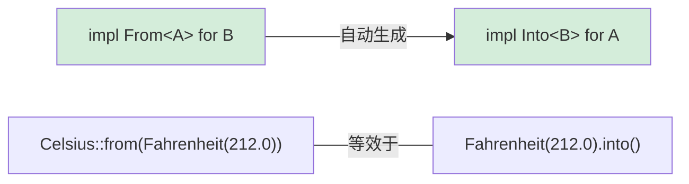

[English Original](../en/ch11-from-and-into-traits.md)

## Rust 中的类型转换

> **你将学到：** 用于零成本类型转换的 `From` 与 `Into` Trait、用于易错转换的 `TryFrom`、`impl From<A> for B` 如何自动生成 `Into`，以及字符串转换的常见模式。
>
> **难度：** 🟡 中级

Python 通过调用构造函数来处理类型转换（如 `int("42")`、`str(42)`、`float("3.14")`）。而 Rust 则使用 `From` 和 `Into` 这两个 Trait 来确保转换的类型安全性。

### Python 的类型转换
```python
# Python — 使用显式的构造函数进行转换
x = int("42")           # str → int (可能抛出 ValueError)
s = str(42)             # int → str
f = float("3.14")       # str → float
lst = list((1, 2, 3))   # tuple → list

# 通过 __init__ 或类方法进行自定义转换
class Celsius:
    def __init__(self, temp: float):
        self.temp = temp

    @classmethod
    def from_fahrenheit(cls, f: float) -> "Celsius":
        return cls((f - 32.0) * 5.0 / 9.0)

c = Celsius.from_fahrenheit(212.0)  # 100.0°C
```

### Rust 的 From/Into
```rust
// Rust — 由 From Trait 定义转换规则
// 实现 From<T> 会自动为你生成对应的 Into<U>！

struct Celsius(f64);
struct Fahrenheit(f64);

impl From<Fahrenheit> for Celsius {
    fn from(f: Fahrenheit) -> Self {
        Celsius((f.0 - 32.0) * 5.0 / 9.0)
    }
}

// 现在这两种方式都可以运行：
let c1 = Celsius::from(Fahrenheit(212.0));    // 显式调用 From
let c2: Celsius = Fahrenheit(212.0).into();   // 调用 Into (自动推导出的)

// 字符串转换：
let s: String = String::from("hello");         // &str → String
let s: String = "hello".to_string();           // 同上
let s: String = "hello".into();                // 同样有效 (因为实现了 From)

let num: i64 = 42i32.into();                   // i32 → i64 (无损转换，所以存在 From)
// let small: i32 = 42i64.into();              // ❌ i64 → i32 可能会丢失数据 — 故未实现 From

// 对于可能失败的转换，请使用 TryFrom：
let n: Result<i32, _> = "42".parse();          // str → i32 (可能失败)
let n: i32 = "42".parse().unwrap();            // 如果不是数字则发生恐慌 (Panic)
let n: i32 = "42".parse()?;                    // 使用 ? 运算符传播错误
```

### From 与 Into 的关系



> **经验法则**：始终只实现 `From`，永远不要直接去实现 `Into`。实现 `From<A> for B` 会让你免费获得 `Into<B> for A` 的能力。

***

### 应该在何时使用 From/Into

```rust
// 为你的类型实现 From<T> 可以让 API 设计变得更加符合人体工程学：

#[derive(Debug)]
struct UserId(i64);

impl From<i64> for UserId {
    fn from(id: i64) -> Self {
        UserId(id)
    }
}

// 现在该函数可以接收任何能够转为 UserId 的参数：
fn find_user(id: impl Into<UserId>) -> Option<String> {
    let user_id = id.into();
    // ... 查找逻辑
    Some(format!("用户 ID: {:?}", user_id))
}

find_user(42i64);              // ✅ i64 会自动转为 UserId
find_user(UserId(42));         // ✅ UserId 保持原样直传
```

---

## TryFrom — 会失败的转换

并非所有的转换都能一定成功。在 Python 中，这会引发异常；在 Rust 中，这需要使用 `TryFrom` 显式地返回一个 `Result`：

```python
# Python — 会失败的转换抛出异常
try:
    port = int("not_a_number")   # ValueError
except ValueError as e:
    print(f"无效输入: {e}")

# 在 __init__ 中进行自定义验证
class Port:
    def __init__(self, value: int):
        if not (1 <= value <= 65535):
            raise ValueError(f"无效的端口号: {value}")
        self.value = value

try:
    p = Port(99999)  # 运行时抛出 ValueError
except ValueError:
    pass
```

```rust
use std::num::ParseIntError;

// 内置类型的 TryFrom
let n: Result<i32, ParseIntError> = "42".try_into();   // Ok(42)
let n: Result<i32, ParseIntError> = "无效".try_into();  // Err(...)

// 自定义验证逻辑的 TryFrom
#[derive(Debug)]
struct Port(u16);

#[derive(Debug)]
enum PortError {
    Zero,
}

impl TryFrom<u16> for Port {
    type Error = PortError;

    fn try_from(value: u16) -> Result<Self, Self::Error> {
        match value {
            0 => Err(PortError::Zero),
            1..=65535 => Ok(Port(value)),
        }
    }
}

impl std::fmt::Display for PortError {
    fn fmt(&self, f: &mut std::fmt::Formatter<'_>) -> std::fmt::Result {
        match self {
            PortError::Zero => write!(f, "端口号不能为零"),
        }
    }
}

// 使用方式：
let p: Result<Port, _> = 8080u16.try_into();   // Ok(Port(8080))
let p: Result<Port, _> = 0u16.try_into();       // Err(PortError::Zero)
```

> **Python → Rust 思维模型**：`TryFrom` 相当于带有验证逻辑且可能会失败的 `__init__`。但由于它显式地返回 `Result` 而不是抛出异常，因此调用方**必须**显式处理错误路径。

---

## 字符串转换模式

字符串通常是 Python 开发者产生转换困扰的主要来源：

```rust
// String → &str (一种“借用”，它是几乎无开销的)
let s = String::from("hello");
let r: &str = &s;              // 自动通过 Deref 强制转换 (Coercion)
let r: &str = s.as_str();     // 显式手动转换

// &str → String (发生了内存分配，会占用额外的内存)
let r: &str = "hello";
let s1 = String::from(r);     // 通过 From Trait
let s2 = r.to_string();       // 通过 ToString Trait (间接通过 Display 获得)
let s3: String = r.into();    // 通过 Into Trait

// 数据类型 → String
let s = 42.to_string();       // "42" — 类似 Python 的 str(42)
let s = format!("{:.2}", 3.14); // "3.14" — 类似 f"{3.14:.2f}"

// String → 数字
let n: i32 = "42".parse().unwrap();       // 类似 Python 的 int("42")
let f: f64 = "3.14".parse().unwrap();     // 类似 Python 的 float("3.14")

// 自定义类型 → String (需要实现 Display)
use std::fmt;

struct Point { x: f64, y: f64 }

impl fmt::Display for Point {
    fn fmt(&self, f: &mut fmt::Formatter<'_>) -> fmt::Result {
        write!(f, "({}, {})", self.x, self.y)
    }
}

let p = Point { x: 1.0, y: 2.0 };
println!("{p}");                // (1, 2) — 类似 Python 的 __str__
let s = p.to_string();         // 同样有效！Display 会自动免费为你提供 ToString 功能。
```

### 转换快速对照表

| Python | Rust | 说明 |
|--------|------|-------|
| `str(x)` | `x.to_string()` | 需要实现 `Display` Trait |
| `int("42")` | `"42".parse::<i32>()` | 返回 `Result` 类型 |
| `float("3.14")` | `"3.14".parse::<f64>()` | 返回 `Result` 类型 |
| `list(iter)` | `iter.collect::<Vec<_>>()` | 通常需要显式写出目标类型 |
| `dict(pairs)` | `pairs.collect::<HashMap<_,_>>()` | 同上 |
| `bool(x)` | 无直接对等项 | 必须进行显式的逻辑检查 |
| `MyClass(x)` | `MyClass::from(x)` | 需要实现 `From<T>` |
| `MyClass(x)` (带验证) | `MyClass::try_from(x)?` | 需要实现 `TryFrom<T>` |

---

## 转换链与错误处理

在实际代码中，我们经常需要串联多个转换操作。对比一下两种语言的处理方式：

```python
# Python — 使用 try/except 的转换链
def parse_config(raw: str) -> tuple[str, int]:
    try:
        host, port_str = raw.split(":")
        port = int(port_str)
        if not (1 <= port <= 65535):
            raise ValueError(f"错误的端口: {port}")
        return (host, port)
    except (ValueError, AttributeError) as e:
        raise ConfigError(f"无效配置: {e}") from e
```

```rust
fn parse_config(raw: &str) -> Result<(String, u16), String> {
    let (host, port_str) = raw
        .split_once(':')
        .ok_or_else(|| "缺少 ':' 分隔符".to_string())?;

    let port: u16 = port_str
        .parse()
        .map_err(|e| format!("无效端口: {e}"))?;

    if port == 0 {
        return Err("端口不能为零".to_string());
    }

    Ok((host.to_string(), port))
}

fn main() {
    match parse_config("localhost:8080") {
        Ok((host, port)) => println!("正在连接到 {host}:{port}"),
        Err(e) => eprintln!("配置解析错误: {e}"),
    }
}
```

> **关键洞见**：每一个 `?` 都是可见的退出点。在 Python 中，`try` 块内的任何一行都可能抛出异常；而在 Rust 中，只有带 `?` 或显式返回 `Err` 的行才会导致失败。
>
> 📌 **延伸阅读**: [第 9 章：错误处理](ch09-error-handling.md) 深入探讨了 `Result`、`?` 以及使用 `thiserror` 库来实现自定义错误。

---

## 练习

<details>
<summary><strong>🏋️ 练习：温度转换库</strong>（点击展开）</summary>

**挑战**：构建一个小型的温度转换库：
1. 定义 `Celsius(f64)`、`Fahrenheit(f64)`、`Kelvin(f64)` 三种结构体。
2. 为 `Celsius` 实现 `From<Celsius> for Fahrenheit` 和 `From<Celsius> for Kelvin`。
3. 为 `Kelvin` 实现 `TryFrom<f64> for Kelvin`，拒绝绝对零度以下的值（-273.15°C ≈ 0K）。
4. 为这三种类型实现 `Display`（例如输出为 `"100.00°C"`）。

<details>
<summary>🔑 答案</summary>

```rust
use std::fmt;

struct Celsius(f64);
struct Fahrenheit(f64);
struct Kelvin(f64);

impl From<Celsius> for Fahrenheit {
    fn from(c: Celsius) -> Self {
        Fahrenheit(c.0 * 9.0 / 5.0 + 32.0)
    }
}

impl From<Celsius> for Kelvin {
    fn from(c: Celsius) -> Self {
        Kelvin(c.0 + 273.15)
    }
}

#[derive(Debug)]
struct BelowAbsoluteZero;

impl fmt::Display for BelowAbsoluteZero {
    fn fmt(&self, f: &mut fmt::Formatter<'_>) -> fmt::Result {
        write!(f, "温度低于绝对零度")
    }
}

impl TryFrom<f64> for Kelvin {
    type Error = BelowAbsoluteZero;

    fn try_from(value: f64) -> Result<Self, Self::Error> {
        if value < 0.0 {
            Err(BelowAbsoluteZero)
        } else {
            Ok(Kelvin(value))
        }
    }
}

impl fmt::Display for Celsius    { fn fmt(&self, f: &mut fmt::Formatter<'_>) -> fmt::Result { write!(f, "{:.2}°C", self.0) } }
impl fmt::Display for Fahrenheit { fn fmt(&self, f: &mut fmt::Formatter<'_>) -> fmt::Result { write!(f, "{:.2}°F", self.0) } }
impl fmt::Display for Kelvin     { fn fmt(&self, f: &mut fmt::Formatter<'_>) -> fmt::Result { write!(f, "{:.2}K",  self.0) } }

fn main() {
    let boiling = Celsius(100.0);
    let f: Fahrenheit = Celsius(100.0).into();
    let k: Kelvin = Celsius(100.0).into();
    println!("{boiling} = {f} = {k}");

    match Kelvin::try_from(-10.0) {
        Ok(k) => println!("{k}"),
        Err(e) => println!("错误: {e}"),
    }
}
```

**核心要点**: `From` 用于处理绝对不会失败的转换（摄氏度到华氏度的转换总是成功的）。`TryFrom` 则用于处理可能会失败的场景（负数开尔文温度是不存在的）。Python 在 `__init__` 中将这两者混在了一起，而 Rust 在类型系统中对它们进行了明确区分。

</details>
</details>

---
