[English Original](../en/ch13-concurrency.md)

## 无 GIL：真正的并行

> **你将学到：** 为什么 GIL 限制了 Python 的并发性能、Rust 中用于编译期线程安全的 `Send`/`Sync` Trait、`Arc<Mutex<T>>` 与 Python `threading.Lock` 的对比、Channel 与 `queue.Queue`，以及 async/await 的差异。
>
> **难度：** 🔴 高级

GIL (全局解释器锁) 是 Python 处理 CPU 密集型任务时的最大瓶颈。Rust 没有 GIL —— 线程可以真正地并行运行，且类型系统在编译期就能防止数据竞态。

```mermaid
gantt
    title CPU 密集型任务：Python GIL vs Rust 线程
    dateFormat X
    axisFormat %s
    section Python (GIL)
        线程 1 :a1, 0, 4
        线程 2 :a2, 4, 8
        线程 3 :a3, 8, 12
        线程 4 :a4, 12, 16
    section Rust (无 GIL)
        线程 1 :b1, 0, 4
        线程 2 :b2, 0, 4
        线程 3 :b3, 0, 4
        线程 4 :b4, 0, 4
```



> **关键洞见**：Python 线程在执行 CPU 任务时是顺序运行的（GIL 将它们序列化了）。而 Rust 线程是真正的并行运行 —— 4 个线程可以带来约 4 倍的提速。
>
> 📌 **先决条件**：在学习本章之前，请确保你已经熟悉 [第 7 章：所有权与借用](ch07-ownership-and-borrowing.md)。`Arc`、`Mutex` 和 move 闭包都建立在所有权概念之上。

### Python 的 GIL 问题
```python
# Python — 线程对 CPU 密集型任务没有帮助
import threading
import time

counter = 0

def increment(n):
    global counter
    for _ in range(n):
        counter += 1  # 并非线程安全！但 GIL “保护”了简单的操作

threads = [threading.Thread(target=increment, args=(1_000_000,)) for _ in range(4)]
start = time.perf_counter()
for t in threads:
    t.start()
for t in threads:
    t.join()
elapsed = time.perf_counter() - start

print(f"计数器: {counter}")    # 结果可能不是 4,000,000！
print(f"用时: {elapsed:.2f}s")  # 与单线程基本相同 (受限于 GIL)

# 为了实现真正的并行，Python 需要使用多进程 (multiprocessing)：
from multiprocessing import Pool
with Pool(4) as pool:
    results = pool.map(cpu_work, data)  # 独立的进程，且存在 pickle 序列化开销
```

### Rust — 真正的并行，编译期安全
```rust
use std::sync::atomic::{AtomicI64, Ordering};
use std::sync::Arc;
use std::thread;

fn main() {
    let counter = Arc::new(AtomicI64::new(0));

    let handles: Vec<_> = (0..4).map(|_| {
        let counter = Arc::clone(&counter);
        thread::spawn(move || {
            for _ in 0..1_000_000 {
                counter.fetch_add(1, Ordering::Relaxed);
            }
        })
    }).collect();

    for h in handles {
        h.join().unwrap();
    }

    println!("计数器: {}", counter.load(Ordering::Relaxed)); // 始终为 4,000,000
    // 在所有核心上运行 — 真正的并行，没有 GIL
}
```

---

## 线程安全：类型系统保证

### Python — 运行时错误
```python
# Python — 数据竞争仅在运行时发现 (或者根本发现不了)
import threading

shared_list = []

def append_items(items):
    for item in items:
        shared_list.append(item)  # GIL 保证了 append 的“线程安全”
        # 但复杂的逻辑就不是安全的了：
        # if item not in shared_list:
        #     shared_list.append(item)  # 竞态条件！

# 使用锁 (Lock) 来保证安全
lock = threading.Lock()
def safe_append(items):
    for item in items:
        with lock:
            if item not in shared_list:
                shared_list.append(item)
# 如果忘了加锁？编译器不会警告。Bug 只会在生产环境中被发现。
```

### Rust — 编译期错误
```rust
use std::sync::{Arc, Mutex};
use std::thread;

fn main() {
    // 试图在没有保护的情况下跨线程共享 Vec：
    // let shared = vec![];
    // thread::spawn(move || shared.push(1));
    // ❌ 编译错误：没有保护的情况下，Vec 不是 Send/Sync 的

    // 使用 Mutex (Rust 中对 threading.Lock 的对等实现)
    let shared = Arc::new(Mutex::new(Vec::new()));

    let handles: Vec<_> = (0..4).map(|i| {
        let shared = Arc::clone(&shared);
        thread::spawn(move || {
            let mut data = shared.lock().unwrap(); // 必须先 Lock 才能访问
            data.push(i);
            // 当 `data` 离开作用域时，锁会自动释放
            // 不存在“忘了释放锁”的问题 — RAII 保证了这一点
        })
    }).collect();

    for h in handles {
        h.join().unwrap();
    }

    println!("{:?}", shared.lock().unwrap()); // [0, 1, 2, 3] (顺序可能不同)
}
```

### Send 与 Sync Trait
```rust
// Rust 使用两个标记（Marker）Trait 来强制执行线程安全：

// Send — “该类型的所有权可以转移到另一个线程”
// 大多数类型都是 Send 的。Rc<T> 则不是 (跨线程请使用 Arc<T>)。

// Sync — “该类型的引用可以从多个线程同时访问”
// 大多数类型都是 Sync 的。Cell<T>/RefCell<T> 则不是 (跨线程请使用 Mutex<T>)。

// 编译器会自动检查这些项：
// thread::spawn(move || { ... })
//   ↑ 闭包捕获的变量必须是 Send 的
//   ↑ 共享的引用必须是 Sync 的
//   ↑ 如果不是 → 编译错误
```

### 并发原语对比表

| Python | Rust | 用途 |
|--------|------|---------|
| `threading.Lock()` | `Mutex<T>` | 互斥锁 |
| `threading.RLock()` | `Mutex<T>` (非重入) | 重入锁 (需采用不同的实现方式) |
| `threading.RWLock` | `RwLock<T>` | 允许多个读取者或单个写入者 |
| `threading.Event()` | `Condvar` | 条件变量 (Condition variable) |
| `queue.Queue()` | `mpsc::channel()` | 线程安全的通道 |
| `multiprocessing.Pool` | `rayon::ThreadPool` | 线程池 |
| `concurrent.futures` | `rayon` / `tokio::spawn` | 基于任务的并行化 |
| `threading.local()` | `thread_local!` | 线程本地存储 (TLS) |
| (无内置项) | `Atomic*` 类型 | 无锁计数器和标记位 |

### 锁中毒 (Mutex Poisoning)

如果一个线程在持有 `Mutex` 锁时发生**恐慌 (Panic)**，该锁就会变为“中毒”状态。Python 中没有对应的概念 —— 如果一个线程在持有 `threading.Lock()` 时崩溃，该锁就会一直被锁死。

```rust
use std::sync::{Arc, Mutex};
use std::thread;

let data = Arc::new(Mutex::new(vec![1, 2, 3]));
let data2 = Arc::clone(&data);

let _ = thread::spawn(move || {
    let mut guard = data2.lock().unwrap();
    guard.push(4);
    panic!("出错了!");  // 锁现在已中毒
}).join();

// 随后尝试加锁会返回 Err(PoisonError)
match data.lock() {
    Ok(guard) => println!("数据: {guard:?}"),
    Err(poisoned) => {
        println!("锁已中毒！正在恢复...");
        let guard = poisoned.into_inner();
        println!("已恢复: {guard:?}");  // [1, 2, 3, 4]
    }
}
```

### 原子性顺序 (Atomic Ordering) 说明

原子操作中的 `Ordering` 参数控制了内存可见性的保证：

| 顺序 (Ordering) | 适用场景 |
|----------|-------------|
| `Relaxed` | 简单的计数器，顺序无关紧要 |
| `Acquire`/`Release` | 生产者-消费者模式：写入者用 `Release`，读取者用 `Acquire` |
| `SeqCst` | 如果你犹豫不决就选这个 — 最严谨的顺序，最符合直觉 |

Python 的 `threading` 模块将这些细节隐藏在了 GIL 之下。而在 Rust 中，你可以显式选择 —— 在性能剖析证明你需要更宽松的方案之前，请始终优先使用 `SeqCst`。

---

## async/await 对比

Python 和 Rust 都有 `async`/`await` 语法，但它们的底层实现机制截然不同。

### Python 的 async/await
```python
# Python — 使用 asyncio 进行并发 I/O
import asyncio
import aiohttp

async def fetch_url(session, url):
    async with session.get(url) as resp:
        return await resp.text()

async def main():
    urls = ["https://example.com", "https://httpbin.org/get"]

    async with aiohttp.ClientSession() as session:
        tasks = [fetch_url(session, url) for url in urls]
        results = await asyncio.gather(*tasks)

    for url, result in zip(urls, results):
        print(f"{url}: {len(result)} 字节")

asyncio.run(main())

# Python 的 async 是单线程的 (依然受限于 GIL)！
# 它只对 I/O 密集型任务 (等待网络/磁盘) 有帮助。
# async 中的 CPU 计算任务依然会阻塞整个事件循环。
```

### Rust 的 async/await
```rust
// Rust — 使用 tokio 进行并发 I/O (以及 CPU 的并行处理！)
use reqwest;
use tokio;
use futures::future::join_all;  // 需要在 Cargo.toml 中添加 `futures`

async fn fetch_url(url: &str) -> Result<String, reqwest::Error> {
    reqwest::get(url).await?.text().await
}

#[tokio::main]
async fn main() -> Result<(), Box<dyn std::error::Error>> {
    let urls = vec!["https://example.com", "https://httpbin.org/get"];

    let tasks: Vec<_> = urls.iter()
        .map(|url| tokio::spawn(fetch_url(url)))  // 不受 GIL 限制
        .collect();                                 // 可以利用所有 CPU 核心

    let results = futures::future::join_all(tasks).await;

    for (url, result) in urls.iter().zip(results) {
        match result {
            Ok(Ok(body)) => println!("{url}: {} 字节", body.len()),
            Ok(Err(e)) => println!("{url}: 出错 {e}"),
            Err(e) => println!("{url}: 任务失败 {e}"),
        }
    }

    Ok(())
}
```

### 核心差异

| 维度 | Python asyncio | Rust tokio |
|--------|---------------|------------|
| GIL | 依然适用 | 无 GIL 限制 |
| CPU 并行 | ❌ 单线程 | ✅ 多线程 |
| 运行时 (Runtime) | 内置 (asyncio) | 外部 Crate (tokio) |
| 生态系统 | aiohttp, asyncpg 等 | reqwest, sqlx 等 |
| 性能 | 适于 I/O | 极佳，兼顾 I/O 与 CPU |
| 错误处理 | 采用异常抛出 | 采用 `Result<T, E>` |
| 任务取消 | `task.cancel()` | 丢弃 (Drop) 对应的 Future |
| 染色问题 (Color problem) | 同/异步边界限制 | 同样存在此类问题 |

### 使用 Rayon 实现极简并行
```python
# Python — 使用多进程多 CPU 并行
from multiprocessing import Pool

def process_item(item):
    return heavy_computation(item)

with Pool(8) as pool:
    results = pool.map(process_item, items)
```

```rust
// Rust — 使用 rayon 极其轻松地实现 CPU 并行 (仅需一行改动！)
use rayon::prelude::*;

// 串行执行：
let results: Vec<_> = items.iter().map(|item| heavy_computation(item)).collect();

// 并行执行 (只需将 .iter() 改为 .par_iter() —— 搞定！)：
let results: Vec<_> = items.par_iter().map(|item| heavy_computation(item)).collect();

// 无需 pickle，无进程开销，无需序列化。
// Rayon 会自动在多个核心之间分配工作。
```

---

## 💼 案例研究：并行图像处理流水线

一个数据科学团队每晚需要处理 50,000 张卫星图像。他们的 Python 流水线使用了 `multiprocessing.Pool`：

```python
# Python — 使用多进程进行 CPU 密集型的图像处理
import multiprocessing
from PIL import Image
import numpy as np

def process_image(path: str) -> dict:
    img = np.array(Image.open(path))
    # CPU 密集型任务：直方图均衡化、边缘检测、分类
    histogram = np.histogram(img, bins=256)[0]
    edges = detect_edges(img)       # 每张图约耗时 200ms
    label = classify(edges)          # 每张图约耗时 100ms
    return {"path": path, "label": label, "edge_count": len(edges)}

# 问题：每个子进程都会复制一份完整的 Python 解释器
# 内存：50MB/工人 × 16 个工人 = 800MB 额外开销
# 启动：Fork 和 Pickle 序列化参数需要 2-3 秒
with multiprocessing.Pool(16) as pool:
    results = pool.map(process_image, image_paths)  # 5 万张图处理完约需 4.5 小时
```

**痛点**：Fork 带来的 800MB 内存开销、参数与结果的 Pickle 序列化延迟、GIL 阻止了线程的使用、错误处理不透明（子进程中的异常很难调试）。

```rust
use rayon::prelude::*;
use image::GenericImageView;

struct ImageResult {
    path: String,
    label: String,
    edge_count: usize,
}

fn process_image(path: &str) -> Result<ImageResult, image::ImageError> {
    let img = image::open(path)?;
    // 应用特定的功能函数
    let histogram = compute_histogram(&img);       // 约 50ms (没有 numpy 的开销)
    let edges = detect_edges(&img);                // 约 40ms (SIMD 优化)
    let label = classify(&edges);                  // 约 20ms
    Ok(ImageResult {
        path: path.to_string(),
        label,
        edge_count: edges.len(),
    })
}

fn main() -> Result<(), Box<dyn std::error::Error>> {
    let paths: Vec<String> = load_image_paths()?;

    // Rayon 自动利用所有 CPU 核心 — 无需 Fork，无需 Pickle，没有 GIL
    let results: Vec<ImageResult> = paths
        .par_iter()                                // 并行迭代器
        .filter_map(|p| process_image(p).ok())     // 优雅地跳过错误
        .collect();                                // 并行收集结果

    println!("已处理 {} 张图像", results.len());
    Ok(())
}
// 5 万张图处理完约需 35 分钟 (Python 需要 4.5 小时)
// 内存：总计约 50MB (线程间共享内存，无需 Fork)
```

**结果对比**：
| 指标 | Python (multiprocessing) | Rust (rayon) |
|--------|------------------------|--------------|
| 时间 (5 万张图) | 约 4.5 小时 | 约 35 分钟 |
| 内存开销 | 800MB (16 个工人) | 约 50MB (共享) |
| 错误处理 | 模糊的 Pickle 错误 | 每一步都有明确的 `Result<T, E>` |
| 启动成本 | 2–3s (Fork + Pickle) | 无 (原生线程) |

> **核心教训**：对于 CPU 密集型的并行任务，Rust 的线程 + Rayon 可以取代 Python 的 `multiprocessing`，且具有零序列化开销、内存共享以及编译期安全等显著优势。

---

## 练习

<details>
<summary><strong>🏋️ 练习：线程安全的计数器</strong>（点击展开）</summary>

**挑战**：在 Python 中，你可能会使用 `threading.Lock` 来保护共享计数器。请将其转换为 Rust 代码：生成 10 个线程，每个线程将共享计数器递增 1000 次。最后打印最终值（应为 10000）。请使用 `Arc<Mutex<u64>>`。

<details>
<summary>🔑 答案</summary>

```rust
use std::sync::{Arc, Mutex};
use std::thread;

fn main() {
    let counter = Arc::new(Mutex::new(0u64));
    let mut handles = vec![];

    for _ in 0..10 {
        let counter = Arc::clone(&counter);
        handles.push(thread::spawn(move || {
            for _ in 0..1000 {
                let mut num = counter.lock().unwrap();
                *num += 1;
            }
        }));
    }

    for handle in handles {
        handle.join().unwrap();
    }

    println!("最终计数: {}", *counter.lock().unwrap());
}
```

**核心要点**: `Arc<Mutex<T>>` 是 Rust 中对 Python 的 `lock = threading.Lock()` + shared variable 的对等实现 —— 但如果你忘了使用 `Arc` 或 `Mutex`，Rust **将无法通过编译**。而在 Python 中，代码会带着竞态 Bug 运行，并静默地给出错误答案。

</details>
</details>

---
