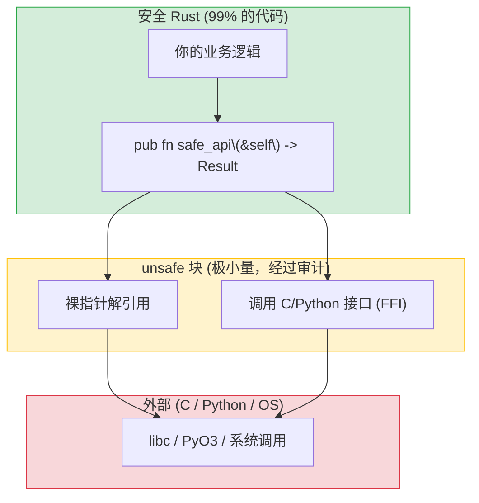

[English Original](../en/ch14-unsafe-rust-and-ffi.md)

## 何时以及为什么要使用 Unsafe

> **你将学到：** `unsafe` 允许做什么及其存在的原因、使用 PyO3 编写 Python 扩展（Python 开发者的杀手级特性）、Rust 的测试框架与 pytest 的对比、使用 mockall 进行 Mock，以及基准测试。
>
> **难度：** 🔴 高级

Rust 中的 `unsafe` 是一个逃生口 —— 它告诉编译器：“我正在做一些你无法验证的事情，但我保证它是正确的。” Python 中没有对应的概念，因为 Python 从不向你直接开放物理内存的访问权。



> **设计模式**：使用安全的 API 包裹一个极小的 `unsafe` 块。调用方永远看不到 `unsafe`。而 Python 的 `ctypes` 则没有这种边界 —— 每一个 FFI 调用都是隐式不安全的。
>
> 📌 **延伸阅读**：[第 13 章：并发](ch13-concurrency.md) 介绍了 `Send`/`Sync` Trait，它们是编译器用于检查线程安全性的 `unsafe` 自动 Trait。

### unsafe 允许的操作
```rust
// unsafe 允许你做五个安全 Rust 禁止的操作：
// 1. 解引用裸指针
// 2. 调用不安全的函数或方法
// 3. 访问可变的静态变量
// 4. 实现不安全的 Trait
// 5. 访问 Union (联合体) 字段

// 示例：调用一个 C 函数
extern "C" {
    fn abs(input: i32) -> i32;
}

fn main() {
    // 安全说明：abs() 是一个定义明确的 C 标准库函数。
    let result = unsafe { abs(-42) };  // 安全 Rust 无法验证 C 代码
    println!("{result}");               // 42
}
```

### 何时使用 unsafe
```rust
// 1. FFI — 调用 C 语言库 (最常见的原因)
// 2. 对性能极其敏感的代码内循环 (罕见)
// 3. 借用检查器无法表达的数据结构 (罕见)

// 作为 Python 开发者，你主要会在以下场景遇到 unsafe：
// - PyO3 的内部机制 (Python ↔ Rust 桥接)
// - C 语言库的绑定
// - 底层系统调用

// 经验法则：如果你是在编写应用逻辑 (而非库代码)，
// 你几乎永远不需要使用 unsafe。如果你觉得自己需要，请先咨询
// Rust 社区 —— 通常都会有安全的替代方案。
```

---

## PyO3：用于 Python 的 Rust 扩展

PyO3 是 Python 和 Rust 之间的桥梁。它允许你编写可从 Python 调用的 Rust 函数和类 —— 非常适合替换慢速的 Python 热点代码。

### 使用 Rust 创建 Python 扩展
```bash
# 安装 maturin: 构建 Rust 编写的 Python 扩展的工具
pip install maturin
maturin init           # 初始化项目结构

# 项目结构如下：
# my_extension/
# ├── Cargo.toml
# ├── pyproject.toml
# └── src/
#     └── lib.rs
```

```toml
# Cargo.toml
[package]
name = "my_extension"
version = "0.1.0"
edition = "2021"

[lib]
crate-type = ["cdylib"]    # 用于 Python 的动态链接库

[dependencies]
pyo3 = { version = "0.22", features = ["extension-module"] }
```

```rust
// src/lib.rs — 可从 Python 调用的 Rust 函数
use pyo3::prelude::*;

#[pyfunction]
fn fibonacci(n: u64) -> u64 {
    let (mut a, mut b) = (0u64, 1u64);
    for _ in 0..n {
        let temp = b;
        b = a.wrapping_add(b);
        a = temp;
    }
    a
}

#[pyfunction]
fn primes_up_to(n: usize) -> Vec<usize> {
    let mut is_prime = vec![true; n + 1];
    is_prime[0] = false;
    if n > 0 { is_prime[1] = false; }
    for i in 2..=((n as f64).sqrt() as usize) {
        if is_prime[i] {
            for j in (i * i..=n).step_by(i) {
                is_prime[j] = false;
            }
        }
    }
    (2..=n).filter(|&i| is_prime[i]).collect()
}

#[pyclass]
struct Counter {
    value: i64,
}

#[pymethods]
impl Counter {
    #[new]
    fn new(start: i64) -> Self {
        Counter { value: start }
    }

    fn increment(&mut self) {
        self.value += 1;
    }

    fn get_value(&self) -> i64 {
        self.value
    }

    fn __repr__(&self) -> String {
        format!("Counter(value={})", self.value)
    }
}

#[pymodule]
fn my_extension(m: &Bound<'_, PyModule>) -> PyResult<()> {
    m.add_function(wrap_pyfunction!(fibonacci, m)?)?;
    m.add_function(wrap_pyfunction!(primes_up_to, m)?)?;
    m.add_class::<Counter>()?;
    Ok(())
}
```

### 在 Python 中使用
```bash
# 构建并安装
maturin develop --release   # 构建并将扩展安装到当前的虚拟环境中
```

```python
# Python — 像任何普通 Python 模块一样使用此扩展
import my_extension

# 调用 Rust 函数
result = my_extension.fibonacci(50)
print(result)  # 12586269025 — 以微秒级速度计算出的结果

# 使用 Rust 类
counter = my_extension.Counter(0)
counter.increment()
counter.increment()
print(counter.get_value())  # 2
print(counter)              # Counter(value=2)

# 性能对比：
import time

# Python 版本
def py_primes(n):
    sieve = [True] * (n + 1)
    for i in range(2, int(n**0.5) + 1):
        if sieve[i]:
            for j in range(i*i, n+1, i):
                sieve[j] = False
    return [i for i in range(2, n+1) if sieve[i]]

start = time.perf_counter()
py_result = py_primes(10_000_000)
py_time = time.perf_counter() - start

start = time.perf_counter()
rs_result = my_extension.primes_up_to(10_000_000)
rs_time = time.perf_counter() - start

print(f"Python: {py_time:.3f}s")    # 约 3.5s
print(f"Rust:   {rs_time:.3f}s")    # 约 0.05s — 提速 70 倍！
print(f"结果一致: {py_result == rs_result}")  # True
```

### PyO3 快速对照表

| Python 概念 | PyO3 属性标记 | 说明 |
|---------------|----------------|-------|
| 函数 | `#[pyfunction]` | 暴露给 Python 的函数 |
| 类 | `#[pyclass]` | 暴露给 Python 的类 |
| 方法 | `#[pymethods]` | 类对应的方法实现 |
| `__init__` | `#[new]` | 构造函数 |
| `__repr__` | `fn __repr__()` | 对象字符串表示 |
| `__str__` | `fn __str__()` | 显示字符串 |
| `__len__` | `fn __len__()` | 长度 |
| `__getitem__` | `fn __getitem__()` | 索引访问 |
| 属性 | `#[getter]` / `#[setter]` | 属性访问器 |
| 静态方法 | `#[staticmethod]` | 无 `self` 参数 |
| 类方法 | `#[classmethod]` | 接收 `cls` 参数 |

### FFI 安全规范

将 Rust 暴露给 Python (无论是通过 PyO3 还是裸 C FFI) 时，这些规则可防止大多数常见的 Bug：

1. **永远不要让恐慌 (Panic) 跨越 FFI 边界** — 如果 Rust 恐慌未能被捕获并解算 (Unwind) 到了 Python 或 C 代码中，将导致 **未定义行为**。PyO3 对 `#[pyfunction]` 自动处理了这一点，但对于裸 FFI 函数，需要手动进行显式保护。

2. **为共享结构体使用 `#[repr(C)]`** —— 如果 Python/C 需直接读取结构体字段，必须使用 `#[repr(C)]` 以保证内存布局与 C 兼容。如果是传递不透明指针 (PyO3 对 `#[pyclass]` 的做法)，则不需要。

3. **`extern "C"`** — 裸 FFI 函数必须标注此项，以确保调用约定符合 C/Python 的预期。

> **PyO3 的优势**：它为你包裹了绝大多数安全忧虑 —— 包括恐慌捕获、类型转换、以及对 GIL 锁的管理。除非有极特殊的理由，否则请优先选用 PyO3 而不是裸 FFI。

---

## 单元测试 vs pytest

### 使用 pytest 进行 Python 测试
```python
# test_calculator.py
import pytest
from calculator import add, divide

def test_add():
    assert add(2, 3) == 5

def test_add_negative():
    assert add(-1, 1) == 0

def test_divide():
    assert divide(10, 2) == 5.0

def test_divide_by_zero():
    with pytest.raises(ZeroDivisionError):
        divide(1, 0)

# 参数化测试
@pytest.mark.parametrize("a,b,expected", [
    (1, 2, 3),
    (0, 0, 0),
    (-1, -1, -2),
    (100, 200, 300),
])
def test_add_parametrized(a, b, expected):
    assert add(a, b) == expected

# Fixtures (固件)
@pytest.fixture
def sample_data():
    return [1, 2, 3, 4, 5]

def test_sum(sample_data):
    assert sum(sample_data) == 15
```

```bash
# 运行测试
pytest                      # 运行所有测试
pytest test_calculator.py   # 运行指定文件
pytest -k "test_add"        # 运行匹配名称的测试
pytest -v                   # 详细输出
```

### Rust 的内置测试机制
```rust
// src/calculator.rs — 测试代码可以直接写在同一个文件中！
fn add(a: i32, b: i32) -> i32 {
    a + b
}

fn divide(a: f64, b: f64) -> Result<f64, String> {
    if b == 0.0 {
        Err("不能除以零".to_string())
    } else {
        Ok(a / b)
    }
}

// 测试代码放在 #[cfg(test)] 模块中 — 仅在执行 `cargo test` 时编译
#[cfg(test)]
mod tests {
    use super::*;  // 导入父模块的所有内容

    #[test]
    fn test_add() {
        assert_eq!(add(2, 3), 5);
    }

    #[test]
    fn test_add_negative() {
        assert_eq!(add(-1, 1), 0);
    }

    #[test]
    fn test_divide() {
        assert_eq!(divide(10.0, 2.0), Ok(5.0));
    }

    #[test]
    fn test_divide_by_zero() {
        assert!(divide(1.0, 0.0).is_err());
    }

    // 测试是否发生了恐慌 (类似 pytest.raises)
    #[test]
    #[should_panic(expected = "out of bounds")]
    fn test_out_of_bounds() {
        let v = vec![1, 2, 3];
        let _ = v[99];  // 触发恐慌
    }
}
```

```bash
# 运行测试
cargo test                         # 运行所有测试
cargo test test_add                # 运行匹配名称的测试
cargo test -- --nocapture          # 显示 println! 的输出
cargo test -p my_crate             # 测试工作区中的特定 Crate
cargo test -- --test-threads=1     # 串行运行（适用于带有副作用的测试）
```

### 测试对照快速索引

| pytest | Rust | 说明 |
|--------|------|-------|
| `assert x == y` | `assert_eq!(x, y)` | 相等断言 |
| `assert x != y` | `assert_ne!(x, y)` | 不等断言 |
| `assert condition` | `assert!(condition)` | 布尔断言 |
| `assert condition, "msg"` | `assert!(condition, "msg")` | 带自定义消息 |
| `pytest.raises(E)` | `#[should_panic]` | 期望发生恐慌 |
| `@pytest.fixture` | 在测试或辅助函数中设置 | 无内置的 Fixture 机制 |
| `@pytest.mark.parametrize` | 需要使用 `rstest` 库 | 参数化测试 |
| `conftest.py` | `tests/common/mod.rs` | 共享测试辅助工具 |
| `pytest.skip()` | `#[ignore]` | 跳过测试 |
| `tmp_path` fixture | 需要使用 `tempfile` 库 | 临时目录处理 |

---

## 使用 rstest 进行参数化测试
```rust
// Cargo.toml: rstest = "0.23"

use rstest::rstest;

// 类似 @pytest.mark.parametrize
#[rstest]
#[case(1, 2, 3)]
#[case(0, 0, 0)]
#[case(-1, -1, -2)]
#[case(100, 200, 300)]
fn test_add(#[case] a: i32, #[case] b: i32, #[case] expected: i32) {
    assert_eq!(add(a, b), expected);
}

// 类似 @pytest.fixture
use rstest::fixture;

#[fixture]
fn sample_data() -> Vec<i32> {
    vec![1, 2, 3, 4, 5]
}

#[rstest]
fn test_sum(sample_data: Vec<i32>) {
    assert_eq!(sample_data.iter().sum::<i32>(), 15);
}
```

---

## 使用 mockall 进行 Mock
```python
# Python — 使用 unittest.mock 进行 Mock
from unittest.mock import Mock, patch

def test_fetch_user():
    mock_db = Mock()
    mock_db.get_user.return_value = {"name": "阿强"}

    result = fetch_user_name(mock_db, 1)
    assert result == "阿强"
    mock_db.get_user.assert_called_once_with(1)
```

```rust
// Rust — 使用 mockall 库进行 Mock
// Cargo.toml: mockall = "0.13"

use mockall::{automock, predicate::*};

#[automock]                          // 自动生成 MockDatabase
trait Database {
    fn get_user(&self, id: i64) -> Option<User>;
}

fn fetch_user_name(db: &dyn Database, id: i64) -> Option<String> {
    db.get_user(id).map(|u| u.name)
}

#[test]
fn test_fetch_user() {
    let mut mock = MockDatabase::new();
    mock.expect_get_user()
        .with(eq(1))                   // 类似 assert_called_with(1)
        .times(1)                      // 类似 assert_called_once
        .returning(|_| Some(User { name: "阿强".into() }));

    let result = fetch_user_name(&mock, 1);
    assert_eq!(result, Some("阿强".to_string()));
}
```

---

## 练习

<details>
<summary><strong>🏋️ 练习：围绕 Unsafe 编写安全包装层</strong>（点击展开）</summary>

**挑战**：编写一个安全的函数 `split_at_mid`，它接收一个 `&mut [i32]` 并返回两个在中心点切分的切片 `(&mut [i32], &mut [i32])`。在内部实现中，请使用裸指针和 `unsafe`（模拟 `split_at_mut` 的实现方式）。随后将其包装在安全的 API 中。

<details>
<summary>🔑 答案</summary>

```rust
fn split_at_mid(slice: &mut [i32]) -> (&mut [i32], &mut [i32]) {
    let mid = slice.len() / 2;
    let ptr = slice.as_mut_ptr();
    let len = slice.len();

    assert!(mid <= len); // 在进入 unsafe 之前进行安全检查

    // 安全说明：mid <= len (由上方断言保证)，且 ptr 源于一个有效的 &mut 切片，
    // 因此两个子切片都在边界内且互不重叠。
    unsafe {
        (
            std::slice::from_raw_parts_mut(ptr, mid),
            std::slice::from_raw_parts_mut(ptr.add(mid), len - mid),
        )
    }
}

fn main() {
    let mut data = vec![1, 2, 3, 4, 5, 6];
    let (left, right) = split_at_mid(&mut data);
    left[0] = 99;
    right[0] = 88;
    println!("左侧: {left:?}, 右侧: {right:?}");
    // 输出: 左侧: [99, 2, 3], 右侧: [88, 5, 6]
}
```

**核心要点**: `unsafe` 块非常小，且受到了 `assert!` 的严密保护。暴露出的 API 是完全安全的 —— 调用方永远看不到 `unsafe`。这就是 Rust 的典型模式：内部使用不安全实现以换取性能或表达力，外部提供安全接口。Python 的 `ctypes` 则无法以此种方式提供安全保证。

</details>
</details>

---
