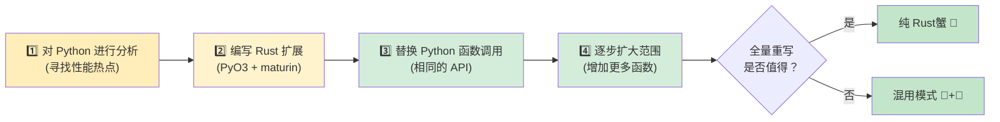

[English Original](../en/ch15-migration-patterns.md)

## Rust 中的常用 Python 模式

> **你将学到：** 如何将 dict 转换为 struct、将 class 转换为 struct+impl、将列表推导式转换为迭代器链、将装饰器转换为 Trait，以及将上下文管理器转换为 Drop/RAII。此外还将介绍核心 Crate 以及渐进式迁移策略。
>
> **难度：** 🟡 中级

### 字典 (Dictionary) → 结构体 (Struct)
```python
# Python — 使用 dict 作为数据容器 (非常常见)
user = {
    "name": "阿强",
    "age": 30,
    "email": "qiang@example.com",
    "active": True,
}
print(user["name"])
```

```rust
// Rust — 带有命名字段的结构体
#[derive(Debug, Clone, serde::Serialize, serde::Deserialize)]
struct User {
    name: String,
    age: i32,
    email: String,
    active: bool,
}

let user = User {
    name: "阿强".into(),
    age: 30,
    email: "qiang@example.com".into(),
    active: true,
};
println!("{}", user.name);
```

### 上下文管理器 → RAII (Drop)
```python
# Python — 使用上下文管理器进行资源清理
class FileManager:
    def __init__(self, path):
        self.file = open(path, 'w')

    def __enter__(self):
        return self.file

    def __exit__(self, *args):
        self.file.close()

with FileManager("output.txt") as f:
    f.write("hello")
# 退出 `with` 块时文件会自动关闭
```

```rust
// Rust — RAII：当值离开作用域时调用 Drop Trait 执行清理
use std::fs::File;
use std::io::Write;

fn write_file() -> std::io::Result<()> {
    let mut file = File::create("output.txt")?;
    file.write_all(b"hello")?;
    Ok(())
    // 当 `file` 离开作用域时文件会自动关闭
    // 不需要专门的 `with` 语句 — RAII 机制会处理好它！
}
```

### 装饰器 → 高阶函数或宏
```python
# Python — 用于计时的装饰器
import functools, time

def timed(func):
    @functools.wraps(func)
    def wrapper(*args, **kwargs):
        start = time.perf_counter()
        result = func(*args, **kwargs)
        elapsed = time.perf_counter() - start
        print(f"{func.__name__} 耗时 {elapsed:.4f}s")
        return result
    return wrapper

@timed
def slow_function():
    time.sleep(1)
```

```rust
// Rust — 不存在装饰器，需使用包装函数或宏来实现
use std::time::Instant;

fn timed<F, R>(name: &str, f: F) -> R
where
    F: FnOnce() -> R,
{
    let start = Instant::now();
    let result = f();
    println!("{} 耗时 {:.4?}", name, start.elapsed());
    result
}

// 使用方式：
let result = timed("slow_function", || {
    std::thread::sleep(std::time::Duration::from_secs(1));
    42
});
```

### 迭代器流水线 (数据处理)
```python
# Python — 一连串的转换操作
import csv
from collections import Counter

def analyze_sales(filename):
    with open(filename) as f:
        reader = csv.DictReader(f)
        sales = [
            row for row in reader
            if float(row["amount"]) > 100
        ]
    by_region = Counter(sale["region"] for sale in sales)
    top_regions = by_region.most_common(5)
    return top_regions
```

```rust
// Rust — 带有强类型的迭代器链
use std::collections::HashMap;

#[derive(Debug, serde::Deserialize)]
struct Sale {
    region: String,
    amount: f64,
}

fn analyze_sales(filename: &str) -> Vec<(String, usize)> {
    let data = std::fs::read_to_string(filename).unwrap();
    let mut reader = csv::Reader::from_reader(data.as_bytes());

    let mut by_region: HashMap<String, usize> = HashMap::new();
    for sale in reader.deserialize::<Sale>().flatten() {
        if sale.amount > 100.0 {
            *by_region.entry(sale.region).or_insert(0) += 1;
        }
    }

    let mut top: Vec<_> = by_region.into_iter().collect();
    top.sort_by(|a, b| b.1.cmp(&a.1));
    top.truncate(5);
    top
}
```

### 全局配置 / 单例模式 (Singleton)
```python
# Python — 模块级单例 (常用模式)
# config.py
import json

class Config:
    _instance = None

    def __new__(cls):
        if cls._instance is None:
            cls._instance = super().__new__(cls)
            with open("config.json") as f:
                cls._instance.data = json.load(f)
        return cls._instance

config = Config()  # 模块级单例
```

```rust
// Rust — 使用 OnceLock 实现惰性静态初始化 (Rust 1.70+)
use std::sync::OnceLock;
use serde_json::Value;

static CONFIG: OnceLock<Value> = OnceLock::new();

fn get_config() -> &'static Value {
    CONFIG.get_or_init(|| {
        let data = std::fs::read_to_string("config.json")
            .expect("读取配置失败");
        serde_json::from_str(&data)
            .expect("解析配置失败")
    })
}

// 可以在任何地方使用：
let db_host = get_config()["database"]["host"].as_str().unwrap();
```

---

## Python 开发者的 Rust 核心库 (Crates) 建议

### 数据处理与序列化

| 任务 | Python | Rust Crate | 说明 |
|------|--------|-----------|-------|
| JSON | `json` | `serde_json` | 类型安全的序列化 |
| CSV | `csv`, `pandas` | `csv` | 流式处理，极低内存 |
| YAML | `pyyaml` | `serde_yaml` | 用于配置文件 |
| TOML | `tomllib` | `toml` | 常用配置格式 |
| 数据验证 | `pydantic` | `serde` + 自定义 | 编译期验证 |
| 日期/时间 | `datetime` | `chrono` | 完善的时区支持 |
| 正则表达式 | `re` | `regex` | 极其快速 |
| UUID | `uuid` | `uuid` | 功能相同 |

### Web 与网络

| 任务 | Python | Rust Crate | 说明 |
|------|--------|-----------|-------|
| HTTP 客户端 | `requests` | `reqwest` | 异步优先 |
| Web 框架 | `FastAPI`/`Flask` | `axum` / `actix-web` | 性能极强 |
| WebSocket | `websockets` | `tokio-tungstenite` | 异步支持 |
| gRPC | `grpcio` | `tonic` | 完整支持 |
| 数据库 (SQL) | `sqlalchemy` | `sqlx` / `diesel` | 编译期检查的 SQL |
| Redis | `redis-py` | `redis` | 支持异步 |

### CLI 与系统工具

| 任务 | Python | Rust Crate | 说明 |
|------|--------|-----------|-------|
| CLI 参数解析 | `argparse`/`click` | `clap` | 使用 derive 宏实现 |
| 终端彩色输出 | `colorama` | `colored` | 功能雷同 |
| 进度条 | `tqdm` | `indicatif` | 体验一致 |
| 文件系统监控 | `watchdog` | `notify` | 跨平台支持 |
| 日志记录 | `logging` | `tracing` | 结构化日志，异步友好 |
| 环境变量 | `os.environ` | `std::env` + `dotenvy` | 支持 .env 文件 |
| 子进程 | `subprocess` | `std::process::Command` | 标准库内置 |
| 临时文件 | `tempfile` | `tempfile` | 名字完全一样！ |

### 测试框架

| 任务 | Python | Rust Crate | 说明 |
|--------|------|-----------|-------|
| 测试框架 | `pytest` | 内置测试 + `rstest` | 执行 `cargo test` |
| 模拟对象 (Mock) | `unittest.mock` | `mockall` | 基于 Trait 实现 |
| 属性测试 | `hypothesis` | `proptest` | 接口风格相似 |
| 快照测试 | `syrupy` | `insta` | 快照工作流 |
| 基准测试 | `pytest-benchmark` | `criterion` | 统计级误差分析 |
| 代码覆盖率 | `coverage.py` | `cargo-tarpaulin` | 基于 LLVM |

---

## 渐进式落地策略



> 📌 **延伸阅读**：[第 14 章：Unsafe Rust 与 FFI](ch14-unsafe-rust-and-ffi.md) 详细介绍了 PyO3 绑定底层所需的 FFI 细节。

### 步骤 1：识别性能热点

```python
# 首先对你的 Python 代码进行性能分析 (Profiling)
import cProfile
cProfile.run('main()')  # 寻找耗时较长的 CPU 密集型函数

# 或者使用 py-spy 进行采样分析：
# py-spy top --pid <python-pid>
# py-spy record -o profile.svg -- python main.py
```

### 步骤 2：为性能热点编写 Rust 扩展

```bash
# 使用 maturin 创建 Rust 扩展项目
cd my_python_project
maturin init --bindings pyo3

# 在 Rust 中重写热点函数 (详见前文 PyO3 部分)
# 构建并安装：
maturin develop --release
```

### 步骤 3：用 Rust 调用替换 Python 调用

```python
# 修改前：
result = python_hot_function(data)  # 慢

# 修改后：
import my_rust_extension
result = my_rust_extension.hot_function(data)  # 快！

# 使用同样的接口、同样的测试，却能获得 10-100 倍的提速
```

### 步骤 4：逐步扩大重写比例

```text
第 1-2 周：将一个 CPU 密集型函数替换为 Rust
第 3-4 周：替换数据解析/校验层
第 2 个月：替换核心数据流水线逻辑
第 3 个月以上：如果收益足够大，考虑用全量 Rust 重写整个项目

核心原则：保留 Python 进行编排，利用 Rust 进行计算。
```

---

## 💼 案例研究：使用 PyO3 加速数据流水线

某金融科技初创公司有一条 Python 数据流水线，每天需要处理 2GB 的交易记录 CSV 文件。其关键瓶颈在于校验和转换步骤：

```python
# Python — 慢速部分 (处理 2GB 数据约需 12 分钟)
import csv
from decimal import Decimal
from datetime import datetime

def validate_and_transform(filepath: str) -> list[dict]:
    results = []
    with open(filepath) as f:
        reader = csv.DictReader(f)
        for row in reader:
            # 解析并校验每一个字段
            amount = Decimal(row["amount"])
            if amount < 0:
                raise ValueError(f"金额为负数: {amount}")
            date = datetime.strptime(row["date"], "%Y-%m-%d")
            category = categorize(row["merchant"])  # 字符串匹配，约 50 条规则

            results.append({
                "amount_cents": int(amount * 100),
                "date": date.isoformat(),
                "category": category,
                "merchant": row["merchant"].strip().lower(),
            })
    return results
# 1500 万行数据需约 12 分钟。尝试过 pandas — 提速到 8 分钟但需 6GB 内存。
```

**步骤 1**：通过性能分析确定热点 (CSV 解析 + Decimal 转换 + 字符串匹配占用了 95% 的时间)。

**步骤 2**：编写 Rust 扩展：

```rust
// src/lib.rs — PyO3 扩展
use pyo3::prelude::*;
use std::fs::File;
use std::io::BufReader;

#[derive(Debug)]
struct Transaction {
    amount_cents: i64,
    date: String,
    category: String,
    merchant: String,
}

fn categorize(merchant: &str) -> &'static str {
    // 使用 Aho-Corasick 或简单规则 — 编译一次，极速运行
    if merchant.contains("amazon") { "购物" }
    else if merchant.contains("uber") || merchant.contains("lyft") { "交通" }
    else if merchant.contains("starbucks") { "餐饮" }
    else { "其他" }
}

#[pyfunction]
fn process_transactions(path: &str) -> PyResult<Vec<(i64, String, String, String)>> {
    let file = File::open(path).map_err(|e| pyo3::exceptions::PyIOError::new_err(e.to_string()))?;
    let mut reader = csv::Reader::from_reader(BufReader::new(file));

    let mut results = Vec::with_capacity(15_000_000); // 预分配内存

    for record in reader.records() {
        let record = record.map_err(|e| pyo3::exceptions::PyValueError::new_err(e.to_string()))?;
        let amount_str = &record[0];
        let amount_cents = parse_amount_cents(amount_str)?;  // 自定义解析器 (无需 Decimal)
        let date = &record[1];  // 已经是 ISO 格式，只需校验
        let merchant = record[2].trim().to_lowercase();
        let category = categorize(&merchant).to_string();

        results.push((amount_cents, date.to_string(), category, merchant));
    }
    Ok(results)
}
```

**步骤 3**：在 Python 中替换调用行：

```python
# 修改前：
results = validate_and_transform("transactions.csv")  # 12 分钟

# 修改后：
import fast_pipeline
results = fast_pipeline.process_transactions("transactions.csv")  # 45 秒

# 同样的 Python 编排，同样的测试，同样的部署流程
```

**结果对比**：
| 指标 | Python (csv + Decimal) | Rust (PyO3 + csv crate) |
|--------|----------------------|------------------------|
| 时间 (2GB / 1500 万行) | 12 分钟 | 45 秒 |
| 内存峰值 | 6GB (pandas) / 2GB (csv) | 200MB |
| Python 代码改动量 | — | 1 行 (import + 调用) |
| 编写的 Rust 代码量 | — | 约 60 行 |
| 测试通过率 | 47/47 | 47/47 (无变化) |

> **核心教训**：你不需要重写整个应用。找到那 5% 占据了 95% 运行时间的“瓶颈代码”，用 Rust 加 PyO3 重新实现它，而其余部分继续留在 Python 中。该团队从“我们需要增加服务器”转变为“一台服务器就足够了”。

---

## 练习

<details>
<summary><strong>🏋️ 练习：迁移决策矩阵</strong>（点击展开）</summary>

**挑战**：你有一个包含以下组件的 Python Web 应用。对于每一个组件，请决定是：**保留在 Python 中**、**用 Rust 重写**，还是使用 **PyO3 桥接**。并说明理由。

1. Flask 路由处理器 (请求解析，JSON 响应)
2. 图像缩略图生成 (CPU 密集型，每天处理 1 万张图)
3. 数据库 ORM 查询 (SQLAlchemy)
4. 处理 2GB 财务文件的 CSV 解析器 (每晚运行一次)
5. 管理后台面板 (Jinja2 模板)

<details>
<summary>🔑 答案</summary>

| 组件 | 决策 | 理由 |
|---|---|---|
| Flask 路由处理器 | 🐍 保留在 Python | I/O 密集型，重度依赖框架，改用 Rust 收益极低 |
| 图像缩略图生成 | 🦀 PyO3 桥接 | CPU 密集型热点路径，保留 Python API，内部用 Rust 实现 |
| 数据库 ORM 查询 | 🐍 保留在 Python | SQLAlchemy 已经很成熟，且查询属于 I/O 密集型 |
| CSV 解析器 (2GB) | 🦀 PyO3 或全量 Rust | CPU 与内存双重瓶颈，Rust 的零拷贝解析极具优势 |
| 管理后台面板 | 🐍 保留在 Python | 属于 UI/模板类代码，对性能没有特殊要求 |

**核心要点**: 迁移的最佳切入点是那些有着清晰边界、且对性能极其敏感的 CPU 密集型代码。不要去重写那些“胶水代码”或 I/O 密集型处理器 —— 它们的性能提升往往无法抵消重写的成本。

</details>
</details>

---
