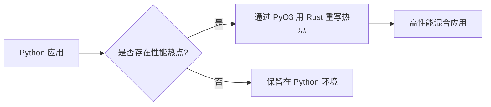

# 15. 迁移模式与最佳实践 🟡

> **你将学到：**
> - 如何将 Python 的常用设计模式映射到 Rust
> - 字典 (Dict) → 结构体 (Structs)
> - 上下文管理器 (Context Manager) → 变量落域 (Drop)
> - 给 Python 开发者的常用 Crate 清单
> - 循序渐进的迁移策略

## 映射常用模式

### 1. 字典 (Dict) → 结构体 (Structs)
在 Python 中，我们经常把 `dict` 当作通用数据容器。而在 Rust 中，你应该尽量使用具有明确类型的 `struct`。

```python
# Python
user = {"name": "张三", "age": 30}
```

```rust
// Rust
struct User {
    name: String,
    age: u32,
}
```

### 2. 上下文管理器 → 确定性析构 (Drop)
Python 的 `with` 语句用于确保资源清理。在 Rust 中， cleanup 发生在变量离开作用域时（通过 `Drop` 特征），而且这一切都是系统自动触发的，无需显式写 `with`。

```python
# Python
with open("file.txt") as f:
    data = f.read()
# 文件在此处自动关闭
```

```rust
// Rust
{
    let mut file = File::open("file.txt")?;
    // 读取文件内容...
} // 文件在该作用域结束处自动关闭！
```

### 3. 装饰器 (Decorators) → 高阶函数或宏
Rust 没有像 Python 那样简洁的 `@` 装饰器语法。你通常可以通过定义高阶函数（接收函数作为参数的项目）或过程宏来实现相同的包裹逻辑。

```rust
fn logged<F, R>(f: F) -> R 
where F: FnOnce() -> R 
{
    println!("逻辑开始运行...");
    let result = f();
    println!("逻辑运行结束。");
    result
}
```

---

## 常用 Crate 对应表

| Python 库 | Rust 对应项目 |
|----------------|-----------------|
| `json` | `serde_json` |
| `requests` | `reqwest` |
| `pandas` / `csv` | `polars` / `csv` |
| `pytest` | 内建测试 + `rstest` |
| `pydantic` | `serde` |
| `fastapi` | `axum` |

---

## 循序渐进的迁移策略

你不需要在一夜之间重写整个项目。向 Rust 迁移的最佳路径是**渐进式采用**：

1. **性能分析 (Profile)**：使用 `cProfile` 或 `py-spy` 找出 Python 代码中最拖后腿的那个函数。
2. **PyO3 重写**：只用 Rust 重写那个最慢的函数。
3. **建立连接**：利用 `maturin` 工具在 Python 中直接注入该 Rust 函数。
4. **循环往复**：随着业务需求，逐步把核心逻辑下沉到 Rust 中。



---

## 练习

<details>
<summary><strong>🏋️ 练习：从动态类型转向强类型</strong> (点击展开)</summary>

**挑战**：在 Python 中，你可能会用 `isinstance(x, (int, float))` 来同时兼容多种输入类型。在 Rust 中，如何实现这种“多种类型选其一”的模式？

<details>
<summary>参考答案</summary>

使用 **枚举 (Enum)**。Rust 的枚举是表示“一个值属于若干种不同分类之一”的最佳手段。你可以利用 `match` 模式匹配来安全、彻底地处理每一种可能的情况。

</details>
</details>

***
