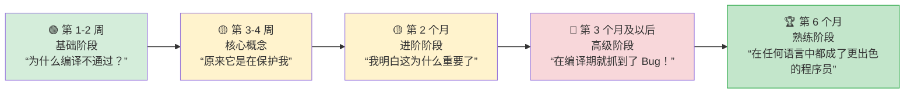

[English Original](../en/ch16-best-practices.md)

## 面向 Python 开发者的地道 Rust 指南

> **你将学到：** 应当培养的前 10 个习惯、常见误区及其修复方案、结构化的 3 个月学习路径、完整的 Python→Rust “罗塞塔石碑”对照表，以及推荐的学习资源。
>
> **难度：** 🟡 中级



### 应当培养的前 10 个习惯

1. **对 Enum 使用 `match` 而非 `if isinstance()`**
   ```python
   # Python                              # Rust
   if isinstance(shape, Circle): ...     match shape { Shape::Circle(r) => ... }
   ```

2. **听从编译器的引导** — 仔细阅读错误信息。Rust 的编译器是所有语言中最出色的，它不仅会告诉你哪里错了，还会告诉你如何修复。

3. **在函数参数中优先使用 `&str` 而非 `String`** — 接受最通用的类型。`&str` 既能接收 `String` 也能接收字符串字面量。

4. **使用迭代器而非索引循环** — 迭代器链更符合 Rust 惯用法，且通常比 `for i in 0..vec.len()` 更快。

5. **拥抱 `Option` 和 `Result`** — 不要对所有东西都用 `.unwrap()`。学会使用 `?`、`map`、`and_then` 以及 `unwrap_or_else`。

6. **大胆派生 (Derive) Trait** — 大多数结构体都应当标上 `#[derive(Debug, Clone, PartialEq)]`。这是免费的，且能极大地方便测试。

7. **坚持使用 `cargo clippy`** — 它能发现数百种风格和正确性问题。将其视为 Rust 版的 `ruff`。

8. **不要与借用检查器对着干** — 如果你发现自己在苦苦挣扎，那很可能是数据结构设计得不合理。通过重构使所有权关系变得清晰。

9. **使用 Enum 实现状态机** — 相比于字符串标记位或布尔值，Enum 更佳。编译器会确保你处理了每一种状态。

10. **先 Clone，后优化** — 在学习阶段，可以大方地使用 `.clone()` 来规避复杂的所有权问题。只有当性能分析显示有必要时再进行优化。

### Python 开发者的常见错误

| 错误 | 原因 | 修复方案 |
|---------|-----|-----|
| 到处使用 `.unwrap()` | 导致运行时崩溃 (Panic) | 改用 `?` 或 `match` |
| 参数使用 String 而不使用 &str | 造成不必要的内存分配 | 参数改用 `&str` |
| `for i in 0..vec.len()` | 不符合 Rust 习惯 | 使用 `for item in &vec` |
| 忽略 clippy 警告 | 错失改进机会 | 执行 `cargo clippy` |
| 过多调用 `.clone()` | 带来性能开销 | 重构所有权逻辑 |
| 过于庞大的 main() 函数 | 难以进行测试 | 提取到 `lib.rs` 中 |
| 不使用 `#[derive()]` | 在重复造轮子 | 派生常用的 Trait |
| 出错时直接触发恐慌 | 错误不可恢复 | 返回 `Result<T, E>` |

---

## 性能对比

### 基准测试：常用操作对比
```text
操作项目              Python 3.12    Rust (release)    提速倍数
─────────────────────  ────────────   ──────────────    ─────────
Fibonacci(40)          约 25s         约 0.3s           约 80x
排序 1000 万个整数      约 5.2s        约 0.6s           约 9x
解析 100MB JSON        约 8.5s        约 0.4s           约 21x
100 万次正则匹配       约 3.1s        约 0.3s           约 10x
HTTP 服务器 (req/s)    约 5,000       约 150,000        约 30x
1GB 文件 SHA-256 计算   约 12s         约 1.2s           约 10x
解析 100 万行 CSV      约 4.5s        约 0.2s           约 22x
字符串拼接             约 2.1s        约 0.05s          约 42x
```

> **注意**：使用 C 语言编写的扩展库 (如 NumPy 等) 会极大地缩小 Python 处理数值运算的差距。上述测试是纯 Python 与纯 Rust 之间的对比。

### 内存占用对比
```text
Python:                                 Rust:
─────────                               ─────
- 对象头: 每个对象 28 字节              - 无对象头
- int: 28 字节 (即使是 0)               - i32: 4 字节, i64: 8 字节
- str "hello": 54 字节                  - &str "hello": 16 字节 (指针 + 长度)
- 1000 个整数的列表: 约 36 KB           - Vec<i32>: 约 4 KB
  (8 KB 指针 + 28 KB 整数对象)
- 100 个项的 dict: 约 5.5 KB            - 100 个项的 HashMap: 约 2.4 KB

典型应用的基线内存占用:
- Python: 50-200 MB 基线                - Rust: 1-5 MB 基线
```

---

## 常见的陷阱与解决方案

### 陷阱 1：“借用检查器不让我这么做”
```rust
// 问题：试图在迭代时进行修改
let mut items = vec![1, 2, 3, 4, 5];
// for item in &items {
//     if *item > 3 { items.push(*item * 2); }  // ❌ 禁止在借用期间进行可变借用
// }

// 方案 1：先收集修改项，结束后统一应用
let additions: Vec<i32> = items.iter()
    .filter(|&&x| x > 3)
    .map(|&x| x * 2)
    .collect();
items.extend(additions);

// 方案 2：利用 retain 或 extend
items.retain(|&x| x <= 3);
```

### 陷阱 2：“字符串类型太多了”
```rust
// 犹豫不决时的经验法则：
// - 在函数参数中使用 &str
// - 在结构体字段和返回值中使用 String
// - 字符串字面量 ("hello") 在任何需要 &str 的地方都能正常工作

fn process(input: &str) -> String {    // 接收 &str，返回 String
    format!("已处理: {}", input)
}
```

### 陷阱 3：“我想念 Python 的简洁性”
```rust
// Python 单行代码：
// result = [x**2 for x in data if x > 0]

// Rust 等效代码：
let result: Vec<i32> = data.iter()
    .filter(|&&x| x > 0)
    .map(|&x| x * x)
    .collect();

// 它虽然更显臃肿，但是：
// - 在编译期就实现了类型安全
// - 速度提快了 10 到 100 倍
// - 不可能出现运行时类型错误
// - 对内存分配有着显式的表达 (.collect())
```

### 陷阱 4：“我的交互式解释器 (REPL) 在哪？”
```rust
// Rust 没有 REPL。可以改用以下工具：
// 1. 将 `cargo test` 当作 REPL — 编写微型测试来尝试功能
// 2. 使用 Rust 演练场 (play.rust-lang.org) 进行快速原型验证
// 3. 利用 `dbg!()` 宏快速打印调试输出
// 4. 使用 `cargo watch -x test` 实现保存后的自动测试

#[test]
fn playground() {
    // 将其视为你的“REPL” — 通过 `cargo test playground` 运行
    let result = "hello world"
        .split_whitespace()
        .map(|w| w.to_uppercase())
        .collect::<Vec<_>>();
    dbg!(&result);  // 输出: [src/main.rs:5] &result = ["HELLO", "WORLD"]
}
```

---

## 学习路径与资源建议

### 第 1-2 周：夯实基础
- [ ] 安装 Rust，配置带有 rust-analyzer 插件的 VS Code
- [ ] 完成本指南的前 4 章 (类型、控制流)
- [ ] 编写 5 个小程序，尝试将 Python 脚本转换为 Rust
- [ ] 熟悉 `cargo build`、`cargo test` 和 `cargo clippy` 的使用

### 第 3-4 周：核心概念
- [ ] 完成第 5-8 章 (结构体、枚举、所有权、模块)
- [ ] 用 Rust 重写一个 Python 数据处理脚本
- [ ] 练习使用 `Option<T>` 和 `Result<T, E>`，直至形成本能
- [ ] 仔细阅读编译器报错信息 —— 它们就是最好的老师

### 第 2 个月：进阶阶段
- [ ] 完成第 9-12 章 (错误处理、Trait、迭代器)
- [ ] 利用 `clap` 和 `serde` 开发一个 CLI 工具
- [ ] 为 Python 项目的性能热点编写一个 PyO3 扩展
- [ ] 练习迭代器链，直到用起来像列表推导式一样顺手

### 第 3 个月：高级阶段
- [ ] 完成第 13-16 章 (并发、Unsafe、测试)
- [ ] 利用 `axum` 和 `tokio` 开发一个 Web 服务
- [ ] 尝试向开源 Rust 项目贡献代码
- [ ] 阅读《Programming Rust》(O'Reilly) 以深入理解底层原理

### 推荐资源
- **Rust 程序设计语言 (The Rust Book)**: https://doc.rust-lang.org/book/ (官方出品，必读经典)
- **通过例子学 Rust (Rust by Example)**: https://doc.rust-lang.org/rust-by-example/ (在实践中学习)
- **Rustlings**: https://github.com/rust-lang/rustlings (精选题库)
- **Rust 演练场 (Rust Playground)**: https://play.rust-lang.org/ (在线编译器)
- **Rust 周报 (This Week in Rust)**: https://this-week-in-rust.org/ (获取行业动态)
- **PyO3 指南**: https://pyo3.rs/ (Python ↔ Rust 桥接技术)
- **Google 全面 Rust 教程**: https://google.github.io/comprehensive-rust/

### Python → Rust 罗塞塔石碑 (对照表)

| Python 概念 | Rust 对等概念 | 对应章节 |
|--------|------|---------|
| `list` | `Vec<T>` | 5 |
| `dict` | `HashMap<K,V>` | 5 |
| `set` | `HashSet<T>` | 5 |
| `tuple` | `(T1, T2, ...)` | 5 |
| `class` | `struct` + `impl` | 5 |
| `@dataclass` | `#[derive(...)]` | 5, 12 |
| `Enum` | `enum` | 6 |
| `None` | `Option<T>` | 6 |
| `raise`/`try`/`except` | `Result<T,E>` + `?` | 9 |
| `Protocol` (PEP 544) | `trait` | 10 |
| `TypeVar` | 泛型 `<T>` | 10 |
| `__dunder__` 魔术方法 | Traits (Display, Add, 等) | 10 |
| `lambda` | `|args| body` | 12 |
| 生成器 `yield` | `impl Iterator` | 12 |
| 列表推导式 | `.map().filter().collect()` | 12 |
| `@decorator` 装饰器 | 高阶函数或宏 | 12, 15 |
| `asyncio` | `tokio` | 13 |
| `threading` | `std::thread` | 13 |
| `multiprocessing` | `rayon` | 13 |
| `unittest.mock` | `mockall` | 14 |
| `pytest` | `cargo test` + `rstest` | 14 |
| `pip install` | `cargo add` | 8 |
| `requirements.txt` | `Cargo.lock` | 8 |
| `pyproject.toml` | `Cargo.toml` | 8 |
| `with` (上下文管理器) | 作用域触发的 `Drop` | 15 |
| `json.dumps/loads` | `serde_json` | 15 |

---

## 给 Python 开发者的结语

```text
你会怀念 Python 的地方：
- REPL 和交互式探索体验
- 极快的原型开发速度
- 极其丰富的 ML/AI 生态 (如 PyTorch 等)
- “运行正常”的动态类型系统
- pip install 后的即刻可用性

你将从 Rust 中获得的东西：
- “只要能编译通过，就能正常运行”的终极自信
- 10 到 100 倍的性能提升
- 再也不会出现运行时类型错误
- 再也不会出现 None/null 导致的崩溃
- 真正的并行处理 (没有 GIL！)
- 单一二进制文件的便捷部署
- 可预测的内存占用
- 任何编程语言中最出色的编译器错误提示

心路历程：
第 1 周：  “为什么编译器这么讨厌我？”
第 2 周：  “噢，原来它是在保护我不出 Bug”
第 1 个月： “我明白这为什么重要了”
第 2 个月： “我在编译期抓到了一个本会导致线上事故的 Bug”
第 3 个月： “我再也不想写没有类型约束的代码了”
第 6 个月： “Rust 让我成了更出色的程序员，无论我在写哪种语言”
```

---

## 练习

<details>
<summary><strong>🏋️ 练习：代码审查清单</strong>（点击展开）</summary>

**挑战**：审查下面这段由 Python 开发者编写的 Rust 代码，并提出 5 项符合 Rust 惯用法的改进建议：

```rust
fn get_name(names: Vec<String>, index: i32) -> String {
    if index >= 0 && (index as usize) < names.len() {
        return names[index as usize].clone();
    } else {
        return String::from("");
    }
}

fn main() {
    let mut result = String::from("");
    let names = vec!["Alice".to_string(), "Bob".to_string()];
    result = get_name(names.clone(), 0);
    println!("{}", result);
}
```

<details>
<summary>🔑 答案</summary>

五项改进建议：

```rust
// 1. 使用 &[String] 而非 Vec<String> (不要获取整个 Vec 的所有权)
// 2. 使用 usize 处理索引 (索引永远不为负数)
// 3. 返回 Option<&str> 而非空字符串 (善用类型系统！)
// 4. 使用 .get() 代替手动边界检查
// 5. 在 main 中不要使用 clone() — 直接传递引用

fn get_name(names: &[String], index: usize) -> Option<&str> {
    names.get(index).map(|s| s.as_str())
}

fn main() {
    let names = vec!["Alice".to_string(), "Bob".to_string()];
    match get_name(&names, 0) {
        Some(name) => println!("{name}"),
        None => println!("未找到"),
    }
}
```

**核心要点**: 在 Rust 中会让你感到吃力的 Python 习惯：到处进行 clone（应改用借用）、使用 `""` 之类的哨兵值（应改用 `Option`）、在借用即可时却获取所有权，以及对索引使用有符号整数。

</details>
</details>

---

*Python 程序员 Rust 训练指南（完）*
