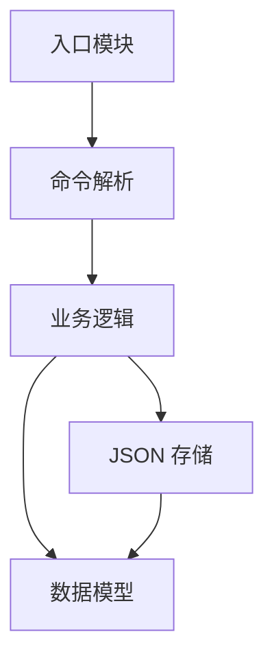

[English Original](../en/ch17-capstone-project.md)

# 17. 结业项目：构建一个 CLI 任务管理器 🔴

> **你将学到：**
> - 将本课程中学到的所有知识融会贯通
> - 构建一个完整的 Rust CLI 应用
> - 数据建模、持久化存储以及核心业务逻辑

## 结业项目：`rustdo`

在这个项目中，我们将构建一个名为 `rustdo` 的命令行任务管理工具。它将允许用户通过命令行添加、列出并完成任务，并将任务数据存储在本地的 JSON 文件中。

### 核心功能
1. **添加任务**：`rustdo add "完成 Rust 自学手册" high`
2. **列表展示**：`rustdo list`
3. **完成任务**：`rustdo done 1`
4. **统计信息**：`rustdo stats` (显示任务总数/待办数)

---

## 架构概览



### 1. 数据模型 (`task.rs`)
定义 `Task` 结构体和 `Priority` 枚举。利用 `serde` 完成 JSON 序列化。

### 2. 存储层 (`storage.rs`)
利用 `std::fs` 和 `serde_json` 实现对 `tasks.json` 文件的读写。

### 3. 业务逻辑 (`actions.rs`)
编写对任务列表进行操作的函数（如过滤待办事项、根据 ID 查找任务等）。

---

## 项目中运用的核心 Rust 概念

| 核心概念 | 在本项目中的应用场景 |
|---------|------------------|
| **结构体/枚举** | 定义 `Task` 模型和 `Priority` 优先级枚举。 |
| **泛型容器** | 使用 `Vec<Task>` 来存取所有任务。 |
| **错误处理** | 使用 `Result` 处理文件读写和解析过程中的异常。 |
| **特征 (Traits)** | 实现 `Display` 特征以便美观地打印任务信息。 |
| **迭代器** | 使用 `.filter()` 对任务列表进行条件过滤。 |

---

## 终极挑战：实现 "Rustdo" CLI

你的最终任务是编写 `main.rs` 来将上述组件串联起来。使用 `std::env::args()` 获取用户输入，并用 `match` 语句跳转到对应的逻辑端。

### 核心主程序参考逻辑：
```rust
fn main() {
    let args: Vec<String> = std::env::args().collect();
    // 1. 解析命令行参数
    // 2. 从本地 JSON 文件加载任务列表
    // 3. 匹配对应的指令 (add/list/done 等)
    // 4. 将更改后的数据写回 JSON
}
```

---

## 项目总结

祝贺你！通过完成这个结业项目，你已经成功地从底层的 **Python 脚本** 跨越到了 **经过编译、类型安全的 Rust 二进制程序**。你已经能够掌握内存安全、错误传播以及高效的数据处理。

**你现在已经具备了在 Rust 之路上一路狂飙的坚实基础！** 🚀🦀

***
