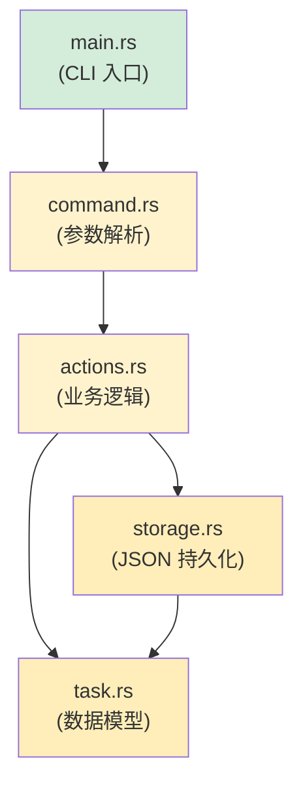

[English Original](../en/ch17-capstone-project.md)

## 结业项目：构建一个 CLI 任务管理器

> **你将学到：** 通过构建一个完整的 Rust CLI 应用程序，将课程中的所有知识点融会贯通。这是一个 Python 开发者通常会用 `argparse` + `json` + `pathlib` 编写的典型项目。
>
> **难度：** 🔴 高级

这个结业项目涵盖了之前每个主要章节的概念：
- **第 3 章**：类型与变量 (结构体、枚举)
- **第 5 章**：集合 (`Vec`, `HashMap`)
- **第 6 章**：枚举与模式匹配 (任务状态、命令)
- **第 7 章**：所有权与借用 (传递引用)
- **第 9 章**：错误处理 (`Result`, `?`, 自定义错误)
- **第 10 章**：Trait (`Display`, `FromStr`)
- **第 11 章**：类型转换 (`From`, `TryFrom`)
- **第 12 章**：迭代器与闭包 (过滤、映射)
- **第 8 章**：模块 (有条理的项目结构)

---

## 项目目标：`rustdo`

一个命令行任务管理器（类似于 Python 的 `todo.txt` 系列工具），它将任务存储在一个 JSON 文件中。

### Python 等效实现 (参考)

```python
#!/usr/bin/env python3
"""一个简单的 CLI 任务管理器 — Python 版本。"""
import json
import sys
from pathlib import Path
from datetime import datetime
from enum import Enum

TASK_FILE = Path.home() / ".rustdo.json"

class Priority(Enum):
    LOW = "low"
    MEDIUM = "medium"
    HIGH = "high"

class Task:
    def __init__(self, id: int, title: str, priority: Priority, done: bool = False):
        self.id = id
        self.title = title
        self.priority = priority
        self.done = done
        self.created = datetime.now().isoformat()

def load_tasks() -> list[Task]:
    if not TASK_FILE.exists():
        return []
    data = json.loads(TASK_FILE.read_text())
    return [Task(**t) for t in data]

def save_tasks(tasks: list[Task]):
    TASK_FILE.write_text(json.dumps([t.__dict__ for t in tasks], indent=2))

# 命令：add, list, done, remove, stats
# ... (你应该很熟悉 Python 的这部分写法)
```

### 你的 Rust 实现方案

我们将分步完成此项目。每一步都对应着相应章节的概念。

---

## 第一步：定义数据模型 (第 3, 6, 10, 11 章)

```rust
// src/task.rs
use std::fmt;
use std::str::FromStr;
use serde::{Deserialize, Serialize};
use chrono::Local;

/// 任务优先级 — 对应 Python 的 Priority(Enum)
#[derive(Debug, Clone, Copy, PartialEq, Eq, Serialize, Deserialize)]
#[serde(rename_all = "lowercase")]
pub enum Priority {
    Low,
    Medium,
    High,
}

// Display Trait (对应 Python 的 __str__)
impl fmt::Display for Priority {
    fn fmt(&self, f: &mut fmt::Formatter<'_>) -> fmt::Result {
        match self {
            Priority::Low => write!(f, "低"),
            Priority::Medium => write!(f, "中"),
            Priority::High => write!(f, "高"),
        }
    }
}

// FromStr Trait (用于解析 "high" → Priority::High)
impl FromStr for Priority {
    type Err = String;

    fn from_str(s: &str) -> Result<Self, Self::Err> {
        match s.to_lowercase().as_str() {
            "low" | "l" => Ok(Priority::Low),
            "medium" | "med" | "m" => Ok(Priority::Medium),
            "high" | "h" => Ok(Priority::High),
            other => Err(format!("未知优先级: '{other}' (请使用 low/medium/high)")),
        }
    }
}

/// 单个任务记录 — 对应 Python 的 Task 类
#[derive(Debug, Clone, Serialize, Deserialize)]
pub struct Task {
    pub id: u32,
    pub title: String,
    pub priority: Priority,
    pub done: bool,
    pub created: String,
}

impl Task {
    pub fn new(id: u32, title: String, priority: Priority) -> Self {
        Self {
            id,
            title,
            priority,
            done: false,
            created: Local::now().format("%Y-%m-%dT%H:%M:%S").to_string(),
        }
    }
}

impl fmt::Display for Task {
    fn fmt(&self, f: &mut fmt::Formatter<'_>) -> fmt::Result {
        let status = if self.done { "✅" } else { "⬜" };
        let priority_icon = match self.priority {
            Priority::Low => "🟢",
            Priority::Medium => "🟡",
            Priority::High => "🔴",
        };
        write!(f, "{} {} [{}] {} ({})", status, self.id, priority_icon, self.title, self.created)
    }
}
```

> **与 Python 的对比**：在 Python 中你会使用 `@dataclass` + `Enum`。而在 Rust 中，`struct` + `enum` 结合 `derive` 宏可以让你免费获得序列化、显示输出和解析能力。

---

## 第二步：存储层 (第 9, 7 章)

```rust
// src/storage.rs
use std::fs;
use std::path::PathBuf;
use crate::task::Task;

/// 获取任务文件路径 (~/.rustdo.json)
fn task_file_path() -> PathBuf {
    let home = dirs::home_dir().expect("无法确定主目录");
    home.join(".rustdo.json")
}

/// 从磁盘加载任务列表 — 如果文件不存在则返回空的 Vec
pub fn load_tasks() -> Result<Vec<Task>, Box<dyn std::error::Error>> {
    let path = task_file_path();
    if !path.exists() {
        return Ok(Vec::new());
    }
    let content = fs::read_to_string(&path)?;  // ? 用于传播 io::Error
    let tasks: Vec<Task> = serde_json::from_str(&content)?;  // ? 用于传播 serde 错误
    Ok(tasks)
}

/// 将任务列表存储到磁盘
pub fn save_tasks(tasks: &[Task]) -> Result<(), Box<dyn std::error::Error>> {
    let path = task_file_path();
    let json = serde_json::to_string_pretty(tasks)?;
    fs::write(&path, json)?;
    Ok(())
}
```

> **与 Python 的对比**：Python 使用 `Path.read_text()` + `json.loads()`。而 Rust 则利用 `fs::read_to_string()` + `serde_json::from_str()`。请观察 `?` 操作符 — 每一次错误处理都是显式声明并向上传播的。

---

## 第三步：命令枚举 (第 6 章)

```rust
// src/command.rs
use crate::task::Priority;

/// 所有可能的命令 — 每个动作对应一个枚举变体
pub enum Command {
    Add { title: String, priority: Priority },
    List { show_done: bool },
    Done { id: u32 },
    Remove { id: u32 },
    Stats,
    Help,
}

impl Command {
    /// 解析命令行参数
    /// (在实际生产中，你会使用 `clap` — 这里仅用于教学目的)
    pub fn parse(args: &[String]) -> Result<Self, String> {
        match args.first().map(|s| s.as_str()) {
            Some("add") => {
                let title = args.get(1)
                    .ok_or("用法: rustdo add <任务名称> [优先级]")?
                    .clone();
                let priority = args.get(2)
                    .map(|p| p.parse::<Priority>())
                    .transpose()
                    .map_err(|e| e.to_string())?
                    .unwrap_or(Priority::Medium);
                Ok(Command::Add { title, priority })
            }
            Some("list") => {
                let show_done = args.get(1).map(|s| s == "--all").unwrap_or(false);
                Ok(Command::List { show_done })
            }
            Some("done") => {
                let id: u32 = args.get(1)
                    .ok_or("用法: rustdo done <ID>")?
                    .parse()
                    .map_err(|_| "ID 必须是数字")?;
                Ok(Command::Done { id })
            }
            Some("remove") => {
                let id: u32 = args.get(1)
                    .ok_or("用法: rustdo remove <ID>")?
                    .parse()
                    .map_err(|_| "ID 必须是数字")?;
                Ok(Command::Remove { id })
            }
            Some("stats") => Ok(Command::Stats),
            _ => Ok(Command::Help),
        }
    }
}
```

> **与 Python 的对比**：Python 使用 `argparse` 或 `click`。这个手动编写的解析器展示了如何通过对 Enum 的模式匹配 (match) 来取代 Python 中的 if/elif 链。在真实项目中，应优先考虑使用 `clap` 这一 Crate。

---

## 第四步：业务逻辑 (第 5, 12, 7 章)

```rust
// src/actions.rs
use crate::task::{Task, Priority};
use crate::storage;

pub fn add_task(title: String, priority: Priority) -> Result<(), Box<dyn std::error::Error>> {
    let mut tasks = storage::load_tasks()?;
    let next_id = tasks.iter().map(|t| t.id).max().unwrap_or(0) + 1;
    let task = Task::new(next_id, title.clone(), priority);
    println!("已添加: {task}");
    tasks.push(task);
    storage::save_tasks(&tasks)?;
    Ok(())
}

pub fn list_tasks(show_done: bool) -> Result<(), Box<dyn std::error::Error>> {
    let tasks = storage::load_tasks()?;
    let filtered: Vec<&Task> = tasks.iter()
        .filter(|t| show_done || !t.done)   // 迭代器 + 闭包 (第 12 章)
        .collect();

    if filtered.is_empty() {
        println!("暂无任务！🎉");
        return Ok(());
    }

    for task in &filtered {
        println!("  {task}");   // 调用 Display Trait (第 10 章)
    }
    println!("\n当前显示了 {} 个任务", filtered.len());
    Ok(())
}

pub fn complete_task(id: u32) -> Result<(), Box<dyn std::error::Error>> {
    let mut tasks = storage::load_tasks()?;
    let task = tasks.iter_mut()
        .find(|t| t.id == id)                // Iterator::find (第 12 章)
        .ok_or(format!("未找到 ID 为 {id} 的任务"))?;
    task.done = true;
    println!("已完成: {task}");
    storage::save_tasks(&tasks)?;
    Ok(())
}

pub fn remove_task(id: u32) -> Result<(), Box<dyn std::error::Error>> {
    let mut tasks = storage::load_tasks()?;
    let len_before = tasks.len();
    tasks.retain(|t| t.id != id);            // Vec::retain (第 5 章)
    if tasks.len() == len_before {
        return Err(format!("未找到 ID 为 {id} 的任务").into());
    }
    println!("已删除任务 {id}");
    storage::save_tasks(&tasks)?;
    Ok(())
}

pub fn show_stats() -> Result<(), Box<dyn std::error::Error>> {
    let tasks = storage::load_tasks()?;
    let total = tasks.len();
    let done = tasks.iter().filter(|t| t.done).count();
    let pending = total - done;

    // 使用迭代器进行分组统计 (第 12 章)
    let high = tasks.iter().filter(|t| !t.done && t.priority == Priority::High).count();
    let medium = tasks.iter().filter(|t| !t.done && t.priority == Priority::Medium).count();
    let low = tasks.iter().filter(|t| !t.done && t.priority == Priority::Low).count();

    println!("📊 任务统计");
    println!("   总数:     {total}");
    println!("   已完成:   {done} ✅");
    println!("   待办中:   {pending}");
    println!("   🔴 高优先级: {high}");
    println!("   🟡 中优先级: {medium}");
    println!("   🟢 低优先级: {low}");
    Ok(())
}
```

> **使用的 Rust 核心模式**：`iter().map().max()`、`iter().filter().collect()`、`iter_mut().find()`、`retain()` 和 `iter().filter().count()`。这些方法取代了 Python 中的列表推导式、`next(x for x in ...)` 以及 `Counter`。

---

## 第五步：连点成线 (第 8 章)

```rust
// src/main.rs
mod task;
mod storage;
mod command;
mod actions;

use command::Command;

fn main() {
    let args: Vec<String> = std::env::args().skip(1).collect();
    let command = match Command::parse(&args) {
        Ok(cmd) => cmd,
        Err(e) => {
            eprintln!("错误: {e}");
            std::process::exit(1);
        }
    };

    let result = match command {
        Command::Add { title, priority } => actions::add_task(title, priority),
        Command::List { show_done } => actions::list_tasks(show_done),
        Command::Done { id } => actions::complete_task(id),
        Command::Remove { id } => actions::remove_task(id),
        Command::Stats => actions::show_stats(),
        Command::Help => {
            print_help();
            Ok(())
        }
    };

    if let Err(e) = result {
        eprintln!("错误: {e}");
        std::process::exit(1);
    }
}

fn print_help() {
    println!("rustdo — 专为在学 Rust 的 Python 开发者打造的任务管理器\n");
    println!("用法:");
    println!("  rustdo add <任务名称> [low|medium|high]   添加任务");
    println!("  rustdo list [--all]                     列出待办任务");
    println!("  rustdo done <ID>                        标记任务为已完成");
    println!("  rustdo remove <ID>                      删除任务");
    println!("  rustdo stats                            显示统计信息");
}
```



---

## 第六步：Cargo.toml 依赖配置

```toml
[package]
name = "rustdo"
version = "0.1.0"
edition = "2021"

[dependencies]
serde = { version = "1", features = ["derive"] }
serde_json = "1"
chrono = "0.4"
dirs = "5"
```

> **与 Python 的对比**：这相当于你 `pyproject.toml` 中的 `[project.dependencies]`。使用 `cargo add serde serde_json chrono dirs` 命令的作用就像 `pip install`。

---

## 第七步：编写测试 (第 14 章)

```rust
// src/task.rs — 将以下代码添加到文件末尾
#[cfg(test)]
mod tests {
    use super::*;

    #[test]
    fn parse_priority() {
        assert_eq!("high".parse::<Priority>().unwrap(), Priority::High);
        assert_eq!("H".parse::<Priority>().unwrap(), Priority::High);
        assert_eq!("med".parse::<Priority>().unwrap(), Priority::Medium);
        assert!("invalid".parse::<Priority>().is_err());
    }

    #[test]
    fn task_display() {
        let task = Task::new(1, "写 Rust".to_string(), Priority::High);
        let display = format!("{task}");
        assert!(display.contains("写 Rust"));
        assert!(display.contains("🔴"));
        assert!(display.contains("⬜")); // 此时尚未完成
    }

    #[test]
    fn task_serialization_roundtrip() {
        let task = Task::new(1, "测试".to_string(), Priority::Low);
        let json = serde_json::to_string(&task).unwrap();
        let recovered: Task = serde_json::from_str(&json).unwrap();
        assert_eq!(recovered.title, "测试");
        assert_eq!(recovered.priority, Priority::Low);
    }
}
```

> **与 Python 的对比**：这对应 Python 中的 `pytest` 测试。请使用 `cargo test` 来运行它们。Rust 不需要特殊的测试发现机制 — `#[test]` 显式地标记了测试函数。

---

## 进阶目标

当你完成上述基础版本后，可以尝试以下改进方案：

1. **引入 `clap` 进行参数解析** — 使用 `clap` 的派生宏替换手写的解析器：
   ```rust
   #[derive(Parser)]
   enum Command {
       Add { title: String, #[arg(default_value = "medium")] priority: Priority },
       List { #[arg(long)] all: bool },
       Done { id: u32 },
       Remove { id: u32 },
       Stats,
   }
   ```

2. **添加彩色输出** — 使用 `colored` 库（类似于 Python 的 `colorama`）为终端输出添加颜色。

3. **增加截止日期** — 添加一个 `Option<NaiveDate>` 字段，并过滤出过期的任务。

4. **增加标签/分类** — 使用 `Vec<String>` 存储标签，并利用 `.iter().any()` 进行过滤。

5. **将其拆分为库 + 二进制文件** — 采用 `lib.rs` + `main.rs` 的结构（第 8 章模块模式），使业务逻辑可重用。

---

## 知识点复盘

| 章节 | 核心概念 | 在本项目中的应用场景 |
|---------|---------|-------------------|
| 第 3 章 | 类型与变量 | `Task` 结构体字段、`u32`、`String`、`bool` |
| 第 5 章 | 集合 | `Vec<Task>`、`retain()`、`push()` |
| 第 6 章 | 枚举与模式匹配 | `Priority`、`Command` 及其详尽匹配 |
| 第 7 章 | 所有权与借用 | `&[Task]` 与 `Vec<Task>` 的对比、完成任务时的 `&mut` |
| 第 8 章 | 模块化 | `mod task; mod storage; mod command; mod actions;` |
| 第 9 章 | 错误处理 | `Result<T, E>`、`?` 操作符、`.ok_or()` |
| 第 10 章 | Trait | `Display`、`FromStr`、`Serialize`、`Deserialize` |
| 第 11 章 | From/Into | Priority 的 `FromStr` 实现、利用 `.into()` 进行错误转换 |
| 第 12 章 | 迭代器 | `filter`、`map`、`find`、`count`、`collect` |
| 第 14 章 | 测试 | `#[test]`、`#[cfg(test)]`、断言宏 |

> 🎓 **恭喜你！** 如果你已经亲手构建了本项目，那么你已经掌握并运用了本书涵盖的每一个 Rust 核心概念。你不再是一个在学 Rust 的 Python 开发者，而是一个同时精通 Python 的 Rust 开发者了。

---
