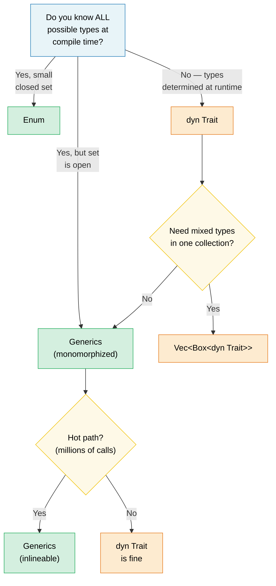

# 1. Generics — The Full Picture / 泛型全景图 🟢

> **What you'll learn / 你将学到：**
> - How monomorphization gives zero-cost generics — and when it causes code bloat / 单态化如何实现零成本泛型 —— 以及何时会引发代码膨胀
> - The decision framework: generics vs enums vs trait objects / 决策框架：泛型 vs 枚举 vs trait 对象
> - Const generics for compile-time array sizes and `const fn` for compile-time evaluation / 用于编译期数组大小的 const 泛型，以及用于编译期计算的 `const fn`
> - When to trade static dispatch for dynamic dispatch on cold paths / 何时在冷代码路径上将静态分发换为动态分发

## Monomorphization and Zero Cost / 单态化与零成本

Generics in Rust are **monomorphized** — the compiler generates a specialized copy of each generic function for every concrete type it's used with. This is the opposite of Java/C# where generics are erased at runtime.

Rust 中的泛型是 **单态化（monomorphized）** 的 —— 编译器会为每个使用的具体类型生成一份该泛型函数的专门副本。这与 Java/C# 不同，后者的泛型在运行时会被擦除。

```rust
fn max_of<T: PartialOrd>(a: T, b: T) -> T {
    if a >= b { a } else { b }
}

fn main() {
    max_of(3_i32, 5_i32);     // Compiler generates max_of_i32 / 编译器生成 max_of_i32
    max_of(2.0_f64, 7.0_f64); // Compiler generates max_of_f64 / 编译器生成 max_of_f64
    max_of("a", "z");         // Compiler generates max_of_str / 编译器生成 max_of_str
}
```

**What the compiler actually produces / 编译器实际生成的内容** (conceptually / 概念上):

```rust
// Three separate functions — no runtime dispatch, no vtable:
// 三个独立的函数 —— 没有运行时分发，没有 vtable：
fn max_of_i32(a: i32, b: i32) -> i32 { if a >= b { a } else { b } }
fn max_of_f64(a: f64, b: f64) -> f64 { if a >= b { a } else { b } }
fn max_of_str<'a>(a: &'a str, b: &'a str) -> &'a str { if a >= b { a } else { b } }
```

> **Why does `max_of_str` need `<'a>` but `max_of_i32` doesn't?** `i32` and `f64`
> are `Copy` types — the function returns an owned value. But `&str` is a reference,
> so the compiler must know the returned reference's lifetime. The `<'a>` annotation
> says "the returned `&str` lives at least as long as both inputs."
>
> **为什么 `max_of_str` 需要 `<'a>` 而 `max_of_i32` 不需要？** `i32` 和 `f64` 是 `Copy` 类型 —— 函数返回的是拥有所有权的值。但 `&str` 是引用，因此编译器必须知道返回引用的生命周期。`<'a>` 标注的意思是“返回的 `&str` 至少与两个输入参数活得一样久”。

**Advantages / 优点**：Zero runtime cost — identical to hand-written specialized code. The optimizer can inline, vectorize, and specialize each copy independently.

**优点**：零运行时开销 —— 与手写的针对特定类型的代码完全一致。优化器可以独立地对每个副本进行内联、向量化和专门优化。

**Comparison with C++ / 与 C++ 的比较**：Rust generics work like C++ templates but with one crucial difference — **bounds checking happens at definition, not instantiation**.

**与 C++ 的比较**：Rust 泛型的工作原理类似于 C++ 模板，但有一个关键区别 —— **约束检查发生在定义时，而不是实例化时**。

```rust
// Rust: error at definition site — "T doesn't implement Display"
// Rust：在定义位置报错 —— “T 未实现 Display”
fn broken<T>(val: T) {
    println!("{val}"); // ❌ Error: T doesn't implement Display
}

// Fix: add the bound / 修复：添加约束
fn fixed<T: std::fmt::Display>(val: T) {
    println!("{val}"); // ✅
}
```

### When Generics Hurt: Code Bloat / 泛型的副作用：代码膨胀

Monomorphization has a cost — binary size. Each unique instantiation duplicates the function body:

单态化是有代价的 —— 即二进制文件体积。每个唯一的实例化都会复制一份函数体：

```rust
// This innocent function... / 这个看似无辜的函数……
fn serialize<T: serde::Serialize>(value: &T) -> Vec<u8> {
    serde_json::to_vec(value).unwrap()
}

// ...used with 50 different types → 50 copies in the binary.
// ……如果用于 50 种不同的类型 → 二进制文件中就会有 50 份副本。
```

**Mitigation strategies / 缓解策略**：

```rust
// 1. Extract the non-generic core ("outline" pattern)
// 1. 提取非泛型核心（“轮廓”模式）
fn serialize<T: serde::Serialize>(value: &T) -> Result<Vec<u8>, serde_json::Error> {
    let json_value = serde_json::to_value(value)?;
    serialize_value(json_value)
}

fn serialize_value(value: serde_json::Value) -> Result<Vec<u8>, serde_json::Error> {
    // This function exists only ONCE in the binary
    // 此函数在二进制文件中只存在一份
    serde_json::to_vec(&value)
}

// 2. Use trait objects (dynamic dispatch) / 2. 使用 trait 对象（动态分发）
fn log_item(item: &dyn std::fmt::Display) {
    // One copy — uses vtable for dispatch / 只有一份拷贝 —— 使用 vtable 进行分发
    println!("[LOG] {item}");
}
```

### Generics vs Enums vs Trait Objects — Decision Guide / 决策指南

| Approach / 方式 | Dispatch / 分发 | Known at / 确定时机 | Extensible? / 可扩展？ | Overhead / 开销 |
|----------|----------|----------|-------------|----------|
| **Generics** (`impl Trait` / `<T: Trait>`) | Static (静态) | Compile time (编译期) | ✅ (open set / 开放集合) | Zero — inlined (零 - 内联) |
| **Enum** | Match arm | Compile time (编译期) | ❌ (closed set / 封闭集合) | Zero (零) |
| **Trait object** (`dyn Trait`) | Dynamic (动态) | Runtime (运行时) | ✅ (open set / 开放集合) | Vtable overhead (vtable 开销) |



### Const Generics / Const 泛型

Since Rust 1.51, you can parameterize types and functions over *constant values*, not just types:

从 Rust 1.51 开始，你可以针对 **常量值** 而不仅仅是类型来对类型和函数进行参数化：

```rust
// Array wrapper parameterized over size / 针对大小进行参数化的数组包装器
struct Matrix<const ROWS: usize, const COLS: usize> {
    data: [[f64; COLS]; ROWS],
}

impl<const ROWS: usize, const COLS: usize> Matrix<ROWS, COLS> {
    fn new() -> Self {
        Matrix { data: [[0.0; COLS]; ROWS] }
    }

    fn transpose(&self) -> Matrix<COLS, ROWS> {
        let mut result = Matrix::<COLS, ROWS>::new();
        for r in 0..ROWS {
            for c in 0..COLS {
                result.data[c][r] = self.data[r][c];
            }
        }
        result
    }
}
```

### Const Functions (const fn) / Const 函数

`const fn` marks a function as evaluable at compile time — Rust's equivalent of C++ `constexpr`.

`const fn` 将函数标记为在编译期可求值 —— 相当于 Rust 中的 C++ `constexpr`。

```rust
// Basic const fn — evaluated at compile time / 基础 const fn —— 在编译期求值
const fn celsius_to_fahrenheit(c: f64) -> f64 {
    c * 9.0 / 5.0 + 32.0
}

const BOILING_F: f64 = celsius_to_fahrenheit(100.0); // Computed at compile time / 编译期计算
```

> **Key Takeaways — Generics / 关键要点：泛型**
> - Monomorphization gives zero-cost abstractions but can cause code bloat / 单态化提供了零成本抽象，但可能导致代码膨胀
> - Const generics (`[T; N]`) replace C++ template tricks / Const 泛型 (`[T; N]`) 替代了 C++ 的模板技巧
> - `const fn` eliminates `lazy_static!` for simple values / `const fn` 针对简单值消除了对 `lazy_static!` 的需求

---

### Exercise: Generic Cache with Eviction / 练习：带逐出机制的泛型缓存 ★★

Build a generic `Cache<K, V>` struct that stores key-value pairs with a configurable maximum capacity. When full, the oldest entry is evicted (FIFO).

构建一个泛型 `Cache<K, V>` 结构体，用于存储键值对，并具有可配置的最大容量。当缓存满时，将逐出最旧的条目（FIFO）。

<details>
<summary>🔑 Solution / 参考答案</summary>

```rust
use std::collections::{HashMap, VecDeque};
use std::hash::Hash;

struct Cache<K, V> {
    map: HashMap<K, V>,
    order: VecDeque<K>,
    capacity: usize,
}

impl<K: Eq + Hash + Clone, V> Cache<K, V> {
    fn new(capacity: usize) -> Self {
        Cache {
            map: HashMap::with_capacity(capacity),
            order: VecDeque::with_capacity(capacity),
            capacity,
        }
    }

    fn insert(&mut self, key: K, value: V) {
        if self.map.contains_key(&key) {
            self.map.insert(key, value);
            return;
        }
        if self.map.len() >= self.capacity {
            if let Some(oldest) = self.order.pop_front() {
                self.map.remove(&oldest);
            }
        }
        self.order.push_back(key.clone());
        self.map.insert(key, value);
    }

    fn get(&self, key: &K) -> Option<&V> {
        self.map.get(key)
    }

    fn len(&self) -> usize {
        self.map.len()
    }
}
```

</details>

***

