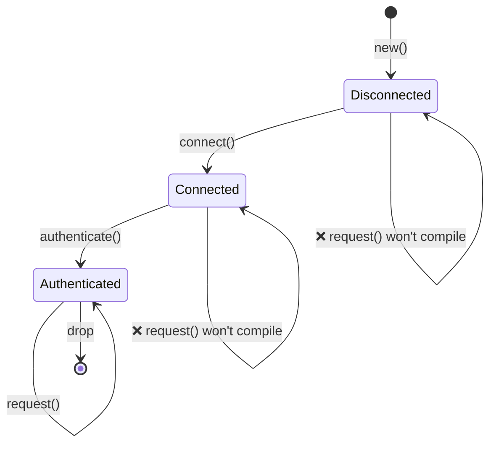
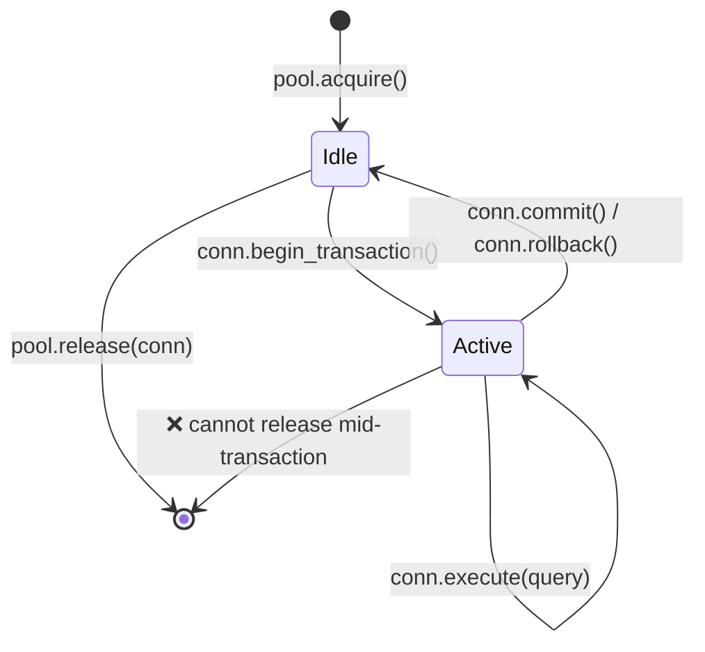
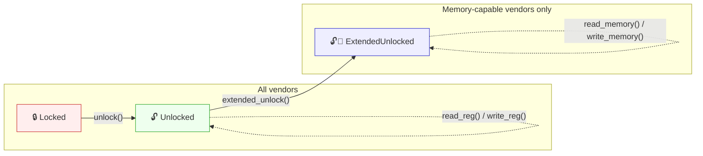
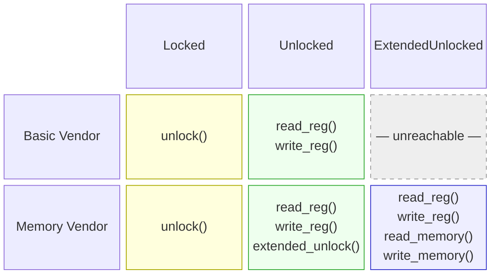

# 3. The Newtype and Type-State Patterns / 3. Newtype 与类型状态 (Type-State) 模式 🟡

> **What you'll learn / 你将学到：**
> - The newtype pattern for zero-cost compile-time type safety / 用于零成本编译时类型安全性的 Newtype 模式
> - Type-state pattern: making illegal state transitions unrepresentable / 类型状态模式：使非法的状态转换变得无法表示
> - Builder pattern with type states for compile-time–enforced construction / 结合类型状态的 Builder 模式，用于编译时强制执行的构建过程
> - Config trait pattern for taming generic parameter explosion / 用于治理泛型参数爆炸的 Config trait 模式

## Newtype: Zero-Cost Type Safety / Newtype：零成本类型安全

The newtype pattern wraps an existing type in a single-field tuple struct to create a distinct type with zero runtime overhead:

Newtype 模式将现有类型包装在单字段元组结构体中，以创建一种具有零运行时开销的独特类型：

```rust
// Without newtypes — easy to mix up:
// 不使用 Newtype —— 很容易混淆：
fn create_user(name: String, email: String, age: u32, employee_id: u32) { }
// create_user(name, email, age, id);  — but what if we swap age and id?
// create_user(name, email, age, id);  — 但如果我们交换了 age 和 id 呢？
// create_user(name, email, id, age);  — COMPILES FINE, BUG
// create_user(name, email, id, age);  — 编译正常，但存在 BUG

// With newtypes — the compiler catches mistakes:
// 使用 Newtype —— 编译器会捕获错误：
struct UserName(String);
struct Email(String);
struct Age(u32);
struct EmployeeId(u32);

fn create_user(name: UserName, email: Email, age: Age, id: EmployeeId) { }
// create_user(name, email, EmployeeId(42), Age(30));
// ❌ Compile error: expected Age, got EmployeeId
// ❌ 编译错误：期望 Age 类型，得到的是 EmployeeId 类型
```

### `impl Deref` for Newtypes — Power and Pitfalls / 为 Newtype 实现 `Deref` —— 威力与陷阱

Implementing `Deref` on a newtype lets it auto-coerce to the inner type's reference, giving you all of the inner type's methods "for free":

在 Newtype 上实现 `Deref` 可以让它自动强制转换为内部类型的引用，从而让你“免费”获得内部类型的所有方法：

```rust
use std::ops::Deref;

struct Email(String);

impl Email {
    fn new(raw: &str) -> Result<Self, &'static str> {
        if raw.contains('@') {
            Ok(Email(raw.to_string()))
        } else {
            Err("invalid email: missing @")
        }
    }
}

impl Deref for Email {
    type Target = str;
    fn deref(&self) -> &str { &self.0 }
}

// Now Email auto-derefs to &str:
// 现在 Email 会自动解引用为 &str：
let email = Email::new("user@example.com").unwrap();
println!("Length: {}", email.len()); // Uses str::len via Deref / 通过 Deref 使用 str::len
```

This is convenient — but it effectively **punches a hole** through your newtype's abstraction boundary because *every* method on the target type becomes callable on your wrapper.

这很方便 —— 但它实际上在你的 Newtype 抽象边界上 **打了一个洞**，因为目标类型上的 *每一个* 方法在你的包装类型上都变得可调用了。

#### When `Deref` IS appropriate / 何时使用 `Deref` 是合适的

| Scenario / 场景 | Example / 示例 | Why it's fine / 为什么没问题 |
|----------|---------|---------------|
| Smart-pointer wrappers / 智能指针包装器 | `Box<T>`, `Arc<T>`, `MutexGuard<T>` | The wrapper's whole purpose is to behave like `T` / 包装器的全部目的就是表现得像 `T` |
| Transparent "thin" wrappers / 透明的“薄”包装器 | `String` → `str`, `PathBuf` → `Path`, `Vec<T>` → `[T]` | The wrapper IS-A superset of the target / 包装器是目标类型的超集 |
| Your newtype genuinely IS the inner type / 你的 Newtype 确实就是内部类型 | `struct Hostname(String)` where you always want full string ops | Restricting the API would add no value / 限制 API 不会带来任何价值 |

#### When `Deref` is an anti-pattern / 何时 `Deref` 是一种反模式

| Scenario / 场景 | Problem / 问题 |
|----------|---------|
| **Domain types with invariants / 具有不变性的领域类型** | `Email` derefs to `&str`, so callers can call `.split_at()`, `.trim()`, etc. — none of which preserve the "must contain @" invariant. If someone stores the trimmed `&str` and reconstructs, the invariant is lost. / `Email` 解引用为 `&str`，因此调用者可以调用 `.split_at()`、`.trim()` 等 —— 这些都无法保证“必须包含 @”的不变性。如果有人存储了裁剪后的 `&str` 并重新构建，不变性就会丢失。 |
| **Types where you want a restricted API / 想要限制 API 的类型** | `struct Password(String)` with `Deref<Target = str>` leaks `.as_bytes()`, `.chars()`, `Debug` output — exactly what you're trying to hide. / `struct Password(String)` 如果实现了 `Deref<Target = str>`，会泄露 `.as_bytes()`、`.chars()`、`Debug` 输出 —— 而这正是你想要隐藏的。 |
| **Fake inheritance / 伪继承** | Using `Deref` to make `ManagerWidget` auto-deref to `Widget` simulates OOP inheritance. This is explicitly discouraged — see the Rust API Guidelines (C-DEREF). / 使用 `Deref` 让 `ManagerWidget` 自动解引用为 `Widget` 以模拟 OOP 继承。这在 Rust 中是明确不鼓励的 —— 参见《Rust API 指南》(C-DEREF)。 |

> **Rule of thumb**: If your newtype exists to *add type safety* or *restrict the API*, don't implement `Deref`. If it exists to *add capabilities* while keeping the inner type's full surface (like a smart pointer), `Deref` is the right choice.
>
> **经验法则**：如果你的 Newtype 存在是为了 *增加类型安全* 或 *限制 API*，请不要实现 `Deref`。如果它的存在是为了在保持内部类型完整表面的同时 *增加能力*（如智能指针），那么 `Deref` 是正确的选择。

#### `DerefMut` — doubles the risk / `DerefMut` —— 双重风险

If you also implement `DerefMut`, callers can *mutate* the inner value directly, bypassing any validation in your constructors:

如果你还实现了 `DerefMut`，调用者可以直接 *修改* 内部值，绕过构造函数中的任何验证：

```rust
use std::ops::{Deref, DerefMut};

struct PortNumber(u16);

impl Deref for PortNumber {
    type Target = u16;
    fn deref(&self) -> &u16 { &self.0 }
}

impl DerefMut for PortNumber {
    fn deref_mut(&mut self) -> &mut u16 { &mut self.0 }
}

let mut port = PortNumber(443);
*port = 0; // Bypasses any validation — now an invalid port
           // 绕过了任何验证 —— 现在是一个无效的端口
```

Only implement `DerefMut` when the inner type has no invariants to protect.

仅当内部类型没有不变性需要保护时，才实现 `DerefMut`。

#### Prefer explicit delegation instead / 优先选择显式委托

When you want only *some* of the inner type's methods, delegate explicitly:

当你只想使用内部类型的 *某些* 方法时，请进行显式委托：

```rust
struct Email(String);

impl Email {
    fn new(raw: &str) -> Result<Self, &'static str> {
        if raw.contains('@') { Ok(Email(raw.to_string())) }
        else { Err("missing @") }
    }

    // Expose only what makes sense:
    // 仅暴露有意义的部分：
    pub fn as_str(&self) -> &str { &self.0 }
    pub fn len(&self) -> usize { self.0.len() }
    pub fn domain(&self) -> &str {
        self.0.split('@').nth(1).unwrap_or("")
    }
    // .split_at(), .trim(), .replace() — NOT exposed
    // .split_at(), .trim(), .replace() —— 不暴露
}
```

#### Clippy and the ecosystem / Clippy 与生态系统

- **`clippy::wrong_self_convention`** can fire when `Deref` coercion makes method resolution surprising (e.g., `is_empty()` resolving to the inner type's version instead of one you intended to shadow). / 当 `Deref` 强制转换使得方法解析出人意料时（例如，`is_empty()` 解析为内部类型的版本，而不是你打算遮掩的版本），**`clippy::wrong_self_convention`** 可能会触发。
- The **Rust API Guidelines** (C-DEREF) state: *"only smart pointers should implement `Deref`."* Treat this as a strong default; deviate only with clear justification. / **《Rust API 指南》**(C-DEREF) 指出：*“只有智能指针应该实现 `Deref`。”* 请将其视为一个强有力的默认规则；仅在有明确理由时才偏离它。
- If you need trait compatibility (e.g., passing `Email` to functions expecting `&str`), consider implementing `AsRef<str>` and `Borrow<str>` instead — they're explicit conversions without auto-coercion surprises. / 如果你需要 trait 兼容性（例如，将 `Email` 传递给期望 `&str` 的函数），请考虑实现 `AsRef<str>` 和 `Borrow<str>` —— 它们是显式转换，没有自动强制转换带来的意外。

#### Decision matrix / 决策矩阵

```text
Do you want ALL methods of the inner type to be callable? / 你是否希望内部类型的所有方法都可调用？
  ├─ YES (是) → Does your type enforce invariants or restrict the API? / 你的类型是否强制执行不变性或限制 API？
  │    ├─ NO (否)  → impl Deref ✅  (smart-pointer / transparent wrapper) / (智能指针 / 透明包装器)
  │    └─ YES (是) → Don't impl Deref ❌ (invariant leaks) / 请勿实现 Deref (不变性泄露)
  └─ NO (否)  → Don't impl Deref ❌  (use AsRef / explicit delegation) / (使用 AsRef / 显式委托)
```

### Type-State: Compile-Time Protocol Enforcement / 类型状态 (Type-State)：编译时协议强制执行

The type-state pattern uses the type system to enforce that operations happen in the correct order. Invalid states become **unrepresentable**.

类型状态模式利用类型系统来强制操作按正确的顺序发生。无效的状态变得 **无法表示**。



> Each transition *consumes* `self` and returns a new type — the compiler enforces valid ordering.
>
> 每次转换都会 *消耗* `self` 并返回一个新类型 —— 编译器强制执行有效的顺序。

```rust
// Problem: A network connection that must be:
// 1. Created
// 2. Connected
// 3. Authenticated
// 4. Then used for requests
// Calling request() before authenticate() should be a COMPILE error.

// 问题：一个网络连接必须按以下顺序操作：
// 1. 创建 (Created)
// 2. 连接 (Connected)
// 3. 认证 (Authenticated)
// 4. 然后用于请求 (Requests)
// 在认证之前调用 request() 应该是一个编译错误。

// --- Type-state markers (zero-sized types) ---
// --- 类型状态标记（零大小类型）---
struct Disconnected;
struct Connected;
struct Authenticated;

// --- Connection parameterized by state ---
// --- 由状态参数化的连接 ---
struct Connection<State> {
    address: String,
    _state: std::marker::PhantomData<State>,
}

// Only Disconnected connections can connect:
// 只有处于“断开连接”状态的连接才能进行连接：
impl Connection<Disconnected> {
    fn new(address: &str) -> Self {
        Connection {
            address: address.to_string(),
            _state: std::marker::PhantomData,
        }
    }

    fn connect(self) -> Connection<Connected> {
        println!("Connecting to {}...", self.address);
        Connection {
            address: self.address,
            _state: std::marker::PhantomData,
        }
    }
}

// Only Connected connections can authenticate:
// 只有处于“已连接”状态的连接才能进行认证：
impl Connection<Connected> {
    fn authenticate(self, _token: &str) -> Connection<Authenticated> {
        println!("Authenticating...");
        Connection {
            address: self.address,
            _state: std::marker::PhantomData,
        }
    }
}

// Only Authenticated connections can make requests:
// 只有处于“已认证”状态的连接才能发送请求：
impl Connection<Authenticated> {
    fn request(&self, path: &str) -> String {
        format!("GET {} from {}", path, self.address)
    }
}

fn main() {
    let conn = Connection::new("api.example.com");
    // conn.request("/data"); // ❌ Compile error: no method `request` on Connection<Disconnected>

    let conn = conn.connect();
    // conn.request("/data"); // ❌ Compile error: no method `request` on Connection<Connected>

    let conn = conn.authenticate("secret-token");
    let response = conn.request("/data"); // ✅ Only works after authentication
    println!("{response}");
}
```

> **Key insight**: Each state transition *consumes* `self` and returns a new type. You can't use the old state after transitioning — the compiler enforces it. Zero runtime cost — `PhantomData` is zero-sized, states are erased at compile time.
>
> **核心见解**：每次状态转换都会 *消耗* `self` 并返回一个新类型。转换后你无法再使用旧状态 —— 编译器会对此进行强制检查。零运行时成本 —— `PhantomData` 是零大小的，状态在编译时会被擦除。

**Comparison with C++/C#**: In C++ or C#, you'd enforce this with runtime checks (`if (!authenticated) throw ...`). The Rust type-state pattern moves these checks to compile time — invalid states are literally unrepresentable in the type system.

**与 C++/C# 的比较**：在 C++ 或 C# 中，你会通过运行时检查（如 `if (!authenticated) throw ...`）来强制执行此操作。Rust 的类型状态模式将这些检查移到了编译时 —— 在类型系统中，无效状态在字面上就是无法表示的。

### Builder Pattern with Type States / 结合类型状态的 Builder 模式

A practical application — a builder that enforces required fields:

一个实际应用 —— 强制要求填写必填字段的 Builder：

```rust
use std::marker::PhantomData;

// Marker types for required fields
// 必填字段的标记类型
struct NeedsName;
struct NeedsPort;
struct Ready;

struct ServerConfig<State> {
    name: Option<String>,
    port: Option<u16>,
    max_connections: usize, // Optional, has default / 可选，有默认值
    _state: PhantomData<State>,
}

impl ServerConfig<NeedsName> {
    fn new() -> Self {
        ServerConfig {
            name: None,
            port: None,
            max_connections: 100,
            _state: PhantomData,
        }
    }

    fn name(self, name: &str) -> ServerConfig<NeedsPort> {
        ServerConfig {
            name: Some(name.to_string()),
            port: self.port,
            max_connections: self.max_connections,
            _state: PhantomData,
        }
    }
}

impl ServerConfig<NeedsPort> {
    fn port(self, port: u16) -> ServerConfig<Ready> {
        ServerConfig {
            name: self.name,
            port: Some(port),
            max_connections: self.max_connections,
            _state: PhantomData,
        }
    }
}

impl ServerConfig<Ready> {
    fn max_connections(mut self, n: usize) -> Self {
        self.max_connections = n;
        self
    }

    fn build(self) -> Server {
        Server {
            name: self.name.unwrap(),
            port: self.port.unwrap(),
            max_connections: self.max_connections,
        }
    }
}

struct Server {
    name: String,
    port: u16,
    max_connections: usize,
}

fn main() {
    // Must provide name, then port, then can build:
    // 必须提供名称，然后是端口，最后才能构建：
    let server = ServerConfig::new()
        .name("my-server")
        .port(8080)
        .max_connections(500)
        .build();

    // ServerConfig::new().port(8080); // ❌ Compile error: no method `port` on NeedsName
    // ServerConfig::new().name("x").build(); // ❌ Compile error: no method `build` on NeedsPort
}
```

***

***

## Case Study: Type-Safe Connection Pool / 案例研究：类型安全的连接池

Real-world systems need connection pools where connections move through well-defined states. Here's how the typestate pattern enforces correctness in a production pool:

现实世界的系统需要连接池，其中的连接会在定义良好的状态之间移动。以下是类型状态 (Type-state) 模式如何在生产环境的连接池中强制执行正确性：



```rust
use std::marker::PhantomData;

// States / 状态
struct Idle;
struct InTransaction;

struct PooledConnection<State> {
    id: u32,
    _state: PhantomData<State>,
}

struct Pool {
    next_id: u32,
}

impl Pool {
    fn new() -> Self { Pool { next_id: 0 } }

    fn acquire(&mut self) -> PooledConnection<Idle> {
        self.next_id += 1;
        println!("[pool] Acquired connection #{}", self.next_id);
        PooledConnection { id: self.next_id, _state: PhantomData }
    }

    // Only idle connections can be released — prevents mid-transaction leaks
    // 只有空闲连接可以被释放 —— 防止事务中途泄露
    fn release(&self, conn: PooledConnection<Idle>) {
        println!("[pool] Released connection #{}", conn.id);
    }
}

impl PooledConnection<Idle> {
    fn begin_transaction(self) -> PooledConnection<InTransaction> {
        println!("[conn #{}] BEGIN", self.id);
        PooledConnection { id: self.id, _state: PhantomData }
    }
}

impl PooledConnection<InTransaction> {
    fn execute(&self, query: &str) {
        println!("[conn #{}] EXEC: {}", self.id, query);
    }

    fn commit(self) -> PooledConnection<Idle> {
        println!("[conn #{}] COMMIT", self.id);
        PooledConnection { id: self.id, _state: PhantomData }
    }

    fn rollback(self) -> PooledConnection<Idle> {
        println!("[conn #{}] ROLLBACK", self.id);
        PooledConnection { id: self.id, _state: PhantomData }
    }
}

fn main() {
    let mut pool = Pool::new();

    let conn = pool.acquire();
    let conn = conn.begin_transaction();
    conn.execute("INSERT INTO users VALUES ('Alice')");
    conn.execute("INSERT INTO orders VALUES (1, 42)");
    let conn = conn.commit(); // Back to Idle / 回到空闲状态
    pool.release(conn);       // ✅ Only works on Idle connections / ✅ 仅适用于空闲连接

    // pool.release(conn_active); // ❌ Compile error: can't release InTransaction
    // ❌ 编译错误：无法释放处于事务中的连接
}
```

**Why this matters in production**: A connection leaked mid-transaction holds database locks indefinitely. The typestate pattern makes this impossible — you literally cannot return a connection to the pool until the transaction is committed or rolled back.

**为什么这在生产环境中很重要**：在事务中途泄露的连接会无限期地持有数据库锁。类型状态架构使这种情况变得不可能发生 —— 在事务提交或回滚之前，你字面上无法将连接返回到池中。

***

## Config Trait Pattern — Taming Generic Parameter Explosion / Config Trait 模式 —— 治理泛型参数爆炸

### The Problem / 问题

As a struct takes on more responsibilities, each backed by a trait-constrained generic, the type signature grows unwieldy:

随着结构体承担更多职责，而每个职责都由受 trait 约束的泛型支持，其类型签名会变得难以管理：

```rust
trait SpiBus   { fn spi_transfer(&self, tx: &[u8], rx: &mut [u8]) -> Result<(), BusError>; }
trait ComPort  { fn com_send(&self, data: &[u8]) -> Result<usize, BusError>; }
trait I3cBus   { fn i3c_read(&self, addr: u8, buf: &mut [u8]) -> Result<(), BusError>; }
trait SmBus    { fn smbus_read_byte(&self, addr: u8, cmd: u8) -> Result<u8, BusError>; }
trait GpioBus  { fn gpio_set(&self, pin: u32, high: bool); }

// ❌ Every new bus trait adds another generic parameter
// ❌ 每增加一个新的总线 trait 都会增加另一个泛型参数
struct DiagController<S: SpiBus, C: ComPort, I: I3cBus, M: SmBus, G: GpioBus> {
    spi: S,
    com: C,
    i3c: I,
    smbus: M,
    gpio: G,
}
// impl blocks, function signatures, and callers all repeat the full list.
// Adding a 6th bus means editing every mention of DiagController<S, C, I, M, G>.

// impl 块、函数签名和调用者都必须重复完整的列表。
// 添加第 6 个总线意味着要修改每一处提到的 DiagController<S, C, I, M, G>。
```

This is often called **"generic parameter explosion."** It compounds across `impl` blocks, function parameters, and downstream consumers — each of which must repeat the full parameter list.

这通常被称为 **“泛型参数爆炸”**。它会在 `impl` 块、函数参数和下游消费者之间产生复合影响 —— 每一个都必须重复完整的参数列表。

### The Solution: A Config Trait / 解决方案：Config Trait

Bundle all associated types into a single trait. The struct then has **one** generic parameter regardless of how many component types it contains:

将所有关联类型捆绑到一个 trait 中。这样，无论包含多少个组件类型，结构体都只有 **一个** 泛型参数：

```rust
#[derive(Debug)]
enum BusError {
    Timeout,
    NakReceived,
    HardwareFault(String),
}

// --- Bus traits (unchanged) ---
// --- 总线 trait（保持不变）---
trait SpiBus {
    fn spi_transfer(&self, tx: &[u8], rx: &mut [u8]) -> Result<(), BusError>;
    fn spi_write(&self, data: &[u8]) -> Result<(), BusError>;
}

trait ComPort {
    fn com_send(&self, data: &[u8]) -> Result<usize, BusError>;
    fn com_recv(&self, buf: &mut [u8], timeout_ms: u32) -> Result<usize, BusError>;
}

trait I3cBus {
    fn i3c_read(&self, addr: u8, buf: &mut [u8]) -> Result<(), BusError>;
    fn i3c_write(&self, addr: u8, data: &[u8]) -> Result<(), BusError>;
}

// --- The Config trait: one associated type per component ---
// --- Config trait：每个组件一个关联类型 ---
trait BoardConfig {
    type Spi: SpiBus;
    type Com: ComPort;
    type I3c: I3cBus;
}

// --- DiagController has exactly ONE generic parameter ---
// --- DiagController 只有唯一一个泛型参数 ---
struct DiagController<Cfg: BoardConfig> {
    spi: Cfg::Spi,
    com: Cfg::Com,
    i3c: Cfg::I3c,
}
```

`DiagController<Cfg>` will never gain another generic parameter. Adding a 4th bus means adding one associated type to `BoardConfig` and one field to `DiagController` — no downstream signature changes.

`DiagController<Cfg>` 永远不会再增加多余的泛型参数。添加第 4 个总线只需在 `BoardConfig` 中添加一个关联类型，并在 `DiagController` 中添加一个字段 —— 下游签名无需任何改动。

### Implementing the Controller / 实现控制器

```rust
impl<Cfg: BoardConfig> DiagController<Cfg> {
    fn new(spi: Cfg::Spi, com: Cfg::Com, i3c: Cfg::I3c) -> Self {
        DiagController { spi, com, i3c }
    }

    fn read_flash_id(&self) -> Result<u32, BusError> {
        let cmd = [0x9F]; // JEDEC Read ID
        let mut id = [0u8; 4];
        self.spi.spi_transfer(&cmd, &mut id)?;
        Ok(u32::from_be_bytes(id))
    }

    fn send_bmc_command(&self, cmd: &[u8]) -> Result<Vec<u8>, BusError> {
        self.com.com_send(cmd)?;
        let mut resp = vec![0u8; 256];
        let n = self.com.com_recv(&mut resp, 1000)?;
        resp.truncate(n);
        Ok(resp)
    }

    fn read_sensor_temp(&self, sensor_addr: u8) -> Result<i16, BusError> {
        let mut buf = [0u8; 2];
        self.i3c.i3c_read(sensor_addr, &mut buf)?;
        Ok(i16::from_be_bytes(buf))
    }

    fn run_full_diag(&self) -> Result<DiagReport, BusError> {
        let flash_id = self.read_flash_id()?;
        let bmc_resp = self.send_bmc_command(b"VERSION\n")?;
        let cpu_temp = self.read_sensor_temp(0x48)?;
        let gpu_temp = self.read_sensor_temp(0x49)?;

        Ok(DiagReport {
            flash_id,
            bmc_version: String::from_utf8_lossy(&bmc_resp).to_string(),
            cpu_temp_c: cpu_temp,
            gpu_temp_c: gpu_temp,
        })
    }
}

#[derive(Debug)]
struct DiagReport {
    flash_id: u32,
    bmc_version: String,
    cpu_temp_c: i16,
    gpu_temp_c: i16,
}
```

### Production Wiring / 生产环境连路

One `impl BoardConfig` selects the concrete hardware drivers:

通过一个 `impl BoardConfig` 即可选择具体的硬件驱动程序：

```rust
struct PlatformSpi  { dev: String, speed_hz: u32 }
struct UartCom      { dev: String, baud: u32 }
struct LinuxI3c     { dev: String }

impl SpiBus for PlatformSpi {
    fn spi_transfer(&self, tx: &[u8], rx: &mut [u8]) -> Result<(), BusError> {
        // ioctl(SPI_IOC_MESSAGE) in production / 生产环境中使用 ioctl
        rx[0..4].copy_from_slice(&[0xEF, 0x40, 0x18, 0x00]);
        Ok(())
    }
    fn spi_write(&self, _data: &[u8]) -> Result<(), BusError> { Ok(()) }
}

impl ComPort for UartCom {
    fn com_send(&self, _data: &[u8]) -> Result<usize, BusError> { Ok(0) }
    fn com_recv(&self, buf: &mut [u8], _timeout: u32) -> Result<usize, BusError> {
        let resp = b"BMC v2.4.1\n";
        buf[..resp.len()].copy_from_slice(resp);
        Ok(resp.len())
    }
}

impl I3cBus for LinuxI3c {
    fn i3c_read(&self, _addr: u8, buf: &mut [u8]) -> Result<(), BusError> {
        buf[0] = 0x00; buf[1] = 0x2D; // 45°C
        Ok(())
    }
    fn i3c_write(&self, _addr: u8, _data: &[u8]) -> Result<(), BusError> { Ok(()) }
}

// ✅ One struct, one impl — all concrete types resolved here
// ✅ 一个结构体，一个实现 —— 此处解析了所有具体类型
struct ProductionBoard;
impl BoardConfig for ProductionBoard {
    type Spi = PlatformSpi;
    type Com = UartCom;
    type I3c = LinuxI3c;
}

fn main() {
    let ctrl = DiagController::<ProductionBoard>::new(
        PlatformSpi { dev: "/dev/spidev0.0".into(), speed_hz: 10_000_000 },
        UartCom     { dev: "/dev/ttyS0".into(),     baud: 115200 },
        LinuxI3c    { dev: "/dev/i3c-0".into() },
    );
    let report = ctrl.run_full_diag().unwrap();
    println!("{report:#?}");
}
```

### Test Wiring with Mocks / 使用 Mock 进行测试连路

Swap the entire hardware layer by defining a different `BoardConfig`:

通过定义不同的 `BoardConfig` 即可切换整个硬件层：

```rust
struct MockSpi  { flash_id: [u8; 4] }
struct MockCom  { response: Vec<u8> }
struct MockI3c  { temps: std::collections::HashMap<u8, i16> }

impl SpiBus for MockSpi {
    fn spi_transfer(&self, _tx: &[u8], rx: &mut [u8]) -> Result<(), BusError> {
        rx[..4].copy_from_slice(&self.flash_id);
        Ok(())
    }
    fn spi_write(&self, _data: &[u8]) -> Result<(), BusError> { Ok(()) }
}

impl ComPort for MockCom {
    fn com_send(&self, _data: &[u8]) -> Result<usize, BusError> { Ok(0) }
    fn com_recv(&self, buf: &mut [u8], _timeout: u32) -> Result<usize, BusError> {
        let n = self.response.len().min(buf.len());
        buf[..n].copy_from_slice(&self.response[..n]);
        Ok(n)
    }
}

impl I3cBus for MockI3c {
    fn i3c_read(&self, addr: u8, buf: &mut [u8]) -> Result<(), BusError> {
        let temp = self.temps.get(&addr).copied().unwrap_or(0);
        buf[..2].copy_from_slice(&temp.to_be_bytes());
        Ok(())
    }
    fn i3c_write(&self, _addr: u8, _data: &[u8]) -> Result<(), BusError> { Ok(()) }
}

struct TestBoard;
impl BoardConfig for TestBoard {
    type Spi = MockSpi;
    type Com = MockCom;
    type I3c = MockI3c;
}

#[cfg(test)]
mod tests {
    // ... test code ...
}
```

### Adding a New Bus Later / 稍后添加新总线

When you need a 4th bus, only two things change — `BoardConfig` and `DiagController`. **No downstream signature changes.** The generic parameter count stays at one:

当你需要第 4 个总线时，只有两处需要更改 —— `BoardConfig` 和 `DiagController`。**下游签名无需改动。** 泛型参数的数量保持为 1：

```rust
trait SmBus {
    fn smbus_read_byte(&self, addr: u8, cmd: u8) -> Result<u8, BusError>;
}

// 1. Add one associated type:
// 1. 添加一个关联类型：
trait BoardConfig {
    type Spi: SpiBus;
    type Com: ComPort;
    type I3c: I3cBus;
    type Smb: SmBus;     // ← new / 新增
}

// 2. Add one field:
// 2. 添加一个字段：
struct DiagController<Cfg: BoardConfig> {
    spi: Cfg::Spi,
    com: Cfg::Com,
    i3c: Cfg::I3c,
    smb: Cfg::Smb,       // ← new / 新增
}

// 3. Provide the concrete type in each config impl:
// 3. 在每个 config 实现中提供具体类型：
impl BoardConfig for ProductionBoard {
    type Spi = PlatformSpi;
    type Com = UartCom;
    type I3c = LinuxI3c;
    type Smb = LinuxSmbus; // ← new / 新增
}
```

### When to Use This Pattern / 何时使用此模式

| Situation / 场景 | Use Config Trait? / 是否使用 Config Trait？ | Alternative / 替代方案 |
|-----------|:-:|---|
| 3+ trait-constrained generics on a struct / 结构体上有 3 个以上受 trait 约束的泛型 | ✅ Yes (是) | — |
| Need to swap entire hardware/platform layer / 需要切换整个硬件/平台层 | ✅ Yes (是) | — |
| Only 1-2 generics / 只有 1-2 个泛型 | ❌ Overkill (过度设计) | Direct generics / 直接使用泛型 |
| Need runtime polymorphism / 需要运行时多态 | ❌ No (否) | `dyn Trait` objects / `dyn Trait` 对象 |
| Open-ended plugin system / 开放式插件系统 | ❌ No (否) | Type-map / `Any` |
| Component traits form a natural group (board, platform) / 组件 trait 构成了自然的分组（主板、平台） | ✅ Yes (是) | — |

### Key Properties / 关键特性

- **One generic parameter forever** — `DiagController<Cfg>` never gains more `<A, B, C, ...>` / **永远只有一个泛型参数** —— `DiagController<Cfg>` 绝不会增加成 `<A, B, C, ...>`。
- **Fully static dispatch** — no vtables, no `dyn`, no heap allocation for trait objects / **完全静态分发** —— 没有 vtable，没有 `dyn`，没有为 trait 对象进行的堆分配。
- **Clean test swapping** — define `TestBoard` with mock impls, zero conditional compilation / **简洁的测试切换** —— 使用 mock 实现定义 `TestBoard`，零条件编译。
- **Compile-time safety** — forget an associated type → compile error, not runtime crash / **编译时安全** —— 忘记关联类型 → 编译错误，而不是运行时崩溃。
- **Battle-tested** — this is the pattern used by Substrate/Polkadot's frame system to manage 20+ associated types through a single `Config` trait / **经过实战检验** —— 这是 Substrate/Polkadot 的 frame 系统使用的模式，通过单个 `Config` trait 管理 20 多个关联类型。

> **Key Takeaways — Newtype & Type-State / 核心要点 —— Newtype 与类型状态**
> - Newtypes give compile-time type safety at zero runtime cost / Newtype 以零运行时成本提供编译时类型安全性
> - Type-state makes illegal state transitions a compile error, not a runtime bug / 类型状态使非法状态转换成为编译错误，而非运行时漏洞
> - Config traits tame generic parameter explosion in large systems / Config trait 在大型系统中治理了泛型参数爆炸
>
> **See also / 另请参阅：** [Ch 4 — PhantomData](ch04-phantomdata-types-that-carry-no-data.md) for the zero-sized markers that power type-state. [Ch 2 — Traits In Depth](ch02-traits-in-depth.md) for associated types used in the config trait pattern.
>
> 查看 [Ch 4 —— PhantomData](ch04-phantomdata-types-that-carry-no-data.md) 了解驱动类型状态的零大小标记。查看 [Ch 2 —— Trait 深入解析](ch02-traits-in-depth.md) 了解 config trait 模式中使用的关联类型。

---

## Case Study: Dual-Axis Typestate — Vendor × Protocol State / 案例研究：双轴类型状态 —— 厂商 × 协议状态

The patterns above handle one axis at a time: typestate enforces *protocol order*, and trait abstraction handles *multiple vendors*. Real systems often need **both simultaneously**: a wrapper `Handle<Vendor, State>` where available methods depend on *which vendor* is plugged in **and** *which state* the handle is in.

上述模式一次只处理一个轴：类型状态强制执行 *协议顺序*，而 trait 抽象处理 *多厂商* 情况。现实中的系统通常需要 **同时满足这两者**：一个包装器 `Handle<Vendor, State>`，其中可用方法取决于插入了 *哪个厂商* 的组件，以及句柄处于 *哪个状态*。

This section shows the **dual-axis conditional `impl`** pattern — where `impl` blocks are gated on both a vendor trait bound and a state marker trait.

本节展示了 **双轴条件 `impl`** 模式 —— 其中 `impl` 块同时受厂商 trait 约束和状态标记 trait 的限制。

### The Two-Dimensional Problem / 二维问题

Consider a debug probe interface (JTAG/SWD). Multiple vendors make probes, and every probe must be unlocked before registers become accessible. Some vendors additionally support direct memory reads — but only after an *extended unlock* that configures the memory access port:

考虑一个调试探针接口 (JTAG/SWD)。多个厂商生产探针，每个探针在访问寄存器之前都必须先解锁。某些厂商还额外支持直接内存读取 —— 但这仅在通过 *扩展解锁* 配置了内存访问端口之后才可用：



The **capability matrix** — which methods exist for which (vendor, state) combination — is two-dimensional:

**能力矩阵** —— 即哪些方法适用于哪种 (厂商, 状态) 组合 —— 是二维的：



The challenge: express this matrix **entirely at compile time**, with static dispatch, so that calling `extended_unlock()` on a basic probe or `read_memory()` on an unlocked-but-not-extended handle is a compile error.

面临的挑战：**完全在编译时** 表达这个矩阵，并使用静态分发，使得在基础探针上调用 `extended_unlock()` 或在已解锁但未扩展的句柄上调用 `read_memory()` 都会导致编译错误。

### The Solution: `Jtag<V, S>` with Marker Traits / 解决方案：带标记 Trait 的 `Jtag<V, S>`

**Step 1 — State tokens and capability markers: / 第 1 步 —— 状态令牌和能力标记：**

```rust,ignore
use std::marker::PhantomData;

// Zero-sized state tokens — no runtime cost
// 零大小状态令牌 —— 无运行时成本
struct Locked;
struct Unlocked;
struct ExtendedUnlocked;

// Marker traits express which capabilities each state has
// 标记 trait 表达了每个状态具有哪些能力
trait HasRegAccess {}
impl HasRegAccess for Unlocked {}
impl HasRegAccess for ExtendedUnlocked {}

trait HasMemAccess {}
impl HasMemAccess for ExtendedUnlocked {}
```

> **Why marker traits, not just concrete states? / 为什么使用标记 trait 而不仅仅是具体状态？**
>
> Writing `impl<V, S: HasRegAccess> Jtag<V, S>` means `read_reg()` works in *any* state with register access — today that's `Unlocked` and `ExtendedUnlocked`, but if you add `DebugHalted` tomorrow, you just add one line: `impl HasRegAccess for DebugHalted {}`. Every register function works with it automatically — zero code changes.
>
> 编写 `impl<V, S: HasRegAccess> Jtag<V, S>` 意味着 `read_reg()` 可以在 *任何* 具有寄存器访问能力的项上工作 —— 目前是 `Unlocked` 和 `ExtendedUnlocked`，但如果你明天添加了 `DebugHalted`，你只需增加一行：`impl HasRegAccess for DebugHalted {}`。所有的寄存器函数都会自动适配它 —— 零代码改动。

**Step 2 — Vendor traits (raw operations): / 第 2 步 —— 厂商 trait（原始操作）：**

```rust,ignore
// Every probe vendor implements these
// 每个探针厂商都要实现这些
trait JtagVendor {
    fn raw_unlock(&mut self);
    fn raw_read_reg(&self, addr: u32) -> u32;
    fn raw_write_reg(&mut self, addr: u32, val: u32);
}

// Vendors with memory access also implement this super-trait
// 具有内存访问能力的厂商还要实现这个 super-trait
trait JtagMemoryVendor: JtagVendor {
    fn raw_extended_unlock(&mut self);
    fn raw_read_memory(&self, addr: u64, buf: &mut [u8]);
    fn raw_write_memory(&mut self, addr: u64, data: &[u8]);
}
```

**Step 3 — The wrapper with conditional `impl` blocks: / 第 3 步 —— 带有条件 `impl` 块的包装器：**

```rust,ignore
struct Jtag<V, S = Locked> {
    vendor: V,
    _state: PhantomData<S>,
}

// Construction — always starts Locked / 构建 —— 初始始终为 Locked 状态
impl<V: JtagVendor> Jtag<V, Locked> {
    fn new(vendor: V) -> Self {
        Jtag { vendor, _state: PhantomData }
    }

    fn unlock(mut self) -> Jtag<V, Unlocked> {
        self.vendor.raw_unlock();
        Jtag { vendor: self.vendor, _state: PhantomData }
    }
}

// Register I/O — any vendor, any state with HasRegAccess
// 寄存器 I/O —— 任何厂商，任何具有 HasRegAccess 能力的状态
impl<V: JtagVendor, S: HasRegAccess> Jtag<V, S> {
    fn read_reg(&self, addr: u32) -> u32 {
        self.vendor.raw_read_reg(addr)
    }
    fn write_reg(&mut self, addr: u32, val: u32) {
        self.vendor.raw_write_reg(addr, val);
    }
}

// Extended unlock — only memory-capable vendors, only from Unlocked
// 扩展解锁 —— 仅限具备内存访问能力的厂商，且仅能从 Unlocked 状态执行
impl<V: JtagMemoryVendor> Jtag<V, Unlocked> {
    fn extended_unlock(mut self) -> Jtag<V, ExtendedUnlocked> {
        self.vendor.raw_extended_unlock();
        Jtag { vendor: self.vendor, _state: PhantomData }
    }
}

// Memory I/O — only memory-capable vendors, only ExtendedUnlocked
// 内存 I/O —— 仅限具备内存访问能力的厂商，且仅限 ExtendedUnlocked 状态
impl<V: JtagMemoryVendor, S: HasMemAccess> Jtag<V, S> {
    fn read_memory(&self, addr: u64, buf: &mut [u8]) {
        self.vendor.raw_read_memory(addr, buf);
    }
    fn write_memory(&mut self, addr: u64, data: &[u8]) {
        self.vendor.raw_write_memory(addr, data);
    }
}
```

Each `impl` block encodes one cell (or row) of the capability matrix. The compiler enforces the matrix — no runtime checks anywhere.

每个 `impl` 块都编码了能力矩阵中的一个单元格（或一行）。编译器强制执行该矩阵 —— 到处都没有运行时检查。

### Vendor Implementations / 厂商实现

Adding a vendor means implementing raw methods on **one struct** — no per-state struct duplication, no delegation boilerplate:

添加厂商意味着在 **一个结构体** 上实现原始方法 —— 无需为每个状态重复结构体，也没有委托模板代码：

```rust,ignore
// Vendor A: basic probe — register access only
// 厂商 A：基础探针 —— 仅限寄存器访问
struct BasicProbe { port: u16 }

impl JtagVendor for BasicProbe {
    fn raw_unlock(&mut self)                    { /* TAP reset sequence */ }
    fn raw_read_reg(&self, addr: u32) -> u32    { /* DR scan */  0 }
    fn raw_write_reg(&mut self, addr: u32, val: u32) { /* DR scan */ }
}
// BasicProbe does NOT impl JtagMemoryVendor.
// extended_unlock() will not compile on Jtag<BasicProbe, _>.
// BasicProbe 没有实现 JtagMemoryVendor。
// 在 Jtag<BasicProbe, _> 上调用 extended_unlock() 将无法通过编译。

// Vendor B: full-featured probe — registers + memory
// 厂商 B：全功能探针 —— 寄存器 + 内存
struct DapProbe { serial: String }

impl JtagVendor for DapProbe {
    fn raw_unlock(&mut self)                    { /* SWD switch, read DPIDR */ }
    fn raw_read_reg(&self, addr: u32) -> u32    { /* AP register read */ 0 }
    fn raw_write_reg(&mut self, addr: u32, val: u32) { /* AP register write */ }
}

impl JtagMemoryVendor for DapProbe {
    fn raw_extended_unlock(&mut self)           { /* select MEM-AP, power up */ }
    fn raw_read_memory(&self, addr: u64, buf: &mut [u8])  { /* MEM-AP read */ }
    fn raw_write_memory(&mut self, addr: u64, data: &[u8]) { /* MEM-AP write */ }
}
```

### What the Compiler Prevents / 编译器能阻止什么

| Attempt / 尝试 | Error / 错误 | Why / 原因 |
|---------|-------|-----|
| `Jtag<_, Locked>::read_reg()` | no method `read_reg` | `Locked` doesn't impl `HasRegAccess` / `Locked` 没有实现 `HasRegAccess` |
| `Jtag<BasicProbe, _>::extended_unlock()` | no method `extended_unlock` | `BasicProbe` doesn't impl `JtagMemoryVendor` / `BasicProbe` 没有实现 `JtagMemoryVendor` |
| `Jtag<_, Unlocked>::read_memory()` | no method `read_memory` | `Unlocked` doesn't impl `HasMemAccess` / `Unlocked` 没有实现 `HasMemAccess` |
| Calling `unlock()` twice / 调用两次 `unlock()` | value used after move / 值在移动后被使用 | `unlock()` consumes `self` / `unlock()` 会消耗 `self` |

All four errors are caught **at compile time**. No panics, no `Option`, no runtime state enum.

所有这四类错误都会在 **编译时** 被捕获。没有恐慌 (Panic)，没有 `Option`，也没有运行时状态枚举。

### Writing Generic Functions / 编写泛型函数

Functions bind only the axes they care about:

函数仅绑定它们所关心的轴：

```rust,ignore
/// Works with ANY vendor, ANY state that grants register access.
/// 适用于任何厂商、任何授权寄存器访问的状态。
fn read_idcode<V: JtagVendor, S: HasRegAccess>(jtag: &Jtag<V, S>) -> u32 {
    jtag.read_reg(0x00)
}

/// Only compiles for memory-capable vendors in ExtendedUnlocked state.
/// 仅适用于具备内存能力的厂商且处于 ExtendedUnlocked 状态。
fn dump_firmware<V: JtagMemoryVendor, S: HasMemAccess>(jtag: &Jtag<V, S>) {
    let mut buf = [0u8; 256];
    jtag.read_memory(0x0800_0000, &mut buf);
}
```

`read_idcode` doesn't care whether you're in `Unlocked` or `ExtendedUnlocked` — it only requires `HasRegAccess`. This is where marker traits pay off over hardcoding specific states in signatures.

`read_idcode` 不关心你处于 `Unlocked` 还是 `ExtendedUnlocked` 状态 —— 它只需要 `HasRegAccess`。这就是标记 trait 相比于在签名中硬编码特定状态的优势所在。

### Same Pattern, Different Domain: Storage Backends / 相同模式，不同领域：存储后端

The dual-axis technique isn't hardware-specific. Here's the same structure for a storage layer where some backends support transactions:

双轴技术并非硬件专有。下面是针对存储层的相同结构，其中某些后端支持事务：

```rust,ignore
// --- States / 状态 ---
struct Closed;
struct Open;
struct InTransaction;

trait HasReadWrite {}
impl HasReadWrite for Open {}
impl HasReadWrite for InTransaction {}

// --- Vendor traits / 厂商 trait ---
trait StorageBackend {
    fn raw_open(&mut self);
    fn raw_read(&self, key: &[u8]) -> Option<Vec<u8>>;
    fn raw_write(&mut self, key: &[u8], value: &[u8]);
}

trait TransactionalBackend: StorageBackend {
    fn raw_begin(&mut self);
    fn raw_commit(&mut self);
    fn raw_rollback(&mut self);
}

// --- Wrapper / 包装器 ---
struct Store<B, S = Closed> { backend: B, _s: PhantomData<S> }

impl<B: StorageBackend> Store<B, Closed> {
    fn open(mut self) -> Store<B, Open> {
        self.backend.raw_open();
        Store { backend: self.backend, _s: PhantomData }
    }
}

impl<B: StorageBackend, S: HasReadWrite> Store<B, S> {
    fn read(&self, key: &[u8]) -> Option<Vec<u8>>  { self.backend.raw_read(key) }
    fn write(&mut self, key: &[u8], val: &[u8])    { self.backend.raw_write(key, val) }
}

impl<B: TransactionalBackend> Store<B, Open> {
    fn begin(mut self) -> Store<B, InTransaction>   {
        self.backend.raw_begin();
        Store { backend: self.backend, _s: PhantomData }
    }
}

impl<B: TransactionalBackend> Store<B, InTransaction> {
    fn commit(mut self) -> Store<B, Open>           {
        self.backend.raw_commit();
        Store { backend: self.backend, _s: PhantomData }
    }
    fn rollback(mut self) -> Store<B, Open>         {
        self.backend.raw_rollback();
        Store { backend: self.backend, _s: PhantomData }
    }
}
```

A flat-file backend implements `StorageBackend` only — `begin()` won't compile. A database backend adds `TransactionalBackend` — the full `Open → InTransaction → Open` cycle becomes available.

普通文件后端仅实现 `StorageBackend` —— `begin()` 将无法编译。数据库后端则增加了 `TransactionalBackend` —— 于是完整的 `Open → InTransaction → Open` 循环操作就通过类型系统变为可用。

### When to Reach for This Pattern / 何时应该使用此模式

| Signal / 信号 | Why dual-axis fits / 为什么双轴模式适用 |
|--------|--------------------|
| Two independent axes: "who provides it" and "what state is it in" / 存在两个独立的轴：“谁提供它”以及“它处于什么状态” | The `impl` block matrix directly encodes both / `impl` 块矩阵直接对这两者进行了编码 |
| Some providers have strictly more capabilities than others / 某些提供者比其他提供者具备严格更多的能力 | Super-trait (`MemoryVendor: Vendor`) + conditional `impl` / 超级 Trait (`MemoryVendor: Vendor`) + 条件 `impl` |
| Misusing state or capability is a safety/correctness bug / 误用状态或能力会导致安全/正确性漏洞 | Compile-time prevention > runtime checks / 编译时预防 > 运行时检查 |
| You want static dispatch (no vtables) / 你想要静态分发（无 vtable） | `PhantomData` + generics = zero-cost / `PhantomData` + 泛型 = 零成本 |

| Signal / 信号 | Consider something simpler / 考虑更简单的方案 |
|--------|---------------------------|
| Only one axis varies (state OR vendor, not both) / 只有一个轴在变化（状态或厂商，而非两者） | Single-axis typestate or plain trait objects / 单轴类型状态或普通的 trait 对象 |
| Three or more independent axes / 三个或更多独立轴 | Config Trait Pattern (above) bundles axes into associated types / Config Trait 模式（见上文）将多个轴捆绑到关联类型中 |
| Runtime polymorphism is acceptable / 运行时多态是可以接受的 | `enum` state + `dyn` dispatch is simpler / `enum` 状态 + `dyn` 分发更简单 |

> **When two axes become three or more: / 当两个轴增加到三个或更多时：**
>
> If you find yourself writing `Handle<V, S, D, T>` — vendor, state, debug level, transport — the generic parameter list is telling you something. Consider collapsing the *vendor* axis into an associated-type config trait (the [Config Trait Pattern](#config-trait-pattern--taming-generic-parameter-explosion) from earlier in this chapter), keeping only the *state* axis as a generic parameter: `Handle<Cfg, S>`. The config trait bundles `type Vendor`, `type Transport`, etc. into one parameter, and the state axis retains its compile-time transition guarantees. This is a natural evolution, not a rewrite — you lift vendor-related types into `Cfg` and leave the typestate machinery untouched.
>
> 如果你发现自己正在编写 `Handle<V, S, D, T>` —— 厂商 (V)、状态 (S)、调试级别 (D)、传输协议 (T) —— 泛型参数列表实际上在向你传递某种信号。可以考虑将 *厂商相关* 的轴收缩进一个使用关联类型的 Config Trait 中（即本章前面提到的 [Config Trait 模式](#config-trait-pattern--治理泛型参数爆炸)），仅保留 *状态* 轴作为泛型参数：`Handle<Cfg, S>`。Config Trait 将 `type Vendor`、`type Transport` 等捆绑为单个参数，而状态轴则保留其编译时状态转换保证。这是一种自然的演进，而非重写 —— 你只需将与厂商相关的类型提升到 `Cfg` 中，而无需触动类型状态机制的底层核心。

> **Key Takeaway: / 核心要点：**
>
> The dual-axis pattern is the intersection of typestate and trait-based abstraction. Each `impl` block maps to one cell of the (vendor × state) matrix. The compiler enforces the entire matrix — no runtime state checks, no impossible-state panics, no cost.
>
> 双轴模式是类型状态 (Typestate) 与基于 Trait 的抽象之交集。每个 `impl` 块都映射到（厂商 × 状态）矩阵中的一个单元格。编译器强制执行整个矩阵 —— 没有运行时状态检查，没有不可能状态导致的恐慌 (Panic)，且不增加任何成本。

---

### Exercise: Type-Safe State Machine ★★ (~30 min) / 练习：类型状态机 ★★（约 30 分钟）

Build a traffic light state machine using the type-state pattern. The light must transition `Red → Green → Yellow → Red` and no other order should be possible.

使用类型状态 (Type-state) 模式构建一个交通信号灯状态机。信号灯必须按 `红 (Red) → 绿 (Green) → 黄 (Yellow) → 红 (Red)` 的顺序循环，且不能出现其他任何顺序。

<details>
<summary>🔑 Solution / 参考答案</summary>

```rust
use std::marker::PhantomData;

// --- States / 状态 ---
struct Red;
struct Green;
struct Yellow;

struct TrafficLight<State> {
    _state: PhantomData<State>,
}

impl TrafficLight<Red> {
    fn new() -> Self {
        println!("🔴 Red — STOP"); // 红灯 —— 停止
        TrafficLight { _state: PhantomData }
    }

    fn go(self) -> TrafficLight<Green> {
        println!("🟢 Green — GO"); // 绿灯 —— 通信
        TrafficLight { _state: PhantomData }
    }
}

impl TrafficLight<Green> {
    fn caution(self) -> TrafficLight<Yellow> {
        println!("🟡 Yellow — CAUTION"); // 黄灯 —— 警告
        TrafficLight { _state: PhantomData }
    }
}

impl TrafficLight<Yellow> {
    fn stop(self) -> TrafficLight<Red> {
        println!("🔴 Red — STOP"); // 红灯 —— 停止
        TrafficLight { _state: PhantomData }
    }
}

fn main() {
    let light = TrafficLight::new(); // Red / 红灯
    let light = light.go();          // Green / 绿灯
    let light = light.caution();     // Yellow / 黄灯
    let _light = light.stop();       // Red / 红灯

    // light.caution(); // ❌ Compile error: no method `caution` on Red
    // ❌ 编译错误：Red 类型上没有 `caution` 方法

    // TrafficLight::new().stop(); // ❌ Compile error: no method `stop` on Red
    // ❌ 编译错误：Red 类型上没有 `stop` 方法
}
```

**Key takeaway**: Invalid transitions are compile errors, not runtime panics.

**核心要点**：无效的状态转换在编译阶段就会报错，而不是在运行时产生恐慌。

</details>

***

