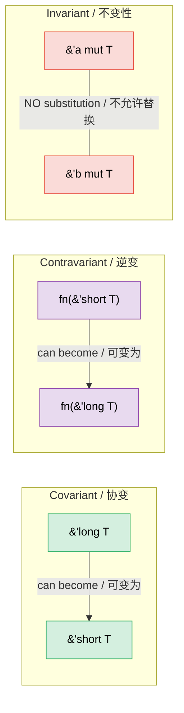

# 4. PhantomData — Types That Carry No Data / 4. PhantomData —— 不携带数据的类型 🔴

> **What you'll learn / 你将学到：**
> - Why `PhantomData<T>` exists and the three problems it solves / 为什么 `PhantomData<T>` 存在以及它解决的三个问题
> - Lifetime branding for compile-time scope enforcement / 用于编译时作用域强制执行的生命周期烙印 (Lifetime Branding)
> - The unit-of-measure pattern for dimension-safe arithmetic / 用于维度安全算术的单位测量模式 (Unit-of-measure Pattern)
> - Variance (covariant, contravariant, invariant) and how PhantomData controls it / 型变（协变、逆变、不变性）以及 PhantomData 如何控制它

## What PhantomData Solves / PhantomData 解决了什么

`PhantomData<T>` is a zero-sized type that tells the compiler "this struct is logically associated with `T`, even though it doesn't contain a `T`." It affects variance, drop checking, and auto-trait inference — without using any memory.

`PhantomData<T>` 是一种零大小的类型，它告诉编译器：“尽管该结构体不包含 `T`，但在逻辑上它与 `T` 相关联。”它会影响型变 (Variance)、析构检查 (Drop Checking) 和自动 trait 推导 (Auto-trait Inference) —— 且不占用任何内存。

```rust
use std::marker::PhantomData;

// Without PhantomData:
// 不使用 PhantomData：
struct Slice<'a, T> {
    ptr: *const T,
    len: usize,
    // Problem: compiler doesn't know this struct borrows from 'a
    // or that it's associated with T for drop-check purposes

    // 问题：编译器不知道这个结构体是从 'a 借用的，
    // 或者出于析构检查的目的，它与 T 有关。
}

// With PhantomData:
// 使用 PhantomData：
struct Slice<'a, T> {
    ptr: *const T,
    len: usize,
    _marker: PhantomData<&'a T>,
    // Now the compiler knows:
    // 1. This struct borrows data with lifetime 'a
    // 2. It's covariant over 'a (lifetimes can shrink)
    // 3. Drop check considers T

    // 现在编译器知道了：
    // 1. 该结构体借用了生命周期为 'a 的数据
    // 2. 它对 'a 是协变的（生命周期可以缩小）
    // 3. 析构检查会考虑 T
}
```

**The three jobs of PhantomData / PhantomData 的三项职责**:

| Job / 职责 | Example / 示例 | What It Does / 它的作用 |
|-----|---------|-------------|
| **Lifetime binding / 生命周期绑定** | `PhantomData<&'a T>` | Struct is treated as borrowing `'a` / 结构体被视为借用了 `'a` |
| **Ownership simulation / 所有权模拟** | `PhantomData<T>` | Drop check assumes struct owns a `T` / 析构检查假设结构体拥有一个 `T` |
| **Variance control / 型变控制** | `PhantomData<fn(T)>` | Makes struct contravariant over `T` / 使结构体对 `T` 是逆变的 |

### Lifetime Branding / 生命周期烙印

Use `PhantomData` to prevent mixing values from different "sessions" or "contexts":

使用 `PhantomData` 来防止混用来自不同“会话 (Sessions)”或“上下文 (Contexts)”的值：

```rust
use std::marker::PhantomData;

/// A handle that's valid only within a specific arena's lifetime
/// 仅在特定 Arena（内存池）生命周期内有效的句柄
struct ArenaHandle<'arena> {
    index: usize,
    _brand: PhantomData<&'arena ()>,
}

struct Arena {
    data: Vec<String>,
}

impl Arena {
    fn new() -> Self {
        Arena { data: Vec::new() }
    }

    /// Allocate a string and return a branded handle
    /// 分配一个字符串并返回一个带烙印的句柄
    fn alloc<'a>(&'a mut self, value: String) -> ArenaHandle<'a> {
        let index = self.data.len();
        self.data.push(value);
        ArenaHandle { index, _brand: PhantomData }
    }

    /// Look up by handle — only accepts handles from THIS arena
    /// 按句柄查找 —— 仅接受来自该 Arena 的句柄
    fn get<'a>(&'a self, handle: ArenaHandle<'a>) -> &'a str {
        &self.data[handle.index]
    }
}

fn main() {
    let mut arena1 = Arena::new();
    let handle1 = arena1.alloc("hello".to_string());

    // Can't use handle1 with a different arena — lifetimes won't match
    // 不能在不同的 arena 中使用 handle1 —— 生命周期不匹配
    // let mut arena2 = Arena::new();
    // arena2.get(handle1); // ❌ Lifetime mismatch / 生命周期不匹配

    println!("{}", arena1.get(handle1)); // ✅
}
```

### Unit-of-Measure Pattern / 单位测量模式

Prevent mixing incompatible units at compile time, with zero runtime cost:

通过零运行时成本，在编译时防止混用不兼容的单位：

```rust
use std::marker::PhantomData;
use std::ops::{Add, Mul};

// Unit marker types (zero-sized)
// 单位标记类型（零大小）
struct Meters;
struct Seconds;
struct MetersPerSecond;

#[derive(Debug, Clone, Copy)]
struct Quantity<Unit> {
    value: f64,
    _unit: PhantomData<Unit>,
}

impl<U> Quantity<U> {
    fn new(value: f64) -> Self {
        Quantity { value, _unit: PhantomData }
    }
}

// Can only add same units:
// 只能加和相同单位：
impl<U> Add for Quantity<U> {
    type Output = Quantity<U>;
    fn add(self, rhs: Self) -> Self::Output {
        Quantity::new(self.value + rhs.value)
    }
}

// Meters / Seconds = MetersPerSecond (custom trait)
// 米 / 秒 = 米每秒 (自定义 trait)
impl std::ops::Div<Quantity<Seconds>> for Quantity<Meters> {
    type Output = Quantity<MetersPerSecond>;
    fn div(self, rhs: Quantity<Seconds>) -> Quantity<MetersPerSecond> {
        Quantity::new(self.value / rhs.value)
    }
}

fn main() {
    let dist = Quantity::<Meters>::new(100.0);
    let time = Quantity::<Seconds>::new(9.58);
    let speed = dist / time; // Quantity<MetersPerSecond>
    println!("Speed: {:.2} m/s", speed.value); // 10.44 m/s

    // let nonsense = dist + time; // ❌ Compile error: can't add Meters + Seconds
    // ❌ 编译错误：不能将“米”和“秒”相加
}
```

> **This is pure type-system magic** — `PhantomData<Meters>` is zero-sized, so `Quantity<Meters>` has the same layout as `f64`. No wrapper overhead at runtime, but full unit safety at compile time.
>
> **这是纯粹的类型系统魔术** —— `PhantomData<Meters>` 是零大小的，因此 `Quantity<Meters>` 的内存布局与 `f64` 完全相同。在运行时没有包装开销，但在编译时具备完整的单位安全性。

### PhantomData and Drop Check / PhantomData 与析构检查

When the compiler checks whether a struct's destructor might access expired data, it uses `PhantomData` to decide:

当编译器检查结构体的析构函数 (Destructor) 是否可能访问过期数据时，它会使用 `PhantomData` 来做决定：

```rust
use std::marker::PhantomData;

// PhantomData<T> — compiler assumes we MIGHT drop a T
// This means T must outlive our struct
// PhantomData<T> —— 编译器假设我们 *可能* 会析构一个 T
// 这意味着 T 的生命周期必须长于我们的结构体
struct OwningSemantic<T> {
    ptr: *const T,
    _marker: PhantomData<T>,  // "I logically own a T" / “我在逻辑上拥有一个 T”
}

// PhantomData<*const T> — compiler assumes we DON'T own T
// More permissive — T doesn't need to outlive us
// PhantomData<*const T> —— 编译器假设我们 *不* 拥有 T
// 更宽松 —— T 不需要比我们活得更久
struct NonOwningSemantic<T> {
    ptr: *const T,
    _marker: PhantomData<*const T>,  // "I just point to T" / “我只是指向 T”
}
```

**Practical rule / 实践规则**: When wrapping raw pointers, choose PhantomData carefully:

在包装原始指针时，请谨慎选择 PhantomData：

- Writing a container that owns its data? → `PhantomData<T>` / 在编写拥有其所有权的数据容器时？ → 使用 `PhantomData<T>`
- Writing a view/reference type? → `PhantomData<&'a T>` or `PhantomData<*const T>` / 在编写视图/引用类型时？ → 使用 `PhantomData<&'a T>` 或 `PhantomData<*const T>`

### Variance — Why PhantomData's Type Parameter Matters / 型变 —— 为什么 PhantomData 的类型参数很重要

**Variance** determines whether a generic type can be substituted with a sub- or super-type (in Rust, "subtype" means "has a longer lifetime"). Getting variance wrong causes either rejected-good-code or unsound-accepted-code.

**型变 (Variance)** 决定了泛型类型是否可以被其子类型或超类型替换（在 Rust 中，“子类型”意味着“具有更长的生命周期”）。搞错型变要么会导致正确的代码被拒绝，要么会导致不安全的代码被接受。



#### The Three Variances / 三种型变

| Variance / 型变 | Meaning / 含义 | "Can I substitute…" / “是否可以替换……” | Rust example / Rust 示例 |
|----------|---------|---------------------|--------------|
| **Covariant / 协变** | Subtype flows through / 子类型关系得以保留 | `'long` where `'short` expected ✅ / 在期望 `'short` 的地方使用 `'long` | `&'a T`, `Vec<T>`, `Box<T>` |
| **Contravariant / 逆变** | Subtype flows *against* / 子类型关系反转 | `'short` where `'long` expected ✅ / 在期望 `'long` 的地方使用 `'short` | `fn(T)` (作为参数位置) |
| **Invariant / 不变性** | No substitution allowed / 不允许任何替换 | Neither direction ❌ / 任何方向都不行 | `&mut T`, `Cell<T>`, `UnsafeCell<T>` |

#### Why `&'a T` is Covariant Over `'a` / 为什么 `&'a T` 对 `'a` 是协变的

```rust
fn print_str(s: &str) {
    println!("{s}");
}

fn main() {
    let owned = String::from("hello");
    // owned lives for the entire function ('long)
    // print_str expects &'_ str ('short — just for the call)
    // owned 在整个函数中存活 ('long)
    // print_str 期望 &'_ str ('short —— 仅在调用期间存活)

    print_str(&owned); // ✅ Covariance: 'long → 'short is safe / 协变：'long → 'short 是安全的
    // A longer-lived reference can always be used where a shorter one is needed.
    // 在需要短生命周期引用的地方，总是可以使用长生命周期的引用。
}
```

#### Why `&mut T` is Invariant Over `T` / 为什么 `&mut T` 对 `T` 是不变的

```rust
// If &mut T were covariant over T, this would compile:
// 如果 &mut T 对 T 是协变的，以下代码将能通过编译：
fn evil(s: &mut &'static str) {
    // We could write a shorter-lived &str into a &'static str slot!
    // 我们可能会将一个较短生命周期的 &str 写入一个 &'static str 槽位！
    let local = String::from("temporary");
    // *s = &local; // ← Would create a dangling &'static str / 这会产生一个悬空的 &'static str
}

// Invariance prevents this: &'static str ≠ &'a str when mutating.
// The compiler rejects the substitution entirely.

// “不变性”可以防止这种情况：在修改时，&'static str ≠ &'a str。
// 编译器会完全拒绝这种替换。
```

#### How PhantomData Controls Variance / PhantomData 如何控制型变

`PhantomData<X>` gives your struct the **same variance as `X`**:

`PhantomData<X>` 使你的结构体具有与 `X` **相同的型变能力**：

```rust
use std::marker::PhantomData;

// Covariant over 'a — a Ref<'long> can be used as Ref<'short>
// 对 'a 是协变的 —— Ref<'long> 可以被当作 Ref<'short> 使用
struct Ref<'a, T> {
    ptr: *const T,
    _marker: PhantomData<&'a T>,  // Covariant over 'a, covariant over T / 对 'a 协变，对 T 协变
}

// Invariant over T — prevents unsound lifetime shortening of T
// 对 T 是不变的 —— 防止对 T 的生命周期进行不安全的缩短
struct MutRef<'a, T> {
    ptr: *mut T,
    _marker: PhantomData<&'a mut T>,  // Covariant over 'a, INVARIANT over T / 对 'a 协变，对 T 不变
}

// Contravariant over T — useful for callback containers
// 对 T 是逆变的 —— 对回调容器很有用
struct CallbackSlot<T> {
    _marker: PhantomData<fn(T)>,  // Contravariant over T / 对 T 逆变
}
```

**PhantomData variance cheat sheet / PhantomData 型变速查表**:

| PhantomData type / PhantomData 类型 | Variance over `T` / 针对 `T` 的型变 | Variance over `'a` / 针对 `'a` 的型变 | Use when / 适用场景 |
|------------------|--------------------|--------------------|-----------|
| `PhantomData<T>` | Covariant / 协变 | — | You logically own a `T` / 逻辑上拥有一个 `T` |
| `PhantomData<&'a T>` | Covariant / 协变 | Covariant / 协变 | You borrow a `T` with lifetime `'a` / 以 'a 生命周期借用 T |
| `PhantomData<&'a mut T>` | **Invariant / 不变** | Covariant / 协变 | You mutably borrow `T` / 可变借用 T |
| `PhantomData<*const T>` | Covariant / 协变 | — | Non-owning pointer to `T` / 对 T 的非拥有型指针 |
| `PhantomData<*mut T>` | **Invariant / 不变** | — | Non-owning mutable pointer / 非拥有型可变指针 |
| `PhantomData<fn(T)>` | **Contravariant / 逆变** | — | `T` appears in argument position / T 出现在参数位置 |
| `PhantomData<fn() -> T>` | Covariant / 协变 | — | `T` appears in return position / T 出现在返回值位置 |
| `PhantomData<fn(T) -> T>` | **Invariant / 不变** | — | `T` in both positions cancels out / T 在两个位置上相互抵消 |

#### Worked Example: Why This Matters in Practice / 实战案例：为什么这在实践中很重要

```rust
use std::marker::PhantomData;

// A token that brands values with a session lifetime.
// MUST be covariant over 'a — otherwise callers can't shorten
// the lifetime when passing to functions that need a shorter borrow.

// 一个带有会话生命周期烙印的令牌。
// 必须对 'a 是协变的 —— 否则在传递给需要较短借用的函数时，调用者无法缩短其生命周期。

struct SessionToken<'a> {
    id: u64,
    _brand: PhantomData<&'a ()>,  // ✅ Covariant — callers can shorten 'a / ✅ 协变 —— 调用者可以缩短 'a
    // _brand: PhantomData<fn(&'a ())>,  // ❌ Contravariant — breaks ergonomics / ❌ 逆变 —— 破坏易用性
}

fn use_token(token: &SessionToken<'_>) {
    println!("Using token {}", token.id);
}

fn main() {
    let token = SessionToken { id: 42, _brand: PhantomData };
    use_token(&token); // ✅ Works because SessionToken is covariant over 'a
                       // ✅ 因为 SessionToken 对 'a 是协变的，所以可以正常工作
}
```

> **Decision rule / 决策规则**: Start with `PhantomData<&'a T>` (covariant). Switch to `PhantomData<&'a mut T>` (invariant) only if your abstraction hands out mutable access to `T`. Use `PhantomData<fn(T)>` (contravariant) almost never — it's only correct for callback-storage scenarios.
>
> **决策规则**：首先尝试使用 `PhantomData<&'a T>`（协变）。只有当你的抽象会分发对 `T` 的可变访问权限时，才切换到 `PhantomData<&'a mut T>`（不变性）。几乎永远不要使用 `PhantomData<fn(T)>`（逆变）—— 它仅在回调存储场景下才是正确的。

> **Key Takeaways — PhantomData / 核心要点 —— PhantomData**
> - `PhantomData<T>` carries type/lifetime information without runtime cost / `PhantomData<T>` 在不产生运行时成本的情况下携带类型/生命周期信息
> - Use it for lifetime branding, variance control, and unit-of-measure patterns / 将其用于生命周期烙印、型变控制和单位测量模式
> - Drop check: `PhantomData<T>` tells the compiler your type logically owns a `T` / 析构检查：`PhantomData<T>` 告诉编译器你的类型在逻辑上拥有一个 `T`

> **See also / 另请参阅：** [Ch 3 — Newtype & Type-State](ch03-the-newtype-and-type-state-patterns.md) for type-state patterns that use PhantomData. [Ch 11 — Unsafe Rust](ch11-unsafe-rust-controlled-danger.md) for how PhantomData interacts with raw pointers.
>
> 参见 [Ch 3 —— Newtype 与类型状态](ch03-the-newtype-and-type-state-patterns.md) 了解使用 PhantomData 的类型状态模式。参见 [Ch 11 —— 不安全 Rust](ch11-unsafe-rust-controlled-danger.md) 了解 PhantomData 如何与原始指针交互。

---

### Exercise: Unit-of-Measure with PhantomData ★★ (~30 min) / 练习：使用 PhantomData 的单位测量模式 ★★（约 30 分钟）

Extend the unit-of-measure pattern to support:
- `Meters`, `Seconds`, `Kilograms`
- Addition of same units
- Multiplication: `Meters * Meters = SquareMeters`
- Division: `Meters / Seconds = MetersPerSecond`

扩展单位测量模式以支持：
- `Meters` (米), `Seconds` (秒), `Kilograms` (千克)
- 相同单位的加法
- 乘法：`Meters * Meters = SquareMeters` (平方米)
- 除法：`Meters / Seconds = MetersPerSecond` (米每秒)

<details>
<summary>🔑 Solution / 参考答案</summary>

```rust
use std::marker::PhantomData;
use std::ops::{Add, Mul, Div};

// --- Unit markers / 单位标记 ---
#[derive(Clone, Copy)]
struct Meters;
#[derive(Clone, Copy)]
struct Seconds;
#[derive(Clone, Copy)]
struct Kilograms;
#[derive(Clone, Copy)]
struct SquareMeters;
#[derive(Clone, Copy)]
struct MetersPerSecond;

#[derive(Debug, Clone, Copy)]
struct Qty<U> {
    value: f64,
    _unit: PhantomData<U>,
}

impl<U> Qty<U> {
    fn new(v: f64) -> Self { Qty { value: v, _unit: PhantomData } }
}

// Same units can be added
// 相同单位可以相加
impl<U> Add for Qty<U> {
    type Output = Qty<U>;
    fn add(self, rhs: Self) -> Self::Output { Qty::new(self.value + rhs.value) }
}

// Meters * Meters = SquareMeters
impl Mul<Qty<Meters>> for Qty<Meters> {
    type Output = Qty<SquareMeters>;
    fn mul(self, rhs: Qty<Meters>) -> Qty<SquareMeters> {
        Qty::new(self.value * rhs.value)
    }
}

// Meters / Seconds = MetersPerSecond
impl Div<Qty<Seconds>> for Qty<Meters> {
    type Output = Qty<MetersPerSecond>;
    fn div(self, rhs: Qty<Seconds>) -> Qty<MetersPerSecond> {
        Qty::new(self.value / rhs.value)
    }
}

fn main() {
    let width = Qty::<Meters>::new(5.0);
    let height = Qty::<Meters>::new(3.0);
    let area = width * height; // Qty<SquareMeters>
    println!("Area: {:.1} m²", area.value);

    let dist = Qty::<Meters>::new(100.0);
    let time = Qty::<Seconds>::new(9.58);
    let speed = dist / time;
    println!("Speed: {:.2} m/s", speed.value);

    let sum = width + height; // Same unit ✅ / 相同单位 ✅
    println!("Sum: {:.1} m", sum.value);

    // let bad = width + time; // ❌ Compile error: can't add Meters + Seconds
    // ❌ 编译错误：无法将“米”和“秒”相加
}
```

</details>

***

