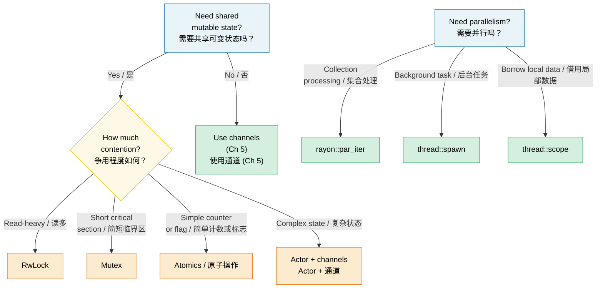

# 6. Concurrency vs Parallelism vs Threads / 6. 并发、并行与线程 🟡

> **What you'll learn / 你将学到：**
> - The precise distinction between concurrency and parallelism / 并发与并行之间的精确区别
> - OS threads, scoped threads, and rayon for data parallelism / OS 线程、作用域线程以及用于数据并行的 rayon
> - Shared state primitives: Arc, Mutex, RwLock, Atomics, Condvar / 共享状态原语：Arc、Mutex、RwLock、原子操作、Condvar
> - Lazy initialization with OnceLock/LazyLock and lock-free patterns / 使用 OnceLock/LazyLock 进行延迟初始化以及无锁模式

## Terminology: Concurrency ≠ Parallelism / 术语：并发 ≠ 并行

These terms are often confused. Here is the precise distinction:

这两个术语经常被混淆。以下是它们的精确区别：

| | Concurrency / 并发 | Parallelism / 并行 |
|---|---|---|
| **Definition / 定义** | Managing multiple tasks that can make progress / 管理多个可以取得进展的任务 | Executing multiple tasks simultaneously / 同时执行多个任务 |
| **Hardware requirement / 硬件要求** | One core is enough / 单核即可 | Requires multiple cores / 需要多核 |
| **Analogy / 类比** | One cook, multiple dishes (switching between them) / 一名厨师，多道菜（在它们之间切换） | Multiple cooks, each working on a dish / 多名厨师，每人负责一道菜 |
| **Rust tools / Rust 工具** | `async/await`, channels, `select!` | `rayon`, `thread::spawn`, `par_iter()` |

```text
Concurrency (single core):           Parallelism (multi-core):
并发 (单核):                          并行 (多核):
                                      
Task A: ██░░██░░██                   Task A: ██████████
Task B: ░░██░░██░░                   Task B: ██████████
─────────────────→ time              ─────────────────→ time
(interleaved on one core)           (simultaneous on two cores)
(单核上交错执行)                      (双核上同时执行)
```

### std::thread — OS Threads / std::thread —— OS 线程

Rust threads map 1:1 to OS threads. Each gets its own stack (typically 2-8 MB):

Rust 线程与操作系统线程是一一对应的。每个线程都有自己的栈（通常为 2-8 MB）：

```rust
use std::thread;
use std::time::Duration;

fn main() {
    // Spawn a thread — takes a closure
    // 派生一个线程 —— 接收一个闭包
    let handle = thread::spawn(|| {
        for i in 0..5 {
            println!("spawned thread: {i}");
            thread::sleep(Duration::from_millis(100));
        }
        42 // Return value / 返回值
    });

    // Do work on the main thread simultaneously
    // 同时在主线程上执行工作
    for i in 0..3 {
        println!("main thread: {i}");
        thread::sleep(Duration::from_millis(150));
    }

    // Wait for the thread to finish and get its return value
    // 等待线程结束并获取其返回值
    let result = handle.join().unwrap(); // unwrap panics if thread panicked
                                         // 如果线程发生恐慌，unwrap 也会产生恐慌
    println!("Thread returned: {result}");
}
```

**Thread::spawn type requirements / Thread::spawn 的类型要求**:

```rust
// The closure must be:
// 闭包必须满足：
// 1. Send — can be transferred to another thread / Send —— 可以转移到另一个线程
// 2. 'static — can't borrow from the calling scope / 'static —— 不能从调用作用域借用
// 3. FnOnce — takes ownership of captured variables / FnOnce —— 获取所捕获变量的所有权

let data = vec![1, 2, 3];

// ❌ Borrows data — not 'static
// ❌ 借用 data —— 不是 'static 的
// thread::spawn(|| println!("{data:?}"));

// ✅ Move ownership into the thread
// ✅ 将所有权移动（Move）到线程中
thread::spawn(move || println!("{data:?}"));
// data is no longer accessible here
// 此处 data 已不再可用
```

### Scoped Threads (std::thread::scope) / 作用域线程 (std::thread::scope)

Since Rust 1.63, scoped threads solve the `'static` requirement — threads can borrow from the parent scope:

从 Rust 1.63 开始，作用域线程 (Scoped Threads) 解决了 `'static` 的限制 —— 线程现在可以从父级作用域中借用变量：

```rust
use std::thread;

fn main() {
    let mut data = vec![1, 2, 3, 4, 5];

    thread::scope(|s| {
        // Thread 1: borrow shared reference
        // 线程 1：借用不可变引用
        s.spawn(|| {
            let sum: i32 = data.iter().sum();
            println!("Sum: {sum}");
        });

        // Thread 2: also borrow shared reference (multiple readers OK)
        // 线程 2：也借用不可变引用（多个读取者是没问题的）
        s.spawn(|| {
            let max = data.iter().max().unwrap();
            println!("Max: {max}");
        });

        // ❌ Can't mutably borrow while shared borrows exist:
        // ❌ 当存在不可变借用时，无法进行可变借用：
        // s.spawn(|| data.push(6));
    });
    // ALL scoped threads joined here — guaranteed before scope returns
    // 所有的作用域线程都在此处汇合 (Joined) —— 保证在作用域返回前完成

    // Now safe to mutate — all threads have finished
    // 现在修改操作是安全的 —— 所有线程都已运行结束
    data.push(6);
    println!("Updated: {data:?}");
}
```

> **This is huge**: Before scoped threads, you had to `Arc::clone()` everything to share with threads. Now you can borrow directly, and the compiler proves all threads finish before the data goes out of scope.
>
> **这是重大的改进**：在有作用域线程之前，你必须通过 `Arc::clone()` 每一个变量来实现在线程间的共享。现在你可以直接借用，并且编译器会证明所有子线程都在数据超出作用域之前已经结束了。

### rayon — Data Parallelism / rayon —— 数据并行

`rayon` provides parallel iterators that distribute work across a thread pool automatically:

`rayon` 提供了并行迭代器，能够自动将工作分配到线程池中执行：

```rust,ignore
// Cargo.toml: rayon = "1"
use rayon::prelude::*;

fn main() {
    let data: Vec<u64> = (0..1_000_000).collect();

    // Sequential:
    // 串行：
    let sum_seq: u64 = data.iter().map(|x| x * x).sum();

    // Parallel — just change .iter() to .par_iter():
    // 并行 —— 只需将 .iter() 改为 .par_iter()：
    let sum_par: u64 = data.par_iter().map(|x| x * x).sum();

    assert_eq!(sum_seq, sum_par);

    // Parallel sort:
    // 并行排序：
    let mut numbers = vec![5, 2, 8, 1, 9, 3];
    numbers.par_sort();

    // Parallel processing with map/filter/collect:
    // 使用 map/filter/collect 进行并行处理：
    let results: Vec<_> = data
        .par_iter()
        .filter(|&&x| x % 2 == 0)
        .map(|&x| expensive_computation(x))
        .collect();
}

fn expensive_computation(x: u64) -> u64 {
    // Simulate CPU-heavy work
    // 模拟高负荷 CPU 工作
    (0..1000).fold(x, |acc, _| acc.wrapping_mul(7).wrapping_add(13))
}
```

**When to use rayon vs threads / 何时使用 rayon 与线程**:

| Use / 使用方式 | When / 适用场景 |
|-----|------|
| `rayon::par_iter()` | Processing collections in parallel (map, filter, reduce) / 并行处理集合（如 map、filter、reduce 等） |
| `thread::spawn` | Long-running background tasks, I/O workers / 长时间运行的后台任务、I/O 工作者 |
| `thread::scope` | Short-lived parallel tasks that borrow local data / 需要借用局部数据的短生命周期并行任务 |
| `async` + `tokio` | I/O-bound concurrency (networking, file I/O) / I/O 密集型并发（网络访问、文件 I/O） |

### Shared State: Arc, Mutex, RwLock, Atomics / 共享状态：Arc、Mutex、RwLock、原子操作

When threads need shared mutable state, Rust provides safe abstractions:

当多个线程需要共享可变状态时，Rust 提供了安全的原语：

> **Note:** `.unwrap()` on `.lock()`, `.read()`, and `.write()` is used for brevity
> throughout these examples. These calls fail only if another thread panicked while
> holding the lock ("poisoning"). Production code should decide whether to recover
> from poisoned locks or propagate the error.
>
> **注意**：在这些示例中，为了简洁，对 `.lock()`、`.read()` 和 `.write()` 使用了 `.unwrap()`。只有当另一个线程在持有锁时发生恐慌（即“锁中毒”，poisoning），这些调用才会失败。生产环境的代码应该决定是从中毒的锁中恢复还是继续传播错误。

```rust
use std::sync::{Arc, Mutex, RwLock};
use std::sync::atomic::{AtomicU64, Ordering};
use std::thread;

// --- Arc<Mutex<T>>: Shared + Exclusive access ---
// --- Arc<Mutex<T>>: 共享 + 排他性访问 ---
fn mutex_example() {
    let counter = Arc::new(Mutex::new(0u64));
    let mut handles = vec![];

    for _ in 0..10 {
        let counter = Arc::clone(&counter);
        handles.push(thread::spawn(move || {
            for _ in 0..1000 {
                let mut guard = counter.lock().unwrap();
                *guard += 1;
            } // Guard dropped → lock released / Guard 被丢弃 → 锁被释放
        }));
    }

    for h in handles { h.join().unwrap(); }
    println!("Counter: {}", counter.lock().unwrap()); // 10000
}

// --- Arc<RwLock<T>>: Multiple readers OR one writer ---
// --- Arc<RwLock<T>>: 多个读取者 或 一个写入者 ---
fn rwlock_example() {
    let config = Arc::new(RwLock::new(String::from("initial")));

    // Many readers — don't block each other
    // 许多读取者 —— 彼此不阻塞
    let readers: Vec<_> = (0..5).map(|id| {
        let config = Arc::clone(&config);
        thread::spawn(move || {
            let guard = config.read().unwrap();
            println!("Reader {id}: {guard}");
        })
    }).collect();

    // Writer — blocks and waits for all readers to finish
    // 写入者 —— 阻塞并等待所有读取者完成
    {
        let mut guard = config.write().unwrap();
        *guard = "updated".to_string();
    }

    for r in readers { r.join().unwrap(); }
}

// --- Atomics: Lock-free for simple values ---
// --- 原子操作：针对简单值的无锁操作 ---
fn atomic_example() {
    let counter = Arc::new(AtomicU64::new(0));
    let mut handles = vec![];

    for _ in 0..10 {
        let counter = Arc::clone(&counter);
        handles.push(thread::spawn(move || {
            for _ in 0..1000 {
                counter.fetch_add(1, Ordering::Relaxed);
                // No lock, no mutex — hardware atomic instruction
                // 无锁，无互斥锁 —— 使用硬件原子指令
            }
        }));
    }

    for h in handles { h.join().unwrap(); }
    println!("Atomic counter: {}", counter.load(Ordering::Relaxed)); // 10000
}
```

### Quick Comparison / 快速对比

| Primitive / 原语 | Use Case / 使用场景 | Cost / 成本 | Contention / 争用情况 |
|-----------|----------|------|------------|
| `Mutex<T>` | Short critical sections / 简短的临界区 | Lock + unlock / 加锁 + 解锁 | Threads wait in line / 线程排队等待 |
| `RwLock<T>` | Read-heavy, rare writes / 读多写少 | Reader-writer lock / 读写锁 | Readers concurrent, writer exclusive / 读取者并发，写入者排他 |
| `AtomicU64` etc. | Counters, flags / 计数器、标志位 | Hardware CAS / 硬件级 CAS | Lock-free — no waiting / 无锁 —— 无需等待 |
| Channels | Message passing / 消息传递 | Queue ops / 队列操作 | Producer/consumer decouple / 生产者/消费者解耦 |

### Condition Variables (`Condvar`) / 条件变量 (`Condvar`)

A `Condvar` lets a thread **wait** until another thread signals that a condition is true, without busy-looping. It is always paired with a `Mutex`:

`Condvar` 允许线程在不进行忙轮询 (Busy-looping) 的情况下 **等待**，直到另一个线程发出信号表明某个条件为真。它总是与一个 `Mutex` 配对使用：

```rust
use std::sync::{Arc, Mutex, Condvar};
use std::thread;

let pair = Arc::new((Mutex::new(false), Condvar::new()));
let pair2 = Arc::clone(&pair);

// Spawned thread: wait until ready == true
// 派生出的线程：等待直到 ready == true
let handle = thread::spawn(move || {
    let (lock, cvar) = &*pair2;
    let mut ready = lock.lock().unwrap();
    while !*ready {
        // atomically unlocks + sleeps
        // 原子地解锁并进入休眠
        ready = cvar.wait(ready).unwrap();
    }
    println!("Worker: condition met, proceeding"); // 工作者：条件满足，正在继续
});

// Main thread: set ready = true, then signal
// 主线程：设置 ready = true，然后发出信号
{
    let (lock, cvar) = &*pair;
    let mut ready = lock.lock().unwrap();
    *ready = true;
    cvar.notify_one(); // wake one waiting thread (use notify_all for many)
                       // 唤醒一个等待中的线程（若有多个，使用 notify_all）
}
handle.join().unwrap();
```

> **Pattern / 模式**: Always re-check the condition in a `while` loop after `wait()` returns — spurious wakeups are allowed by the OS.
>
> **模式**：在 `wait()` 返回后，务必在一个 `while` 循环中重新检查条件 —— 因为操作系统允许发生“虚假唤醒 (Spurious Wakeups)”。

### Lazy Initialization: OnceLock and LazyLock / 延迟初始化：OnceLock 与 LazyLock

Before Rust 1.80, initializing a global static that requires runtime computation (e.g., parsing a config, compiling a regex) needed the `lazy_static!` macro or the `once_cell` crate. The standard library now provides two types that cover these use cases natively:

在 Rust 1.80 之前，初始化一个需要运行时计算的全局静态变量（例如：解析配置文件、编译正则表达式）通常需要 `lazy_static!` 宏或者 `once_cell` crate。现在，标准库原生提供了两种类型来涵盖这些用例：

```rust
use std::sync::{OnceLock, LazyLock};
use std::collections::HashMap;

// OnceLock — initialize on first use via `get_or_init`.
// Useful when the init value depends on runtime arguments.

// OnceLock —— 通过 `get_or_init` 在首次使用时进行初始化
// 当初始化值依赖于运行时参数时非常有用

static CONFIG: OnceLock<HashMap<String, String>> = OnceLock::new();

fn get_config() -> &'static HashMap<String, String> {
    CONFIG.get_or_init(|| {
        // Expensive: read & parse config file — happens exactly once.
        // 耗时操作：读取并解析配置文件 —— 此操作只会发生一次
        let mut m = HashMap::new();
        m.insert("log_level".into(), "info".into());
        m
    })
}

// LazyLock — initialize on first access, closure provided at definition site.
// Equivalent to lazy_static! but without a macro.

// LazyLock —— 在首次访问时进行初始化，闭包在定义时提供
// 相当于 `lazy_static!` 但无需使用宏

static REGEX: LazyLock<regex::Regex> = LazyLock::new(|| {
    regex::Regex::new(r"^[a-zA-Z0-9_]+$").unwrap()
});

fn is_valid_identifier(s: &str) -> bool {
    REGEX.is_match(s) // First call compiles the regex; subsequent calls reuse it.
                      // 首次调用会编译正则；后续调用则复用结果
}
```

| Type / 类型 | Stabilized / 稳定版本 | Init Timing / 初始化时机 | Use When / 适用场景 |
|------|-----------|-------------|----------|
| `OnceLock<T>` | Rust 1.70 | Call-site (`get_or_init`) / 调用处 | Init depends on runtime args / 初始化依赖于运行时参数 |
| `LazyLock<T>` | Rust 1.80 | Definition-site (closure) / 定义处 | Init is self-contained / 初始化是自包含的 |
| `lazy_static!` | — | Definition-site (macro) / 定义处 | Pre-1.80 codebases (migrate away) / 早期代码仓库（建议迁移） |
| `const fn` + `static` | Always / 始终支持 | Compile-time / 编译时 | Value is computable at compile time / 值在编译时即可算出 |

> **Migration tip / 迁移建议**: Replace `lazy_static! { static ref X: T = expr; }` with `static X: LazyLock<T> = LazyLock::new(|| expr);` — same semantics, no macro, no external dependency.
>
> **迁移建议**：将 `lazy_static! { static ref X: T = expr; }` 替换为 `static X: LazyLock<T> = LazyLock::new(|| expr);` —— 两者语义相同，但无需使用宏及其外部依赖。

### Lock-Free Patterns / 无锁模式

For high-performance code, avoid locks entirely:

对于高性能代码，可以尝试完全避开锁：

```rust
use std::sync::atomic::{AtomicBool, AtomicUsize, Ordering};
use std::sync::Arc;

// Pattern 1: Spin lock (educational — prefer std::sync::Mutex)
// 模式 1：自旋锁（教学用途 —— 生产中请优先使用 std::sync::Mutex）

// ⚠️ WARNING: This is a teaching example only. Real spinlocks need:
//   - A RAII guard (so a panic while holding doesn't deadlock forever)
//   - Fairness guarantees (this starves under contention)
//   - Backoff strategies (exponential backoff, yield to OS)
// Use std::sync::Mutex or parking_lot::Mutex in production.

// ⚠️ 警告：这仅仅是一个教学示例。真实的自旋锁需要：
//   - RAII 卫哨 (Guard)（这样在持有锁时发生恐慌就不会导致永久死锁）
//   - 公平性保证（本示例在存在争用时会导致饥饿）
//   - 退避策略 (Backoff)（指数退避、让出 OS 时间片等）
// 在生产环境中，请使用 std::sync::Mutex 或 parking_lot::Mutex。

struct SpinLock {
    locked: AtomicBool,
}

impl SpinLock {
    fn new() -> Self { SpinLock { locked: AtomicBool::new(false) } }

    fn lock(&self) {
        while self.locked
            .compare_exchange_weak(false, true, Ordering::Acquire, Ordering::Relaxed)
            .is_err()
        {
            std::hint::spin_loop(); // CPU hint: we're spinning / CPU 提示：我们正在自旋
        }
    }

    fn unlock(&self) {
        self.locked.store(false, Ordering::Release);
    }
}

// Pattern 2: Lock-free SPSC (single producer, single consumer)
// Use crossbeam::queue::ArrayQueue or similar in production
// roll-your-own only for learning.

// 模式 2：无锁 SPSC（单生产者、单消费者）
// 生产环境中请使用 crossbeam::queue::ArrayQueue 或类似的库
// 自行实现仅用于学习。

// Pattern 3: Sequence counter for wait-free reads
// ⚠️ Best for single-machine-word types (u64, f64); wider T may tear on read.

// 模式 3：用于无等待读取的序列计数器（Sequence Counter）
// ⚠️ 最适用于单机器字类型（如 u64, f64）；更宽的类型 T 在读取时可能会发生撕裂 (Tearing)。

struct SeqLock<T: Copy> {
    seq: AtomicUsize,
    data: std::cell::UnsafeCell<T>,
}

unsafe impl<T: Copy + Send> Sync for SeqLock<T> {}

impl<T: Copy> SeqLock<T> {
    fn new(val: T) -> Self {
        SeqLock {
            seq: AtomicUsize::new(0),
            data: std::cell::UnsafeCell::new(val),
        }
    }

    fn read(&self) -> T {
        loop {
            let s1 = self.seq.load(Ordering::Acquire);
            if s1 & 1 != 0 { continue; } // Writer in progress, retry / 写入正在进行中，重试

            // SAFETY: We use ptr::read_volatile to prevent the compiler from
            // reordering or caching the read. The SeqLock protocol (checking
            // s1 == s2 after reading) ensures we retry if a writer was active.
            // This mirrors the C SeqLock pattern where the data read must use
            // volatile/relaxed semantics to avoid tearing under concurrency.
            // 安全性：我们使用 ptr::read_volatile 来防止编译器重排序或缓存读取。
            // SeqLock 协议（读取后检查 s1 == s2）确保了如果有写入者处于活跃状态，我们会进行重试。
            // 这与 C 语言的 SeqLock 模式类似，其中数据读取必须使用 volatile/relaxed 语义，以避免在并发下发生数据撕裂。
            let value = unsafe { core::ptr::read_volatile(self.data.get() as *const T) };

            // Acquire fence: ensures the data read above is ordered before
            // we re-check the sequence counter.
            // Acquire 屏障：确保上述数据读取在重新检查序列计数器之前完成。
            std::sync::atomic::fence(Ordering::Acquire);
            let s2 = self.seq.load(Ordering::Relaxed);

            if s1 == s2 { return value; } // No writer intervened / 没有写入者介入
            // else retry / 否则重试
        }
    }

    /// # Safety contract
    /// Only ONE thread may call `write()` at a time. If multiple writers
    /// are needed, wrap the `write()` call in an external `Mutex`.
    /// # 安全合约
    /// 每次只能有一个线程调用 `write()`。如果需要多个写入者，请将 `write()` 调用封装在外部 `Mutex` 中。
    fn write(&self, val: T) {
        // Increment to odd (signals write in progress).
        // AcqRel: the Acquire side prevents the subsequent data write
        // from being reordered before this increment (readers must see
        // odd before they could observe a partial write). The Release
        // side is technically unnecessary for a single writer but
        // harmless and consistent.
        // 增加到奇数（信号表示写入正在进行中）。
        // AcqRel：Acquire 端阻止后续数据写入在此增量之前被重排序（读取者必须在观察到部分写入之前看到奇数）。
        // Release 端对于单个写入者来说技术上不是必需的，但无害且保持一致性。
        self.seq.fetch_add(1, Ordering::AcqRel);
        // SAFETY: Single-writer invariant upheld by caller (see doc above).
        // UnsafeCell allows interior mutation; seq counter protects readers.
        // 安全性：调用者需维护单写入者不变性（参见上方文档）。
        // UnsafeCell 允许内部可变性；序列计数器保护读取者。
        unsafe { *self.data.get() = val; }
        // Increment to even (signals write complete).
        // Release: ensure the data write is visible before readers see the even seq.
        // 增加到偶数（信号表示写入完成）。
        // Release：确保数据写入在读取者看到偶数序列之前可见。
        self.seq.fetch_add(1, Ordering::Release);
    }
}
```

> **⚠️ Rust memory model caveat**: The non-atomic write through `UnsafeCell` in
> `write()` concurrent with the non-atomic `ptr::read_volatile` in `read()` is
> technically a data race under the Rust abstract machine — even though the
> SeqLock protocol ensures readers always retry on stale data. This mirrors the
> C kernel SeqLock pattern and is sound in practice on all modern hardware for
> types `T` that fit in a single machine word (e.g., `u64`). For wider types,
> consider using `AtomicU64` for the data field or wrapping access in a `Mutex`.
> See [the Rust unsafe code guidelines](https://rust-lang.github.io/unsafe-code-guidelines/)
> for the evolving story on `UnsafeCell` concurrency.
>
> **⚠️ Rust 内存模型警告**：在 Rust 抽象机下，`write()` 中通过 `UnsafeCell` 进行的非原子写入与 `read()` 中非原子的 `ptr::read_volatile` 在并发时，技术上构成了“数据竞争 (Data Race)” —— 尽管 SeqLock 协议确保了读取者总是在数据陈旧时进行重试。这参考了 C 内核的 SeqLock 模式，并且在所有现代硬件上对于能装入单个机器字（例如 `u64`）的类型 `T` 来说，实践中是可靠的。对于更宽的类型，请考虑为数据字段使用 `AtomicU64` 或将访问封装在 `Mutex` 中。请参阅 [Rust 非安全代码指南](https://rust-lang.github.io/unsafe-code-guidelines/)，了解 `UnsafeCell` 并发演进的故事。

> **Practical advice / 实践建议**: Lock-free code is hard to get right. Use `Mutex` or
> `RwLock` unless profiling shows lock contention is your bottleneck. When you
> do need lock-free, reach for proven crates (`crossbeam`, `arc-swap`, `dashmap`)
> rather than rolling your own.
>
> **实践建议**：无锁代码很难写对。除非性能分析表明锁争用是你的瓶颈，否则请使用 `Mutex` 或 `RwLock`。当你确实需要无锁方案时，请选用已经过验证的 crate（如 `crossbeam`、`arc-swap`、`dashmap`），而不是由于好奇而自行实现。

> **Key Takeaways — Concurrency / 核心要点 —— 并发**
> - Scoped threads (`thread::scope`) let you borrow stack data without `Arc` / 作用域线程 (`thread::scope`) 允许你在不使用 `Arc` 的情况下借用栈数据
> - `rayon::par_iter()` parallelizes iterators with one method call / `rayon::par_iter()` 通过一个方法调用即可实现迭代器并行化
> - Use `OnceLock`/`LazyLock` instead of `lazy_static!`; use `Mutex` before reaching for atomics / 使用 `OnceLock`/`LazyLock` 代替 `lazy_static!`；在考虑原子操作之前先尝试使用 `Mutex`
> - Lock-free code is hard — prefer proven crates over hand-rolled implementations / 无锁代码非常困难 —— 优先使用经过验证的 crate，而不是自行实现

> **See also / 另请参阅:** [Ch 5 — Channels](ch05-channels-and-message-passing.md) for message-passing concurrency. [Ch 8 — Smart Pointers](ch08-smart-pointers-and-interior-mutability.md) for Arc/Rc details.
>
> 参见 [Ch 5 —— 通道](ch05-channels-and-message-passing.md) 了解消息传递并发。参见 [Ch 8 —— 智能指针](ch08-smart-pointers-and-interior-mutability.md) 了解 Arc/Rc 的细节。



---

### Exercise: Parallel Map with Scoped Threads ★★ (~25 min) / 练习：使用作用域线程实现并行映射 ★★（约 25 分钟）

Write a function `parallel_map<T, R>(data: &[T], f: fn(&T) -> R, num_threads: usize) -> Vec<R>` that splits `data` into `num_threads` chunks and processes each in a scoped thread. Do not use `rayon` — use `std::thread::scope`.

编写一个函数 `parallel_map<T, R>(data: &[T], f: fn(&T) -> R, num_threads: usize) -> Vec<R>`，将 `data` 分成 `num_threads` 个块，并在作用域线程中处理每个块。请勿使用 `rayon` —— 使用 `std::thread::scope`。

<details>
<summary>🔑 Solution / 参考答案</summary>

```rust
fn parallel_map<T: Sync, R: Send>(data: &[T], f: fn(&T) -> R, num_threads: usize) -> Vec<R> {
    let chunk_size = (data.len() + num_threads - 1) / num_threads;
    let mut results = Vec::with_capacity(data.len());

    std::thread::scope(|s| {
        let mut handles = Vec::new();
        for chunk in data.chunks(chunk_size) {
            handles.push(s.spawn(move || {
                chunk.iter().map(f).collect::<Vec<_>>()
            }));
        }
        for h in handles {
            results.extend(h.join().unwrap());
        }
    });

    results
}

fn main() {
    let data: Vec<u64> = (1..=20).collect();
    let squares = parallel_map(&data, |x| x * x, 4);
    assert_eq!(squares, (1..=20).map(|x: u64| x * x).collect::<Vec<_>>());
    println!("Parallel squares: {squares:?}");
}
```

</details>

***

