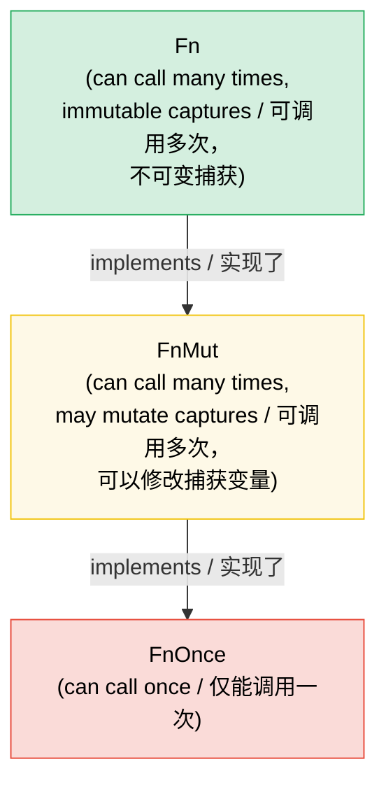

# 7. Closures and Higher-Order Functions / 7. 闭包与高阶函数 🟢

> **What you'll learn / 你将学到：**
> - The three closure traits (`Fn`, `FnMut`, `FnOnce`) and how capture works / 三种闭包 Trait (`Fn`, `FnMut`, `FnOnce`) 以及捕获的工作原理
> - Passing closures as parameters and returning them from functions / 将闭包作为参数传递，并从函数中返回闭包
> - Combinator chains and iterator adapters for functional-style programming / 函数式编程风格下的组合器链与迭代器适配器
> - Designing your own higher-order APIs with the right trait bounds / 使用正确的 Trait Bound 设计自己的高阶 API

## Fn, FnMut, FnOnce — The Closure Traits / Fn, FnMut, FnOnce —— 闭包 Trait

Every closure in Rust implements one or more of three traits, based on how it captures variables:

Rust 中的每个闭包都会根据它捕获变量的方式，实现三个 Trait 中的一个或多个：

```rust
// FnOnce — consumes captured values (can only be called once)
// FnOnce —— 消耗所捕获的值（只能被调用一次）
let name = String::from("Alice");
let greet = move || {
    println!("Hello, {name}!"); // Takes ownership of `name` / 获取了 `name` 的所有权
    drop(name); // name is consumed / name 被消耗（丢弃）了
};
greet(); // ✅ First call / 首次调用
// greet(); // ❌ Can't call again — `name` was consumed / ❌ 无法再次调用 —— `name` 已被消耗

// FnMut — mutably borrows captured values (can be called many times)
// FnMut —— 以可变方式借用捕获的值（可以被调用多次）
let mut count = 0;
let mut increment = || {
    count += 1; // Mutably borrows `count` / 可变借用 `count`
};
increment(); // count == 1
increment(); // count == 2

// Fn — immutably borrows captured values (can be called many times, concurrently)
// Fn —— 以不可变方式借用捕获的值（可以并行被多次调用）
let prefix = "Result";
let display = |x: i32| {
    println!("{prefix}: {x}"); // Immutably borrows `prefix` / 不可变借用 `prefix`
};
display(1);
display(2);
```

**The hierarchy / 等级体系**: `Fn` : `FnMut` : `FnOnce` — each is a subtrait of the next:

**等级体系**：`Fn` : `FnMut` : `FnOnce` —— 每一个都是后者的子 Trait：

```text
FnOnce  ← everything can be called at least once / 任何闭包都至少能被调用一次
 ↑
FnMut   ← can be called repeatedly (may mutate state) / 可以重复调用（可能会修改状态）
 ↑
Fn      ← can be called repeatedly and concurrently (no mutation) / 可以重复并并行调用（不修改状态）
```

If a closure implements `Fn`, it also implements `FnMut` and `FnOnce`.

如果一个闭包实现了 `Fn`，它也同时实现了 `FnMut` 和 `FnOnce`。

### Closures as Parameters and Return Values / 作为参数和返回值的闭包

```rust
// --- Parameters / 参数 ---

// Static dispatch (monomorphized — fastest)
// 静态分发（单态化 —— 速度最快）
fn apply_twice<F: Fn(i32) -> i32>(f: F, x: i32) -> i32 {
    f(f(x))
}

// Also written with impl Trait:
// 也可以使用 impl Trait 形式书写：
fn apply_twice_v2(f: impl Fn(i32) -> i32, x: i32) -> i32 {
    f(f(x))
}

// Dynamic dispatch (trait object — flexible, slight overhead)
// 动态分发（Trait 对象 —— 灵活，但有轻微开销）
fn apply_dyn(f: &dyn Fn(i32) -> i32, x: i32) -> i32 {
    f(x)
}

// --- Return Values / 返回值 ---

// Can't return closures by value without boxing (they have anonymous types):
// 闭包具有匿名类型，不使用 Boxing 就无法按值返回闭包：
fn make_adder(n: i32) -> Box<dyn Fn(i32) -> i32> {
    Box::new(move |x| x + n)
}

// With impl Trait (simpler, monomorphized, but can't be dynamic):
// 使用 impl Trait（更简单，单态化，但无法动态）：
fn make_adder_v2(n: i32) -> impl Fn(i32) -> i32 {
    move |x| x + n
}

fn main() {
    let double = |x: i32| x * 2;
    println!("{}", apply_twice(double, 3)); // 12

    let add5 = make_adder(5);
    println!("{}", add5(10)); // 15
}
```

### Combinator Chains and Iterator Adapters / 组合器链与迭代器适配器

Higher-order functions shine with iterators — this is idiomatic Rust:

高阶函数在迭代器中大放异彩 —— 这是地道的 Rust 风格：

```rust
// C-style loop (imperative):
// C 语言风格循环（命令式）：
let data = vec![1, 2, 3, 4, 5, 6, 7, 8, 9, 10];
let mut result = Vec::new();
for x in &data {
    if x % 2 == 0 {
        result.push(x * x);
    }
}

// Idiomatic Rust (functional combinator chain):
// 地道的 Rust 风格（函数式组合器链）：
let result: Vec<i32> = data.iter()
    .filter(|&&x| x % 2 == 0)
    .map(|&x| x * x)
    .collect();

// Same performance — iterators are lazy and optimized by LLVM
// 性能相同 —— 迭代器是延迟计算（Lazy）的，并由 LLVM 进行了优化
assert_eq!(result, vec![4, 16, 36, 64, 100]);
```

**Common combinators cheat sheet / 常用组合器速查表**:

| Combinator / 组合器 | What It Does / 功能 | Example / 示例 |
|-----------|-------------|---------|
| `.map(f)` | Transform each element / 转换每个元素 | `.map(|x| x * 2)` |
| `.filter(p)` | Keep elements where predicate is true / 保留谓词为真的元素 | `.filter(|x| x > &5)` |
| `.filter_map(f)` | Map + filter in one step (returns `Option`) / 一步完成映射与过滤（返回 `Option`） | `.filter_map(|x| x.parse().ok())` |
| `.flat_map(f)` | Map then flatten nested iterators / 先映射再扁平化嵌套迭代器 | `.flat_map(|s| s.chars())` |
| `.fold(init, f)` | Reduce to single value / 归约为单个值 | `.fold(0, |acc, x| acc + x)` |
| `.any(p)` / `.all(p)` | Short-circuit boolean check / 短路布尔检查 | `.any(|x| x > 100)` |
| `.enumerate()` | Add index / 添加索引 | `.enumerate().map(|(i, x)| ...)` |
| `.zip(other)` | Pair with another iterator / 与另一个迭代器配对 | `.zip(labels.iter())` |
| `.take(n)` / `.skip(n)` | First/skip N elements / 获取/跳过前 N 个元素 | `.take(10)` |
| `.chain(other)` | Concatenate two iterators / 连接两个迭代器 | `.chain(extra.iter())` |
| `.peekable()` | Look ahead without consuming / 在不消耗元素的情况下查看后续内容 | `.peek()` |
| `.collect()` | Gather into a collection / 收集到集合中 | `.collect::<Vec<_>>()` |

### Implementing Your Own Higher-Order APIs / 实现你自己的高阶 API

Design APIs that accept closures for customization:

设计接受闭包作为参数的 API，以便进行自定义：

```rust
/// Retry an operation with a configurable strategy
/// 使用可配置策略重试操作
fn retry<T, E, F, S>(
    mut operation: F,
    mut should_retry: S,
    max_attempts: usize,
) -> Result<T, E>
where
    F: FnMut() -> Result<T, E>,
    S: FnMut(&E, usize) -> bool, // (error, attempt) → try again? / (错误, 尝试次数) → 是否重试？
{
    for attempt in 1..=max_attempts {
        match operation() {
            Ok(val) => return Ok(val),
            Err(e) if attempt < max_attempts && should_retry(&e, attempt) => {
                continue;
            }
            Err(e) => return Err(e),
        }
    }
    unreachable!()
}

// Usage — caller controls retry logic:
// 使用示例 —— 调用者控制重试逻辑：
```

```rust
# fn connect_to_database() -> Result<(), String> { Ok(()) }
# fn http_get(_url: &str) -> Result<String, String> { Ok(String::new()) }
# trait TransientError { fn is_transient(&self) -> bool; }
# impl TransientError for String { fn is_transient(&self) -> bool { true } }
# let url = "http://example.com";
let result = retry(
    || connect_to_database(),
    |err, attempt| {
        eprintln!("Attempt {attempt} failed: {err}");
        true // Always retry / 总是重试
    },
    3,
);

// Usage — retry only specific errors:
// 使用示例 —— 仅重试特定错误：
let result = retry(
    || http_get(url),
    |err, _| err.is_transient(), // Only retry transient errors / 仅重试瞬态错误
    5,
);
```

### The `with` Pattern — Bracketed Resource Access / `with` 模式 —— 括号式资源访问

Sometimes you need to guarantee that a resource is in a specific state for the duration of an operation, and restored afterward — regardless of how the caller's code exits (early return, `?`, panic). Instead of exposing the resource directly and hoping callers remember to set up and tear down, **lend it through a closure**:

有时你需要保证某个资源在操作期间处于特定状态，并在操作结束后恢复 —— 无论调用者的代码如何退出（提前返回、使用 `?`、恐慌等）。与其直接暴露资源并寄希望于调用者记得进行设置和清理，不如 **通过闭包将其借出**：

```text
set up → call closure with resource → tear down
设置 (Set up) → 使用资源调用闭包 → 清理 (Tear down)
```

The caller never touches setup or teardown. They can't forget, can't get it wrong, and can't hold the resource beyond the closure's scope.

调用者无需接触设置或清理逻辑。他们不会忘记，也不会出错，更无法在闭包作用域之外持有该资源。

#### Example: GPIO Pin Direction / 示例：GPIO 引脚方向

A GPIO controller manages pins that support bidirectional I/O. Some callers need the pin configured as input, others as output. Rather than exposing raw pin access and trusting callers to set direction correctly, the controller provides `with_pin_input` and `with_pin_output`:

GPIO 控制器负责管理支持双向 I/O 的引脚。有些调用者需要引脚配置为输入，有些则需要配置为输出。控制器不再暴露原始引脚访问权限并信任调用者能够正确设置方向，而是提供 `with_pin_input` 和 `with_pin_output` 方法：

```rust
/// GPIO pin direction — not public, callers never set this directly.
/// GPIO 引脚方向 —— 不公开，调用者永远无法直接设置。
#[derive(Debug, Clone, Copy, PartialEq)]
enum Direction { In, Out }

/// A GPIO pin handle lent to the closure. Cannot be stored or cloned —
/// it exists only for the duration of the callback.
/// 借给闭包的 GPIO 引脚句柄。它不能被存储或克隆 ——
/// 它仅在回调执行期间存在。
pub struct GpioPin<'a> {
    pin_number: u8,
    _controller: &'a GpioController,
}

impl GpioPin<'_> {
    pub fn read(&self) -> bool {
        // Read pin level from hardware register / 从硬件寄存器读取引脚电平
        println!("  reading pin {}", self.pin_number);
        true // stub
    }

    pub fn write(&self, high: bool) {
        // Drive pin level via hardware register / 通过硬件寄存器驱动引脚电平
        println!("  writing pin {} = {high}", self.pin_number);
    }
}

pub struct GpioController {
    current_direction: std::cell::Cell<Option<Direction>>,
}

impl GpioController {
    pub fn new() -> Self {
        GpioController {
            current_direction: std::cell::Cell::new(None),
        }
    }

    /// Configure pin as input, run the closure, restore state.
    /// The caller receives a `GpioPin` that lives only for the callback.
    /// 将引脚配置为输入，运行闭包，随后恢复状态。
    /// 调用者接收到一个仅在回调函数中存活的 `GpioPin`。
    pub fn with_pin_input<R>(
        &self,
        pin: u8,
        mut f: impl FnMut(&GpioPin<'_>) -> R,
    ) -> R {
        let prev = self.current_direction.get();
        self.set_direction(pin, Direction::In);
        let handle = GpioPin { pin_number: pin, _controller: self };
        let result = f(&handle);
        // Restore previous direction (or leave as-is — policy choice)
        // 恢复之前的方向（或保持不变 —— 这取决于策略选择）
        if let Some(dir) = prev {
            self.set_direction(pin, dir);
        }
        result
    }

    /// Configure pin as output, run the closure, restore state.
    /// 将引脚配置为输出，运行闭包，随后恢复状态。
    pub fn with_pin_output<R>(
        &self,
        pin: u8,
        mut f: impl FnMut(&GpioPin<'_>) -> R,
    ) -> R {
        let prev = self.current_direction.get();
        self.set_direction(pin, Direction::Out);
        let handle = GpioPin { pin_number: pin, _controller: self };
        let result = f(&handle);
        if let Some(dir) = prev {
            self.set_direction(pin, dir);
        }
        result
    }

    fn set_direction(&self, pin: u8, dir: Direction) {
        println!("  [hw] pin {pin} → {dir:?}");
        self.current_direction.set(Some(dir));
    }
}

fn main() {
    let gpio = GpioController::new();

    // Caller 1: needs input — doesn't know or care how direction is managed
    // 调用者 1：需要输入 —— 既不知道也不关心方向是如何管理的
    let level = gpio.with_pin_input(4, |pin| {
        pin.read()
    });
    println!("Pin 4 level: {level}");

    // Caller 2: needs output — same API shape, different guarantee
    // 调用者 2：需要输出 —— 同样的 API 形式，不同的保证
    gpio.with_pin_output(4, |pin| {
        pin.write(true);
        // do more work...
        pin.write(false);
    });

    // Can't use the pin handle outside the closure:
    // 无法在闭包之外使用引脚句柄：
    // let escaped_pin = gpio.with_pin_input(4, |pin| pin);
    // ❌ ERROR: borrowed value does not live long enough
}
```

**What the `with` pattern guarantees: / `with` 模式提供的保证：**
- Direction is **always set before** the caller's code runs / 在调用者代码运行之前，方向 **始终已设置**
- Direction is **always restored after**, even if the closure returns early / 即使闭包提前返回，方向 **始终会在之后恢复**
- The `GpioPin` handle **cannot escape** the closure — the borrow checker enforces this via the lifetime tied to the controller reference / `GpioPin` 句柄 **无法逃逸** 出闭包 —— 借用检查器通过绑定到控制器引脚的生命周期来强制执行此规则
- Callers never import `Direction`, never call `set_direction` — the API is impossible to misuse / 调用者永远不需要导入 `Direction`，也不需要调用 `set_direction` —— 该 API 几乎不可能被误用

#### Where This Pattern Appears / 此模式在何处出现

The `with` pattern shows up throughout Rust's standard library and ecosystem:

`with` 模式贯穿于 Rust 的标准库和生态系统中：

| API | Setup / 设置 | Callback / 回调 | Teardown / 清理 |
|-----|-------|----------|----------|
| `std::thread::scope` | Create scope / 创建作用域 | `\|s\| { s.spawn(...) }` | Join all threads / 汇合所有线程 |
| `Mutex::lock` | Acquire lock / 获取锁 | Use `MutexGuard` / 使用 `MutexGuard` | Release on drop / 丢弃时释放 |
| `tempfile::tempdir` | Create temp directory / 创建临时目录 | Use path / 使用路径 | Delete on drop / 丢弃时删除 |
| `std::io::BufWriter::new` | Buffer writes / 缓冲写入 | Write operations / 写入操作 | Flush on drop / 丢弃时刷新 |
| GPIO `with_pin_*` (above) | Set direction / 设置方向 | Use pin handle / 使用引脚句柄 | Restore direction / 恢复方向 |

The closure-based variant is strongest when:

基于闭包的变体在以下情况下最为强大：

- **Setup and teardown are paired** and forgetting either is a bug / **设置与清理必须成对出现**，遗漏任何一个都是 Bug
- **The resource shouldn't outlive the operation** — the borrow checker enforces this naturally / **资源不应在操作结束后继续存活** —— 借用检查器可以自然地强制执行这一点
- **Multiple configurations exist** (`with_pin_input` vs `with_pin_output`) — each `with_*` method encapsulates a different setup without exposing the configuration to the caller / **存在多种配置选择**（如 `with_pin_input` 与 `with_pin_output`） —— 每个 `with_*` 方法都封装了不同的设置，且无需向调用者暴露具体的配置细节

> **`with` vs RAII (Drop):** Both guarantee cleanup. Use RAII / `Drop` when the caller needs to hold the resource across multiple statements and function calls. Use `with` when the operation is **bracketed** — one setup, one block of work, one teardown — and you don't want the caller to be able to break the bracket.
>
> **`with` 对比 RAII (Drop)**：两者都能保证清理工作。当调用者需要跨多个语句或函数调用持有资源时，请使用 RAII / `Drop`。当操作是 **括号式 (Bracketed)** 的 —— 即：一次设置、一段工作、一次清理 —— 并且你不希望调用者能够打破这个“括号”约束时，请使用 `with`。

> **FnMut vs Fn in API design / API 设计中的 FnMut 与 Fn**: Use `FnMut` as the default bound — it's the most flexible (callers can pass `Fn` or `FnMut` closures). Only require `Fn` if you need to call the closure concurrently (e.g., from multiple threads). Only require `FnOnce` if you call it exactly once.
>
> **API 设计中的 FnMut 与 Fn**：请将 `FnMut` 作为默认的 Trait Bound —— 它是最灵活的（调用者可以传递 `Fn` 或 `FnMut` 闭包）。只有在你需要并发地执行闭包（例如多线程环境下）时，才要求 `Fn`。只有在你确定仅调用闭包一次时，才要求 `FnOnce`。

> **Key Takeaways — Closures / 核心要点 —— 闭包**
> - `Fn` borrows, `FnMut` borrows mutably, `FnOnce` consumes — accept the weakest bound your API needs / `Fn` 借用，`FnMut` 可变借用，`FnOnce` 消耗 —— 你的 API 应接受能满足需求的、强度最弱的 Bound
> - `impl Fn` in parameters, `Box<dyn Fn>` for storage, `impl Fn` in return (or `Box<dyn Fn>` if dynamic) / 参数中使用 `impl Fn`，存储时使用 `Box<dyn Fn>`，返回时使用 `impl Fn`（若需动态则使用 `Box<dyn Fn>`）
> - Combinator chains (`map`, `filter`, `and_then`) compose cleanly and inline to tight loops / 组合器链（`map`、`filter`、`and_then`）可以通过清晰的组合内联为紧凑的循环
> - The `with` pattern (bracketed access via closure) guarantees setup/teardown and prevents resource escape — use it when the caller shouldn't manage configuration lifecycle / `with` 模式（通过闭包进行的括号式访问）保证了设置与清理，并防止资源逃逸 —— 当不应由调用者管理配置生命周期时，请使用该模式

> **See also / 另请参阅:** [Ch 2 — Traits In Depth](ch02-traits-in-depth.md) for how `Fn`/`FnMut`/`FnOnce` relate to trait objects. [Ch 8 — Functional vs. Imperative](ch08-functional-vs-imperative-when-elegance-wins.md) for when to choose combinators over loops. [Ch 15 — API Design](ch15-crate-architecture-and-api-design.md) for ergonomic parameter patterns.
>
> 参见 [Ch 2 —— Trait 深入解析](ch02-traits-in-depth.md) 了解 `Fn`/`FnMut`/`FnOnce` 与 Trait 对象的联系。参见 [Ch 8 —— 函数式对比命令式](ch08-functional-vs-imperative-when-elegance-wins.md) 了解何时选择组合器而非循环。参见 [Ch 15 —— API 设计](ch15-crate-architecture-and-api-design.md) 了解符合人体工程学的参数模式。



> Every `Fn` is also `FnMut`, and every `FnMut` is also `FnOnce`. Accept `FnMut` by default — it’s the most flexible bound for callers.
>
> 每个 `Fn` 都实现了 `FnMut`，而每个 `FnMut` 都实现了 `FnOnce`。默认情况下请接受 `FnMut` —— 因为它对调用者来说是最灵活的。

---

### Exercise: Higher-Order Combinator Pipeline ★★ (~25 min) / 练习：高阶组合器流水线 ★★（约 25 分钟）

Create a `Pipeline` struct that chains transformations. It should support `.pipe(f)` to add a transformation and `.execute(input)` to run the full chain.

创建一个 `Pipeline` 结构体来链接各种转换操作。它应支持通过 `.pipe(f)` 添加转换，并通过 `.execute(input)` 运行整个链条。

<details>
<summary>🔑 Solution / 参考答案</summary>

```rust
struct Pipeline<T> {
    transforms: Vec<Box<dyn Fn(T) -> T>>,
}

impl<T: 'static> Pipeline<T> {
    fn new() -> Self {
        Pipeline { transforms: Vec::new() }
    }

    fn pipe(mut self, f: impl Fn(T) -> T + 'static) -> Self {
        self.transforms.push(Box::new(f));
        self
    }

    fn execute(self, input: T) -> T {
        self.transforms.into_iter().fold(input, |val, f| f(val))
    }
}

fn main() {
    let result = Pipeline::new()
        .pipe(|s: String| s.trim().to_string())
        .pipe(|s| s.to_uppercase())
        .pipe(|s| format!(">>> {s} <<<"))
        .execute("  hello world  ".to_string());

    println!("{result}"); // >>> HELLO WORLD <<<

    let result = Pipeline::new()
        .pipe(|x: i32| x * 2)
        .pipe(|x| x + 10)
        .pipe(|x| x * x)
        .execute(5);

    println!("{result}"); // (5*2 + 10)^2 = 400
}
```

</details>

***

