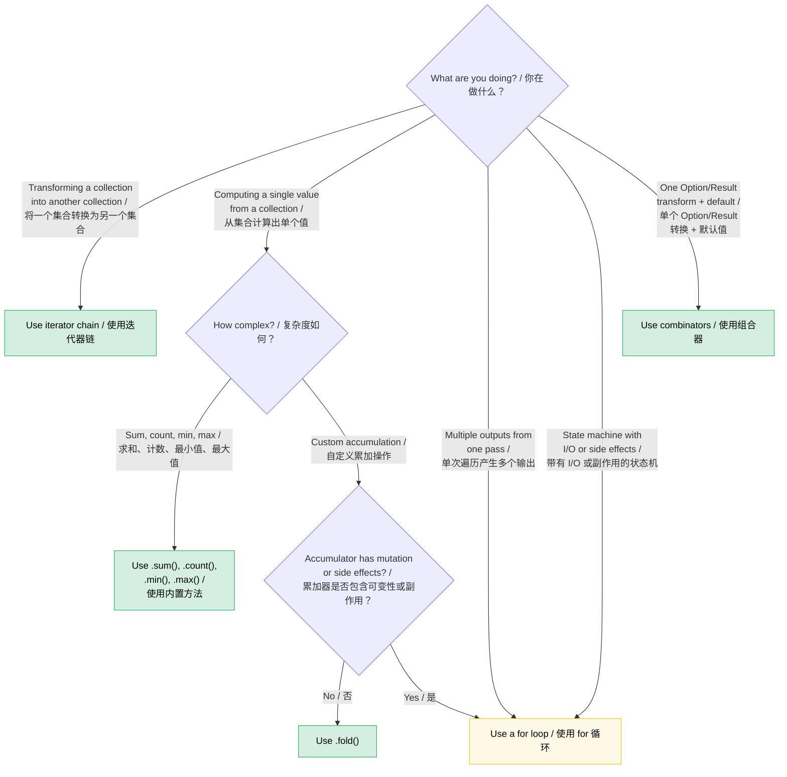

# Chapter 8 — Functional vs. Imperative: When Elegance Wins (and When It Doesn't) / 第 8 章 —— 函数式与命令式：优雅何时胜出（以及何时不会）

> **Difficulty / 难度：** 🟡 Intermediate / 中级 | **Time / 预计用时：** 2–3 hours / 2–3 小时 | **Prerequisites / 先决条件：** [Ch 7 — Closures](ch07-closures-and-higher-order-functions.md)

Rust gives you genuine parity between functional and imperative styles. Unlike Haskell (functional by fiat) or C (imperative by default), Rust lets you choose — and the right choice depends on what you're expressing. This chapter builds the judgment to pick well.

Rust 让函数式与命令式风格拥有了真正的对等地位。与 Haskell（强制函数式）或 C（默认命令式）不同，Rust 让你自由选择 —— 而正确的选择取决于你想要表达的内容。本章旨在帮助你建立良好的判断力，从而做出明智的选择。

**The core principle:** Functional style shines when you're *transforming data through a pipeline*. Imperative style shines when you're *managing state transitions with side effects*. Most real code has both, and the skill is knowing where the boundary falls.

**核心原则**：函数式风格在 **通过流水线转换数据** 时大放异彩；而命令式风格则在 **管理带有副作用的状态转换** 时更胜一筹。大多数真实代码都兼具两者，而技能的关键在于掌握它们之间的界限在哪里。

---

## 8.1 The Combinator You Didn't Know You Wanted / 8.1 你一直想要却未曾察觉的组合器

Many Rust developers write this:

许多 Rust 开发者会这样写：

```rust
let value = if let Some(x) = maybe_config() {
    x
} else {
    default_config()
};
process(value);
```

When they could write this:

但他们其实可以写成这样：

```rust
process(maybe_config().unwrap_or_else(default_config));
```

Or this common pattern:

或者是这种常见的模式：

```rust
let display_name = if let Some(name) = user.nickname() {
    name.to_uppercase()
} else {
    "ANONYMOUS".to_string()
};
```

Which is:

可以简化为：

```rust
let display_name = user.nickname()
    .map(|n| n.to_uppercase())
    .unwrap_or_else(|| "ANONYMOUS".to_string());
```

The functional version isn't just shorter — it tells you *what* is happening (transform, then default) without making you trace control flow. The `if let` version makes you read the branches to figure out that both paths end up in the same place.

函数式版本不仅仅是为了缩短代码 —— 它直接告诉了你 **正在发生什么**（先转换，再应用默认值），而不需要你去追踪控制流。`if let` 版本则强制让你去阅读各个分支，才能弄清楚这两条路径最终会汇聚到同一个地方。

### The `Option` combinator family / `Option` 组合器家族

Here's the mental model: `Option<T>` is a one-element-or-empty collection. Every combinator on `Option` has an analogy to a collection operation.

下面是它的心智模型：`Option<T>` 是一个包含“一个元素”或“为空”的集合。`Option` 上的每个组合器在集合操作中都有类比。

| You write... / 你写下... | Instead of... / 代替... | What it communicates / 它所表达的意图 |
|---|---|---|
| `opt.unwrap_or(default)` | `if let Some(x) = opt { x } else { default }` | "Use this value or fall back" / “使用该值或回退” |
| `opt.unwrap_or_else(|| expensive())` | `if let Some(x) = opt { x } else { expensive() }` | Same, but default is lazy / 同上，但默认值是惰性的 |
| `opt.map(f)` | `match opt { Some(x) => Some(f(x)), None => None }` | "Transform the inside, propagate absence" / “转换内部值，传播空值” |
| `opt.and_then(f)` | `match opt { Some(x) => f(x), None => None }` | "Chain fallible operations" (flatmap) / “链式调用可能失败的操作” |
| `opt.filter(|x| pred(x))` | `match opt { Some(x) if pred(&x) => Some(x), _ => None }` | "Keep only if it passes" / “仅在通过检查时保留” |
| `opt.zip(other)` | `if let (Some(a), Some(b)) = (opt, other) { Some((a,b)) } else { None }` | "Both or neither" / “两者皆有或两者皆无” |
| `opt.or(fallback)` | `if opt.is_some() { opt } else { fallback }` | "First available" / “第一个可用项” |
| `opt.or_else(|| try_another())` | `if opt.is_some() { opt } else { try_another() }` | "Try alternatives in order" / “按顺序尝试备选项” |
| `opt.map_or(default, f)` | `if let Some(x) = opt { f(x) } else { default }` | "Transform or default" — one-liner / “转换或应用默认值” —— 单行实现 |
| `opt.map_or_else(default_fn, f)` | `if let Some(x) = opt { f(x) } else { default_fn() }` | Same, both sides are closures / 同上，两边都是闭包 |
| `opt?` | `match opt { Some(x) => x, None => return None }` | "Propagate absence upward" / “向上层传播空值” |

### The `Result` combinator family / `Result` 组合器家族

The same pattern applies to `Result<T, E>`:

同样的模式也适用于 `Result<T, E>`：

| You write... / 你写下... | Instead of... / 代替... | What it communicates / 它所表达的意图 |
|---|---|---|
| `res.map(f)` | `match res { Ok(x) => Ok(f(x)), Err(e) => Err(e) }` | Transform the success path / 转换成功路径 |
| `res.map_err(f)` | `match res { Ok(x) => Ok(x), Err(e) => Err(f(e)) }` | Transform the error / 转换错误值 |
| `res.and_then(f)` | `match res { Ok(x) => f(x), Err(e) => Err(e) }` | Chain fallible operations / 链式调用可能失败的操作 |
| `res.unwrap_or_else(|e| default(e))` | `match res { Ok(x) => x, Err(e) => default(e) }` | Recover from error / 从错误中恢复 |
| `res.ok()` | `match res { Ok(x) => Some(x), Err(_) => None }` | "I don't care about the error" / “我不关心具体的错误” |
| `res?` | `match res { Ok(x) => x, Err(e) => return Err(e.into()) }` | Propagate errors upward / 向上层传播错误 |

### When `if let` IS better / 何时 `if let` 更合适

The combinators lose when:

- **You need multiple statements in the `Some` branch.** A map closure with 5 lines is worse than an `if let` with 5 lines.
- **The control flow is the point.** `if let Some(connection) = pool.try_get() { /* use it */ } else { /* log, retry, alert */ }` — the two branches are genuinely different code paths, not a transform-or-default.
- **Side effects dominate.** If both branches do I/O with different error handling, the combinator version obscures the important differences.

**Rule of thumb:** If the `else` branch produces the *same type* as the `Some` branch and the bodies are short expressions, use a combinator. If the branches do fundamentally different things, use `if let` or `match`.

---

## 8.2 Bool Combinators: `.then()` and `.then_some()` / 8.2 布尔组合器：`.then()` 与 `.then_some()`

Another pattern that's more common than it should be:

另一个比想象中更常见的模式：

```rust
let label = if is_admin {
    Some("ADMIN")
} else {
    None
};
```

Rust 1.62+ gives you:

Rust 1.62+ 之后你可以这样写：

```rust
let label = is_admin.then_some("ADMIN");
```

Or with a computed value:

或者是使用计算出的值：

```rust
let permissions = is_admin.then(|| compute_admin_permissions());
```

This is especially powerful in chains:

这在链式调用中尤其强大：

```rust
// Imperative / 命令式
let mut tags = Vec::new();
if user.is_admin { tags.push("admin"); }
if user.is_verified { tags.push("verified"); }
if user.score > 100 { tags.push("power-user"); }

// Functional / 函数式
let tags: Vec<&str> = [
    user.is_admin.then_some("admin"),
    user.is_verified.then_some("verified"),
    (user.score > 100).then_some("power-user"),
]
.into_iter()
.flatten()
.collect();
```

The functional version makes the pattern explicit: "build a list from conditional elements." The imperative version makes you read each `if` to confirm they all do the same thing (push a tag).

函数式版本使这种模式显式化：“从条件元素中构建一个列表”。而命令式版本则迫使你阅读每一个 `if` 语句，以确认它们都在做同样的事情（如推送一个标签）。

---

---

## 8.3 Iterator Chains vs. Loops: The Decision Framework / 8.3 迭代器链与循环：决策框架

Ch 7 showed the mechanics. This section builds the judgment.

第 7 章展示了其工作机制。本节将培养你做出判断的能力。

### When iterators win / 何时迭代器胜出

**Data pipelines** — transforming a collection through a series of steps:

**数据流水线** —— 通过一系列步骤转换集合中的数据：

```rust
// Imperative: 8 lines, 2 mutable variables
// 命令式：8 行代码，2 个可变变量
let mut results = Vec::new();
for item in inventory {
    if item.category == Category::Server {
        if let Some(temp) = item.last_temperature() {
            if temp > 80.0 {
                results.push((item.id, temp));
            }
        }
    }
}

// Functional: 6 lines, 0 mutable variables, one pipeline
// 函数式：6 行代码，0 个可变变量，一条流水线
let results: Vec<_> = inventory.iter()
    .filter(|item| item.category == Category::Server)
    .filter_map(|item| item.last_temperature().map(|t| (item.id, t)))
    .filter(|(_, temp)| *temp > 80.0)
    .collect();
```

The functional version wins because:

函数式版本胜出是因为：

- Each filter is independently readable / 每个过滤器都是独立可读的
- No `mut` — the data flows in one direction / 没有 `mut` —— 数据流向单一
- You can add/remove/reorder pipeline stages without restructuring / 你可以增加、删除或重新排序流水线阶段，而无需重新组织代码结构
- LLVM inlines iterator adapters to the same machine code as the loop / LLVM 会将迭代器适配器内联为与循环相同的机器码

**Aggregation** — computing a single value from a collection:

**聚合** —— 从集合中计算出单个值：

```rust
// Imperative / 命令式
let mut total_power = 0.0;
let mut count = 0;
for server in fleet {
    total_power += server.power_draw();
    count += 1;
}
let avg = total_power / count as f64;

// Functional / 函数式
let (total_power, count) = fleet.iter()
    .map(|s| s.power_draw())
    .fold((0.0, 0usize), |(sum, n), p| (sum + p, n + 1));
let avg = total_power / count as f64;
```

Or even simpler if you just need the sum:

如果你只需要求和，还可以更简单：

```rust
let total: f64 = fleet.iter().map(|s| s.power_draw()).sum();
```

### When loops win / 何时循环胜出

**Early exit with complex state / 带有复杂状态的提前退出：**

```rust
// This is clear and direct / 这种写法清晰直接
let mut best_candidate = None;
for server in fleet {
    let score = evaluate(server);
    if score > threshold {
        if server.is_available() {
            best_candidate = Some(server);
            break; // Found one — stop immediately / 找到了一个 —— 立即停止
        }
    }
}

// The functional version is strained / 函数式版本则显得有些勉强
let best_candidate = fleet.iter()
    .filter(|s| evaluate(s) > threshold)
    .find(|s| s.is_available());
```

Wait — that functional version is actually pretty clean. Let's try a case where it genuinely loses:

等等 —— 上面那个函数式版本其实挺整洁的。让我们看一个它真正处于下风的情况：

**Building multiple outputs simultaneously / 同时构建多个输出：**

```rust
// Imperative: clear, each branch does something different
// 命令式：清晰，每个分支执行不同的操作
let mut warnings = Vec::new();
let mut errors = Vec::new();
let mut stats = Stats::default();

for event in log_stream {
    match event.severity {
        Severity::Warn => {
            warnings.push(event.clone());
            stats.warn_count += 1;
        }
        Severity::Error => {
            errors.push(event.clone());
            stats.error_count += 1;
            if event.is_critical() {
                alert_oncall(&event);
            }
        }
        _ => stats.other_count += 1,
    }
}

// Functional version: forced, awkward, nobody wants to read this
// 函数式版本：牵强、笨拙，没人想读这样的代码
let (warnings, errors, stats) = log_stream.iter().fold(
    (Vec::new(), Vec::new(), Stats::default()),
    |(mut w, mut e, mut s), event| {
        match event.severity {
            Severity::Warn => { w.push(event.clone()); s.warn_count += 1; }
            Severity::Error => {
                e.push(event.clone()); s.error_count += 1;
                if event.is_critical() { alert_oncall(event); }
            }
            _ => s.other_count += 1,
        }
        (w, e, s)
    },
);
```

The `fold` version is *longer*, *harder to read*, and has mutation anyway (the `mut` deconstructed accumulators). The loop wins because:

`fold` 版本不仅 **更长**、**更难读**，而且无论如何都存在可变性（被解构的可变累加器）。循环胜出是因为：

- Multiple outputs being built in parallel / 并行构建多个输出
- Side effects (alerting) mixed into the logic / 逻辑中混入了副作用（如报警通知）
- Branch bodies are statements, not expressions / 分支主体是语句而非表达式

**State machines with I/O / 带有 I/O 的状态机：**

```rust
// A parser that reads tokens — the loop IS the algorithm
// 一个读取 Token 的解析器 —— 这里的循环本身即是算法
let mut state = ParseState::Start;
loop {
    let token = lexer.next_token()?;
    state = match state {
        ParseState::Start => match token {
            Token::Keyword(k) => ParseState::GotKeyword(k),
            Token::Eof => break,
            _ => return Err(ParseError::UnexpectedToken(token)),
        },
        ParseState::GotKeyword(k) => match token {
            Token::Ident(name) => ParseState::GotName(k, name),
            _ => return Err(ParseError::ExpectedIdentifier),
        },
        // ...more states / ...更多状态
    };
}
```

No functional equivalent is cleaner. The loop with `match state` is the natural expression of a state machine.

没有比这更简洁的函数式对等写法了。带有 `match state` 的循环是实现状态机最自然的表达方式。

### The decision flowchart / 决策流程图



### Sidebar: Scoped mutability — imperative inside, functional outside / 边栏：作用域内可变性 —— 内部命令式，外部函数式

Rust blocks are expressions. This lets you confine mutation to a construction phase and bind the result immutably:

Rust 的代码块是表达式。这允许你将可变性限制在构建阶段，并以不可变的方式绑定结果：

```rust
use rand::random;

let samples = {
    let mut buf = Vec::with_capacity(10);
    while buf.len() < 10 {
        let reading: f64 = random();
        buf.push(reading);
        if random::<u8>() % 3 == 0 { break; } // randomly stop early / 随机提前停止
    }
    buf // Yield the vector / 产生（返回）这个 vector
};
// samples is immutable — contains between 1 and 10 elements
// samples 是不可变的 —— 包含 1 到 10 个元素
```

The inner `buf` is mutable only inside the block. Once the block yields, the outer binding `samples` is immutable and the compiler will reject any later `samples.push(...)`.

内部的 `buf` 仅在代码块内是可变的。一旦代码块产生结果，外部绑定 `samples` 就是不可变的，编译器将拒绝后续任何 `samples.push(...)` 调用。

**Why not an iterator chain?** You might try:

**为什么不用迭代器链？** 你可能会尝试：

```rust
let samples: Vec<f64> = std::iter::from_fn(|| Some(random()))
    .take(10)
    .take_while(|_| random::<u8>() % 3 != 0)
    .collect();
```

But `take_while` *excludes* the element that fails the predicate, producing anywhere from zero to nine elements instead of the guaranteed-at-least-one the imperative version provides. You can work around it with `scan` or `chain`, but the imperative version is clearer.

但是 `take_while` 会 **排除** 谓词检查失败的那个元素，从而产生 0 到 9 个元素，而不是像命令式版本那样保证至少有一个元素。你也可以通过 `scan` 或 `chain` 来规避这个问题，但命令式版本更清晰。

**When scoped mutability genuinely wins / 作用域内可变性真正胜出的场景：**

| Scenario / 场景 | Why iterators struggle / 为什么迭代器难以胜任 |
|---|---|
| **Sort-then-freeze / 排序后冻结** (`sort_unstable()` + `dedup()`) | Both return `()` — no chainable output / 两者都返回 `()` —— 没有可链式调用的输出（若有 [itertools](https://docs.rs/itertools) 则可使用 `.sorted().dedup()`） |
| **Stateful termination / 状态化终止** (stop on a condition unrelated to the data) | `take_while` drops the boundary element / `take_while` 会丢弃边界上的那个元素 |
| **Multi-step struct population / 多步骤结构体填充** (field-by-field from different sources) | No natural single pipeline / 没有自然的单一流水线 |

**Honest calibration:** For most collection-building tasks, iterator chains or [itertools](https://docs.rs/itertools) are preferred. Reach for scoped mutability when the construction logic has branching, early exit, or in-place mutation that doesn't map to a single pipeline. The pattern's real value is teaching that *mutation scope can be smaller than variable lifetime* — a Rust fundamental that surprises developers coming from C++, C#, and Python.

**坦诚的评估**：对于大多数构建集合的任务，迭代器链或 [itertools](https://docs.rs/itertools) 是首选。当构建逻辑包含分支、提前退出或无法映射到单一流水线的原地修改时，请使用作用域内可变性。这种模式的真正价值在于：它揭示了 **可变作用域可以比变量生命周期更小** —— 这是 Rust 的一项基本原理，常令来自 C++、C# 和 Python 的开发者感到惊讶。

---

## 8.4 The `?` Operator: Where Functional Meets Imperative / 8.4 `?` 运算符：函数式与命令式的交汇点

The `?` operator is Rust's most elegant synthesis of both styles. It's essentially `.and_then()` combined with early return:

`?` 运算符是 Rust 对这两种风格最优雅的综合。它本质上是 `.and_then()` 与提前返回（early return）的结合：

```rust
// This chain of and_then...
// 这种 and_then 链式调用...
fn load_config() -> Result<Config, Error> {
    read_file("config.toml")
        .and_then(|contents| parse_toml(&contents))
        .and_then(|table| validate_config(table))
        .and_then(|valid| Config::from_validated(valid))
}

// ...is exactly equivalent to this
// ...与下面这段代码完全等价
fn load_config() -> Result<Config, Error> {
    let contents = read_file("config.toml")?;
    let table = parse_toml(&contents)?;
    let valid = validate_config(table)?;
    Config::from_validated(valid)
}
```

Both are functional in spirit (they propagate errors automatically) but the `?` version gives you named intermediate variables, which matter when:

两者在精神上都是函数式的（它们自动传播错误），但 `?` 版本为你提供了命名的中间变量，这在以下情况下非常重要：

- You need to use `contents` again later / 你稍后还需要再次使用 `contents`
- You want to add `.context("while parsing config")?` per step / 你想为每一步添加 `.context("while parsing config")?`
- You're debugging and want to inspect intermediate values / 你正在调试，并希望检查中间值

**The anti-pattern:** long `.and_then()` chains when `?` is available. If every closure in the chain is `|x| next_step(x)`, you've reinvented `?` without the readability.

**反模式**：在 `?` 可用的情况下使用长长的 `.and_then()` 链。如果链中的每个闭包都只是 `|x| next_step(x)`，那么你只是在用一种更难读的方式重新实现 `?`。

**When `.and_then()` IS better than `?` / 何时 `.and_then()` 比 `?` 更好：**

```rust
// Transforming inside an Option, without early return
// 在 Option 内部进行转换，无需提前返回
let port: Option<u16> = config.get("port")
    .and_then(|v| v.parse::<u16>().ok())
    .filter(|&p| p > 0 && p < 65535);
```

You can't use `?` here because there's no enclosing function to return from — you're building an `Option`, not propagating it.

在这里你不能使用 `?`，因为没有外部函数可以返回 —— 你是在构建一个 `Option`，而不是传播它。

---

---

## 8.5 Collection Building: `collect()` vs. Push Loops / 8.5 集合构建：`collect()` 与 Push 循环

`collect()` is more powerful than most developers realize:

`collect()` 的强大程度超乎大多数开发者的想象：

### Collecting into a `Result` / 收集到 `Result` 中

```rust
// Imperative: parse a list, fail on first error
// 命令式：解析列表，遇到第一个错误即失败
let mut numbers = Vec::new();
for s in input_strings {
    let n: i64 = s.parse().map_err(|_| Error::BadInput(s.clone()))?;
    numbers.push(n);
}

// Functional: collect into Result<Vec<_>, _>
// 函数式：收集到 Result<Vec<_>, _> 中
let numbers: Vec<i64> = input_strings.iter()
    .map(|s| s.parse::<i64>().map_err(|_| Error::BadInput(s.clone())))
    .collect::<Result<_, _>>()?;
```

The `collect::<Result<Vec<_>, _>>()` trick works because `Result` implements `FromIterator`. It short-circuits on the first `Err`, just like the loop with `?`.

`collect::<Result<Vec<_>, _>>()` 这个技巧之所以奏效，是因为 `Result` 实现了 `FromIterator`。它会在遇到第一个 `Err` 时短路（short-circuit），就像带有 `?` 的循环一样。

### Collecting into a `HashMap` / 收集到 `HashMap` 中

```rust
// Imperative / 命令式
let mut index = HashMap::new();
for server in fleet {
    index.insert(server.id.clone(), server);
}

// Functional / 函数式
let index: HashMap<_, _> = fleet.into_iter()
    .map(|s| (s.id.clone(), s))
    .collect();
```

### Collecting into a `String` / 收集到 `String` 中

```rust
// Imperative / 命令式
let mut csv = String::new();
for (i, field) in fields.iter().enumerate() {
    if i > 0 { csv.push(','); }
    csv.push_str(field);
}

// Functional / 函数式
let csv = fields.join(",");

// Or for more complex formatting:
// 或者针对更复杂的格式化：
let csv: String = fields.iter()
    .map(|f| format!("\"{f}\""))
    .collect::<Vec<_>>()
    .join(",");
```

### When the loop version wins / 何时循环版本胜出

`collect()` allocates a new collection. If you're *modifying in place*, the loop is both clearer and more efficient:

`collect()` 会分配一个新的集合。如果你是在 **原地修改（modifying in place）**，那么循环不仅更清晰，而且更高效：

```rust
// In-place update — no functional equivalent that's better
// 原地更新 —— 没有比这更好的函数式等价写法
for server in &mut fleet {
    if server.needs_refresh() {
        server.refresh_telemetry()?;
    }
}
```

The functional version would require `.iter_mut().for_each(|s| { ... })`, which is just a loop with extra syntax.

函数式版本需要使用 `.iter_mut().for_each(|s| { ... })`，这其实只是多了额外语法的循环而已。

---

---

## 8.6 Pattern Matching as Function Dispatch / 8.6 模式匹配作为函数分发

Rust's `match` is a functional construct that most developers use imperatively. Here's the functional lens:

Rust 的 `match` 是一个函数式结构，但大多数开发者会以命令式的方式使用它。下面是其函数式的视角：

### Match as a lookup table / Match 作为查找表

```rust
// Imperative thinking: "check each case"
// 命令式思维：“检查每一种情况”
fn status_message(code: StatusCode) -> &'static str {
    if code == StatusCode::OK { "Success" }
    else if code == StatusCode::NOT_FOUND { "Not found" }
    else if code == StatusCode::INTERNAL { "Server error" }
    else { "Unknown" }
}

// Functional thinking: "map from domain to range"
// 函数式思维：“从定义域映射到值域”
fn status_message(code: StatusCode) -> &'static str {
    match code {
        StatusCode::OK => "Success",
        StatusCode::NOT_FOUND => "Not found",
        StatusCode::INTERNAL => "Server error",
        _ => "Unknown",
    }
}
```

The `match` version isn't just style — the compiler verifies exhaustiveness. Add a new variant, and every `match` that doesn't handle it becomes a compile error. The `if/else` chain silently falls through to the default.

`match` 版本不仅仅是风格问题 —— 编译器会验证其 **完备性（exhaustiveness）**。如果增加一个新变体，每一个未处理该变体的 `match` 都会导致编译错误。而 `if/else` 链则会静默地进入默认分支。

### Match + destructuring as a pipeline / Match + 解构作为流水线

```rust
// Parsing a command — each arm extracts and transforms
// 解析命令 —— 每个分支提取并转换
fn execute(cmd: Command) -> Result<Response, Error> {
    match cmd {
        Command::Get { key } => db.get(&key).map(Response::Value),
        Command::Set { key, value } => db.set(key, value).map(|_| Response::Ok),
        Command::Delete { key } => db.delete(&key).map(|_| Response::Ok),
        Command::Batch(cmds) => cmds.into_iter()
            .map(execute)
            .collect::<Result<Vec<_>, _>>()
            .map(Response::Batch),
    }
}
```

Each arm is an expression that returns the same type. This is pattern matching as function dispatch — the `match` arms are essentially a function table indexed by the enum variant.

每个分支都是一个返回相同类型的表达式。这就是作为函数分发的模式匹配 —— `match` 分支本质上是一个由枚举变体索引的函数表。

---

---

## 8.7 Chaining Methods on Custom Types / 8.7 在自定义类型上链式调用方法

The functional style extends beyond standard library types. Builder patterns and fluent APIs are functional programming in disguise:

函数式风格不仅限于标准库类型。构建器模式（Builder patterns）和流式 API（fluent APIs）其实就是披着羊皮的函数式编程：

```rust
// This is a combinator chain over your own type
// 这是一个针对你自己类型的组合器链
let query = QueryBuilder::new("servers")
    .filter("status", Eq, "active")
    .filter("rack", In, &["A1", "A2", "B1"])
    .order_by("temperature", Desc)
    .limit(50)
    .build();
```

**The key insight:** if your type has methods that take `self` and return `Self` (or a transformed type), you've built a combinator. The same functional/imperative judgment applies:

**核心见解**：如果你的类型拥有接受 `self` 并返回 `Self`（或转换后的类型）的方法，那么你实际上已经构建了一个组合器。同样的函数式/命令式判断标准同样适用：

```rust
// Good: chainable because each step is a simple transform
// ✅ 好的设计：可链式调用，因为每一步都是简单的转换
let config = Config::default()
    .with_timeout(Duration::from_secs(30))
    .with_retries(3)
    .with_tls(true);

// Bad: chainable but the chain is doing too many unrelated things
// ❌ 不好的设计：虽然可链式调用，但链条做了太多不相关的事情
let result = processor
    .load_data(path)?       // I/O
    .validate()             // Pure / 纯函数
    .transform(rule_set)    // Pure / 纯函数
    .save_to_disk(output)?  // I/O
    .notify_downstream()?;  // Side effect / 副作用

// Better: separate the pure pipeline from the I/O bookends
// 💡 更好的做法：将纯数据流水线与 I/O 操作区分开
let data = load_data(path)?;
let processed = data.validate().transform(rule_set);
save_to_disk(output, &processed)?;
notify_downstream()?;
```

The chain fails when it mixes pure transforms with I/O. The reader can't tell which calls might fail, which have side effects, and where the actual data transformations happen.

当链条混合了纯转换与 I/O 操作时，它就失效了。读者无法分辨哪些调用可能会失败、哪些带有副作用，以及实际的数据转换发生在何处。

---

---

## 8.8 Performance: They're the Same / 8.8 性能：它们是一样的

A common misconception: "functional style is slower because of all the closures and allocations."

一个常见的误解是：“函数式风格更慢，因为它包含大量的闭包和内存分配。”

In Rust, **iterator chains compile to the same machine code as hand-written loops.** LLVM inlines the closure calls, eliminates the iterator adapter structs, and often produces identical assembly. This is called *zero-cost abstraction* and it's not aspirational — it's measured.

在 Rust 中，**迭代器链编译出的机器码与手写的循环是一样的。** LLVM 会内联闭包调用，消除迭代器适配器结构体，并且通常会生成完全相同的汇编代码。这被称为 **零成本抽象（zero-cost abstraction）**，这并非空谈 —— 而是经过实测验证的。

```rust
// These produce identical assembly on release builds:
// 在 release 构建下，这些会生成完全一致的汇编代码：

// Functional / 函数式
let sum: i64 = (0..1000).filter(|n| n % 2 == 0).map(|n| n * n).sum();

// Imperative / 命令式
let mut sum: i64 = 0;
for n in 0..1000 {
    if n % 2 == 0 {
        sum += n * n;
    }
}
```

**The one exception:** `.collect()` allocates. If you're chaining `.map().collect().iter().map().collect()` with intermediate collections, you're paying for allocations the loop version avoids. The fix: eliminate intermediate collects by chaining adapters directly, or use a loop if you need the intermediate collections for other reasons.

**唯一的例外**：`.collect()` 会分配内存。如果你正在链式调用 `.map().collect().iter().map().collect()` 并在其中使用了中间集合，那么你就要为循环版本原本不需要的内存分配额外付费。解决方法是：通过直接链接适配器来消除中间环节的 `collect()`，或者如果由于其他原因确实需要中间集合，则改用循环。

---

---

## 8.9 The Taste Test: A Catalog of Transformations / 8.9 风格品鉴：转换目录

Here's a reference table for the most common "I wrote 6 lines but there's a one-liner" patterns:

下面是一张参考表，列出了最常见的“我写了 6 行，但其实一行就能搞定”的模式：

| Imperative pattern / 命令式模式 | Functional equivalent / 函数式等价写法 | When to prefer functional / 何时首选函数式 |
|---|---|---|
| `if let Some(x) = opt { f(x) } else { default }` | `opt.map_or(default, f)` | Short expressions on both sides / 两边都是简短表达式时 |
| `if let Some(x) = opt { Some(g(x)) } else { None }` | `opt.map(g)` | Always — this is what `map` is for / 总是首选 —— 这正是 `map` 的用武之地 |
| `if condition { Some(x) } else { None }` | `condition.then_some(x)` | Always / 总是首选 |
| `if condition { Some(compute()) } else { None }` | `condition.then(compute)` | Always / 总是首选 |
| `match opt { Some(x) if pred(x) => Some(x), _ => None }` | `opt.filter(pred)` | Always / 总是首选 |
| `for x in iter { if pred(x) { result.push(f(x)); } }` | `iter.filter(pred).map(f).collect()` | When the pipeline is readable / 当流水线可读性强时 |
| `if a.is_some() && b.is_some() { Some((a?, b?)) }` | `a.zip(b)` | Always — `.zip()` is exactly this / 总是首选 —— `.zip()` 正是为此设计的 |
| `match (a, b) { (Some(x), Some(y)) => x + y, _ => 0 }` | `a.zip(b).map(\|(x,y)\| x + y).unwrap_or(0)` | Judgment call — depends on complexity / 需要斟酌 —— 取决于逻辑复杂度 |
| `iter.map(f).collect::<Vec<_>>()[0]` | `iter.map(f).next().unwrap()` | Don't allocate a Vec for one element / 不要为了一个元素分配 Vec |
| `let mut v = vec; v.sort(); v` | `{ let mut v = vec; v.sort(); v }` | Rust doesn't have a `.sorted()` in std / Rust 标准库没有 `.sorted()` |

---

---

## 8.10 The Anti-Patterns / 8.10 反模式

### Over-functionalizing: the 5-deep chain nobody can read / 过度函数式：无人能读懂的深层链条

```rust
// This is not elegant. This is a puzzle.
// 这不优雅。这简直是个谜题。
let result = data.iter()
    .filter_map(|x| x.metadata.as_ref())
    .flat_map(|m| m.tags.iter())
    .filter(|t| t.starts_with("env:"))
    .map(|t| t.strip_prefix("env:").unwrap())
    .filter(|env| allowed_envs.contains(env))
    .map(|env| env.to_uppercase())
    .collect::<HashSet<_>>()
    .into_iter()
    .sorted()
    .collect::<Vec<_>>();
```

When a chain exceeds ~4 adapters, break it up with named intermediate variables or extract a helper:

当链条超过约 4 个适配器时，请使用命名的中间变量将其拆分，或者提取出一个辅助函数：

```rust
let env_tags = data.iter()
    .filter_map(|x| x.metadata.as_ref())
    .flat_map(|m| m.tags.iter());

let allowed: Vec<_> = env_tags
    .filter_map(|t| t.strip_prefix("env:"))
    .filter(|env| allowed_envs.contains(env))
    .map(|env| env.to_uppercase())
    .sorted()
    .collect();
```

### Under-functionalizing: the C-style loop that Rust has a word for / 缺乏函数式思维：Rust 已有现成术语的 C 风格循环

```rust
// This is just .any() / 这其实就是 .any()
let mut found = false;
for item in &list {
    if item.is_expired() {
        found = true;
        break;
    }
}

// Write this instead / 请改写为：
let found = list.iter().any(|item| item.is_expired());
```

```rust
// This is just .find() / 这其实就是 .find()
let mut target = None;
for server in &fleet {
    if server.id == target_id {
        target = Some(server);
        break;
    }
}

// Write this instead / 请改写为：
let target = fleet.iter().find(|s| s.id == target_id);
```

```rust
// This is just .all() / 这其实就是 .all()
let mut all_healthy = true;
for server in &fleet {
    if !server.is_healthy() {
        all_healthy = false;
        break;
    }
}

// Write this instead / 请改写为：
let all_healthy = fleet.iter().all(|s| s.is_healthy());
```

The standard library has these for a reason. Learn the vocabulary and the patterns become obvious.

标准库提供这些方法是有原因的。一旦掌握了这些“词汇”，相关的模式就会变得一目了然。

---

## Key Takeaways / 核心要点

> - **Option and Result are one-element collections.** Their combinators (`.map()`, `.and_then()`, `.unwrap_or_else()`, `.filter()`, `.zip()`) replace most `if let` / `match` boilerplate. / **Option 和 Result 是单元素集合。** 它们的组合器（`.map()`、`.and_then()`、`.unwrap_or_else()`、`.filter()`、`.zip()`）可以替代大多数 `if let` / `match` 样板代码。
> - **Use `bool::then_some()`** — it replaces `if cond { Some(x) } else { None }` in every case. / **使用 `bool::then_some()`** —— 它在任何情况下都能替代 `if cond { Some(x) } else { None }`。
> - **Iterator chains win for data pipelines** — filter/map/collect with zero mutable state. They compile to the same machine code as loops. / **迭代器链在数据流水线中更胜一筹** —— 使用 filter/map/collect 可以实现零可变状态。它们编译出的机器码与循环完全一致。
> - **Loops win for multi-output state machines** — when you're building multiple collections, doing I/O in branches, or managing a state transition. / **循环在多输出状态机中更胜一筹** —— 当你需要构建多个集合、在分支中执行 I/O 或管理状态转换时。
> - **The `?` operator is the best of both worlds** — functional error propagation with imperative readability. / **`?` 运算符兼具两者的优点** —— 既有函数式的错误传播，又有命令式的可读性。
> - **Break chains at ~4 adapters** — use named intermediates for readability. Over-functionalizing is as bad as under-functionalizing. / **在约 4 个适配器处断开链条** —— 使用命名的中间变量以提高可读性。过度函数式与缺乏函数式思维同样糟糕。
> - **Learn the standard-library vocabulary** — `.any()`, `.all()`, `.find()`, `.position()`, `.sum()`, `.min_by_key()` — each one replaces a multi-line loop with a single intent-revealing call. / **学习标准库“词汇”** —— `.any()`、`.all()`、`.find()`、`.position()`、`.sum()`、`.min_by_key()` —— 每一个都能用一个揭示意图的调用来替代多行循环。

> **See also / 另请参阅:** [Ch 7](ch07-closures-and-higher-order-functions.md) for closure mechanics and the `Fn` trait hierarchy. [Ch 10](ch10-error-handling-patterns.md) for error combinator patterns. [Ch 15](ch15-crate-architecture-and-api-design.md) for fluent API design.
> 
> 参见 [第 7 章](ch07-closures-and-higher-order-functions.md) 了解闭包机制和 `Fn` Trait 等级体系。参见 [第 10 章](ch10-error-handling-patterns.md) 了解错误组合器模式。参见 [第 15 章](ch15-crate-architecture-and-api-design.md) 了解流式 API 设计。

---

### Exercise: Refactoring Imperative to Functional ★★ (~30 min) / 练习：将命令式重构为函数式 ★★（约 30 分钟）

Refactor the following function from imperative to functional style. Then identify one place where the functional version is *worse* and explain why.

将下列函数从命令式风格重构为函数式风格。然后找出一个函数式版本表现 **更差** 的地方并说明原因。

```rust
fn summarize_fleet(fleet: &[Server]) -> FleetSummary {
    let mut healthy = Vec::new();
    let mut degraded = Vec::new();
    let mut failed = Vec::new();
    let mut total_power = 0.0;
    let mut max_temp = f64::NEG_INFINITY;

    for server in fleet {
        match server.health_status() {
            Health::Healthy => healthy.push(server.id.clone()),
            Health::Degraded(reason) => degraded.push((server.id.clone(), reason)),
            Health::Failed(err) => failed.push((server.id.clone(), err)),
        }
        total_power += server.power_draw();
        if server.max_temperature() > max_temp {
            max_temp = server.max_temperature();
        }
    }

    FleetSummary {
        healthy,
        degraded,
        failed,
        avg_power: total_power / fleet.len() as f64,
        max_temp,
    }
}
```

<details>
<summary>🔑 Solution / 参考答案</summary>

The `total_power` and `max_temp` are clean functional rewrites:

`total_power` 和 `max_temp` 可以非常整洁地改写为函数式风格：

```rust
fn summarize_fleet(fleet: &[Server]) -> FleetSummary {
    let avg_power: f64 = fleet.iter().map(|s| s.power_draw()).sum::<f64>()
        / fleet.len() as f64;

    let max_temp = fleet.iter()
        .map(|s| s.max_temperature())
        .fold(f64::NEG_INFINITY, f64::max);

    // But the three-way partition is BETTER as a loop.
    // Functional version would require three separate passes
    // or an awkward fold with three mutable accumulators.
    // 但这个三路划分（three-way partition）在循环中表现更好。
    // 函数式版本要么需要三次独立的遍历，要么需要一个带有三个可变累加器的笨拙 fold。
    let mut healthy = Vec::new();
    let mut degraded = Vec::new();
    let mut failed = Vec::new();

    for server in fleet {
        match server.health_status() {
            Health::Healthy => healthy.push(server.id.clone()),
            Health::Degraded(reason) => degraded.push((server.id.clone(), reason)),
            Health::Failed(err) => failed.push((server.id.clone(), err)),
        }
    }

    FleetSummary { healthy, degraded, failed, avg_power, max_temp }
}
```

**Why the loop is better for the three-way partition:** A functional version would either require three `.filter().collect()` passes (3x iteration), or a `.fold()` with three `mut Vec` accumulators inside a tuple — which is just the loop rewritten with worse syntax. The imperative single-pass loop is clearer, more efficient, and easier to extend.

**为什么针对三路划分循环更好**：函数式版本要么需要三次 `.filter().collect()` 遍历（3 倍迭代次数），要么需要一个在元组中包含三个 `mut Vec` 累加器的 `.fold()` —— 这其实只是用一种更糟糕的语法重写了循环。命令式的单次遍历（single-pass）循环更清晰、更高效，并且更容易扩展。

</details>

***
