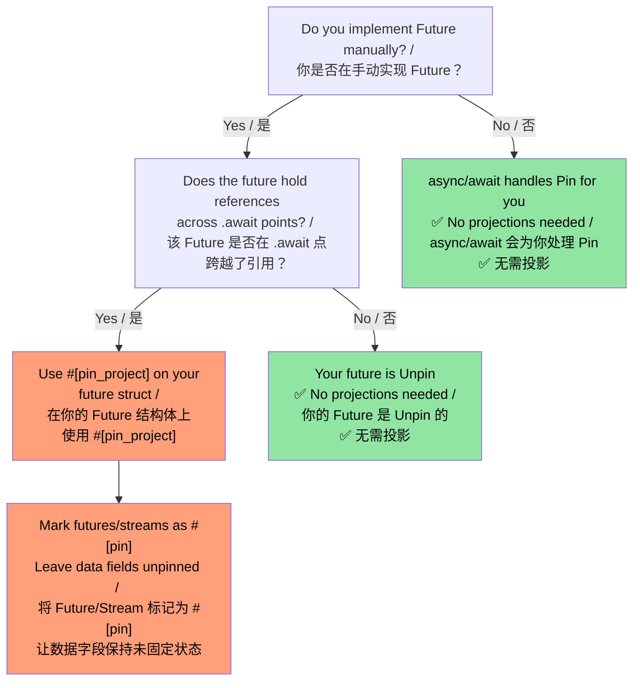
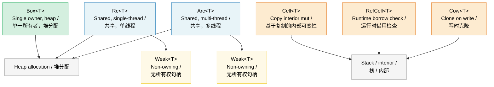

# 9. Smart Pointers and Interior Mutability / 9. 智能指针与内部可变性 🟡

> **What you'll learn / 你将学到：**
> - `Box`, `Rc`, `Arc` for heap allocation and shared ownership / 用于堆分配和共享所有权的 `Box`、`Rc`、`Arc`
> - `Weak` references for breaking `Rc`/`Arc` reference cycles / 用于打破 `Rc`/`Arc` 引用循环的 `Weak` 引用
> - `Cell`, `RefCell`, and `Cow` for interior mutability patterns / 用于内部可变性模式的 `Cell`、`RefCell` 和 `Cow`
> - `Pin` for self-referential types and `ManuallyDrop` for lifecycle control / 用于自引用类型的 `Pin` 和用于生命周期控制的 `ManuallyDrop`

## Box, Rc, Arc — Heap Allocation and Sharing

## Box, Rc, Arc — Heap Allocation and Sharing / Box, Rc, Arc —— 堆分配与共享

```rust
// --- Box<T>: Single owner, heap allocation ---
// --- Box<T>：单一所有者，堆分配 ---
// Use when: recursive types, large values, trait objects
// 适用场景：递归类型、大型数值、Trait 对象
let boxed: Box<i32> = Box::new(42);
println!("{}", *boxed); // Deref to i32 / 解引用为 i32

// Recursive type requires Box (otherwise infinite size):
// 递归类型需要 Box（否则其大小将无限大）：
enum List<T> {
    Cons(T, Box<List<T>>),
    Nil,
}

// Trait object (dynamic dispatch):
// Trait 对象（动态分发）：
let writer: Box<dyn std::io::Write> = Box::new(std::io::stdout());

// --- Rc<T>: Multiple owners, single-threaded ---
// --- Rc<T>：多个所有者，单线程 ---
// Use when: shared ownership within one thread (no Send/Sync)
// 适用场景：单线程内的共享所有权（非 Send/Sync）
use std::rc::Rc;

let a = Rc::new(vec![1, 2, 3]);
let b = Rc::clone(&a); // Increments reference count (NOT deep clone) / 增加引用计数（而非深拷贝）
let c = Rc::clone(&a);
println!("Ref count: {}", Rc::strong_count(&a)); // 3

// All three point to the same Vec. When the last Rc is dropped,
// the Vec is deallocated.
// 三者都指向同一个 Vec。当最后一个 Rc 被丢弃时，该 Vec 内存也会被释放。

// --- Arc<T>: Multiple owners, thread-safe ---
// --- Arc<T>：多个所有者，线程安全 ---
// Use when: shared ownership across threads
// 适用场景：跨线程的共享所有权
use std::sync::Arc;

let shared = Arc::new(String::from("shared data"));
let handles: Vec<_> = (0..5).map(|_| {
    let shared = Arc::clone(&shared);
    std::thread::spawn(move || println!("{shared}"))
}).collect();
for h in handles { h.join().unwrap(); }
```

### Weak References — Breaking Reference Cycles / Weak 引用 —— 打破引用循环

`Rc` and `Arc` use reference counting, which cannot free cycles (A → B → A).
`Weak<T>` is a non-owning handle that does **not** increment the strong count:

`Rc` 和 `Arc` 使用引用计数，这无法释放循环引用（如 A → B → A）。
`Weak<T>` 是一种不具有所有权的句柄，它 **不会** 增加强引用计数（strong count）：

```rust
use std::rc::{Rc, Weak};
use std::cell::RefCell;

struct Node {
    value: i32,
    parent: RefCell<Weak<Node>>,   // does NOT keep parent alive / 不会让父节点保持存活
    children: RefCell<Vec<Rc<Node>>>,
}

let parent = Rc::new(Node {
    value: 0, parent: RefCell::new(Weak::new()), children: RefCell::new(vec![]),
});
let child = Rc::new(Node {
    value: 1, parent: RefCell::new(Rc::downgrade(&parent)), children: RefCell::new(vec![]),
});
parent.children.borrow_mut().push(Rc::clone(&child));

// Access parent from child — returns Option<Rc<Node>>:
// 从子节点访问父节点 —— 返回一个 Option<Rc<Node>>：
if let Some(p) = child.parent.borrow().upgrade() {
    println!("Child's parent value: {}", p.value); // 0
}
// When `parent` is dropped, strong_count → 0, memory is freed.
// `child.parent.upgrade()` would then return `None`.
// 当 `parent` 被丢弃时，强引用计数变为 0，内存将被释放。
// 此时 `child.parent.upgrade()` 将会返回 `None`。
```

**Rule of thumb**: Use `Rc`/`Arc` for ownership edges, `Weak` for back-references and caches. For thread-safe code, use `Arc<T>` with `sync::Weak<T>`.

**经验法则**：对于具有所有权的连接使用 `Rc`/`Arc`，对于背向引用（back-references）和缓存使用 `Weak`。对于线程安全的代码，请将 `Arc<T>` 与 `sync::Weak<T>` 配合使用。

### Cell and RefCell — Interior Mutability / Cell 与 RefCell —— 内部可变性

Sometimes you need to mutate data behind a shared (`&`) reference. Rust provides *interior mutability* with runtime borrow checking:

有时你需要修改隐藏在共享（`&`）引用之后的数据。Rust 通过运行时借用检查提供了 **内部可变性（interior mutability）**：

```rust
use std::cell::{Cell, RefCell};

// --- Cell<T>: Copy-based interior mutability ---
// --- Cell<T>：基于复制的内部可变性 ---
// Only for Copy types (or types you swap in/out)
// 仅适用于 Copy 类型（或者你进行 swap/replace 操作的类型）
struct Counter {
    count: Cell<u32>,
}

impl Counter {
    fn new() -> Self { Counter { count: Cell::new(0) } }

    fn increment(&self) { // &self, not &mut self!
        self.count.set(self.count.get() + 1);
    }

    fn value(&self) -> u32 { self.count.get() }
}

// --- RefCell<T>: Runtime borrow checking ---
// --- RefCell<T>：运行时借用检查 ---
// Panics if you violate borrow rules at runtime
// 如果在运行时违反借用规则，将会触发 Panic
struct Cache {
    data: RefCell<Vec<String>>,
}

impl Cache {
    fn new() -> Self { Cache { data: RefCell::new(Vec::new()) } }

    fn add(&self, item: String) { // &self — looks immutable from outside
        // &self —— 从外部看是不可变的
        self.data.borrow_mut().push(item); // Runtime-checked &mut / 运行时检查的 &mut
    }

    fn get_all(&self) -> Vec<String> {
        self.data.borrow().clone() // Runtime-checked & / 运行时检查的 &
    }

    fn bad_example(&self) {
        let _guard1 = self.data.borrow();
        // let _guard2 = self.data.borrow_mut();
        // ❌ PANICS at runtime — can't have &mut while & exists
        // ❌ 运行时 Panic —— & 引用存在时不能拥有 &mut
    }
}
```

> **Cell vs RefCell**: `Cell` never panics (it copies/swaps values) but only works with `Copy` types or via `swap()`/`replace()`. `RefCell` works with any type but panics on double-mutable-borrow. Neither is `Sync` — for multithreaded use, see `Mutex`/`RwLock`.
>
> **Cell vs RefCell**：`Cell` 永远不会触发 Panic（它通过复制或交换值来工作），但仅适用于 `Copy` 类型，或者通过 `swap()`/`replace()` 使用。`RefCell` 适用于任何类型，但在发生“双重可变借用”时会触发 Panic。两者都不是 `Sync` —— 对于多线程使用，请参考 `Mutex`/`RwLock`。

### Cow — Clone on Write / Cow —— 写时克隆

`Cow` (Clone on Write) holds either a borrowed or owned value. It clones *only* when mutation is needed:

`Cow` (Clone on Write，写时克隆) 可以持有一个借用的值或一个拥有的值。它 **仅在** 需要修改时才进行克隆：

```rust
use std::borrow::Cow;

// Avoids allocating when no modification is needed:
// 当不需要修改时，避免内存分配：
fn normalize(input: &str) -> Cow<'_, str> {
    if input.contains('\t') {
        // Only allocate if tabs need replacing
        // 只有当制表符需要替换时才进行分配
        Cow::Owned(input.replace('\t', "    "))
    } else {
        // No allocation — just return a reference
        // 无需分配 —— 仅返回一个引用
        Cow::Borrowed(input)
    }
}

fn main() {
    let clean = "no tabs here";
    let dirty = "tabs\there";

    let r1 = normalize(clean); // Cow::Borrowed — zero allocation / 零分配
    let r2 = normalize(dirty); // Cow::Owned — allocated new String / 分配了新的 String

    println!("{r1}");
    println!("{r2}");
}

// Also useful for function parameters that MIGHT need ownership:
// 对于可能需要所有权的函数参数同样有用：
fn process(data: Cow<'_, [u8]>) {
    // Can read data without copying
    // 可以读取数据而无需拷贝
    println!("Length: {}", data.len());
    // If we need to mutate, Cow auto-clones:
    // 如果我们需要修改，Cow 会自动克隆：
    let mut owned = data.into_owned(); // Clone only if Borrowed / 仅在借用时克隆
    owned.push(0xFF);
}
```

#### `Cow<'_, [u8]>` for Binary Data / 用于二进制数据的 `Cow<'_, [u8]>`

`Cow` is especially useful for byte-oriented APIs where data may or may not need transformation (checksum insertion, padding, escaping). This avoids allocating a `Vec<u8>` on the common fast path:

`Cow` 对于面向字节的 API 特别有用，因为在这些场景下，数据可能需要也可能不需要进行转换（如校验和插入、填充、转义）。这在常见的“快速路径”中避免了分配 `Vec<u8>` 的开销：

```rust
use std::borrow::Cow;

/// Pads a frame to a minimum length, borrowing when no padding is needed.
/// 将帧填充到最小长度，如果无需填充，则使用借用。
fn pad_frame(frame: &[u8], min_len: usize) -> Cow<'_, [u8]> {
    if frame.len() >= min_len {
        Cow::Borrowed(frame)  // Already long enough — zero allocation / 已经足够长 —— 零分配
    } else {
        let mut padded = frame.to_vec();
        padded.resize(min_len, 0x00);
        Cow::Owned(padded)    // Allocate only when padding is required / 仅在需要填充时才分配
    }
}

let short = pad_frame(&[0xDE, 0xAD], 8);    // Owned — padded to 8 bytes / Owned —— 已填充至 8 字节
let long  = pad_frame(&[0; 64], 8);          // Borrowed — already ≥ 8 / Borrowed —— 已经 ≥ 8
```

> **Tip**: Combine `Cow<[u8]>` with `bytes::Bytes` (Ch10) when you need reference-counted sharing of potentially-transformed buffers.
>
> **提示**：当你需要对可能经过转换的缓冲区进行引用计数共享时，可以将 `Cow<[u8]>` 与 `bytes::Bytes`（见第 10 章）结合使用。

### When to Use Which Pointer / 该使用哪种指针

| Pointer / 指针 | Owner Count / 所有者数量 | Thread-Safe / 线程安全 | Mutability / 可变性 | Use When / 适用场景 |
|---------|:-----------:|:-----------:|:----------:|----------|
| `Box<T>` | 1 | ✅ (if T: Send) | Via `&mut` | Heap allocation, trait objects, recursive types / 堆分配、Trait 对象、递归类型 |
| `Rc<T>` | N | ❌ | None (wrap in Cell/RefCell) / 无（需包裹在 Cell/RefCell 中） | Shared ownership, single thread, graphs/trees / 共享所有权、单线程、图/树结构 |
| `Arc<T>` | N | ✅ | None (wrap in Mutex/RwLock) / 无（需包裹在 Mutex/RwLock 中） | Shared ownership across threads / 跨线程的共享所有权 |
| `Cell<T>` | — | ❌ | `.get()` / `.set()` | Interior mutability for Copy types / 适用于 Copy 类型的内部可变性 |
| `RefCell<T>` | — | ❌ | `.borrow()` / `.borrow_mut()` | Interior mutability for any type, single thread / 适用于任何类型的内部可变性（单线程） |
| `Cow<'_, T>` | 0 or 1 | ✅ (if T: Send) | Clone on write / 写时克隆 | Avoid allocation when data is often unchanged / 当数据通常保持不变时避免分配 |

### Pin and Self-Referential Types / Pin 与自引用类型

`Pin<P>` prevents a value from being moved in memory. This is essential for **self-referential types** — structs that contain a pointer to their own data — and for `Future`s, which may hold references across `.await` points.

`Pin<P>` 防止一个值在内存中被移动。这对于 **自引用类型（self-referential types）**（即包含指向自身数据指针的结构体）以及 `Future`（可能在 `.await` 点跨越引用）至关重要。

```rust
use std::pin::Pin;
use std::marker::PhantomPinned;

// A self-referential struct (simplified):
// 一个自引用结构体（简化版）：
struct SelfRef {
    data: String,
    ptr: *const String, // Points to `data` above / 指向其上方的 `data`
    _pin: PhantomPinned, // Opts out of Unpin — can't be moved / 排除 Unpin —— 不克被移动
}

impl SelfRef {
    fn new(s: &str) -> Pin<Box<Self>> {
        let val = SelfRef {
            data: s.to_string(),
            ptr: std::ptr::null(),
            _pin: PhantomPinned,
        };
        let mut boxed = Box::pin(val);

        // SAFETY: we don't move the data after setting the pointer
        // 安全性：在设置指针后，我们不再移动数据
        let self_ptr: *const String = &boxed.data;
        unsafe {
            let mut_ref = Pin::as_mut(&mut boxed);
            Pin::get_unchecked_mut(mut_ref).ptr = self_ptr;
        }
        boxed
    }

    fn data(&self) -> &str {
        &self.data
    }

    fn ptr_data(&self) -> &str {
        // SAFETY: ptr was set to point to self.data while pinned
        // 安全性：ptr 在 pinned 时已设置为指向 self.data
        unsafe { &*self.ptr }
    }
}

fn main() {
    let pinned = SelfRef::new("hello");
    assert_eq!(pinned.data(), pinned.ptr_data()); // Both "hello"
    // std::mem::swap would invalidate ptr — but Pin prevents it
    // std::mem::swap 会使指针失效 —— 但 Pin 阻止了这种情况
}
```

**Key concepts / 核心概念：**

| Concept / 概念 | Meaning / 含义 |
|---------|--------|
| `Unpin` (auto-trait) | "Moving this type is safe." Most types are `Unpin` by default. / “移动此类型是安全的。” 大多数类型默认都是 `Unpin` 的。 |
| `!Unpin` / `PhantomPinned` | "I have internal pointers — don't move me." / “我有内部指针 —— 别移动我。” |
| `Pin<&mut T>` | A mutable reference that guarantees `T` won't move / 保证 `T` 不会被移动的可变引用 |
| `Pin<Box<T>>` | An owned, heap-pinned value / 拥有的、堆上固定的值 |

**Why this matters for async / 为什么这对于异步很重要：**

Every `async fn` desugars to a `Future` that may hold references across `.await` points — making it self-referential. The async runtime uses `Pin<&mut Future>` to guarantee the future isn't moved once polled.

每一个 `async fn` 都会反糖化（desugar）为一个 `Future`，它可能在 `.await` 点跨越引用 —— 使其成为自引用的。异步运行时使用 `Pin<&mut Future>` 来保证 Future 在第一次轮询（poll）后不会被移动。

```rust
// When you write: / 当你写下：
async fn fetch(url: &str) -> String {
    let response = http_get(url).await; // reference held across await / 引用跨越了 await
    response.text().await
}

// The compiler generates a state machine struct that is !Unpin,
// and the runtime pins it before calling Future::poll().
// 编译器生成一个 !Unpin 的状态机结构体，运行时在调用 Future::poll() 之前会将其固定。
```

> **When to care about Pin**: (1) Implementing `Future` manually, (2) writing async runtimes or combinators, (3) any struct with self-referential pointers. For normal application code, `async/await` handles pinning transparently. See the companion *Async Rust Training* for deeper coverage.
>
> **何时需要关心 Pin**：(1) 手动实现 `Future`；(2) 编写异步运行时或组合器；(3) 任何带有自引用指针的结构体。对于普通的应用程序代码，`async/await` 会透明地处理固定。参见配套的《Async Rust 培训》以获得更深入的讲解。
>
> **Crate alternatives**: For self-referential structs without manual `Pin`, consider [`ouroboros`](https://crates.io/crates/ouroboros) or [`self_cell`](https://crates.io/crates/self_cell) — they generate safe wrappers with correct pinning and drop semantics.
>
> **Crate 替代方案**：对于无需手动 `Pin` 的自引用结构体，可以考虑使用 [`ouroboros`](https://crates.io/crates/ouroboros) 或 [`self_cell`](https://crates.io/crates/self_cell) —— 它们会生成带有正确固定和丢弃语义的安全包装器。

### Pin Projections — Structural Pinning / Pin 投影 —— 结构化固定

When you have a `Pin<&mut MyStruct>`, you often need to access individual fields. **Pin projection** is the pattern for safely going from `Pin<&mut Struct>` to `Pin<&mut Field>` (for pinned fields) or `&mut Field` (for unpinned fields).

当你拥有一个 `Pin<&mut MyStruct>` 时，你经常需要访问其中的单个字段。**Pin 投影（Pin projection）** 是一种安全地从 `Pin<&mut Struct>` 转换到 `Pin<&mut Field>`（用于固定字段）或 `&mut Field`（用于未固定字段）的模式。

#### The Problem: Field Access on Pinned Types / 问题所在：访问固定类型的字段

```rust
use std::pin::Pin;
use std::marker::PhantomPinned;

struct MyFuture {
    data: String,              // Regular field — safe to move / 普通字段 —— 可以安全移动
    state: InternalState,      // Self-referential — must stay pinned / 自引用 —— 必须保持固定
    _pin: PhantomPinned,
}

enum InternalState {
    Waiting { ptr: *const String }, // Points to `data` — self-referential / 指向 `data` —— 自引用
    Done,
}

// Given `Pin<&mut MyFuture>`, how do you access `data` and `state`?
// You CAN'T just do `pinned.data` — the compiler won't let you
// get a &mut to a field of a pinned value without unsafe.
// 给定 `Pin<&mut MyFuture>`，你该如何访问 `data` 和 `state`？
// 你不能直接写 `pinned.data` —— 编译器不允许你在不使用 unsafe 的情况下获取固定值的字段的可变引用（&mut）。
```

#### Manual Pin Projection (unsafe) / 手动 Pin 投影（unsafe）

```rust
impl MyFuture {
    // Project to `data` — this field is structurally unpinned (safe to move)
    // 投影到 `data` —— 该字段在结构上未被固定（可以安全移动）
    fn data(self: Pin<&mut Self>) -> &mut String {
        // SAFETY: `data` is not structurally pinned. Moving `data` alone
        // doesn't move the whole struct, so Pin's guarantee is preserved.
        // 安全性：`data` 在结构上未被固定。仅移动 `data` 不会移动整个结构体，
        // 因此保留了 Pin 的保证。
        unsafe { &mut self.get_unchecked_mut().data }
    }

    // Project to `state` — this field IS structurally pinned
    // 投影到 `state` —— 该字段在结构上已被固定
    fn state(self: Pin<&mut Self>) -> Pin<&mut InternalState> {
        // SAFETY: `state` is structurally pinned — we maintain the
        // pin invariant by returning Pin<&mut InternalState>.
        // 安全性：`state` 在结构上已被固定 —— 我们通过返回 
        // Pin<&mut InternalState> 来维护 Pin 的不变性。
        unsafe { Pin::new_unchecked(&mut self.get_unchecked_mut().state) }
    }
}
```

**Structural pinning rules / 结构化固定规则** — a field is "structurally pinned" if / 如果满足以下条件，则该字段是“结构化固定的”：
1. Moving/swapping that field alone could invalidate a self-reference / 仅移动/交换该字段本身就可能使自引用失效
2. The struct's `Drop` impl must not move the field / 结构体的 `Drop` 实现绝不能移动该字段
3. The struct must be `!Unpin` (enforced by `PhantomPinned` or a `!Unpin` field) / 结构体必须是 `!Unpin` 的（通过 `PhantomPinned` 或 `!Unpin` 字段强制执行）

#### `pin-project` — Safe Pin Projections (Zero Unsafe) / `pin-project` —— 安全的 Pin 投影（零 Unsafe）

The `pin-project` crate generates provably correct projections at compile time, eliminating the need for manual `unsafe`:

`pin-project` crate 在编译时生成可证明正确的投影，从而消除了手动使用 `unsafe` 的必要：

```rust
use pin_project::pin_project;
use std::pin::Pin;
use std::future::Future;
use std::task::{Context, Poll};

#[pin_project]                   // <-- Generates projection methods / 生成投影方法
struct TimedFuture<F: Future> {
    #[pin]                       // <-- Structurally pinned (it's a Future) / 结构化固定（因为它是 Future）
    inner: F,
    started_at: std::time::Instant, // NOT pinned — plain data / 未固定 —— 普通数据
}

impl<F: Future> Future for TimedFuture<F> {
    type Output = (F::Output, std::time::Duration);

    fn poll(self: Pin<&mut Self>, cx: &mut Context<'_>) -> Poll<Self::Output> {
        let this = self.project();  // Safe! Generated by pin_project / 安全！由 pin_project 生成
        //   this.inner   : Pin<&mut F>              — pinned field / 固定字段
        //   this.started_at : &mut std::time::Instant — unpinned field / 未固定字段

        match this.inner.poll(cx) {
            Poll::Ready(output) => {
                let elapsed = this.started_at.elapsed();
                Poll::Ready((output, elapsed))
            }
            Poll::Pending => Poll::Pending,
        }
    }
}
```

#### `pin-project` vs Manual Projection / `pin-project` 对比手动投影

| Aspect / 维度 | Manual (`unsafe`) / 手动 | `pin-project` |
|--------|-------------------|---------------|
| Safety / 安全性 | You prove invariants / 由你证明不变性 | Compiler-verified / 编译器验证 |
| Boilerplate / 样板代码 | Low (but error-prone) / 较少（但易错） | Zero — derive macro / 零样板 —— 通过派生宏 |
| `Drop` interaction / 与 `Drop` 的交互 | Must not move pinned fields / 禁止移动固定字段 | Enforced: `#[pinned_drop]` / 强制执行 |
| Compile-time cost / 编译开销 | None / 无 | Proc-macro expansion / 过程宏展开 |
| Use case / 适用场景 | Primitives, `no_std` / 原型组件、`no_std` | Application / library code / 应用或库代码 |

#### `#[pinned_drop]` — Drop for Pinned Types / 用于固定类型的 Drop

When a type has `#[pin]` fields, `pin-project` requires `#[pinned_drop]` instead of a regular `Drop` impl to prevent accidentally moving pinned fields:

当一个类型包含 `#[pin]` 字段时，`pin-project` 要求使用 `#[pinned_drop]` 而非普通的 `Drop` 实现，以防止意外移动固定字段：

```rust
use pin_project::{pin_project, pinned_drop};
use std::pin::Pin;

#[pin_project(PinnedDrop)]
struct Connection<F> {
    #[pin]
    future: F,
    buffer: Vec<u8>,  // Not pinned — can be moved in drop / 未固定 —— 可以在 drop 中被移动
}

#[pinned_drop]
impl<F> PinnedDrop for Connection<F> {
    fn drop(self: Pin<&mut Self>) {
        let this = self.project();
        // `this.future` is Pin<&mut F> — can't be moved, only dropped in place
        // `this.future` 是 Pin<&mut F> —— 不能被移动，只能原地销毁
        // `this.buffer` is &mut Vec<u8> — can be drained, cleared, etc.
        // `this.buffer` 是 &mut Vec<u8> —— 可以进行 drain、clear 等操作
        this.buffer.clear();
        println!("Connection dropped, buffer cleared");
    }
}
```

#### When Pin Projections Matter in Practice / 何时需要在实践中考虑 Pin 投影



> **Rule of thumb**: If you're wrapping another `Future` or `Stream`, use `pin-project`. If you're writing application code with `async/await`, you'll never need pin projections directly. See the companion *Async Rust Training* for async combinator patterns that use pin projections.
>
> **经验法则**：如果你正在包装另一个 `Future` 或 `Stream`，请使用 `pin-project`。如果你正在使用 `async/await` 编写应用程序代码，你永远不需要直接处理 Pin 投影。参见配套的《Async Rust 培训》了解使用 Pin 投影的异步组合器模式。

### Drop Ordering and ManuallyDrop / 丢弃顺序与 ManuallyDrop

Rust's drop order is deterministic but has rules worth knowing:

Rust 的丢弃（drop）顺序是确定的，但有一些规则值得了解：

#### Drop Order Rules / 丢弃顺序规则

```rust
struct Label(&'static str);

impl Drop for Label {
    fn drop(&mut self) { println!("Dropping {}", self.0); }
}

fn main() {
    let a = Label("first");   // Declared first / 首先声明
    let b = Label("second");  // 其次声明
    let c = Label("third");   // 最后声明
}
// Output: / 输出：
//   Dropping third    ← locals drop in REVERSE declaration order
//   Dropping third    ← 局部变量按声明的逆序丢弃
//   Dropping second
//   Dropping first
```

**The three rules / 三大规则：**

| What / 对象 | Drop Order / 丢弃顺序 | Rationale / 原理 |
|------|-----------|----------|
| **Local variables / 局部变量** | Reverse declaration order / 声明的逆序 | Later variables might reference earlier ones / 后声明的变量可能引用先声明的变量 |
| **Struct fields / 结构体字段** | Declaration order (top to bottom) / 声明顺序（从上到下） | Matches construction order (stable since Rust 1.0, guaranteed by [RFC 1857](https://rust-lang.github.io/rfcs/1857-stabilize-drop-order.html)) / 符合构建顺序（自 Rust 1.0 起稳定，由 [RFC 1857](https://rust-lang.github.io/rfcs/1857-stabilize-drop-order.html) 保证） |
| **Tuple elements / 元组元素** | Declaration order (left to right) / 声明顺序（从左到右） | `(a, b, c)` → drop `a`, then `b`, then `c` / `(a, b, c)` → 先丢弃 `a`，然后 `b`，最后 `c` |

```rust
struct Server {
    listener: Label,  // Dropped 1st / 第一个丢弃
    handler: Label,   // Dropped 2nd / 第二个丢弃
    logger: Label,    // Dropped 3rd / 第三个丢弃
}
// Fields drop top-to-bottom (declaration order).
// This matters when fields reference each other or hold resources.
// 字段按从上到下的顺序（声明顺序）丢弃。
// 当字段之间存在引用关系或持有资源时，这一点至关重要。
```

> **Practical impact / 实际影响**：如果你的结构体包含一个 `JoinHandle` 和一个 `Sender`，字段顺序将决定谁先被丢弃。如果线程正在从通道读取数据，请先丢弃 `Sender`（关闭通道）以使线程退出，然后再加入（join）句柄。在结构体中，应将 `Sender` 放在 `JoinHandle` 之上。

#### `ManuallyDrop<T>` — Suppressing Automatic Drop / `ManuallyDrop<T>` —— 抑制自动丢弃

`ManuallyDrop<T>` wraps a value and prevents its destructor from running automatically. You take responsibility for dropping it (or intentionally leaking it):

`ManuallyDrop<T>` 包装一个值并防止其析构函数自动运行。你将承担起手动丢弃（或有意让其泄漏）它的责任：

```rust
use std::mem::ManuallyDrop;

// Use case 1: Prevent double-free in unsafe code
// 使用场景 1：防止 unsafe 代码中的二次释放（double-free）
struct TwoPhaseBuffer {
    // We need to drop the Vec ourselves to control timing
    // 我们需要自行丢弃 Vec 以控制时机
    data: ManuallyDrop<Vec<u8>>,
    committed: bool,
}

impl TwoPhaseBuffer {
    fn new(capacity: usize) -> Self {
        TwoPhaseBuffer {
            data: ManuallyDrop::new(Vec::with_capacity(capacity)),
            committed: false,
        }
    }

    fn write(&mut self, bytes: &[u8]) {
        self.data.extend_from_slice(bytes);
    }

    fn commit(&mut self) {
        self.committed = true;
        println!("Committed {} bytes", self.data.len());
    }
}

impl Drop for TwoPhaseBuffer {
    fn drop(&mut self) {
        if !self.committed {
            println!("Rolling back — dropping uncommitted data");
        }
        // SAFETY: data is always valid here; we only drop it once.
        // 安全性：data 在此处始终有效；且我们只丢弃它一次。
        unsafe { ManuallyDrop::drop(&mut self.data); }
    }
}
```

```rust
// Use case 2: Intentional leak (e.g., global singletons)
// 使用场景 2：故意泄漏（例如全局单例）
fn leaked_string() -> &'static str {
    // Box::leak() is the idiomatic way to create a &'static reference:
    // Box::leak() 是创建 &'static 引用的惯用方式：
    let s = String::from("lives forever");
    Box::leak(s.into_boxed_str())
    // ⚠️ This is a controlled memory leak. The String's heap allocation
    // ⚠️ 这是一个受控的内存泄漏。String 的堆分配永远不会被释放。
    // is never freed. Only use for long-lived singletons.
    // 仅用于长生命周期的单例。
}

// ManuallyDrop alternative (requires unsafe):
// ManuallyDrop 替代方案（需要 unsafe）：
// ⚠️ Prefer Box::leak() above — this is shown only to illustrate
// ⚠️ 优先使用上方的 Box::leak() —— 此处仅为演示 ManuallyDrop 的语义
// ManuallyDrop semantics (suppressing Drop while the heap data survives).
fn leaked_string_manual() -> &'static str {
    use std::mem::ManuallyDrop;
    let md = ManuallyDrop::new(String::from("lives forever"));
    // SAFETY: ManuallyDrop prevents deallocation; the heap data lives
    // forever, so a 'static reference is valid.
    // 安全性：ManuallyDrop 阻止了释放；堆数据将永远存在，因此 'static 引用是有效的。
    unsafe { &*(md.as_str() as *const str) }
}
```

```rust
// Use case 3: Union fields (only one variant is valid at a time)
// 使用场景 3：Union 字段（一次只有一个变体有效）
use std::mem::ManuallyDrop;

union IntOrString {
    i: u64,
    s: ManuallyDrop<String>,
    // String has a Drop impl, so it MUST be wrapped in ManuallyDrop
    // inside a union — the compiler can't know which field is active.
    // String 具有 Drop 实现，因此在 union 中它必须被包装在 ManuallyDrop 中 
    // —— 因为编译器无法知道哪个字段是激活状态。
}

// No automatic Drop — the code that constructs IntOrString must also
// handle cleanup. If the String variant is active, call:
// 没有自动丢弃 —— 构造 IntOrString 的代码也必须处理清理工作。
// 如果 String 变体是激活的，请调用：
//   unsafe { ManuallyDrop::drop(&mut value.s); }
// without a Drop impl, the union is simply leaked (no UB, just a leak).
// 如果没有 Drop 实现，union 就会被简单地泄漏（不是未定义行为，只是泄漏）。
```

**ManuallyDrop vs `mem::forget` / ManuallyDrop 对比 `mem::forget`：**

| | `ManuallyDrop<T>` | `mem::forget(value)` |
|---|---|---|
| When / 何时使用 | Wrap at construction / 在构造时包装 | Consume later / 在稍后消耗 |
| Access inner / 访问内部 | `&*md` / `&mut *md` | Value is gone / 值已消失 |
| Drop later / 稍后丢弃 | `ManuallyDrop::drop(&mut md)` | Not possible / 不可能 |
| Use case / 适用场景 | Fine-grained lifecycle control / 细粒度生命周期控制 | Fire-and-forget leak / “发完即忘”式的泄漏 |

> **Rule**: Use `ManuallyDrop` in unsafe abstractions where you need to control *exactly* when a destructor runs. In safe application code, you almost never need it — Rust's automatic drop ordering handles things correctly.
>
> **法则**：在需要 **精确** 控制析构函数何时运行的 unsafe 抽象中使用 `ManuallyDrop`。在安全的应用程序代码中，你几乎永远不需要它 —— Rust 的自动丢弃顺序会正确处理一切。

> **Key Takeaways — Smart Pointers / 核心要点 —— 智能指针**
> - `Box` for single ownership on heap; `Rc`/`Arc` for shared ownership (single-/multi-threaded) / `Box` 用于堆上的单一所有权；`Rc`/`Arc` 用于（单线程/多线程）共享所有权
> - `Cell`/`RefCell` provide interior mutability; `RefCell` panics on violations at runtime / `Cell`/`RefCell` 提供内部可变性；`RefCell` 在运行时违反规则时会触发 Panic
> - `Cow` avoids allocation on the common path; `Pin` prevents moves for self-referential types / `Cow` 在常见路径下避免内存分配；`Pin` 防止自引用类型的移动
> - Drop order: fields drop in declaration order (RFC 1857); locals drop in reverse declaration order / 丢弃顺序：字段按声明顺序丢弃（RFC 1857）；局部变量按声明的逆序丢弃

> **See also / 另请参阅:** [Ch 6 — Concurrency](ch06-concurrency-vs-parallelism-vs-threads.md) for Arc + Mutex patterns. [Ch 4 — PhantomData](ch04-phantomdata-types-that-carry-no-data.md) for PhantomData used with smart pointers.
>
> 参见 [第 6 章 —— 并发](ch06-concurrency-vs-parallelism-vs-threads.md) 了解 Arc + Mutex 模式。参见 [第 4 章 —— PhantomData](ch04-phantomdata-types-that-carry-no-data.md) 了解在智能指针中使用 PhantomData。



---

### Exercise: Reference-Counted Graph ★★ (~30 min) / 练习：引用计数图 ★★（约 30 分钟）

Build a directed graph using `Rc<RefCell<Node>>` where each node has a name and a list of children. Create a cycle (A → B → C → A) using `Weak` to break the back-edge. Verify no memory leak with `Rc::strong_count`.

使用 `Rc<RefCell<Node>>` 构建一个有向图，其中每个节点都有一个名称和子节点列表。创建一个循环（A → B → C → A），并使用 `Weak` 来打破背向边（back-edge）。通过 `Rc::strong_count` 验证没有内存泄漏。

<details>
<summary>🔑 Solution / 参考答案</summary>

```rust
use std::cell::RefCell;
use std::rc::{Rc, Weak};

struct Node {
    name: String,
    children: Vec<Rc<RefCell<Node>>>,
    back_ref: Option<Weak<RefCell<Node>>>,
}

impl Node {
    fn new(name: &str) -> Rc<RefCell<Self>> {
        Rc::new(RefCell::new(Node {
            name: name.to_string(),
            children: Vec::new(),
            back_ref: None,
        }))
    }
}

impl Drop for Node {
    fn drop(&mut self) {
        println!("Dropping {}", self.name);
    }
}

fn main() {
    let a = Node::new("A");
    let b = Node::new("B");
    let c = Node::new("C");

    // A → B → C, with C back-referencing A via Weak
    // A → B → C，其中 C 通过 Weak 背向引用 A
    a.borrow_mut().children.push(Rc::clone(&b));
    b.borrow_mut().children.push(Rc::clone(&c));
    c.borrow_mut().back_ref = Some(Rc::downgrade(&a)); // Weak ref! / Weak 引用！

    println!("A strong count: {}", Rc::strong_count(&a)); // 1 (only `a` binding) / 1（只有 `a` 绑定）
    println!("B strong count: {}", Rc::strong_count(&b)); // 2 (b + A's child) / 2（变量 b + A 的子节点）
    println!("C strong count: {}", Rc::strong_count(&c)); // 2 (c + B's child) / 2（变量 c + B 的子节点）

    // Upgrade the weak ref to prove it works:
    // 升级 Weak 引用以证明其有效：
    let c_ref = c.borrow();
    if let Some(back) = &c_ref.back_ref {
        if let Some(a_ref) = back.upgrade() {
            println!("C points back to: {}", a_ref.borrow().name);
        }
    }
    // When a, b, c go out of scope, all Nodes drop (no cycle leak!)
    // 当 a, b, c 离开作用域时，所有节点都会被丢弃（没有循环泄露！）
}
```

</details>

***

