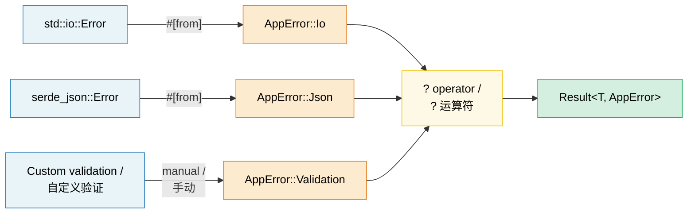

# 10. Error Handling Patterns / 10. 错误处理模式 🟢

> **What you'll learn / 你将学到：**
> - When to use `thiserror` (libraries) vs `anyhow` (applications) / 何时使用 `thiserror`（库）与 `anyhow`（应用程序）
> - Error conversion chains with `#[from]` and `.context()` wrappers / 使用 `#[from]` 和 `.context()` 包装器的错误转换链
> - How the `?` operator desugars and works in `main()` / `?` 运算符是如何反糖化（desugar）以及如何在 `main()` 中工作的
> - When to panic vs return errors, and `catch_unwind` for FFI boundaries / 何时触发 Panic 与何时返回错误，以及用于 FFI 边界的 `catch_unwind`

## thiserror vs anyhow — Library vs Application / thiserror 与 anyhow —— 库与应用程序

Rust error handling centers on the `Result<T, E>` type. Two crates dominate:

Rust 的错误处理围绕 `Result<T, E>` 类型展开。该领域有两款主流的 crate：

```rust,ignore
// --- thiserror: For LIBRARIES ---
// --- thiserror：适用于“库” ---
// Generates Display, Error, and From impls via derive macros
// 通过派生宏生成 Display、Error 和 From 实现
use thiserror::Error;

#[derive(Error, Debug)]
pub enum DatabaseError {
    #[error("connection failed: {0}")]
    ConnectionFailed(String),

    #[error("query error: {source}")]
    QueryError {
        #[source]
        source: sqlx::Error,
    },

    #[error("record not found: table={table} id={id}")]
    NotFound { table: String, id: u64 },

    #[error(transparent)] // Delegate Display to the inner error / 将 Display 委托给内部错误
    Io(#[from] std::io::Error), // Auto-generates From<io::Error> / 自动生成 From<io::Error>
}

// --- anyhow: For APPLICATIONS ---
// --- anyhow：适用于“应用程序” ---
// Dynamic error type — great for top-level code where you just want errors to propagate
// 动态错误类型 —— 非常适合这种仅仅需要传播错误的顶层代码
use anyhow::{Context, Result, bail, ensure};

fn read_config(path: &str) -> Result<Config> {
    let content = std::fs::read_to_string(path)
        .with_context(|| format!("failed to read config from {path}"))?;

    let config: Config = serde_json::from_str(&content)
        .context("failed to parse config JSON")?;

    ensure!(config.port > 0, "port must be positive, got {}", config.port);

    Ok(config)
}

fn main() -> Result<()> {
    let config = read_config("server.toml")?;

    if config.name.is_empty() {
        bail!("server name cannot be empty"); // Return Err immediately / 立即返回 Err
    }

    Ok(())
}
```

**When to use which / 该如何选择：**

| | `thiserror` | `anyhow` |
|---|---|---|
| **Use in / 用于** | Libraries, shared crates / 库、共享 crate | Applications, binaries / 应用程序、二进制文件 |
| **Error types / 错误类型** | Concrete enums — callers can match / 具体的枚举 —— 调用者可以进行 match | `anyhow::Error` — opaque / 封闭的（Opaque） |
| **Effort / 开发工作量** | Define your error enum / 定义你的错误枚举 | Just use `Result<T>` / 直接使用 `Result<T>` 即可 |
| **Downcasting / 向下转型** | Not needed — pattern match / 不需要 —— 利用模式匹配 | `error.downcast_ref::<MyError>()` |

### Error Conversion Chains (#[from]) / 错误转换链 (#[from])

```rust,ignore
use thiserror::Error;

#[derive(Error, Debug)]
enum AppError {
    #[error("I/O error: {0}")]
    Io(#[from] std::io::Error),

    #[error("JSON error: {0}")]
    Json(#[from] serde_json::Error),

    #[error("HTTP error: {0}")]
    Http(#[from] reqwest::Error),
}

// Now ? automatically converts:
// 此时 ? 会自动进行转换：
fn fetch_and_parse(url: &str) -> Result<Config, AppError> {
    let body = reqwest::blocking::get(url)?.text()?;  // reqwest::Error → AppError::Http
    let config: Config = serde_json::from_str(&body)?; // serde_json::Error → AppError::Json
    Ok(config)
}
```

### Context and Error Wrapping / 上下文与错误包装

Add human-readable context to errors without losing the original:

在不丢失原始错误的情况下，为错误添加人类可读的上下文：

```rust,ignore
use anyhow::{Context, Result};

fn process_file(path: &str) -> Result<Data> {
    let content = std::fs::read_to_string(path)
        .with_context(|| format!("failed to read {path}"))?;

    let data = parse_content(&content)
        .with_context(|| format!("failed to parse {path}"))?;

    validate(&data)
        .context("validation failed")?;

    Ok(data)
}

// Error output: / 错误输出：
// Error: validation failed
//
// Caused by:
//    0: failed to parse config.json
//    1: expected ',' at line 5 column 12
```

### The ? Operator in Depth / 深入了解 ? 运算符

`?` is syntactic sugar for a `match` + `From` conversion + early return:

`?` 是 `match` + `From` 转换 + 提前返回（early return）的语法糖：

```rust
// This: / 这段代码：
let value = operation()?;

// Desugars to: / 反糖化后等同于：
let value = match operation() {
    Ok(v) => v,
    Err(e) => return Err(From::from(e)),
    //                  ^^^^^^^^^^^^^^
    //                  Automatic conversion via From trait
    //                  通过 From trait 进行自动转换
};
```

**`?` also works with `Option`** (in functions returning `Option`):

**`?` 也能用于 `Option`**（在返回 `Option` 的函数中）：

```rust
fn find_user_email(users: &[User], name: &str) -> Option<String> {
    let user = users.iter().find(|u| u.name == name)?; // Returns None if not found / 若未找到则返回 None
    let email = user.email.as_ref()?; // Returns None if email is None / 若 email 为 None 则返回 None
    Some(email.to_uppercase())
}
```

### Panics, catch_unwind, and When to Abort / Panic、catch_unwind 以及何时中止

```rust
// Panics: for BUGS, not expected errors
// Panic：用于处理 BUG，而非预料中的错误
fn get_element(data: &[i32], index: usize) -> &i32 {
    // If this panics, it's a programming error (bug).
    // Don't "handle" it — fix the caller.
    // 如果这里发生 panic，说明是编程错误（bug）。
    // 不要试图“处理”它 —— 请修复调用者。
    &data[index]
}

// catch_unwind: for boundaries (FFI, thread pools)
// catch_unwind：用于边界场景（FFI、线程池）
use std::panic;

let result = panic::catch_unwind(|| {
    // Run potentially panicking code safely
    // 安全地运行可能发生 panic 的代码
    risky_operation()
});

match result {
    Ok(value) => println!("Success: {value:?}"),
    Err(_) => eprintln!("Operation panicked — continuing safely"),
    // Err(_) => eprintln!("操作发生 panic —— 正在安全地继续运行"),
}

// When to use which / 该如何选择：
// - Result<T, E> → expected failures (file not found, network timeout)
// - Result<T, E> → 预料中的失败（如文件未找到、网络超时）
// - panic!()     → programming bugs (index out of bounds, invariant violated)
// - panic!()     → 编程 bug（如索引越界、违反不变性）
// - process::abort() → unrecoverable state (security violation, corrupt data)
// - process::abort() → 不可恢复的状态（如安全违规、数据损坏）
```

> **C++ comparison**: `Result<T, E>` replaces exceptions for expected errors. `panic!()` is like `assert()` or `std::terminate()` — it's for bugs, not control flow. Rust's `?` operator makes error propagation as ergonomic as exceptions without the unpredictable control flow.
>
> **C++ 对比**：`Result<T, E>` 取代了 C++ 中处理预期错误的异常机制。`panic!()` 类似于 `assert()` 或 `std::terminate()` —— 它是为了处理 bug，而非控制流。Rust 的 `?` 运算符使错误传播像异常一样符合人体工程学，同时又避免了不可预测的控制流。

> **Key Takeaways — Error Handling / 核心要点 —— 错误处理**
> - Libraries: `thiserror` for structured error enums; applications: `anyhow` for ergonomic propagation / 库：使用 `thiserror` 定义结构化错误枚举；应用程序：使用 `anyhow` 进行符合人体工程学的错误传播
> - `#[from]` auto-generates `From` impls; `.context()` adds human-readable wrappers / `#[from]` 自动生成 `From` 实现；`.context()` 添加人类可读的包装层
> - `?` desugars to `From::from()` + early return; works in `main()` returning `Result` / `?` 会反糖化为 `From::from()` + 提前返回；可在返回 `Result` 的 `main()` 函数中使用

> **See also / 另请参阅:** [Ch 14 — API Design](ch14-crate-architecture-and-api-design.md) for "parse, don't validate" patterns. [Ch 11 — Serialization](ch11-serialization-zero-copy-and-binary-data.md) for serde error handling.
>
> 参见 [第 14 章 —— API 设计](ch14-crate-architecture-and-api-design.md) 了解“解析而非验证”模式。参见 [第 11 章 —— 序列化](ch11-serialization-zero-copy-and-binary-data.md) 了解 serde 错误处理。



---

### Exercise: Error Hierarchy with thiserror ★★ (~30 min) / 练习：使用 thiserror 构建错误层级 ★★（约 30 分钟）

Design an error type hierarchy for a file-processing application that can fail during I/O, parsing (JSON and CSV), and validation. Use `thiserror` and demonstrate `?` propagation.

为文件处理应用程序设计错误类型层级，该程序可能会在 I/O、解析（JSON 和 CSV）以及验证期间发生失败。使用 `thiserror` 并演示 `?` 运算符的传播。

<details>
<summary>🔑 Solution / 参考答案</summary>

```rust,ignore
use thiserror::Error;

#[derive(Error, Debug)]
pub enum AppError {
    #[error("I/O error: {0}")]
    Io(#[from] std::io::Error),

    #[error("JSON parse error: {0}")]
    Json(#[from] serde_json::Error),

    #[error("CSV error at line {line}: {message}")]
    Csv { line: usize, message: String },

    #[error("validation error: {field} — {reason}")]
    Validation { field: String, reason: String },
}

fn read_file(path: &str) -> Result<String, AppError> {
    Ok(std::fs::read_to_string(path)?) // io::Error → AppError::Io via #[from]
}

fn parse_json(content: &str) -> Result<serde_json::Value, AppError> {
    Ok(serde_json::from_str(content)?) // serde_json::Error → AppError::Json
}

fn validate_name(value: &serde_json::Value) -> Result<String, AppError> {
    let name = value.get("name")
        .and_then(|v| v.as_str())
        .ok_or_else(|| AppError::Validation {
            field: "name".into(),
            reason: "must be a non-null string".into(),
        })?;

    if name.is_empty() {
        return Err(AppError::Validation {
            field: "name".into(),
            reason: "must not be empty".into(),
        });
    }

    Ok(name.to_string())
}

fn process_file(path: &str) -> Result<String, AppError> {
    let content = read_file(path)?;
    let json = parse_json(&content)?;
    let name = validate_name(&json)?;
    Ok(name)
}

fn main() {
    match process_file("config.json") {
        Ok(name) => println!("Name: {name}"),
        Err(e) => eprintln!("Error: {e}"),
    }
}
```

</details>

***

