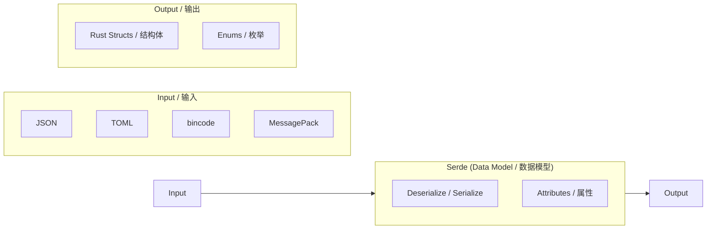

# 11. Serialization, Zero-Copy, and Binary Data / 11. 序列化、零拷贝与二进制数据 🟡

> **What you'll learn / 你将学到：**
> - `serde` fundamentals: derive macros, attributes, and enum representations / `serde` 基础：派生宏、属性和枚举表示形式
> - Zero-copy deserialization for high-performance read-heavy workloads / 适用于高性能、重负载读取场景的零拷贝（Zero-copy）反序列化
> - The `serde` format ecosystem (JSON, TOML, bincode, MessagePack) / `serde` 格式生态系统（JSON、TOML、bincode、MessagePack）
> - Binary data handling with `repr(C)`, `zerocopy`, and `bytes::Bytes` / 使用 `repr(C)`、`zerocopy` 和 `bytes::Bytes` 处理二进制数据

## serde Fundamentals / `serde` 基础

`serde` (SERialize/DEserialize) is the universal serialization framework for Rust. It separates **data model** (your structs) from **format** (JSON, TOML, binary):

`serde` (SERialize/DEserialize) 是 Rust 中通用的序列化框架。它将 **数据模型（data model）**（即你的结构体）与 **数据格式（format）**（如 JSON、TOML、二进制）分离开来：

```rust,ignore
use serde::{Serialize, Deserialize};

#[derive(Debug, Serialize, Deserialize)]
struct ServerConfig {
    name: String,
    port: u16,
    #[serde(default)]                    // Use Default::default() if missing / 若缺失则使用 Default::default()
    max_connections: usize,
    #[serde(skip_serializing_if = "Option::is_none")]
    tls_cert_path: Option<String>,
}

fn main() -> Result<(), Box<dyn std::error::Error>> {
    // Deserialize from JSON:
    // 从 JSON 反序列化：
    let json_input = r#"{
        "name": "hw-diag",
        "port": 8080
    }"#;
    let config: ServerConfig = serde_json::from_str(json_input)?;
    println!("{config:?}");
    // ServerConfig { name: "hw-diag", port: 8080, max_connections: 0, tls_cert_path: None }

    // Serialize to JSON:
    // 序列化为 JSON：
    let output = serde_json::to_string_pretty(&config)?;
    println!("{output}");

    // Same struct, different format — no code changes:
    // 相同的结构体，不同的格式 —— 无需修改代码：
    let toml_input = r#"
        name = "hw-diag"
        port = 8080
    "#;
    let config: ServerConfig = toml::from_str(toml_input)?;
    println!("{config:?}");

    Ok(())
}
```

> **Key insight / 核心见解**：你的结构体只需派生一次 `Serialize` 和 `Deserialize`。随后，它即可与 *所有* 兼容 `serde` 的格式配合使用 —— 包括 JSON、TOML、YAML、bincode、MessagePack、CBOR、postcard 及其它数十种格式。

### Common serde Attributes / 常用的 `serde` 属性

serde provides fine-grained control over serialization through field and container attributes:

`serde` 通过字段属性（field attributes）和容器属性（container attributes）提供了对序列化的细粒度控制：

```rust,ignore
use serde::{Serialize, Deserialize};

// --- Container attributes (on the struct/enum) ---
// --- 容器属性（作用于结构体/枚举） ---
#[derive(Serialize, Deserialize)]
#[serde(rename_all = "camelCase")]       // JSON convention: field_name → fieldName
#[serde(deny_unknown_fields)]            // Reject extra keys — strict parsing / 拒绝额外键值 —— 严格解析
struct DiagResult {
    test_name: String,                   // Serialized as "testName"
    pass_count: u32,                     // Serialized as "passCount"
    fail_count: u32,                     // Serialized as "failCount"
}

// --- Field attributes ---
// --- 字段属性 ---
#[derive(Serialize, Deserialize)]
struct Sensor {
    #[serde(rename = "sensor_id")]       // Override field name for serialization / 覆盖序列化时的字段名
    id: u64,

    #[serde(default)]                    // Use Default if missing from input / 若输入中缺失则使用 Default
    enabled: bool,

    #[serde(default = "default_threshold")]
    threshold: f64,

    #[serde(skip)]                       // Never serialize or deserialize / 永不进行序列化或反序列化
    cached_value: Option<f64>,

    #[serde(skip_serializing_if = "Vec::is_empty")]
    tags: Vec<String>,

    #[serde(flatten)]                    // Inline nested struct fields / 内联嵌套结构体的字段
    metadata: Metadata,

    #[serde(with = "hex_bytes")]         // Custom ser/de module / 自定义序列化/反序列化模块
    raw_data: Vec<u8>,
}

fn default_threshold() -> f64 { 1.0 }

#[derive(Serialize, Deserialize)]
struct Metadata {
    vendor: String,
    model: String,
}
// With #[serde(flatten)], the JSON looks like:
// 使用 #[serde(flatten)] 后，JSON 结构如下：
// { "sensor_id": 1, "vendor": "Intel", "model": "X200", ... }
// NOT: { "sensor_id": 1, "metadata": { "vendor": "Intel", ... } }
// 而非：{ "sensor_id": 1, "metadata": { "vendor": "Intel", ... } }
```

**Most-used attributes cheat sheet / 常用属性速查表：**

| Attribute / 属性 | Level / 层级 | Effect / 作用 |
|-----------|-------|--------|
| `rename_all = "camelCase"` | Container / 容器 | Rename all fields to camelCase/snake_case/SCREAMING_SNAKE_CASE / 将所有字段重命名为小驼峰/蛇形/大写蛇形命名 |
| `deny_unknown_fields` | Container / 容器 | Error on unexpected keys (strict mode) / 遇到未预料的键时报错（严格模式） |
| `default` | Field / 字段 | Use `Default::default()` when field missing / 当字段缺失时使用 `Default::default()` |
| `rename = "..."` | Field / 字段 | Custom serialized name / 自定义序列化名称 |
| `skip` | Field / 字段 | Exclude from ser/de entirely / 完全排除在序列化/反序列化之外 |
| `skip_serializing_if = "fn"` | Field / 字段 | Conditionally exclude (e.g., `Option::is_none`) / 条件性排除（如 `Option::is_none`） |
| `flatten` | Field / 字段 | Inline a nested struct's fields / 内联嵌套结构体的字段 |
| `with = "module"` | Field / 字段 | Use custom serialize/deserialize functions / 使用自定义的序列化/反序列化函数 |
| `alias = "..."` | Field / 字段 | Accept alternative names during deserialization / 反序列化时接受备选名称 |
| `deserialize_with = "fn"` | Field / 字段 | Custom deserialize function only / 仅使用自定义的反序列化函数 |
| `untagged` | Enum / 枚举 | Try each variant in order (no discriminant in output) / 按顺序尝试每个变体（输出中不包含判别式） |

### Enum Representations / 枚举表示形式

serde provides four representations for enums in formats like JSON:

对于 JSON 等格式，`serde` 为枚举提供了四种表示形式：

```rust,ignore
use serde::{Serialize, Deserialize};

// 1. Externally tagged (DEFAULT):
// 1. 外部标记（默认）：
#[derive(Serialize, Deserialize)]
enum Command {
    Reboot,
    RunDiag { test_name: String, timeout_secs: u64 },
    SetFanSpeed(u8),
}
// "Reboot"                                          → Command::Reboot
// {"RunDiag": {"test_name": "gpu", "timeout_secs": 60}}  → Command::RunDiag { ... }

// 2. Internally tagged — #[serde(tag = "type")]:
// 2. 内部标记 —— #[serde(tag = "type")]：
#[derive(Serialize, Deserialize)]
#[serde(tag = "type")]
enum Event {
    Start { timestamp: u64 },
    Error { code: i32, message: String },
    End   { timestamp: u64, success: bool },
}
// {"type": "Start", "timestamp": 1706000000}
// {"type": "Error", "code": 42, "message": "timeout"}

// 3. Adjacently tagged — #[serde(tag = "t", content = "c")]:
// 3. 相邻标记 —— #[serde(tag = "t", content = "c")]：
#[derive(Serialize, Deserialize)]
#[serde(tag = "t", content = "c")]
enum Payload {
    Text(String),
    Binary(Vec<u8>),
}
// {"t": "Text", "c": "hello"}
// {"t": "Binary", "c": [0, 1, 2]}

// 4. Untagged — #[serde(untagged)]:
// 4. 无标记 —— #[serde(untagged)]：
#[derive(Serialize, Deserialize)]
#[serde(untagged)]
enum StringOrNumber {
    Str(String),
    Num(f64),
}
// "hello" → StringOrNumber::Str("hello")
// 42.0    → StringOrNumber::Num(42.0)
// ⚠️ Tried IN ORDER — first matching variant wins
// ⚠️ 按顺序尝试 —— 第一个匹配的变体胜出
```

> **Which representation to choose / 该选择哪种表示形式**：对于大多数 JSON API，请使用内部标记（`tag = "type"`）。它是最可读的，并且符合 Go、Python 和 TypeScript 中的惯例。只有在形状（shape）本身足以区分的“联合”类型（union types）中，才使用无标记。

### Zero-Copy Deserialization / 零拷贝反序列化

serde can deserialize without allocating new strings — borrowing directly from the input buffer. This is the key to high-performance parsing:

`serde` 可以实现在不分配新字符串的情况下进行反序列化 —— 直接从输入缓冲区借用数据。这是高性能解析的关键：

```rust,ignore
use serde::Deserialize;

// --- Owned (allocating) ---
// --- 所有权模式（会进行分配） ---
// Each String field copies bytes from the input into new heap allocations.
// 每个 String 字段都会将字节从输入中复制到新的堆分配中。
#[derive(Deserialize)]
struct OwnedRecord {
    name: String,           // Allocates a new String / 分配一个新 String
    value: String,          // Allocates another String / 分配另一个 String
}

// --- Zero-copy (borrowing) ---
// --- 零拷贝模式（进行借用） ---
// &'de str fields borrow directly from the input — ZERO allocation.
// &'de str 字段直接从输入中借用 —— 零分配。
#[derive(Deserialize)]
struct BorrowedRecord<'a> {
    name: &'a str,          // Points into the input buffer / 指向输入缓冲区
    value: &'a str,         // Points into the input buffer / 指向输入缓冲区
}

fn main() {
    let input = r#"{"name": "cpu_temp", "value": "72.5"}"#;

    // Owned: allocates two String objects
    // 所有权模式：分配了两个 String 对象
    let owned: OwnedRecord = serde_json::from_str(input).unwrap();

    // Zero-copy: `name` and `value` point into `input` — no allocation
    // 零拷贝模式：`name` 和 `value` 指向 `input` —— 无分配
    let borrowed: BorrowedRecord = serde_json::from_str(input).unwrap();

    // The output is lifetime-bound: borrowed can't outlive input
    // 输出受生命周期限制：borrowed 的存活时间不能超过 input
    println!("{}: {}", borrowed.name, borrowed.value);
}
```

**Understanding the lifetime / 理解生命周期：**

```rust,ignore
// Deserialize<'de> — the struct can borrow from data with lifetime 'de:
// Deserialize<'de> —— 结构体可以从生命周期为 'de 的数据中借用：
//   struct BorrowedRecord<'a> where 'a == 'de
//   Only works when the input buffer lives long enough
//   仅在输入缓冲区存活时间足够长时有效

// DeserializeOwned — the struct owns all its data, no borrowing:
// DeserializeOwned —— 结构体拥有其所有数据，无借用：
//   trait DeserializeOwned: for<'de> Deserialize<'de> {}
//   Works with any input lifetime (the struct is independent)

use serde::de::DeserializeOwned;

// This function requires owned types — input can be temporary
// 此函数要求所有权类型 —— 输入可以是临时的
fn parse_owned<T: DeserializeOwned>(input: &str) -> T {
    serde_json::from_str(input).unwrap()
}

// This function allows borrowing — more efficient but restricts lifetimes
// 此函数允许借用 —— 更高效，但限制了生命周期
fn parse_borrowed<'a, T: Deserialize<'a>>(input: &'a str) -> T {
    serde_json::from_str(input).unwrap()
}
```

**When to use zero-copy / 何时使用零拷贝：**
- Parsing large files where you only need a few fields / 解析大文件且只需要其中几个字段时
- High-throughput pipelines (network packets, log lines) / 高吞吐量流水线（网络数据包、日志行）时
- When the input buffer already lives long enough (e.g., memory-mapped file) / 输入缓冲区已经存活足够长时间（如内存映射文件）时

**When NOT to use zero-copy / 何时不可使用零拷贝：**
- Input is ephemeral (network read buffer that's reused) / 输入是瞬时的（如被复用的网络读取缓冲区）时
- You need to store the result beyond the input's lifetime / 你需要将结果存储得比输入的生命周期更久时
- Fields need transformation (escapes, normalization) / 字段需要转换（如转义、归一化）时

> **Practical tip / 实用提示**：`Cow<'a, str>` 为你提供了两全其美的选择 —— 尽可能借用，必要时分配（例如，当 JSON 转义序列需要取消转义时）。`serde` 原生支持 `Cow`。
### The Format Ecosystem / 格式生态系统

| Format / 格式 | Crate | Human-Readable / 人类可读 | Size / 体积 | Speed / 速度 | Use Case / 使用场景 |
|--------|-------|:--------------:|:----:|:-----:|----------|
| JSON | `serde_json` | ✅ | Large / 大 | Good / 良 | Config files, REST APIs, logging / 配置文件、REST API、日志 |
| TOML | `toml` | ✅ | Medium / 中 | Good / 良 | Config files (Cargo.toml style) / 配置文件（Cargo.toml 风格） |
| YAML | `serde_yaml` | ✅ | Medium / 中 | Good / 良 | Config files (complex nesting) / 配置文件（复杂嵌套） |
| bincode | `bincode` | ❌ | Small / 小 | Fast / 快 | IPC, caches, Rust-to-Rust / IPC、缓存、Rust 到 Rust 的通信 |
| postcard | `postcard` | ❌ | Tiny / 极小 | Very fast / 极快 | Embedded systems, `no_std` / 嵌入式系统、`no_std` 环境 |
| MessagePack | `rmp-serde` | ❌ | Small / 小 | Fast / 快 | Cross-language binary protocol / 跨语言二进制协议 |
| CBOR | `ciborium` | ❌ | Small / 小 | Fast / 快 | IoT, constrained environments / 物联网、受限环境 |

```rust
// Same struct, many formats — serde's power:
// 同一个结构体，多种格式 —— 这就是 serde 的强大之处：

#[derive(serde::Serialize, serde::Deserialize, Debug)]
struct DiagConfig {
    name: String,
    tests: Vec<String>,
    timeout_secs: u64,
}

let config = DiagConfig {
    name: "accel_diag".into(),
    tests: vec!["memory".into(), "compute".into()],
    timeout_secs: 300,
};

// JSON:   {"name":"accel_diag","tests":["memory","compute"],"timeout_secs":300}
let json = serde_json::to_string(&config).unwrap();       // 67 bytes

// bincode: compact binary — ~40 bytes, no field names
// bincode：紧凑二进制 —— 约 40 字节，不包含地段名称
let bin = bincode::serialize(&config).unwrap();            // Much smaller / 小得多

// postcard: even smaller, varint encoding — great for embedded
// postcard：体积更小，采用变长整数（varint）编码 —— 非常适合嵌入式
// let post = postcard::to_allocvec(&config).unwrap();
```

> **Choose your format / 该选择哪种格式：**
> - Config files humans edit → TOML or JSON / 人类编辑的配置文件 → TOML 或 JSON
> - Rust-to-Rust IPC/caching → bincode (fast, compact, not cross-language) / Rust 到 Rust 的 IPC/缓存 → bincode（快、紧凑、非跨语言）
> - Cross-language binary → MessagePack or CBOR / 跨语言二进制 → MessagePack 或 CBOR
> - Embedded / `no_std` → postcard / 嵌入式 / `no_std` → postcard

### Binary Data and repr(C) / 二进制数据与 `repr(C)`

When you need to parse fixed-layout binary data (hardware protocols, firmware), we use `repr(C)` to ensure the struct layout matches the physical data:

当你需要解析固定布局的二进制数据（如硬件协议、固件）时，我们使用 `repr(C)` 来确保结构体布局与物理数据相匹配：

```rust
// Without repr(C), Rust might reorder fields for better packing
// 不使用 repr(C) 时，Rust 可能会为了更好的打包效果而重新排列字段
#[repr(C)]
#[derive(Debug, Clone, Copy)]
struct IpmiHeader {
    rs_addr: u8,
    net_fn_lun: u8,
    checksum: u8,
    rq_addr: u8,
    rq_seq_lun: u8,
    cmd: u8,
}

// --- Safe binary parsing with manual deserialization ---
// --- 通过手动反序列化进行安全的二进制解析 ---
impl IpmiHeader {
    fn from_bytes(data: &[u8]) -> Option<Self> {
        if data.len() < std::mem::size_of::<Self>() { // Changed size_of to std::mem::size_of
            return None;
        }
        Some(IpmiHeader {
            rs_addr:     data[0],
            net_fn_lun:  data[1],
            checksum:    data[2],
            rq_addr:     data[3],
            rq_seq_lun:  data[4],
            cmd:         data[5],
        })
    }

    fn net_fn(&self) -> u8 { self.net_fn_lun >> 2 }
    fn lun(&self)    -> u8 { self.net_fn_lun & 0x03 }
}

// --- Endianness-aware parsing ---
// --- 字节序敏感的解析 ---
fn read_u16_le(data: &[u8], offset: usize) -> u16 {
    u16::from_le_bytes([data[offset], data[offset + 1]])
}

fn read_u32_be(data: &[u8], offset: usize) -> u32 {
    u32::from_be_bytes([
        data[offset], data[offset + 1],
        data[offset + 2], data[offset + 3],
    ])
}

// --- #[repr(C, packed)]: Remove padding (alignment = 1) ---
// --- #[repr(C, packed)]：移除填充（对齐方式 = 1） ---
#[repr(C, packed)]
#[derive(Debug, Clone, Copy)]
struct PcieCapabilityHeader {
    cap_id: u8,        // Capability ID / 能力ID
    next_cap: u8,      // Pointer to next capability / 指向下一个能力的指针
    cap_reg: u16,      // Capability-specific register / 能力特定寄存器
}
// ⚠️ Packed structs: taking &field creates an unaligned reference — UB.
// ⚠️ 紧凑型结构体：获取字段引用（&field）会创建未对齐的引用 —— 属于未定义行为（UB）。
// Always copy fields out: let id = header.cap_id;  // OK (Copy)
// 务必将字段复制出来：let id = header.cap_id;  // 正确（复制）
// Never do: let r = &header.cap_reg;               // UB if unaligned
// 切勿执行：let r = &header.cap_reg;               // 若未对齐则是 UB
```

### zerocopy and bytemuck — Safe Transmutation / zerocopy 与 bytemuck —— 安全转换

Instead of `unsafe` transmute, use crates that verify layout safety at compile time:

与其使用 `unsafe` 的 `transmute`，不如使用在编译时验证布局安全性的库：

```rust
// --- zerocopy: Compile-time checked zero-copy conversions ---
// --- zerocopy：编译时检查的零拷贝转换 ---
// Cargo.toml: zerocopy = { version = "0.8", features = ["derive"] }

use zerocopy::{FromBytes, IntoBytes, KnownLayout, Immutable};

#[derive(FromBytes, IntoBytes, KnownLayout, Immutable, Debug)]
#[repr(C)]
struct SensorReading {
    sensor_id: u16,
    flags: u8,
    _reserved: u8,
    value: u32,     // Fixed-point: actual = value / 1000.0 / 定点数：实际值 = value / 1000.0
}

fn parse_sensor(raw: &[u8]) -> Option<&SensorReading> {
    // Safe zero-copy: verifies alignment and size AT COMPILE TIME
    // 安全零拷贝：在编译时验证对齐和大小
    SensorReading::ref_from_bytes(raw)
    // Returns &SensorReading pointing INTO raw — no copy, no allocation
    // 返回指向 raw 内部的 &SensorReading —— 无拷贝，无分配
}

// --- bytemuck: Simple, battle-tested ---
// --- bytemuck：简单且经过实战检验 ---
// Cargo.toml: bytemuck = { version = "1", features = ["derive"] }

use bytemuck::{Pod, Zeroable};

#[derive(Pod, Zeroable, Clone, Copy, Debug)]
#[repr(C)]
struct GpuRegister {
    address: u32,
    value: u32,
}

fn cast_registers(data: &[u8]) -> &[GpuRegister] {
    // Safe cast: Pod guarantees all bit patterns are valid
    // 安全转换：Pod 保证所有位模式都是有效的
    bytemuck::cast_slice(data)
}
```

**When to use which / 如何选择：**

| Approach / 方法 | Safety / 安全性 | Overhead / 开销 | Use When / 适用场景 |
|----------|:------:|:--------:|----------|
| Manual field-by-field parsing / 手动逐字段解析 | ✅ Safe / 安全 | Copy fields / 拷贝字段 | Small structs, complex layouts / 小型结构体、复杂布局 |
| `zerocopy` | ✅ Safe / 安全 | Zero-copy / 零拷贝 | Large buffers, many reads, compile-time checks / 大缓冲区、多次读取、编译时检查 |
| `bytemuck` | ✅ Safe / 安全 | Zero-copy / 零拷贝 | Simple `Pod` types, casting slices / 简单的 `Pod` 类型、切片转换 |
| `unsafe { transmute() }` | ❌ Unsafe / 不安全 | Zero-copy / 零拷贝 | Last resort — avoid in application code / 最后的手段 —— 在应用代码中应避免使用 |

### bytes::Bytes — Reference-Counted Buffers / bytes::Bytes —— 引用计数缓冲区

The `bytes` crate (used by tokio, hyper, tonic) provides zero-copy byte buffers with reference counting — `Bytes` is to `Vec<u8>` what `Arc<[u8]>` is to owned slices:

`bytes` 库（被 tokio、hyper、tonic 等广泛使用）提供了带引用计数的零拷贝字节缓冲区 —— `Bytes` 之于 `Vec<u8>`，正如 `Arc<[u8]>` 之于所有权切片：

```rust
use bytes::{Bytes, BytesMut, Buf, BufMut};

fn main() {
    // --- BytesMut: mutable buffer for building data ---
    // --- BytesMut：用于构建数据的可变缓冲区 ---
    let mut buf = BytesMut::with_capacity(1024);
    buf.put_u8(0x01);                    // Write a byte / 写入一个字节
    buf.put_u16(0x1234);                 // Write u16 (big-endian) / 写入 u16（大端序）
    buf.put_slice(b"hello");             // Write raw bytes / 写入原始字节
    buf.put(&b"world"[..]);              // Write from slice / 从切片写入

    // Freeze into immutable Bytes (zero cost):
    // 冻结为不可变的 Bytes（零成本）：
    let data: Bytes = buf.freeze();

    // --- Bytes: immutable, reference-counted, cloneable ---
    // --- Bytes：不可变、引用计数、可克隆 ---
    let data2 = data.clone();            // Cheap: increments refcount, NOT deep copy / 廉价：增加引用计数，而非深拷贝
    let slice = data.slice(3..8);        // Zero-copy sub-slice (shares buffer) / 零拷贝子切片（共享缓冲区）

    // Read from Bytes using the Buf trait:
    // 使用 Buf trait 从 Bytes 中读取：
    let mut reader = &data[..];
    let byte = reader.get_u8();          // 0x01
    let short = reader.get_u16();        // 0x1234

    // Split without copying:
    // 无需拷贝即可进行拆分：
    let mut original = Bytes::from_static(b"HEADER\x00PAYLOAD");
    let header = original.split_to(6);   // header = "HEADER", original = "\x00PAYLOAD"

    println!("header: {:?}", &header[..]);
    println!("payload: {:?}", &original[1..]);
}
```

**`bytes` vs `Vec<u8>` / `bytes` 与 `Vec<u8>`：**

| Feature / 特性 | `Vec<u8>` | `Bytes` |
|---------|-----------|---------|
| Clone cost / 克隆开销 | O(n) deep copy / O(n) 深拷贝 | O(1) refcount increment / O(1) 引用计数增加 |
| Sub-slicing / 子切片 | Borrows with lifetime / 带生命周期的借用 | Owned, refcount-tracked / 所有权模式、引用计数追踪 |
| Thread safety / 线程安全 | Not `Sync` (needs `Arc`) / 非 `Sync`（需要 `Arc`） | `Send + Sync` built in / 内置 `Send + Sync` |
| Mutability / 可变性 | Direct `&mut` / 直接 `&mut` | Split into `BytesMut` first / 需先拆分为 `BytesMut` |
| Ecosystem / 生态环境 | Standard library / 标准库 | tokio, hyper, tonic, axum |

> **When to use bytes / 何时使用 bytes：**网络协议、数据包解析，或者任何你需要接收缓冲区并将其拆分为由不同组件或线程处理的部分的场景。零拷贝拆分是它的杀手锏功能。

> **Key Takeaways — Serialization & Binary Data / 核心要点 —— 序列化与二进制数据**
> - serde's derive macros handle 90% of cases; use attributes (`rename`, `skip`, `default`) for the rest / `serde` 的派生宏可处理 90% 的情况；其余情况请使用属性（`rename`、`skip`、`default`）。
> - Zero-copy deserialization (`&'a str` in structs) avoids allocation for read-heavy workloads / 零拷贝反序列化（结构体中的 `&'a str`）可避免读密集型工作负载中的分配开销。
> - `repr(C)` + `zerocopy`/`bytemuck` for hardware register layouts; `bytes::Bytes` for reference-counted buffers / 对于硬件寄存器布局，使用 `repr(C)` + `zerocopy`/`bytemuck`；对于引用计数缓冲区，使用 `bytes::Bytes`。

> **See also: / 另请参阅：** [Ch 10 — Error Handling](ch10-error-handling-patterns.md) 了解如何将 `serde` 错误与 `thiserror` 结合。 [Ch 12 — Unsafe](ch12-unsafe-rust-controlled-danger.md) 了解 `repr(C)` 和 FFI 数据布局。



---

### Exercise: Custom serde Deserialization ★★★ (~45 min) / 练习：自定义 serde 反序列化 ★★★（约 45 分钟）

Design a `HumanDuration` wrapper that deserializes from human-readable strings like `"30s"`, `"5m"`, `"2h"` using a custom serde deserializer. It should also serialize back to the same format.

设计一个 `HumanDuration` 包装器，使用自定义 serde 反序列化器将 `"30s"`、`"5m"`、`"2h"` 等人类可读的字符串反序列化。它还应该能序列化回相同的格式。

<details>
<summary>🔑 Solution / 解决方案</summary>

```rust,ignore
use serde::{Deserialize, Deserializer, Serialize, Serializer};
use std::fmt;

#[derive(Debug, Clone, PartialEq)]
struct HumanDuration(std::time::Duration);

impl HumanDuration {
    fn from_str(s: &str) -> Result<Self, String> {
        let s = s.trim();
        if s.is_empty() { return Err("empty duration string".into()); }

        let (num_str, suffix) = s.split_at(
            s.find(|c: char| !c.is_ascii_digit()).unwrap_or(s.len())
        );
        let value: u64 = num_str.parse()
            .map_err(|_| format!("invalid number: {num_str}"))?;

        let duration = match suffix {
            "s" | "sec"  => std::time::Duration::from_secs(value),
            "m" | "min"  => std::time::Duration::from_secs(value * 60),
            "h" | "hr"   => std::time::Duration::from_secs(value * 3600),
            "ms"         => std::time::Duration::from_millis(value),
            other        => return Err(format!("unknown suffix: {other}")),
        };
        Ok(HumanDuration(duration))
    }
}

impl fmt::Display for HumanDuration {
    fn fmt(&self, f: &mut fmt::Formatter<'_>) -> fmt::Result {
        let secs = self.0.as_secs();
        if secs == 0 {
            write!(f, "{}ms", self.0.as_millis())
        } else if secs % 3600 == 0 {
            write!(f, "{}h", secs / 3600)
        } else if secs % 60 == 0 {
            write!(f, "{}m", secs / 60)
        } else {
            write!(f, "{}s", secs)
        }
    }
}

impl Serialize for HumanDuration {
    fn serialize<S: Serializer>(&self, serializer: S) -> Result<S::Ok, S::Error> {
        // Serialize using Display / 使用 Display 进行序列化
        serializer.serialize_str(&self.to_string())
    }
}

impl<'de> Deserialize<'de> for HumanDuration {
    fn deserialize<D: Deserializer<'de>>(deserializer: D) -> Result<Self, D::Error> {
        // Deserialize from string and parse / 从字符串反序列化并解析
        let s = String::deserialize(deserializer)?;
        HumanDuration::from_str(&s).map_err(serde::de::Error::custom)
    }
}

#[derive(Debug, Deserialize, Serialize)]
struct Config {
    timeout: HumanDuration,
    retry_interval: HumanDuration,
}

fn main() {
    let json = r#"{ "timeout": "30s", "retry_interval": "5m" }"#;
    let config: Config = serde_json::from_str(json).unwrap();

    assert_eq!(config.timeout.0, std::time::Duration::from_secs(30));
    assert_eq!(config.retry_interval.0, std::time::Duration::from_secs(300));

    let serialized = serde_json::to_string(&config).unwrap();
    assert!(serialized.contains("30s"));
    println!("Config: {serialized}");
}
```

</details>

***

