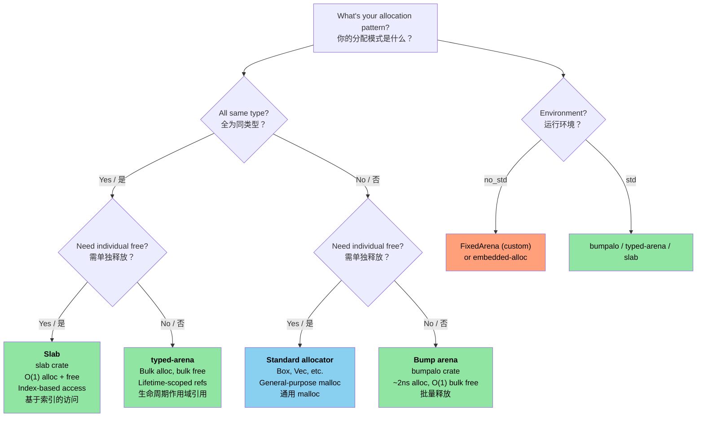

# 12. Unsafe Rust — Controlled Danger / 12. Unsafe Rust：受控的危险 🔶

> **What you'll learn / 你将学到：**
> - The five unsafe superpowers and when each is needed / 五种 Unsafe “超能力”及其适用场景
> - Writing sound abstractions: safe API, unsafe internals / 编写可靠的抽象：安全 API 与 Unsafe 内部实现
> - FFI patterns for calling C from Rust (and back) / FFI 模式：在 Rust 中调用 C（以及反向调用）
> - Common UB pitfalls and arena/slab allocator patterns / 常见的未定义行为 (UB) 陷阱与 Arena/Slab 分配器模式

## The Five Unsafe Superpowers / 五种 Unsafe 超能力

`unsafe` unlocks five operations that the compiler can't verify:

`unsafe` 开启了五种编译器无法验证的操作：

```rust
// SAFETY: each operation is explained inline below.
// 安全提示：每项操作均在下方行内进行说明。
unsafe {
    // 1. Dereference a raw pointer
    // 1. 解引用裸指针
    let ptr: *const i32 = &42;
    let value = *ptr; // Could be a dangling/null pointer
                      // 可能是一个悬空或空指针

    // 2. Call an unsafe function
    // 2. 调用 unsafe 函数
    let layout = std::alloc::Layout::new::<u64>();
    let mem = std::alloc::alloc(layout);

    // 3. Access a mutable static variable
    // 3. 访问可变静态变量
    static mut COUNTER: u32 = 0;
    COUNTER += 1; // Data race if multiple threads access
                  // 如果多个线程访问，会发生数据竞态

    // 4. Implement an unsafe trait
    // 4. 实现 unsafe trait
    // unsafe impl Send for MyType {}

    // 5. Access fields of a union
    // 5. 访问 union 的字段
    // union IntOrFloat { i: i32, f: f32 }
    // let u = IntOrFloat { i: 42 };
    // let f = u.f; // Reinterpret bits — could be garbage
                  // 重新解释位（bits）—— 可能是垃圾数据
}
```

> **Key principle / 核心原则**：`unsafe` doesn't turn off the borrow checker or type system. It only unlocks these five specific capabilities. All other Rust rules still apply.
>
> `unsafe` 并没有关闭借用检查器或类型系统。它仅仅开启了这五种特定的能力。所有其他 Rust 规则依然适用。

### Writing Sound Abstractions / 编写可靠的抽象

The purpose of `unsafe` is to build **safe abstractions** around unsafe operations:

`unsafe` 的目的是围绕不安全的操作构建 **安全抽象**：

```rust
/// A fixed-capacity stack-allocated buffer.
/// All public methods are safe — the unsafe is encapsulated.
/// 一个固定容量的、分配在栈上的缓冲区。
/// 所有公共方法都是安全的 —— unsafe 已被封装在内部。
pub struct StackBuf<T, const N: usize> {
    data: [std::mem::MaybeUninit<T>; N],
    len: usize,
}

impl<T, const N: usize> StackBuf<T, N> {
    pub fn new() -> Self {
        StackBuf {
            // Each element is individually MaybeUninit — no unsafe needed.
            // `const { ... }` blocks (Rust 1.79+) let us repeat a non-Copy
            // const expression N times.
            // 每个元素都是独立的 MaybeUninit —— 这里无需使用 unsafe。
            // `const { ... }` 块（Rust 1.79+）允许我们重复一个非 Copy 的常量表达式 N 次。
            data: [const { std::mem::MaybeUninit::uninit() }; N],
            len: 0,
        }
    }

    pub fn push(&mut self, value: T) -> Result<(), T> {
        if self.len >= N {
            return Err(value); // Buffer full — return value to caller
                               // 缓冲区已满 —— 将值返回给调用者
        }
        // SAFETY: len < N, so data[len] is within bounds.
        // We write a valid T into the MaybeUninit slot.
        // 安全性：len < N，因此 data[len] 处于边界内。
        // 我们在 MaybeUninit 插槽中写入了一个有效的 T。
        self.data[self.len] = std::mem::MaybeUninit::new(value);
        self.len += 1;
        Ok(())
    }

    pub fn get(&self, index: usize) -> Option<&T> {
        if index < self.len {
            // SAFETY: index < len, and data[0..len] are all initialized.
            // 安全性：index < len，且 data[0..len] 均已完成初始化。
            Some(unsafe { self.data[index].assume_init_ref() })
        } else {
            None
        }
    }
}

impl<T, const N: usize> Drop for StackBuf<T, N> {
    fn drop(&mut self) {
        // SAFETY: data[0..len] are initialized — drop them properly.
        // 安全性：data[0..len] 已初始化 —— 需妥善释放它们。
        for i in 0..self.len {
            unsafe { self.data[i].assume_init_drop(); }
        }
    }
}
```

**The three rules of sound unsafe code / 可靠 Unsafe 代码的三原则**：
1. **Document invariants / 文档化不变量** — every `// SAFETY:` comment explains why the operation is valid / 每一个 `// SAFETY:` 注释都必须解释为什么该操作是有效的
2. **Encapsulate / 封装** — the unsafe is inside a safe API; users can't trigger UB / 将 unsafe 保护在安全 API 内部；用户无法触发未定义行为 (UB)
3. **Minimize / 最小化** — only the smallest possible block is `unsafe` / 仅在尽可能小的范围内使用 `unsafe` 块

### FFI Patterns: Calling C from Rust / FFI 模式：在 Rust 中调用 C

```rust
// Declare the C function signature:
// 声明 C 函数签名：
extern "C" {
    fn strlen(s: *const std::ffi::c_char) -> usize;
    fn printf(format: *const std::ffi::c_char, ...) -> std::ffi::c_int;
}

// Safe wrapper:
// 安全封装：
fn safe_strlen(s: &str) -> usize {
    let c_string = std::ffi::CString::new(s).expect("string contains null byte");
    // SAFETY: c_string is a valid null-terminated string, alive for the call.
    // 安全性：c_string 是一个有效的以 null 结尾的字符串，且在调用期间有效。
    unsafe { strlen(c_string.as_ptr()) }
}

// Calling Rust from C (export a function):
// 从 C 调用 Rust（导出函数）：
#[no_mangle]
pub extern "C" fn rust_add(a: i32, b: i32) -> i32 {
    a + b
}
```

**Common FFI types / 常用 FFI 类型**：

| Rust | C | Notes / 备注 |
|------|---|-------|
| `i32` / `u32` | `int32_t` / `uint32_t` | Fixed-width, safe / 固定宽度，安全 |
| `*const T` / `*mut T` | `const T*` / `T*` | Raw pointers / 裸指针 |
| `std::ffi::CStr` | `const char*` (borrowed) | Null-terminated, borrowed / 以 null 结尾，借用 |
| `std::ffi::CString` | `char*` (owned) | Null-terminated, owned / 以 null 结尾，拥有所有权 |
| `std::ffi::c_void` | `void` | Opaque pointer target / 不透明指针目标 |
| `Option<fn(...)>` | Nullable function pointer | `None` = NULL / 可为空的函数指针 |

### Common UB Pitfalls / 常见的未定义行为 (UB) 陷阱

| Pitfall / 陷阱 | Example / 示例 | Why It's UB / 为什么是 UB |
|---------|---------|------------|
| Null dereference / 空指针解引用 | `*std::ptr::null::<i32>()` | Dereferencing null is always UB / 解引用空指针总是 UB |
| Dangling pointer / 悬空指针 | Dereference after `drop()` | Memory may be reused / 内存可能已被重用 |
| Data race / 数据竞态 | Two threads write to `static mut` | Unsynchronized concurrent writes / 未经同步的并发写入 |
| Wrong `assume_init` / 错误的 `assume_init` | `MaybeUninit::uninit().assume_init()` | Reading uninitialized memory / 读取了未初始化的内存 |
| Aliasing violation / 别名违规 | Creating two `&mut` to same data | Violates Rust's aliasing model / 违反了 Rust 的别名模型 |
| Invalid enum value / 无效枚举值 | `transmute::<u8, bool>(2)` | `bool` can only be 0 or 1 / `bool` 只能是 0 或 1 |

> **When to use `unsafe` in production / 生产中何时使用 `unsafe`**：
> - FFI boundaries (calling C/C++ code) / FFI 边界（调用 C/C++ 代码）
> - Performance-critical inner loops (avoid bounds checks) / 性能极其关键的内部循环（避免边界检查）
> - Building primitives (`Vec`, `HashMap` — these use unsafe internally) / 构建基础原语（`Vec`、`HashMap` —— 它们内部就使用了 unsafe）
> - Never in application logic if you can avoid it / 只要能避免，绝不要将其用于应用逻辑

### Custom Allocators — Arena and Slab Patterns / 自定义分配器 —— Arena 与 Slab 模式

In C, you'd write custom `malloc()` replacements for specific allocation patterns — arena allocators that free everything at once, slab allocators for fixed-size objects, or pool allocators for high-throughput systems. Rust provides the same power through the `GlobalAlloc` trait and allocator crates, with the added benefit of lifetime-scoped arenas that **prevent use-after-free at compile time**.

在 C 语言中，你会针对特定的分配模式编写自定义的 `malloc()` 替代方案 —— 例如一次性释放所有内容的 arena 分配器、针对固定大小对象的 slab 分配器，或者用于高吞吐量系统的池分配器。Rust 通过 `GlobalAlloc` trait 和各种分配器 crate 提供了同样的能力，并增加了“基于生命周期作用域的 arena”这一额外优势，从而在 **编译时防止“释放后使用（use-after-free）”**。

#### Arena Allocators — Bulk Allocation, Bulk Free / Arena 分配器 —— 批量分配与释放

An arena allocates by bumping a pointer forward. Individual items can't be freed — the entire arena is freed at once. This is perfect for request-scoped or frame-scoped allocations:

Arena 通过向前推进指针来进行分配。单个条目无法被单独释放 —— 整个 arena 的内容会一次性全部释放。这非常适合于请求级（request-scoped）或帧级（frame-scoped）的分配场景：

```rust
use bumpalo::Bump;

fn process_sensor_frame(raw_data: &[u8]) {
    // Create an arena for this frame's allocations
    let arena = Bump::new();

    // Allocate objects in the arena — ~2ns each (just a pointer bump)
    let header = arena.alloc(parse_header(raw_data));
    let readings: &mut [f32] = arena.alloc_slice_fill_default(header.sensor_count);

    for (i, chunk) in raw_data[header.payload_offset..].chunks(4).enumerate() {
        if i < readings.len() {
            readings[i] = f32::from_le_bytes(chunk.try_into().unwrap());
        }
    }

    // Use readings...
    let avg = readings.iter().sum::<f32>() / readings.len() as f32;
    println!("Frame avg: {avg:.2}");

    // `arena` drops here — ALL allocations freed at once in O(1)
    // No per-object destructor overhead, no fragmentation
}
# fn parse_header(_: &[u8]) -> Header { Header { sensor_count: 4, payload_offset: 8 } }
# struct Header { sensor_count: usize, payload_offset: usize }
```

**Arena vs standard allocator**:

| Aspect | `Vec::new()` / `Box::new()` | `Bump` arena |
|--------|---------------------------|--------------|
| Alloc speed | ~25ns (malloc) | ~2ns (pointer bump) |
| Free speed | Per-object destructor | O(1) bulk free |
| Fragmentation | Yes (long-lived processes) | None within arena |
| Lifetime safety | Heap — freed on `Drop` | Arena reference — compile-time scoped |
| Use case | General purpose | Request/frame/batch processing |

#### `typed-arena` — Type-Safe Arena / 类型安全的 Arena

When all arena objects are the same type, `typed-arena` provides a simpler API that returns references with the arena's lifetime:

当 arena 中的所有对象都是同一类型时，`typed-arena` 提供了一个更简单的 API，其返回的引用生命周期与 arena 本身相绑定：

```rust
use typed_arena::Arena;

struct AstNode<'a> {
    value: i32,
    children: Vec<&'a AstNode<'a>>,
}

fn build_tree() {
    let arena: Arena<AstNode<'_>> = Arena::new();

    // Allocate nodes — returns &AstNode tied to arena's lifetime
    // 分配节点 —— 返回绑在 arena 生命周期上的 &AstNode
    let root = arena.alloc(AstNode { value: 1, children: vec![] });
    let left = arena.alloc(AstNode { value: 2, children: vec![] });
    let right = arena.alloc(AstNode { value: 3, children: vec![] });

    // Build the tree — all references valid as long as `arena` lives
    // 构建树 —— 只要 arena 还在，所有引用就都有效
    println!("Root: {}, Left: {}, Right: {}", root.value, left.value, right.value);

    // `arena` drops here — all nodes freed at once
    // `arena` 在此处被释放 —— 所有节点一次性销毁
}
```

#### Slab Allocators — Fixed-Size Object Pools / Slab 分配器 —— 固定大小的对象池

A slab allocator pre-allocates a pool of fixed-size slots. Objects are allocated and returned individually, but all slots are the same size — eliminating fragmentation and enabling O(1) alloc/free:

Slab 分配器预先分配一个固定大小插槽（slots）的池。对象可以被单独分配和归还，但所有插槽大小相同 —— 这消除了内存碎片，并实现了 O(1) 的分配和释放：

```rust
use slab::Slab;

struct Connection {
    id: u64,
    buffer: [u8; 1024],
    active: bool,
}

fn connection_pool_example() {
    // Pre-allocate a slab for connections
    // 为连接预分配一个 slab
    let mut connections: Slab<Connection> = Slab::with_capacity(256);

    // Insert returns a key (usize index) — O(1)
    // 插入返回一个 key (usize 索引) —— O(1)
    let key1 = connections.insert(Connection {
        id: 1001,
        buffer: [0; 1024],
        active: true,
    });

    let key2 = connections.insert(Connection {
        id: 1002,
        buffer: [0; 1024],
        active: true,
    });

    // Access by key — O(1)
    // 通过 key 访问 —— O(1)
    if let Some(conn) = connections.get_mut(key1) {
        conn.buffer[0..5].copy_from_slice(b"hello");
    }

    // Remove returns the value — O(1), slot is reused for next insert
    // 移除操作返回该值 —— O(1)，该插槽会被下次插入重用
    let removed = connections.remove(key2);
    assert_eq!(removed.id, 1002);

    // Next insert reuses the freed slot — no fragmentation
    // 下一次插入重用已释放的插槽 —— 无内存碎片
    let key3 = connections.insert(Connection {
        id: 1003,
        buffer: [0; 1024],
        active: true,
    });
    assert_eq!(key3, key2); // Same slot reused!
                            // 同一个插槽被重用了！
}
```

#### Implementing a Minimal Arena (for `no_std`) / 实现最小 Arena（适用于 `no_std`）

For bare-metal environments where you can't pull in `bumpalo`, here's a minimal arena built on `unsafe`:

对于无法引入 `bumpalo` 的裸机环境，这里有一个基于 `unsafe` 构建的极简 arena：

```rust
#![cfg_attr(not(test), no_std)]

use core::alloc::Layout;
use core::cell::{Cell, UnsafeCell};

/// A simple bump allocator backed by a fixed-size byte array.
/// Not thread-safe — use per-core or with a lock for multi-threaded contexts.
/// 一个由固定大小字节数组支持的简单 bump 分配器。
/// 非线程安全 —— 在多线程环境下请在每个核心使用或配合锁使用。
///
/// **Important**: Like `bumpalo`, this arena does NOT call destructors on
/// allocated items when the arena is dropped. Types with `Drop` impls will
/// leak their resources (file handles, sockets, etc.). Only allocate types
/// without meaningful `Drop` impls, or manually drop them before the arena.
/// **重要提示**：与 `bumpalo` 类似，当 arena 被释放时，它并不会调用已分配条目的析构函数。
/// 实现了 `Drop` 的类型将会泄露其资源（如文件句柄、套接字等）。
/// 请仅分配那些没有特殊 `Drop` 实现的类型，或者在 arena 释放前手动释放它们。
pub struct FixedArena<const N: usize> {
    // UnsafeCell is REQUIRED here: we mutate `buf` through `&self`.
    // Without UnsafeCell, casting &self.buf to *mut u8 would be UB
    // (violates Rust's aliasing model — shared ref implies immutable).
    // 这里必须使用 UnsafeCell：我们需要通过 `&self` 修改 `buf`。
    // 如果没有 UnsafeCell，将 &self.buf 转换为 *mut u8 将导致 UB
    // （这违反了 Rust 的别名模型 —— 共享引用意味着不可变）。
    buf: UnsafeCell<[u8; N]>,
    offset: Cell<usize>, // Interior mutability for &self allocation
                         // 内部可变性，用于 &self 分配
}

impl<const N: usize> FixedArena<N> {
    pub const fn new() -> Self {
        FixedArena {
            buf: UnsafeCell::new([0; N]),
            offset: Cell::new(0),
        }
    }

    /// Allocate a `T` in the arena. Returns `None` if out of space.
    /// 在 arena 中分配一个 `T`。如果空间不足则返回 `None`。
    pub fn alloc<T>(&self, value: T) -> Option<&mut T> {
        let layout = Layout::new::<T>();
        let current = self.offset.get();

        // Align up
        // 向上对齐
        let aligned = (current + layout.align() - 1) & !(layout.align() - 1);
        let new_offset = aligned + layout.size();

        if new_offset > N {
            return None; // Arena full
                         // Arena 已满
        }

        self.offset.set(new_offset);

        // SAFETY:
        // - `aligned` is within `buf` bounds (checked above)
        // - Alignment is correct (aligned to T's requirement)
        // - No aliasing: each alloc returns a unique, non-overlapping region
        // - UnsafeCell grants permission to mutate through &self
        // - The arena outlives the returned reference (caller must ensure)
        // 安全性：
        // - `aligned` 在 `buf` 的边界内（已在上方检查）
        // - 对齐正确（已按 T 的要求对齐）
        // - 无别名：每次分配都返回一个唯一、不重叠的区域
        // - UnsafeCell 允许通过 &self 进行修改
        // - Arena 的寿命长于返回的引用（调用者必须确保这一点）
        let ptr = unsafe {
            let base = (self.buf.get() as *mut u8).add(aligned);
            let typed = base as *mut T;
            typed.write(value);
            &mut *typed
        };

        Some(ptr)
    }

    /// Reset the arena — invalidates all previous allocations.
    /// 重置 arena —— 使之前所有的分配失效。
    ///
    /// # Safety
    /// Caller must ensure no references to arena-allocated data exist.
    /// ## 安全性
    /// 调用者必须确保不存在任何指向 arena 分配数据的引用。
    pub unsafe fn reset(&self) {
        self.offset.set(0);
    }

    pub fn used(&self) -> usize {
        self.offset.get()
    }

    pub fn remaining(&self) -> usize {
        N - self.offset.get()
    }
}
```

#### Choosing an Allocator Strategy / 选择分配器策略

> **Note / 注意**：The diagram below uses Mermaid syntax. It renders on GitHub and in tools that support Mermaid (mdBook with `mermaid` plugin). In plain Markdown viewers, you'll see the raw source.
>
> 下图使用了 Mermaid 语法。它在 GitHub 及支持 Mermaid 的工具（如带有 `mermaid` 插件的 mdBook）中可以正常渲染。在普通的 Markdown 查看器中，你将看到原始源代码。



| C Pattern / C 模式 | Rust Equivalent / Rust 等效 | Key Advantage / 关键优势 |
|-----------|----------------|---------------|
| Custom `malloc()` pool / 自定义 `malloc()` 池 | `#[global_allocator]` impl | Type-safe, debuggable / 类型安全，可调试 |
| `obstack` (GNU) | `bumpalo::Bump` | Lifetime-scoped, no use-after-free / 生命周期作用域，无释放后使用 |
| Kernel slab (`kmem_cache`) | `slab::Slab<T>` | Type-safe, index-based / 类型安全，基于索引 |
| Stack-allocated temp buffer / 栈分配临时缓冲 | `FixedArena<N>` (above) | No heap, `const` constructible / 无堆分配，可 `const` 构造 |
| `alloca()` | `[T; N]` or `SmallVec` | Compile-time sized, no UB / 编译时确定大小，无 UB |

> **Cross-reference / 交叉引用**：有关裸机分配器设置（使用 `embedded-alloc` 配合 `#[global_allocator]`），请参见《面向 C 程序员的 Rust 培训》第 15.1 章“全局分配器设置”，其中涵盖了嵌入式特定的引导加载。

> **Key Takeaways — Unsafe Rust / 关键要点：Unsafe Rust**
> - Document invariants (`SAFETY:` comments), encapsulate behind safe APIs, minimize unsafe scope / 记录不变量（`SAFETY:` 注释），将其封装在安全 API 之后，并最小化 unsafe 的作用范围
> - `[const { MaybeUninit::uninit() }; N]` (Rust 1.79+) replaces the old `assume_init` anti-pattern / `[const { MaybeUninit::uninit() }; N]`（Rust 1.79+）取代了旧的 `assume_init` 反模式
> - FFI requires `extern "C"`, `#[repr(C)]`, and careful null/lifetime handling / FFI 需要 `extern "C"`、`#[repr(C)]` 以及对空指针/生命周期的谨慎处理
> - Arena and slab allocators trade general-purpose flexibility for allocation speed / Arena 和 Slab 分配器通过牺牲通用灵活性来换取分配速度

> **See also / 延伸阅读**：[Ch 4 — PhantomData](ch04-phantomdata-types-that-carry-no-data.md) 了解与 unsafe 代码相关的型变（variance）和 drop-check 交互。[Ch 9 — Smart Pointers](ch09-smart-pointers-and-interior-mutability.md) 了解 Pin 和自引用类型。

---

### Exercise: Safe Wrapper around Unsafe ★★★ (~45 min) / 练习：围绕 Unsafe 编写安全封装

Write a `FixedVec<T, const N: usize>` — a fixed-capacity, stack-allocated vector.
Requirements:
- `push(&mut self, value: T) -> Result<(), T>` returns `Err(value)` when full
- `pop(&mut self) -> Option<T>` returns and removes the last element
- `as_slice(&self) -> &[T]` borrows initialized elements
- All public methods must be safe; all unsafe must be encapsulated with `SAFETY:` comments
- `Drop` must clean up initialized elements

编写一个 `FixedVec<T, const N: usize>` —— 一个固定容量的、分配在栈上的 vector。
要求：
- `push(&mut self, value: T) -> Result<(), T>`：如果已满，返回 `Err(value)`。
- `pop(&mut self) -> Option<T>`：返回并移除最后一个元素。
- `as_slice(&self) -> &[T]`：借用已初始化的元素。
- 所有公共方法必须是安全的（safe）；所有 unsafe 操作必须被封装在内，并附带 `SAFETY:` 注释。
- `Drop` 必须清理已初始化的元素。

<details>
<summary>🔑 Solution / 参考答案</summary>

```rust
use std::mem::MaybeUninit;

pub struct FixedVec<T, const N: usize> {
    data: [MaybeUninit<T>; N],
    len: usize,
}

impl<T, const N: usize> FixedVec<T, N> {
    pub fn new() -> Self {
        FixedVec {
            data: [const { MaybeUninit::uninit() }; N],
            len: 0,
        }
    }

    pub fn push(&mut self, value: T) -> Result<(), T> {
        if self.len >= N { return Err(value); }
        // SAFETY: len < N, so data[len] is within bounds.
        // 安全性：len < N，因此 data[len] 处于边界内。
        self.data[self.len] = MaybeUninit::new(value);
        self.len += 1;
        Ok(())
    }

    pub fn pop(&mut self) -> Option<T> {
        if self.len == 0 { return None; }
        self.len -= 1;
        // SAFETY: data[len] was initialized (len was > 0 before decrement).
        // 安全性：data[len] 已初始化（len 在递减前大于 0）。
        Some(unsafe { self.data[self.len].assume_init_read() })
    }

    pub fn as_slice(&self) -> &[T] {
        // SAFETY: data[0..len] are all initialized, and MaybeUninit<T>
        // has the same layout as T.
        // 安全性：data[0..len] 均已初始化，且 MaybeUninit<T> 与 T 的布局相同。
        unsafe { std::slice::from_raw_parts(self.data.as_ptr() as *const T, self.len) }
    }

    pub fn len(&self) -> usize { self.len }
    pub fn is_empty(&self) -> bool { self.len == 0 }
}

impl<T, const N: usize> Drop for FixedVec<T, N> {
    fn drop(&mut self) {
        // SAFETY: data[0..len] are initialized — drop each one.
        // 安全性：data[0..len] 已初始化 —— 逐个释放它们。
        for i in 0..self.len {
            unsafe { self.data[i].assume_init_drop(); }
        }
    }
}

fn main() {
    let mut v = FixedVec::<String, 4>::new();
    v.push("hello".into()).unwrap();
    v.push("world".into()).unwrap();
    assert_eq!(v.as_slice(), &["hello", "world"]);
    assert_eq!(v.pop(), Some("world".into()));
    assert_eq!(v.len(), 1);
}
```

</details>

***

