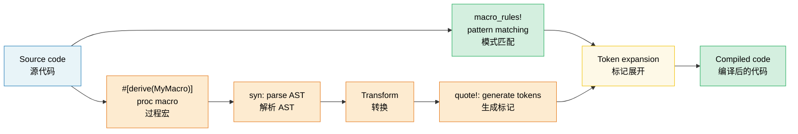

# 13. Macros — Code That Writes Code / 13. 宏：生成代码的代码 🟡

> **What you'll learn / 你将学到：**
> - Declarative macros (`macro_rules!`) with pattern matching and repetition / 声明式宏（`macro_rules!`）中的模式匹配与重复操作
> - When macros are the right tool vs generics/traits / 宏与泛型/trait 的权衡及适用场景
> - Procedural macros: derive, attribute, and function-like / 过程宏：派生宏（derive）、属性宏（attribute）和函数式宏
> - Writing a custom derive macro with `syn` and `quote` / 使用 `syn` 和 `quote` 编写自定义派生宏

## Declarative Macros (macro_rules!) / 声明式宏 (macro_rules!)

Macros match patterns on syntax and expand to code at compile time:

宏在编译时根据语法匹配模式并展开为代码：

```rust
// A simple macro that creates a HashMap
// 一个创建 HashMap 的简单宏
macro_rules! hashmap {
    // Match: key => value pairs separated by commas
    // 匹配：以逗号分隔的 key => value 键值对
    ( $( $key:expr => $value:expr ),* $(,)? ) => {
        {
            let mut map = std::collections::HashMap::new();
            $( map.insert($key, $value); )*
            map
        }
    };
}

let scores = hashmap! {
    "Alice" => 95,
    "Bob" => 87,
    "Carol" => 92,
};
// Expands to:
// 展开为：
// let mut map = HashMap::new();
// map.insert("Alice", 95);
// map.insert("Bob", 87);
// map.insert("Carol", 92);
// map
```

**Macro fragment types / 宏片段类型**：

| Fragment / 片段 | Matches / 匹配内容 | Example / 示例 |
|----------|---------|---------|
| `$x:expr` | Any expression / 任何表达式 | `42`, `a + b`, `foo()` |
| `$x:ty` | A type / 某种类型 | `i32`, `Vec<String>` |
| `$x:ident` | An identifier / 标识符 | `my_var`, `Config` |
| `$x:pat` | A pattern / 模式 | `Some(x)`, `_` |
| `$x:stmt` | A statement / 语句 | `let x = 5;` |
| `$x:tt` | A single token tree / 单个标记树 | Anything / 任何东西 (最灵活) |
| `$x:literal` | A literal value / 字面量 | `42`, `"hello"`, `true` |

**Repetition / 重复操作**：`$( ... ),*` means "zero or more, comma-separated" / 表示“零个或多个且以逗号分隔”

```rust
// Generate test functions automatically
// 自动生成测试函数
macro_rules! test_cases {
    ( $( $name:ident: $input:expr => $expected:expr ),* $(,)? ) => {
        $(
            #[test]
            fn $name() {
                assert_eq!(process($input), $expected);
            }
        )*
    };
}

test_cases! {
    test_empty: "" => "",
    test_hello: "hello" => "HELLO",
    test_trim: "  spaces  " => "SPACES",
}
// Generates three separate #[test] functions
// 生成三个独立的 #[test] 函数
```

### When (Not) to Use Macros / 何时（不）使用宏

**Use macros when / 在以下场景使用宏**：
- Reducing boilerplate that traits/generics can't handle (variadic arguments, DRY test generation) / 减少 trait/泛型无法处理的样板代码（如变长参数、减少重复的测试生成）
- Creating DSLs (`html!`, `sql!`, `vec!`) / 创建领域特定语言 (DSL)
- Conditional code generation (`cfg!`, `compile_error!`) / 条件代码生成

**Don't use macros when / 在以下场景不要使用宏**：
- A function or generic would work (macros are harder to debug, autocomplete doesn't help) / 函数或泛型可以完成的任务（宏更难调试，且编辑器自动补全无效）
- You need type checking inside the macro (macros operate on tokens, not types) / 需要在宏内部进行类型检查（宏操作的是标记，而非类型）
- The pattern is used once or twice (not worth the abstraction cost) / 某种模式只用到一两次（不值得承担抽象成本）

```rust
// ❌ Unnecessary macro — a function works fine:
// ❌ 没必要的宏 —— 函数就很好用：
macro_rules! double {
    ($x:expr) => { $x * 2 };
}

// ✅ Just use a function:
// ✅ 直接用函数：
fn double(x: i32) -> i32 { x * 2 }

// ✅ Good macro use — variadic, can't be a function:
// ✅ 宏的良好应用场景 —— 变长参数，无法用函数实现：
macro_rules! println {
    ($($arg:tt)*) => { /* format string + args */ };
}
```

### Procedural Macros Overview / 过程宏概览

Procedural macros are Rust functions that transform token streams. They require a separate crate with `proc-macro = true`:

过程宏是转换标记流（token streams）的 Rust 函数。它们需要一个带有 `proc-macro = true` 设置的独立 crate：

```rust
// Three types of proc macros:
// 三种类型的过程宏：

// 1. Derive macros — #[derive(MyTrait)]
// 1. 派生宏 —— #[derive(MyTrait)]
// Generate trait implementations from struct definitions
// 根据结构体定义生成 trait 实现
#[derive(Debug, Clone, Serialize, Deserialize)]
struct Config {
    name: String,
    port: u16,
}

// 2. Attribute macros — #[my_attribute]
// 2. 属性宏 —— #[my_attribute]
// Transform the annotated item
// 转换被标注的项
#[route(GET, "/api/users")]
async fn list_users() -> Json<Vec<User>> { /* ... */ }

// 3. Function-like macros — my_macro!(...)
// 3. 函数式宏 —— my_macro!(...)
// Custom syntax
// 自定义语法
let query = sql!(SELECT * FROM users WHERE id = ?);
```

### Derive Macros in Practice / 派生宏实践

The most common proc macro type. Here's how `#[derive(Debug)]` works conceptually:

这是最常用的过程宏类型。以下是 `#[derive(Debug)]` 在概念上的工作原理：

```rust
// Input (your struct):
// 输入（你的结构体）：
#[derive(Debug)]
struct Point {
    x: f64,
    y: f64,
}

// The derive macro generates:
// 派生宏会生成：
impl std::fmt::Debug for Point {
    fn fmt(&self, f: &mut std::fmt::Formatter<'_>) -> std::fmt::Result {
        f.debug_struct("Point")
            .field("x", &self.x)
            .field("y", &self.y)
            .finish()
    }
}
```

**Commonly used derive macros / 常用派生宏**：

| Derive / 派生 | Crate / 库 | What It Generates / 生成内容 |
|--------|-------|-------------------|
| `Debug` | std | `fmt::Debug` impl (debug printing / 调试打印) |
| `Clone`, `Copy` | std | Value duplication / 值复制 |
| `PartialEq`, `Eq` | std | Equality comparison / 等值比较 |
| `Hash` | std | Hashing for HashMap keys / HashMap 键的哈希计算 |
| `Serialize`, `Deserialize` | serde | JSON/YAML/etc. encoding / 编码 |
| `Error` | thiserror | `std::error::Error` + `Display` |
| `Parser` | `clap` | CLI argument parsing / 命令行参数解析 |
| `Builder` | derive_builder | Builder pattern / 建造者模式 |

> **Practical advice / 实践建议**：请大胆使用派生宏 —— 它们能消除易出错的样板代码。编写自己的过程宏是一个进阶课题；在尝试构建自定义宏之前，请先熟悉现有宏（如 `serde`、`thiserror`、`clap`）的使用。

### Macro Hygiene and `$crate` / 宏卫生性与 `$crate`

**Hygiene / 卫生性** means that identifiers created inside a macro don't collide with identifiers in the caller's scope. Rust's `macro_rules!` is *partially* hygienic:

**卫生性** 意味着在宏内部创建的标识符不会与调用者作用域内的标识符发生冲突。Rust 的 `macro_rules!` 是 *部分* 卫生的：

```rust
macro_rules! make_var {
    () => {
        let x = 42; // This 'x' is in the MACRO's scope
                    // 这个 'x' 位于宏的作用域内
    };
}

fn main() {
    let x = 10;
    make_var!();   // Creates a different 'x' (hygienic)
                   // 创建一个不同的 'x'（卫生性体现）
    println!("{x}"); // Prints 10, not 42 — macro's x doesn't leak
                     // 打印 10 而非 42 —— 宏内部的 x 不会泄露出来
}
```

**`$crate`**：When writing macros in a library, use `$crate` to refer to your own crate — it resolves correctly regardless of how users import your crate:

**`$crate`**：在编写库宏时，使用 `$crate` 来引用你自己的 crate —— 无论用户如何导入你的 crate，它都能正确解析：

```rust
// In my_diagnostics crate:
// 在 my_diagnostics crate 中：

pub fn log_result(msg: &str) {
    println!("[diag] {msg}");
}

#[macro_export]
macro_rules! diag_log {
    ($($arg:tt)*) => {
        // ✅ $crate always resolves to my_diagnostics, even if the user
        // renamed the crate in their Cargo.toml
        // ✅ $crate 总能解析到 my_diagnostics，即便用户在 Cargo.toml 中重命名了该 crate
        $crate::log_result(&format!($($arg)*))
    };
}

// ❌ Without $crate:
// ❌ 若不使用 $crate：
// my_diagnostics::log_result(...)  ← breaks if user writes:
//                                  ← 若用户按以下方式导入则会报错：
//   [dependencies]
//   diag = { package = "my_diagnostics", version = "1" }
```

> **Rule / 规则**：Always use `$crate::` in `#[macro_export]` macros. Never use your crate's name directly.
>
> 始终在 `#[macro_export]` 宏中使用 `$crate::`。绝不要直接使用你的 crate 名称。

### Recursive Macros and `tt` Munching / 递归宏与 `tt` 处理

Recursive macros process input one token at a time — a technique called **`tt` munching** (token-tree munching):

递归宏一次处理一个标记 —— 这种技术被称为 **`tt` munching**（标记树处理）：

```rust
// Count the number of expressions passed to the macro
// 统计传递给宏的表达式数量
macro_rules! count {
    // Base case: no tokens left
    // 基础情况：没有剩余标记
    () => { 0usize };
    // Recursive case: consume one expression, count the rest
    // 递归情况：消耗一个表达式，并计算剩余部分
    ($head:expr $(, $tail:expr)* $(,)?) => {
        1usize + count!($($tail),*)
    };
}

fn main() {
    let n = count!("a", "b", "c", "d");
    assert_eq!(n, 4);

    // Works at compile time too:
    // 在编译时同样有效：
    const N: usize = count!(1, 2, 3);
    assert_eq!(N, 3);
}
```

```rust
// Build a heterogeneous tuple from a list of expressions:
// 从表达式列表构建一个异构元组：
macro_rules! tuple_from {
    // Base: single element
    // 基础：单个元素
    ($single:expr $(,)?) => { ($single,) };
    // Recursive: first element + rest
    // 递归：第一个元素 + 剩余部分
    ($head:expr, $($tail:expr),+ $(,)?) => {
        ($head, tuple_from!($($tail),+))
    };
}

let t = tuple_from!(1, "hello", 3.14, true);
// Expands to: (1, ("hello", (3.14, (true,))))
// 展开为：(1, ("hello", (3.14, (true,))))
```

**Fragment specifier subtleties / 片段说明符的微妙之处**：

| Fragment / 片段 | Gotcha / 陷阱 |
|----------|--------|
| `$x:expr` | Greedily parses — `1 + 2` is ONE expression / 贪婪解析 —— `1 + 2` 是一个表达式 |
| `$x:ty` | Greedily parses — `Vec<String>` is one type / 贪婪解析 —— `Vec<String>` 是一个类型 |
| `$x:tt` | Matches exactly ONE token tree / 匹配确切的一个标记树 (最灵活，检查最少) |
| `$x:ident` | Only plain identifiers — not paths / 仅限普通标识符 —— 不能是路径如 `std::io` |
| `$x:pat` | In Rust 2021, matches `A \| B` patterns / 在 Rust 2021 中匹配 `A \| B` 模式 |

> **When to use `tt` / 何时使用 `tt`**：When you need to forward tokens to another macro without the parser constraining them. `$($args:tt)*` is the "accept everything" pattern (used by `println!`, `format!`, `vec!`).
>
> 当你需要将标记转发给另一个宏且不希望解析器限制它们时。`$($args:tt)*` 是“接受一切”的模式（常用于 `println!`、`format!`、`vec!`）。

### Writing a Derive Macro with `syn` and `quote` / 使用 `syn` 和 `quote` 编写派生宏

Derive macros live in a separate crate (`proc-macro = true`) and transform a token stream using `syn` (parse Rust) and `quote` (generate Rust):

派生宏存储在独立的 crate（设置 `proc-macro = true`）中，并使用 `syn`（解析 Rust）和 `quote`（生成 Rust）来处理标记流：

```toml
```

# my_derive/Cargo.toml
[lib]
proc-macro = true

[dependencies]
syn = { version = "2", features = ["full"] }
quote = "1"
proc-macro2 = "1"

```rust
// my_derive/src/lib.rs
use proc_macro::TokenStream;
use quote::quote;
use syn::{parse_macro_input, DeriveInput};

/// Derive macro that generates a `describe()` method
/// returning the struct name and field names.
/// 派生宏，用于生成一个 `describe()` 方法，
/// 该方法返回结构体名称及字段名称。
#[proc_macro_derive(Describe)]
pub fn derive_describe(input: TokenStream) -> TokenStream {
    let input = parse_macro_input!(input as DeriveInput);
    let name = &input.ident;
    let name_str = name.to_string();

    // Extract field names (only for structs with named fields)
    // 提取字段名称（仅适用于拥有命名字段的结构体）
    let fields = match &input.data {
        syn::Data::Struct(data) => {
            data.fields.iter()
                .filter_map(|f| f.ident.as_ref())
                .map(|id| id.to_string())
                .collect::<Vec<_>>()
        }
        _ => vec![],
    };

    let field_list = fields.join(", ");

    let expanded = quote! {
        impl #name {
            pub fn describe() -> String {
                format!("{} {{ {} }}", #name_str, #field_list)
            }
        }
    };

    TokenStream::from(expanded)
}
```

```rust
// In the application crate:
use my_derive::Describe;

#[derive(Describe)]
struct SensorReading {
    sensor_id: u16,
    value: f64,
    timestamp: u64,
}

fn main() {
    println!("{}", SensorReading::describe());
    // "SensorReading { sensor_id, value, timestamp }"
}
```

**The workflow / 工作流程**：`TokenStream` (raw tokens / 原始标记) → `syn::parse` (AST) → inspect/transform (检查/转换) → `quote!` (generate tokens / 生成标记) → `TokenStream` (back to compiler / 回传给编译器).

| Crate / 库 | Role / 角色 | Key types / 关键类型 |
|-------|------|-----------|
| `proc-macro` | Compiler interface / 编译器接口 | `TokenStream` |
| `syn` | Parse Rust source into AST / 将 Rust 源码解析为 AST | `DeriveInput`, `ItemFn`, `Type` |
| `quote` | Generate Rust tokens from templates / 从模板生成 Rust 标记 | `quote!{}`, `#variable` interpolation |
| `proc-macro2` | Bridge between syn/quote and proc-macro / syn/quote 与 proc-macro 之间的桥梁 | `TokenStream`, `Span` |

> **Practical tip / 实践技巧**：在编写自己的派生宏之前，先研究一下简单的派生宏源码（如 `thiserror` 或 `derive_more`）。`cargo expand` 命令（通过 `cargo-expand` 工具）可以显示任何宏展开后的样子 —— 这对调试非常有帮助。

> **Key Takeaways — Macros / 关键要点：宏**
> - `macro_rules!` for simple code generation; proc macros (`syn` + `quote`) for complex derives / `macro_rules!` 用于简单的代码生成；过程宏（`syn` + `quote`）用于复杂的派生
> - Prefer generics/traits over macros when possible — macros are harder to debug and maintain / 尽可能优先考虑泛型/trait 而非宏 —— 宏更难调试和维护
> - `$crate` ensures hygiene; `tt` munching enables recursive pattern matching / `$crate` 确保库的卫生性；`tt` munching 实现了递归模式匹配

> **See also / 延伸阅读**：[Ch 2 — Traits](ch02-traits-in-depth.md) 了解何时 trait/泛型优于宏。[Ch 14 — Testing](ch14-testing-and-benchmarking-patterns.md) 了解如何测试由宏生成的代码。



---

### Exercise: Declarative Macro — `map!` ★ (~15 min) / 练习：声明式宏 —— `map!`

Write a `map!` macro that creates a `HashMap` from key-value pairs:

编写一个 `map!` 宏，用于从键值对创建 `HashMap`：

```rust,ignore
let m = map! {
    "host" => "localhost",
    "port" => "8080",
};
assert_eq!(m.get("host"), Some(&"localhost"));
```

Requirements: support trailing comma and empty invocation `map!{}`.

要求：支持尾部逗号和空调用 `map!{}`。

<details>
<summary>🔑 Solution / 参考答案</summary>

```rust
macro_rules! map {
    () => { std::collections::HashMap::new() };
    ( $( $key:expr => $val:expr ),+ $(,)? ) => {{
        let mut m = std::collections::HashMap::new();
        $( m.insert($key, $val); )+
        m
    }};
}

fn main() {
    let config = map! {
        "host" => "localhost",
        "port" => "8080",
        "timeout" => "30",
    };
    assert_eq!(config.len(), 3);
    assert_eq!(config["host"], "localhost");

    let empty: std::collections::HashMap<String, String> = map!();
    assert!(empty.is_empty());

    let scores = map! { 1 => 100, 2 => 200 };
    assert_eq!(scores[&1], 100);
}
```

</details>

***

