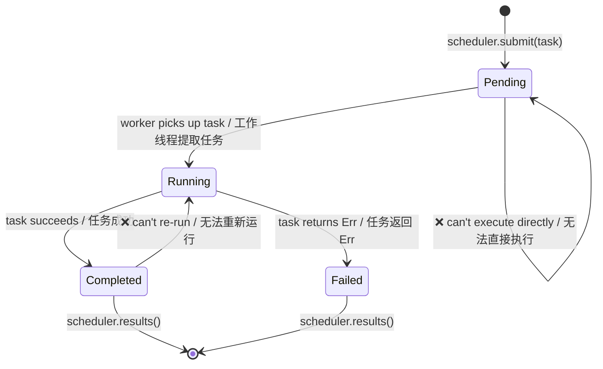

# Capstone Project: Type-Safe Task Scheduler / 综合项目：类型安全的任务调度器

This project integrates patterns from across the book into a single, production-style system. You'll build a **type-safe, concurrent task scheduler** that uses generics, traits, typestate, channels, error handling, and testing.

该项目将本书各章节中的模式整合到一个生产级别的系统中。你将构建一个 **类型安全的并发任务调度器**，其中会用到泛型、trait、类型状态（typestate）、通道、错误处理和测试。

**Estimated time / 估计用时**：4–6 hours | **Difficulty / 难度**：★★★

> **What you'll practice / 你将练习：**
> - Generics and trait bounds (Ch 1–2) / 泛型与 trait 约束（第 1–2 章）
> - Typestate pattern for task lifecycle (Ch 3) / 用于任务生命周期的类型状态模式（第 3 章）
> - PhantomData for zero-cost state markers (Ch 4) / 用于零成本状态标记的 PhantomData（第 4 章）
> - Channels for worker communication (Ch 5) / 用于工作线程通信的通道（第 5 章）
> - Concurrency with scoped threads (Ch 6) / 使用作用域线程的并发（第 6 章）
> - Error handling with `thiserror` (Ch 9) / 使用 `thiserror` 进行错误处理（第 9 章）
> - Testing with property-based tests (Ch 13) / 使用基于属性的测试进行测试（第 13 章 / 原书为 Ch13）
> - API design with `TryFrom` and validated types (Ch 14) / 使用 `TryFrom` 和经验证类型的 API 设计（第 14 章 / 原书为 Ch14）

## The Problem / 问题背景描述

Build a task scheduler where / 构建一个满足以下要求的任务调度器：

1. **Tasks** have a typed lifecycle: `Pending → Running → Completed` (or `Failed`) / **任务** 具有类型化的生命周期：`等待（Pending） → 运行中（Running） → 已完成（Completed）`（或 `失败（Failed）`）
2. **Workers** pull tasks from a channel, execute them, and report results / **工作线程** 从通道拉取任务，执行并上报结果
3. The **scheduler** manages task submission, worker coordination, and result collection / **调度器** 管理任务提交、工作线程协调和结果收集
4. Invalid state transitions are **compile-time errors** / 无效的状态转换应导致 **编译时错误**



## Step 1: Define the Task Types / 第一步：定义任务类型

Start with the typestate markers and a generic `Task`:

从类型状态标记（markers）和一个泛型的 `Task` 结构体开始：

```rust
use std::marker::PhantomData;

// --- State markers (zero-sized) / 状态标记（零大小） ---
struct Pending;
struct Running;
struct Completed;
struct Failed;

// --- Task ID (newtype for type safety) / 任务 ID（用于类型安全的新类型） ---
#[derive(Debug, Clone, Copy, PartialEq, Eq, Hash)]
struct TaskId(u64);

// --- The Task struct, parameterized by lifecycle state / Task 结构体，由生命周期状态及其参数化 ---
struct Task<State, R> {
    id: TaskId,
    name: String,
    _state: PhantomData<State>,
    _result: PhantomData<R>,
}
```

**Your job / 你的任务**：Implement state transitions so that:

实现以下状态转换：

- `Task<Pending, R>` can transition to `Task<Running, R>` (via `start()`) / `Task<Pending, R>` 可转换为 `Task<Running, R>`（通过 `start()`）
- `Task<Running, R>` can transition to `Task<Completed, R>` or `Task<Failed, R>` / `Task<Running, R>` 可转换为 `Task<Completed, R>` 或 `Task<Failed, R>`
- No other transitions compile / 其他转换均无法通过编译

<details>
<summary>💡 Hint / 提示</summary>

Each transition method should consume `self` and return the new state:

每一个转换方法都应该消耗（consume） `self` 并返回新状态：
麻

```rust
impl<R> Task<Pending, R> {
    fn start(self) -> Task<Running, R> {
        Task {
            id: self.id,
            name: self.name,
            _state: PhantomData,
            _result: PhantomData,
        }
    }
}
```

</details>

## Step 2: Define the Work Function / 第二步：定义工作函数

Tasks need a function to execute. Use a boxed closure: / 任务需要一个可执行的函数。请使用装箱的闭包（boxed closure）：

```rust
struct WorkItem<R: Send + 'static> {
    id: TaskId,
    name: String,
    work: Box<dyn FnOnce() -> Result<R, String> + Send>,
}
```

**Your job / 你的任务**：Implement `WorkItem::new()` that accepts a task name and closure. Add a `TaskId` generator (simple atomic counter or mutex-protected counter).

实现 `WorkItem::new()`，使其接收任务名称和闭包。添加一个 `TaskId` 生成器（简单的原子计数器或受互斥锁保护的计数器）。

## Step 3: Error Handling / 第三步：错误处理

Define the scheduler's error types using `thiserror`: / 使用 `thiserror` 定义调度器的错误类型：

```rust,ignore
use thiserror::Error;

#[derive(Error, Debug)]
pub enum SchedulerError {
    #[error("scheduler is shut down")]
    ShutDown,

    #[error("task {0:?} failed: {1}")]
    TaskFailed(TaskId, String),

    #[error("channel send error")]
    ChannelError(#[from] std::sync::mpsc::SendError<()>),

    #[error("worker panicked")]
    WorkerPanic,
}
```

## Step 4: The Scheduler / 第四步：调度器

Build the scheduler using channels (Ch 5) and scoped threads (Ch 6):

使用通道（第 5 章）和作用域线程（第 6 章）构建调度器：

```rust
use std::sync::mpsc;

struct Scheduler<R: Send + 'static> {
    sender: Option<mpsc::Sender<WorkItem<R>>>,
    results: mpsc::Receiver<TaskResult<R>>,
    num_workers: usize,
}

struct TaskResult<R> {
    id: TaskId,
    name: String,
    outcome: Result<R, String>,
}
```

**Your job / 你的任务**：Implement:
- `Scheduler::new(num_workers: usize) -> Self` — creates channels and spawns workers / 创建通道并生成工作线程
- `Scheduler::submit(&self, item: WorkItem<R>) -> Result<TaskId, SchedulerError>` / 提交任务
- `Scheduler::shutdown(self) -> Vec<TaskResult<R>>` — drops the sender, joins workers, collects results / 丢弃发送端、合并（join）工作线程、收集结果

<details>
<summary>💡 Hint — Worker loop / 提示 —— 工作线程循环</summary>

```rust
fn worker_loop<R: Send + 'static>(
    rx: std::sync::Arc<std::sync::Mutex<mpsc::Receiver<WorkItem<R>>>>,
    result_tx: mpsc::Sender<TaskResult<R>>,
    worker_id: usize,
) {
    loop {
        let item = {
            let rx = rx.lock().unwrap();
            rx.recv()
        };
        match item {
            Ok(work_item) => {
                let outcome = (work_item.work)();
                let _ = result_tx.send(TaskResult {
                    id: work_item.id,
                    name: work_item.name,
                    outcome,
                });
            }
            Err(_) => break, // Channel closed / 通道已关闭
        }
    }
}
```

</details>

## Step 5: Integration Test / 第五步：集成测试

Write tests that verify:

编写测试来验证以下内容：

1.  **Happy path / 正常路径**：Submit 10 tasks, shut down, verify all 10 results are `Ok` / 提交 10 个任务，关闭调度器，验证全部 10 个结果均为 `Ok`
2.  **Error handling / 错误处理**：Submit tasks that fail, verify `TaskResult.outcome` is `Err` / 提交会失败的任务，验证 `TaskResult.outcome` 为 `Err`
3.  **Empty scheduler / 空调度器**：Create and immediately shut down — no panics / 创建并立即关闭 —— 不应产生 panic
4.  **Property test (bonus) / 属性测试（加分项）**：Use `proptest` to verify that for any N tasks (1..100), the scheduler always returns exactly N results / 使用 `proptest` 验证对于任意 N 个任务（1..100），调度器始终准确返回 N 个结果

```rust
#[cfg(test)]
mod tests {
    use super::*;

    #[test]
    fn happy_path() {
        let scheduler = Scheduler::<String>::new(4);

        for i in 0..10 {
            let item = WorkItem::new(
                format!("task-{i}"),
                move || Ok(format!("result-{i}")),
            );
            scheduler.submit(item).unwrap();
        }

        let results = scheduler.shutdown();
        assert_eq!(results.len(), 10);
        for r in &results {
            assert!(r.outcome.is_ok());
        }
    }

    #[test]
    fn handles_failures() {
        let scheduler = Scheduler::<String>::new(2);

        scheduler.submit(WorkItem::new("good", || Ok("ok".into()))).unwrap();
        scheduler.submit(WorkItem::new("bad", || Err("boom".into()))).unwrap();

        let results = scheduler.shutdown();
        assert_eq!(results.len(), 2);

        let failures: Vec<_> = results.iter()
            .filter(|r| r.outcome.is_err())
            .collect();
        assert_eq!(failures.len(), 1);
    }
}
```

## Step 6: Put It All Together / 第六步：融会贯通

Here's the `main()` that demonstrates the full system:

以下是展示完整系统的 `main()` 函数：

```rust,ignore
fn main() {
    let scheduler = Scheduler::<String>::new(4);

    // Submit tasks with varying workloads / 提交具有不同工作负载的任务
    for i in 0..20 {
        let item = WorkItem::new(
            format!("compute-{i}"),
            move || {
                // Simulate work / 模拟工作
                std::thread::sleep(std::time::Duration::from_millis(10));
                if i % 7 == 0 {
                    Err(format!("task {i} hit a simulated error / 任务 {i} 触发模拟错误"))
                } else {
                    Ok(format!("task {i} completed with value {} / 任务 {i} 完成，值为 {}", i * i, i * i))
                }
            },
        );
        // NOTE: .unwrap() is used for brevity — handle SendError in production.
        // 注意：此处使用 .unwrap() 是为了简洁 —— 在生产环境中请处理 SendError。
        scheduler.submit(item).unwrap();
    }

    println!("All tasks submitted. Shutting down...");
    let results = scheduler.shutdown();

    let (ok, err): (Vec<_>, Vec<_>) = results.iter()
        .partition(|r| r.outcome.is_ok());

    println!("\n✅ Succeeded: {}", ok.len());
    for r in &ok {
        println!("  {} → {}", r.name, r.outcome.as_ref().unwrap());
    }

    println!("\n❌ Failed: {}", err.len());
    for r in &err {
        println!("  {} → {}", r.name, r.outcome.as_ref().unwrap_err());
    }
}
```

## Evaluation Criteria / 评价标准

| Criterion / 准则 | Target / 目标 |
|-----------|--------|
| Type safety / 类型安全 | Invalid state transitions don't compile / 无效的状态转换无法通过编译 |
| Concurrency / 并发 | Workers run in parallel, no data races / 工作线程并行运行，无数据竞争 |
| Error handling / 错误处理 | All failures captured in `TaskResult`, no panics / 所有失败均被 `TaskResult` 捕获，不产生 panic |
| Testing / 测试 | At least 3 tests; bonus for proptest / 至少 3 个测试；proptest 为加分项 |
| Code organization / 代码组织 | Clean module structure, public API uses validated types / 模块结构清晰，公共 API 使用经验证的类型 |
| Documentation / 文档 | Key types have doc comments explaining invariants / 关键类型备有解释其不变性（invariants）的文档注释 |

## Extension Ideas / 拓展思路

Once the basic scheduler works, try these enhancements:

基本调度器运行成功后，可以尝试以下增强功能：

1.  **Priority queue / 优先级队列**：Add a `Priority` newtype (1–10) and process higher-priority tasks first / 添加 `Priority` 新类型（1–10）并优先处理高优先级任务
2.  **Retry policy / 重试策略**：Failed tasks retry up to N times before being marked permanently failed / 失败的任务在被标记为永久失败前最多重试 N 次
3.  **Cancellation / 取消机制**：Add a `cancel(TaskId)` method that removes pending tasks / 添加 `cancel(TaskId)` 方法来移除等待中的任务
4.  **Async version / 异步版本**：Port to `tokio::spawn` with `tokio::sync::mpsc` channels (Ch 15) / 迁移到带 `tokio::sync::mpsc` 通道的 `tokio::spawn`（第 16 章 / 原书为 Ch15）
5.  **Metrics / 指标统计**：Track per-worker task counts, average execution time, and failure rates / 统计每个工作线程的任务数、平均执行时间和失败率

***
