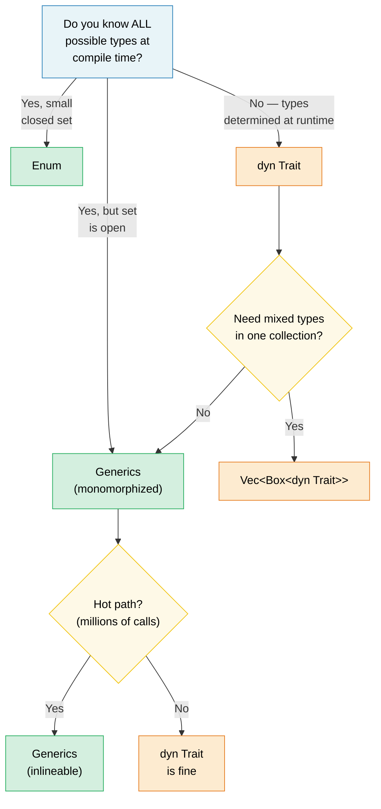

# 1. Generics — The Full Picture 🟢

> **What you'll learn:**
> - How monomorphization gives zero-cost generics — and when it causes code bloat
> - The decision framework: generics vs enums vs trait objects
> - Const generics for compile-time array sizes and `const fn` for compile-time evaluation
> - When to trade static dispatch for dynamic dispatch on cold paths

## Monomorphization and Zero Cost

Generics in Rust are **monomorphized** — the compiler generates a specialized copy of each generic function for every concrete type it's used with. This is the opposite of Java/C# where generics are erased at runtime.

```rust
fn max_of<T: PartialOrd>(a: T, b: T) -> T {
    if a >= b { a } else { b }
}

fn main() {
    max_of(3_i32, 5_i32);     // Compiler generates max_of_i32
    max_of(2.0_f64, 7.0_f64); // Compiler generates max_of_f64
    max_of("a", "z");         // Compiler generates max_of_str
}
```

**What the compiler actually produces** (conceptually):

```rust
// Three separate functions — no runtime dispatch, no vtable:
fn max_of_i32(a: i32, b: i32) -> i32 { if a >= b { a } else { b } }
fn max_of_f64(a: f64, b: f64) -> f64 { if a >= b { a } else { b } }
fn max_of_str<'a>(a: &'a str, b: &'a str) -> &'a str { if a >= b { a } else { b } }
```

> **Why does `max_of_str` need `<'a>` but `max_of_i32` doesn't?** `i32` and `f64`
> are `Copy` types — the function returns an owned value. But `&str` is a reference,
> so the compiler must know the returned reference's lifetime. The `<'a>` annotation
> says "the returned `&str` lives at least as long as both inputs."

**Advantages**: Zero runtime cost — identical to hand-written specialized code. The optimizer can inline, vectorize, and specialize each copy independently.

**Comparison with C++**: Rust generics work like C++ templates but with one crucial difference — **bounds checking happens at definition, not instantiation**.

```rust
// Rust: error at definition site — "T doesn't implement Display"
fn broken<T>(val: T) {
    println!("{val}"); // ❌ Error: T doesn't implement Display
}

// Fix: add the bound
fn fixed<T: std::fmt::Display>(val: T) {
    println!("{val}"); // ✅
}
```

### When Generics Hurt: Code Bloat

Monomorphization has a cost — binary size. Each unique instantiation duplicates the function body:

```rust
// This innocent function...
fn serialize<T: serde::Serialize>(value: &T) -> Vec<u8> {
    serde_json::to_vec(value).unwrap()
}

// ...used with 50 different types → 50 copies in the binary.
```

**Mitigation strategies**:

```rust
// 1. Extract the non-generic core ("outline" pattern)
fn serialize<T: serde::Serialize>(value: &T) -> Result<Vec<u8>, serde_json::Error> {
    let json_value = serde_json::to_value(value)?;
    serialize_value(json_value)
}

fn serialize_value(value: serde_json::Value) -> Result<Vec<u8>, serde_json::Error> {
    // This function exists only ONCE in the binary
    serde_json::to_vec(&value)
}

// 2. Use trait objects (dynamic dispatch)
fn log_item(item: &dyn std::fmt::Display) {
    // One copy — uses vtable for dispatch
    println!("[LOG] {item}");
}
```

### Generics vs Enums vs Trait Objects — Decision Guide

| Approach | Dispatch | Known at | Extensible? | Overhead |
|----------|----------|----------|-------------|----------|
| **Generics** (`impl Trait` / `<T: Trait>`) | Static | Compile time | ✅ (open set) | Zero — inlined |
| **Enum** | Match arm | Compile time | ❌ (closed set) | Zero |
| **Trait object** (`dyn Trait`) | Dynamic | Runtime | ✅ (open set) | Vtable overhead |



### Const Generics

Since Rust 1.51, you can parameterize types and functions over *constant values*, not just types:

```rust
// Array wrapper parameterized over size
struct Matrix<const ROWS: usize, const COLS: usize> {
    data: [[f64; COLS]; ROWS],
}

impl<const ROWS: usize, const COLS: usize> Matrix<ROWS, COLS> {
    fn new() -> Self {
        Matrix { data: [[0.0; COLS]; ROWS] }
    }

    fn transpose(&self) -> Matrix<COLS, ROWS> {
        let mut result = Matrix::<COLS, ROWS>::new();
        for r in 0..ROWS {
            for c in 0..COLS {
                result.data[c][r] = self.data[r][c];
            }
        }
        result
    }
}
```

### Const Functions (const fn)

`const fn` marks a function as evaluable at compile time — Rust's equivalent of C++ `constexpr`.

```rust
// Basic const fn — evaluated at compile time
const fn celsius_to_fahrenheit(c: f64) -> f64 {
    c * 9.0 / 5.0 + 32.0
}

const BOILING_F: f64 = celsius_to_fahrenheit(100.0); // Computed at compile time
```

> **Key Takeaways — Generics**
> - Monomorphization gives zero-cost abstractions but can cause code bloat
> - Const generics (`[T; N]`) replace C++ template tricks
> - `const fn` eliminates `lazy_static!` for simple values

---

### Exercise: Generic Cache with Eviction ★★

Build a generic `Cache<K, V>` struct that stores key-value pairs with a configurable maximum capacity. When full, the oldest entry is evicted (FIFO).

<details>
<summary>🔑 Solution</summary>

```rust
use std::collections::{HashMap, VecDeque};
use std::hash::Hash;

struct Cache<K, V> {
    map: HashMap<K, V>,
    order: VecDeque<K>,
    capacity: usize,
}

impl<K: Eq + Hash + Clone, V> Cache<K, V> {
    fn new(capacity: usize) -> Self {
        Cache {
            map: HashMap::with_capacity(capacity),
            order: VecDeque::with_capacity(capacity),
            capacity,
        }
    }

    fn insert(&mut self, key: K, value: V) {
        if self.map.contains_key(&key) {
            self.map.insert(key, value);
            return;
        }
        if self.map.len() >= self.capacity {
            if let Some(oldest) = self.order.pop_front() {
                self.map.remove(&oldest);
            }
        }
        self.order.push_back(key.clone());
        self.map.insert(key, value);
    }

    fn get(&self, key: &K) -> Option<&V> {
        self.map.get(key)
    }

    fn len(&self) -> usize {
        self.map.len()
    }
}
```

</details>

***
