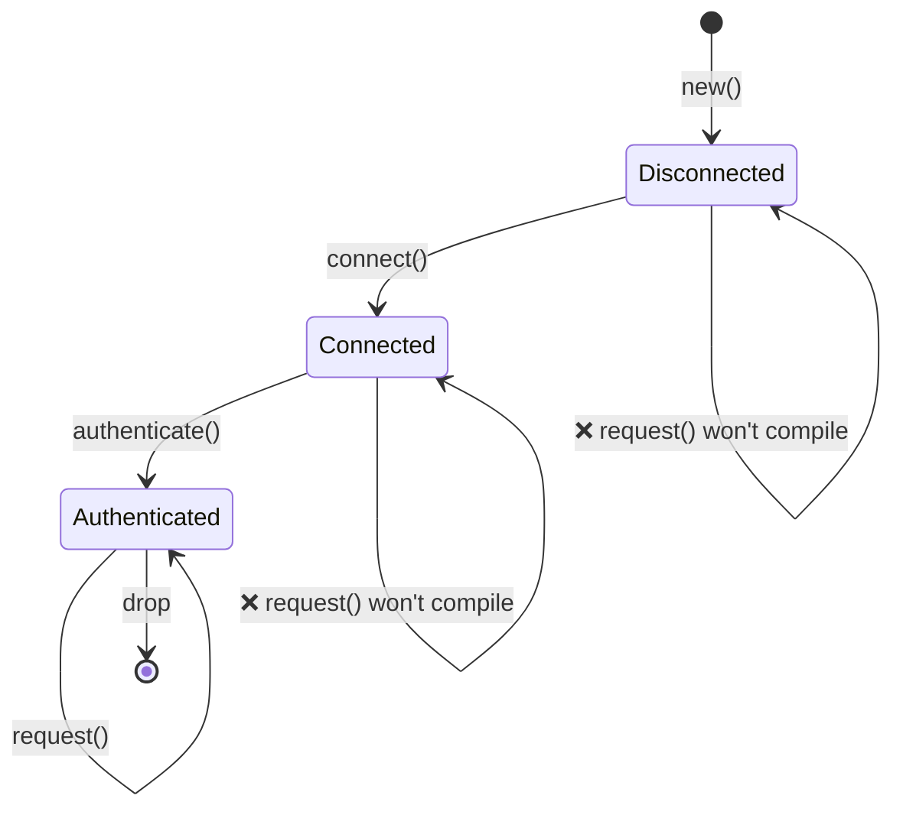
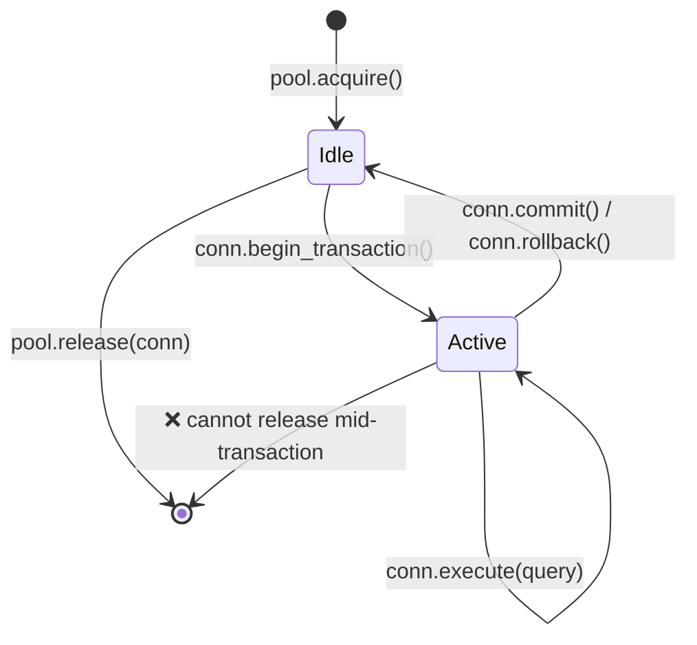
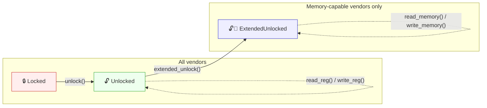
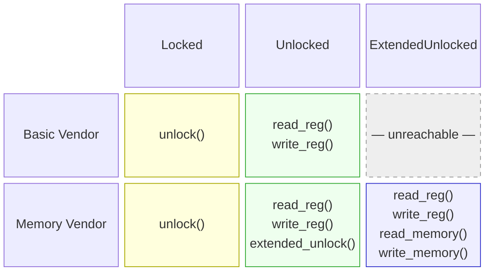

# 3. The Newtype and Type-State Patterns 🟡

> **What you'll learn:**
> - The newtype pattern for zero-cost compile-time type safety
> - Type-state pattern: making illegal state transitions unrepresentable
> - Builder pattern with type states for compile-time–enforced construction
> - Config trait pattern for taming generic parameter explosion

## Newtype: Zero-Cost Type Safety

The newtype pattern wraps an existing type in a single-field tuple struct to create a distinct type with zero runtime overhead:

```rust
// Without newtypes — easy to mix up:
fn create_user(name: String, email: String, age: u32, employee_id: u32) { }
// create_user(name, email, age, id);  — but what if we swap age and id?
// create_user(name, email, id, age);  — COMPILES FINE, BUG

// With newtypes — the compiler catches mistakes:
struct UserName(String);
struct Email(String);
struct Age(u32);
struct EmployeeId(u32);

fn create_user(name: UserName, email: Email, age: Age, id: EmployeeId) { }
// create_user(name, email, EmployeeId(42), Age(30));
// ❌ Compile error: expected Age, got EmployeeId
```

### `impl Deref` for Newtypes — Power and Pitfalls

Implementing `Deref` on a newtype lets it auto-coerce to the inner type's
reference, giving you all of the inner type's methods "for free":

```rust
use std::ops::Deref;

struct Email(String);

impl Email {
    fn new(raw: &str) -> Result<Self, &'static str> {
        if raw.contains('@') {
            Ok(Email(raw.to_string()))
        } else {
            Err("invalid email: missing @")
        }
    }
}

impl Deref for Email {
    type Target = str;
    fn deref(&self) -> &str { &self.0 }
}

// Now Email auto-derefs to &str:
let email = Email::new("user@example.com").unwrap();
println!("Length: {}", email.len()); // Uses str::len via Deref
```

This is convenient — but it effectively **punches a hole** through your
newtype's abstraction boundary because *every* method on the target type
becomes callable on your wrapper.

#### When `Deref` IS appropriate

| Scenario | Example | Why it's fine |
|----------|---------|---------------|
| Smart-pointer wrappers | `Box<T>`, `Arc<T>`, `MutexGuard<T>` | The wrapper's whole purpose is to behave like `T` |
| Transparent "thin" wrappers | `String` → `str`, `PathBuf` → `Path`, `Vec<T>` → `[T]` | The wrapper IS-A superset of the target |
| Your newtype genuinely IS the inner type | `struct Hostname(String)` where you always want full string ops | Restricting the API would add no value |

#### When `Deref` is an anti-pattern

| Scenario | Problem |
|----------|---------|
| **Domain types with invariants** | `Email` derefs to `&str`, so callers can call `.split_at()`, `.trim()`, etc. — none of which preserve the "must contain @" invariant. If someone stores the trimmed `&str` and reconstructs, the invariant is lost. |
| **Types where you want a restricted API** | `struct Password(String)` with `Deref<Target = str>` leaks `.as_bytes()`, `.chars()`, `Debug` output — exactly what you're trying to hide. |
| **Fake inheritance** | Using `Deref` to make `ManagerWidget` auto-deref to `Widget` simulates OOP inheritance. This is explicitly discouraged — see the Rust API Guidelines (C-DEREF). |

> **Rule of thumb**: If your newtype exists to *add type safety* or *restrict
> the API*, don't implement `Deref`. If it exists to *add capabilities* while
> keeping the inner type's full surface (like a smart pointer), `Deref` is
> the right choice.

#### `DerefMut` — doubles the risk

If you also implement `DerefMut`, callers can *mutate* the inner value
directly, bypassing any validation in your constructors:

```rust
use std::ops::{Deref, DerefMut};

struct PortNumber(u16);

impl Deref for PortNumber {
    type Target = u16;
    fn deref(&self) -> &u16 { &self.0 }
}

impl DerefMut for PortNumber {
    fn deref_mut(&mut self) -> &mut u16 { &mut self.0 }
}

let mut port = PortNumber(443);
*port = 0; // Bypasses any validation — now an invalid port
```

Only implement `DerefMut` when the inner type has no invariants to protect.

#### Prefer explicit delegation instead

When you want only *some* of the inner type's methods, delegate explicitly:

```rust
struct Email(String);

impl Email {
    fn new(raw: &str) -> Result<Self, &'static str> {
        if raw.contains('@') { Ok(Email(raw.to_string())) }
        else { Err("missing @") }
    }

    // Expose only what makes sense:
    pub fn as_str(&self) -> &str { &self.0 }
    pub fn len(&self) -> usize { self.0.len() }
    pub fn domain(&self) -> &str {
        self.0.split('@').nth(1).unwrap_or("")
    }
    // .split_at(), .trim(), .replace() — NOT exposed
}
```

#### Clippy and the ecosystem

- **`clippy::wrong_self_convention`** can fire when `Deref` coercion
  makes method resolution surprising (e.g., `is_empty()` resolving to the
  inner type's version instead of one you intended to shadow).
- The **Rust API Guidelines** (C-DEREF) state: *"only smart pointers
  should implement `Deref`."* Treat this as a strong default; deviate
  only with clear justification.
- If you need trait compatibility (e.g., passing `Email` to functions
  expecting `&str`), consider implementing `AsRef<str>` and `Borrow<str>`
  instead — they're explicit conversions without auto-coercion surprises.

#### Decision matrix

```text
Do you want ALL methods of the inner type to be callable?
  ├─ YES → Does your type enforce invariants or restrict the API?
  │    ├─ NO  → impl Deref ✅  (smart-pointer / transparent wrapper)
  │    └─ YES → Don't impl Deref ❌ (invariant leaks)
  └─ NO  → Don't impl Deref ❌  (use AsRef / explicit delegation)
```

### Type-State: Compile-Time Protocol Enforcement

The type-state pattern uses the type system to enforce that operations happen in the correct order. Invalid states become **unrepresentable**.



> Each transition *consumes* `self` and returns a new type — the compiler enforces valid ordering.

```rust
// Problem: A network connection that must be:
// 1. Created
// 2. Connected
// 3. Authenticated
// 4. Then used for requests
// Calling request() before authenticate() should be a COMPILE error.

// --- Type-state markers (zero-sized types) ---
struct Disconnected;
struct Connected;
struct Authenticated;

// --- Connection parameterized by state ---
struct Connection<State> {
    address: String,
    _state: std::marker::PhantomData<State>,
}

// Only Disconnected connections can connect:
impl Connection<Disconnected> {
    fn new(address: &str) -> Self {
        Connection {
            address: address.to_string(),
            _state: std::marker::PhantomData,
        }
    }

    fn connect(self) -> Connection<Connected> {
        println!("Connecting to {}...", self.address);
        Connection {
            address: self.address,
            _state: std::marker::PhantomData,
        }
    }
}

// Only Connected connections can authenticate:
impl Connection<Connected> {
    fn authenticate(self, _token: &str) -> Connection<Authenticated> {
        println!("Authenticating...");
        Connection {
            address: self.address,
            _state: std::marker::PhantomData,
        }
    }
}

// Only Authenticated connections can make requests:
impl Connection<Authenticated> {
    fn request(&self, path: &str) -> String {
        format!("GET {} from {}", path, self.address)
    }
}

fn main() {
    let conn = Connection::new("api.example.com");
    // conn.request("/data"); // ❌ Compile error: no method `request` on Connection<Disconnected>

    let conn = conn.connect();
    // conn.request("/data"); // ❌ Compile error: no method `request` on Connection<Connected>

    let conn = conn.authenticate("secret-token");
    let response = conn.request("/data"); // ✅ Only works after authentication
    println!("{response}");
}
```

> **Key insight**: Each state transition *consumes* `self` and returns a new type.
> You can't use the old state after transitioning — the compiler enforces it.
> Zero runtime cost — `PhantomData` is zero-sized, states are erased at compile time.

**Comparison with C++/C#**: In C++ or C#, you'd enforce this with runtime checks (`if (!authenticated) throw ...`). The Rust type-state pattern moves these checks to compile time — invalid states are literally unrepresentable in the type system.

### Builder Pattern with Type States

A practical application — a builder that enforces required fields:

```rust
use std::marker::PhantomData;

// Marker types for required fields
struct NeedsName;
struct NeedsPort;
struct Ready;

struct ServerConfig<State> {
    name: Option<String>,
    port: Option<u16>,
    max_connections: usize, // Optional, has default
    _state: PhantomData<State>,
}

impl ServerConfig<NeedsName> {
    fn new() -> Self {
        ServerConfig {
            name: None,
            port: None,
            max_connections: 100,
            _state: PhantomData,
        }
    }

    fn name(self, name: &str) -> ServerConfig<NeedsPort> {
        ServerConfig {
            name: Some(name.to_string()),
            port: self.port,
            max_connections: self.max_connections,
            _state: PhantomData,
        }
    }
}

impl ServerConfig<NeedsPort> {
    fn port(self, port: u16) -> ServerConfig<Ready> {
        ServerConfig {
            name: self.name,
            port: Some(port),
            max_connections: self.max_connections,
            _state: PhantomData,
        }
    }
}

impl ServerConfig<Ready> {
    fn max_connections(mut self, n: usize) -> Self {
        self.max_connections = n;
        self
    }

    fn build(self) -> Server {
        Server {
            name: self.name.unwrap(),
            port: self.port.unwrap(),
            max_connections: self.max_connections,
        }
    }
}

struct Server {
    name: String,
    port: u16,
    max_connections: usize,
}

fn main() {
    // Must provide name, then port, then can build:
    let server = ServerConfig::new()
        .name("my-server")
        .port(8080)
        .max_connections(500)
        .build();

    // ServerConfig::new().port(8080); // ❌ Compile error: no method `port` on NeedsName
    // ServerConfig::new().name("x").build(); // ❌ Compile error: no method `build` on NeedsPort
}
```

***

## Case Study: Type-Safe Connection Pool

Real-world systems need connection pools where connections move through well-defined states. Here's how the typestate pattern enforces correctness in a production pool:



```rust
use std::marker::PhantomData;

// States
struct Idle;
struct InTransaction;

struct PooledConnection<State> {
    id: u32,
    _state: PhantomData<State>,
}

struct Pool {
    next_id: u32,
}

impl Pool {
    fn new() -> Self { Pool { next_id: 0 } }

    fn acquire(&mut self) -> PooledConnection<Idle> {
        self.next_id += 1;
        println!("[pool] Acquired connection #{}", self.next_id);
        PooledConnection { id: self.next_id, _state: PhantomData }
    }

    // Only idle connections can be released — prevents mid-transaction leaks
    fn release(&self, conn: PooledConnection<Idle>) {
        println!("[pool] Released connection #{}", conn.id);
    }
}

impl PooledConnection<Idle> {
    fn begin_transaction(self) -> PooledConnection<InTransaction> {
        println!("[conn #{}] BEGIN", self.id);
        PooledConnection { id: self.id, _state: PhantomData }
    }
}

impl PooledConnection<InTransaction> {
    fn execute(&self, query: &str) {
        println!("[conn #{}] EXEC: {}", self.id, query);
    }

    fn commit(self) -> PooledConnection<Idle> {
        println!("[conn #{}] COMMIT", self.id);
        PooledConnection { id: self.id, _state: PhantomData }
    }

    fn rollback(self) -> PooledConnection<Idle> {
        println!("[conn #{}] ROLLBACK", self.id);
        PooledConnection { id: self.id, _state: PhantomData }
    }
}

fn main() {
    let mut pool = Pool::new();

    let conn = pool.acquire();
    let conn = conn.begin_transaction();
    conn.execute("INSERT INTO users VALUES ('Alice')");
    conn.execute("INSERT INTO orders VALUES (1, 42)");
    let conn = conn.commit(); // Back to Idle
    pool.release(conn);       // ✅ Only works on Idle connections

    // pool.release(conn_active); // ❌ Compile error: can't release InTransaction
}
```

**Why this matters in production**: A connection leaked mid-transaction holds database
locks indefinitely. The typestate pattern makes this impossible — you literally cannot
return a connection to the pool until the transaction is committed or rolled back.

***

## Config Trait Pattern — Taming Generic Parameter Explosion

### The Problem

As a struct takes on more responsibilities, each backed by a trait-constrained generic,
the type signature grows unwieldy:

```rust
trait SpiBus   { fn spi_transfer(&self, tx: &[u8], rx: &mut [u8]) -> Result<(), BusError>; }
trait ComPort  { fn com_send(&self, data: &[u8]) -> Result<usize, BusError>; }
trait I3cBus   { fn i3c_read(&self, addr: u8, buf: &mut [u8]) -> Result<(), BusError>; }
trait SmBus    { fn smbus_read_byte(&self, addr: u8, cmd: u8) -> Result<u8, BusError>; }
trait GpioBus  { fn gpio_set(&self, pin: u32, high: bool); }

// ❌ Every new bus trait adds another generic parameter
struct DiagController<S: SpiBus, C: ComPort, I: I3cBus, M: SmBus, G: GpioBus> {
    spi: S,
    com: C,
    i3c: I,
    smbus: M,
    gpio: G,
}
// impl blocks, function signatures, and callers all repeat the full list.
// Adding a 6th bus means editing every mention of DiagController<S, C, I, M, G>.
```

This is often called **"generic parameter explosion."** It compounds across `impl` blocks,
function parameters, and downstream consumers — each of which must repeat the full
parameter list.

### The Solution: A Config Trait

Bundle all associated types into a single trait. The struct then has **one** generic
parameter regardless of how many component types it contains:

```rust
#[derive(Debug)]
enum BusError {
    Timeout,
    NakReceived,
    HardwareFault(String),
}

// --- Bus traits (unchanged) ---
trait SpiBus {
    fn spi_transfer(&self, tx: &[u8], rx: &mut [u8]) -> Result<(), BusError>;
    fn spi_write(&self, data: &[u8]) -> Result<(), BusError>;
}

trait ComPort {
    fn com_send(&self, data: &[u8]) -> Result<usize, BusError>;
    fn com_recv(&self, buf: &mut [u8], timeout_ms: u32) -> Result<usize, BusError>;
}

trait I3cBus {
    fn i3c_read(&self, addr: u8, buf: &mut [u8]) -> Result<(), BusError>;
    fn i3c_write(&self, addr: u8, data: &[u8]) -> Result<(), BusError>;
}

// --- The Config trait: one associated type per component ---
trait BoardConfig {
    type Spi: SpiBus;
    type Com: ComPort;
    type I3c: I3cBus;
}

// --- DiagController has exactly ONE generic parameter ---
struct DiagController<Cfg: BoardConfig> {
    spi: Cfg::Spi,
    com: Cfg::Com,
    i3c: Cfg::I3c,
}
```

`DiagController<Cfg>` will never gain another generic parameter.
Adding a 4th bus means adding one associated type to `BoardConfig` and one field
to `DiagController` — no downstream signature changes.

### Implementing the Controller

```rust
impl<Cfg: BoardConfig> DiagController<Cfg> {
    fn new(spi: Cfg::Spi, com: Cfg::Com, i3c: Cfg::I3c) -> Self {
        DiagController { spi, com, i3c }
    }

    fn read_flash_id(&self) -> Result<u32, BusError> {
        let cmd = [0x9F]; // JEDEC Read ID
        let mut id = [0u8; 4];
        self.spi.spi_transfer(&cmd, &mut id)?;
        Ok(u32::from_be_bytes(id))
    }

    fn send_bmc_command(&self, cmd: &[u8]) -> Result<Vec<u8>, BusError> {
        self.com.com_send(cmd)?;
        let mut resp = vec![0u8; 256];
        let n = self.com.com_recv(&mut resp, 1000)?;
        resp.truncate(n);
        Ok(resp)
    }

    fn read_sensor_temp(&self, sensor_addr: u8) -> Result<i16, BusError> {
        let mut buf = [0u8; 2];
        self.i3c.i3c_read(sensor_addr, &mut buf)?;
        Ok(i16::from_be_bytes(buf))
    }

    fn run_full_diag(&self) -> Result<DiagReport, BusError> {
        let flash_id = self.read_flash_id()?;
        let bmc_resp = self.send_bmc_command(b"VERSION\n")?;
        let cpu_temp = self.read_sensor_temp(0x48)?;
        let gpu_temp = self.read_sensor_temp(0x49)?;

        Ok(DiagReport {
            flash_id,
            bmc_version: String::from_utf8_lossy(&bmc_resp).to_string(),
            cpu_temp_c: cpu_temp,
            gpu_temp_c: gpu_temp,
        })
    }
}

#[derive(Debug)]
struct DiagReport {
    flash_id: u32,
    bmc_version: String,
    cpu_temp_c: i16,
    gpu_temp_c: i16,
}
```

### Production Wiring

One `impl BoardConfig` selects the concrete hardware drivers:

```rust
struct PlatformSpi  { dev: String, speed_hz: u32 }
struct UartCom      { dev: String, baud: u32 }
struct LinuxI3c     { dev: String }

impl SpiBus for PlatformSpi {
    fn spi_transfer(&self, tx: &[u8], rx: &mut [u8]) -> Result<(), BusError> {
        // ioctl(SPI_IOC_MESSAGE) in production
        rx[0..4].copy_from_slice(&[0xEF, 0x40, 0x18, 0x00]);
        Ok(())
    }
    fn spi_write(&self, _data: &[u8]) -> Result<(), BusError> { Ok(()) }
}

impl ComPort for UartCom {
    fn com_send(&self, _data: &[u8]) -> Result<usize, BusError> { Ok(0) }
    fn com_recv(&self, buf: &mut [u8], _timeout: u32) -> Result<usize, BusError> {
        let resp = b"BMC v2.4.1\n";
        buf[..resp.len()].copy_from_slice(resp);
        Ok(resp.len())
    }
}

impl I3cBus for LinuxI3c {
    fn i3c_read(&self, _addr: u8, buf: &mut [u8]) -> Result<(), BusError> {
        buf[0] = 0x00; buf[1] = 0x2D; // 45°C
        Ok(())
    }
    fn i3c_write(&self, _addr: u8, _data: &[u8]) -> Result<(), BusError> { Ok(()) }
}

// ✅ One struct, one impl — all concrete types resolved here
struct ProductionBoard;
impl BoardConfig for ProductionBoard {
    type Spi = PlatformSpi;
    type Com = UartCom;
    type I3c = LinuxI3c;
}

fn main() {
    let ctrl = DiagController::<ProductionBoard>::new(
        PlatformSpi { dev: "/dev/spidev0.0".into(), speed_hz: 10_000_000 },
        UartCom     { dev: "/dev/ttyS0".into(),     baud: 115200 },
        LinuxI3c    { dev: "/dev/i3c-0".into() },
    );
    let report = ctrl.run_full_diag().unwrap();
    println!("{report:#?}");
}
```

### Test Wiring with Mocks

Swap the entire hardware layer by defining a different `BoardConfig`:

```rust
struct MockSpi  { flash_id: [u8; 4] }
struct MockCom  { response: Vec<u8> }
struct MockI3c  { temps: std::collections::HashMap<u8, i16> }

impl SpiBus for MockSpi {
    fn spi_transfer(&self, _tx: &[u8], rx: &mut [u8]) -> Result<(), BusError> {
        rx[..4].copy_from_slice(&self.flash_id);
        Ok(())
    }
    fn spi_write(&self, _data: &[u8]) -> Result<(), BusError> { Ok(()) }
}

impl ComPort for MockCom {
    fn com_send(&self, _data: &[u8]) -> Result<usize, BusError> { Ok(0) }
    fn com_recv(&self, buf: &mut [u8], _timeout: u32) -> Result<usize, BusError> {
        let n = self.response.len().min(buf.len());
        buf[..n].copy_from_slice(&self.response[..n]);
        Ok(n)
    }
}

impl I3cBus for MockI3c {
    fn i3c_read(&self, addr: u8, buf: &mut [u8]) -> Result<(), BusError> {
        let temp = self.temps.get(&addr).copied().unwrap_or(0);
        buf[..2].copy_from_slice(&temp.to_be_bytes());
        Ok(())
    }
    fn i3c_write(&self, _addr: u8, _data: &[u8]) -> Result<(), BusError> { Ok(()) }
}

struct TestBoard;
impl BoardConfig for TestBoard {
    type Spi = MockSpi;
    type Com = MockCom;
    type I3c = MockI3c;
}

#[cfg(test)]
mod tests {
    use super::*;

    fn make_test_controller() -> DiagController<TestBoard> {
        let mut temps = std::collections::HashMap::new();
        temps.insert(0x48, 45i16);
        temps.insert(0x49, 72i16);

        DiagController::<TestBoard>::new(
            MockSpi  { flash_id: [0xEF, 0x40, 0x18, 0x00] },
            MockCom  { response: b"BMC v2.4.1\n".to_vec() },
            MockI3c  { temps },
        )
    }

    #[test]
    fn test_flash_id() {
        let ctrl = make_test_controller();
        assert_eq!(ctrl.read_flash_id().unwrap(), 0xEF401800);
    }

    #[test]
    fn test_sensor_temps() {
        let ctrl = make_test_controller();
        assert_eq!(ctrl.read_sensor_temp(0x48).unwrap(), 45);
        assert_eq!(ctrl.read_sensor_temp(0x49).unwrap(), 72);
    }

    #[test]
    fn test_full_diag() {
        let ctrl = make_test_controller();
        let report = ctrl.run_full_diag().unwrap();
        assert_eq!(report.flash_id, 0xEF401800);
        assert_eq!(report.cpu_temp_c, 45);
        assert_eq!(report.gpu_temp_c, 72);
        assert!(report.bmc_version.contains("2.4.1"));
    }
}
```

### Adding a New Bus Later

When you need a 4th bus, only two things change — `BoardConfig` and `DiagController`.
**No downstream signature changes.** The generic parameter count stays at one:

```rust
trait SmBus {
    fn smbus_read_byte(&self, addr: u8, cmd: u8) -> Result<u8, BusError>;
}

// 1. Add one associated type:
trait BoardConfig {
    type Spi: SpiBus;
    type Com: ComPort;
    type I3c: I3cBus;
    type Smb: SmBus;     // ← new
}

// 2. Add one field:
struct DiagController<Cfg: BoardConfig> {
    spi: Cfg::Spi,
    com: Cfg::Com,
    i3c: Cfg::I3c,
    smb: Cfg::Smb,       // ← new
}

// 3. Provide the concrete type in each config impl:
impl BoardConfig for ProductionBoard {
    type Spi = PlatformSpi;
    type Com = UartCom;
    type I3c = LinuxI3c;
    type Smb = LinuxSmbus; // ← new
}
```

### When to Use This Pattern

| Situation | Use Config Trait? | Alternative |
|-----------|:-:|---|
| 3+ trait-constrained generics on a struct | ✅ Yes | — |
| Need to swap entire hardware/platform layer | ✅ Yes | — |
| Only 1-2 generics | ❌ Overkill | Direct generics |
| Need runtime polymorphism | ❌ | `dyn Trait` objects |
| Open-ended plugin system | ❌ | Type-map / `Any` |
| Component traits form a natural group (board, platform) | ✅ Yes | — |

### Key Properties

- **One generic parameter forever** — `DiagController<Cfg>` never gains more `<A, B, C, ...>`
- **Fully static dispatch** — no vtables, no `dyn`, no heap allocation for trait objects
- **Clean test swapping** — define `TestBoard` with mock impls, zero conditional compilation
- **Compile-time safety** — forget an associated type → compile error, not runtime crash
- **Battle-tested** — this is the pattern used by Substrate/Polkadot's frame system
  to manage 20+ associated types through a single `Config` trait

> **Key Takeaways — Newtype & Type-State**
> - Newtypes give compile-time type safety at zero runtime cost
> - Type-state makes illegal state transitions a compile error, not a runtime bug
> - Config traits tame generic parameter explosion in large systems

> **See also:** [Ch 4 — PhantomData](ch04-phantomdata-types-that-carry-no-data.md) for the zero-sized markers that power type-state. [Ch 2 — Traits In Depth](ch02-traits-in-depth.md) for associated types used in the config trait pattern.

---

## Case Study: Dual-Axis Typestate — Vendor × Protocol State

The patterns above handle one axis at a time: typestate enforces *protocol order*,
and trait abstraction handles *multiple vendors*. Real systems often need **both
simultaneously**: a wrapper `Handle<Vendor, State>` where available methods depend
on *which vendor* is plugged in **and** *which state* the handle is in.

This section shows the **dual-axis conditional `impl`** pattern — where `impl`
blocks are gated on both a vendor trait bound and a state marker trait.

### The Two-Dimensional Problem

Consider a debug probe interface (JTAG/SWD). Multiple vendors make probes, and
every probe must be unlocked before registers become accessible. Some vendors
additionally support direct memory reads — but only after an *extended unlock*
that configures the memory access port:



The **capability matrix** — which methods exist for which (vendor, state)
combination — is two-dimensional:



The challenge: express this matrix **entirely at compile time**, with static
dispatch, so that calling `extended_unlock()` on a basic probe or
`read_memory()` on an unlocked-but-not-extended handle is a compile error.

### The Solution: `Jtag<V, S>` with Marker Traits

**Step 1 — State tokens and capability markers:**

```rust,ignore
use std::marker::PhantomData;

// Zero-sized state tokens — no runtime cost
struct Locked;
struct Unlocked;
struct ExtendedUnlocked;

// Marker traits express which capabilities each state has
trait HasRegAccess {}
impl HasRegAccess for Unlocked {}
impl HasRegAccess for ExtendedUnlocked {}

trait HasMemAccess {}
impl HasMemAccess for ExtendedUnlocked {}
```

> **Why marker traits, not just concrete states?**
> Writing `impl<V, S: HasRegAccess> Jtag<V, S>` means `read_reg()` works in
> *any* state with register access — today that's `Unlocked` and `ExtendedUnlocked`,
> but if you add `DebugHalted` tomorrow, you just add one line:
> `impl HasRegAccess for DebugHalted {}`. Every register function works with
> it automatically — zero code changes.

**Step 2 — Vendor traits (raw operations):**

```rust,ignore
// Every probe vendor implements these
trait JtagVendor {
    fn raw_unlock(&mut self);
    fn raw_read_reg(&self, addr: u32) -> u32;
    fn raw_write_reg(&mut self, addr: u32, val: u32);
}

// Vendors with memory access also implement this super-trait
trait JtagMemoryVendor: JtagVendor {
    fn raw_extended_unlock(&mut self);
    fn raw_read_memory(&self, addr: u64, buf: &mut [u8]);
    fn raw_write_memory(&mut self, addr: u64, data: &[u8]);
}
```

**Step 3 — The wrapper with conditional `impl` blocks:**

```rust,ignore
struct Jtag<V, S = Locked> {
    vendor: V,
    _state: PhantomData<S>,
}

// Construction — always starts Locked
impl<V: JtagVendor> Jtag<V, Locked> {
    fn new(vendor: V) -> Self {
        Jtag { vendor, _state: PhantomData }
    }

    fn unlock(mut self) -> Jtag<V, Unlocked> {
        self.vendor.raw_unlock();
        Jtag { vendor: self.vendor, _state: PhantomData }
    }
}

// Register I/O — any vendor, any state with HasRegAccess
impl<V: JtagVendor, S: HasRegAccess> Jtag<V, S> {
    fn read_reg(&self, addr: u32) -> u32 {
        self.vendor.raw_read_reg(addr)
    }
    fn write_reg(&mut self, addr: u32, val: u32) {
        self.vendor.raw_write_reg(addr, val);
    }
}

// Extended unlock — only memory-capable vendors, only from Unlocked
impl<V: JtagMemoryVendor> Jtag<V, Unlocked> {
    fn extended_unlock(mut self) -> Jtag<V, ExtendedUnlocked> {
        self.vendor.raw_extended_unlock();
        Jtag { vendor: self.vendor, _state: PhantomData }
    }
}

// Memory I/O — only memory-capable vendors, only ExtendedUnlocked
impl<V: JtagMemoryVendor, S: HasMemAccess> Jtag<V, S> {
    fn read_memory(&self, addr: u64, buf: &mut [u8]) {
        self.vendor.raw_read_memory(addr, buf);
    }
    fn write_memory(&mut self, addr: u64, data: &[u8]) {
        self.vendor.raw_write_memory(addr, data);
    }
}
```

Each `impl` block encodes one cell (or row) of the capability matrix.
The compiler enforces the matrix — no runtime checks anywhere.

### Vendor Implementations

Adding a vendor means implementing raw methods on **one struct** — no
per-state struct duplication, no delegation boilerplate:

```rust,ignore
// Vendor A: basic probe — register access only
struct BasicProbe { port: u16 }

impl JtagVendor for BasicProbe {
    fn raw_unlock(&mut self)                    { /* TAP reset sequence */ }
    fn raw_read_reg(&self, addr: u32) -> u32    { /* DR scan */  0 }
    fn raw_write_reg(&mut self, addr: u32, val: u32) { /* DR scan */ }
}
// BasicProbe does NOT impl JtagMemoryVendor.
// extended_unlock() will not compile on Jtag<BasicProbe, _>.

// Vendor B: full-featured probe — registers + memory
struct DapProbe { serial: String }

impl JtagVendor for DapProbe {
    fn raw_unlock(&mut self)                    { /* SWD switch, read DPIDR */ }
    fn raw_read_reg(&self, addr: u32) -> u32    { /* AP register read */ 0 }
    fn raw_write_reg(&mut self, addr: u32, val: u32) { /* AP register write */ }
}

impl JtagMemoryVendor for DapProbe {
    fn raw_extended_unlock(&mut self)           { /* select MEM-AP, power up */ }
    fn raw_read_memory(&self, addr: u64, buf: &mut [u8])  { /* MEM-AP read */ }
    fn raw_write_memory(&mut self, addr: u64, data: &[u8]) { /* MEM-AP write */ }
}
```

### What the Compiler Prevents

| Attempt | Error | Why |
|---------|-------|-----|
| `Jtag<_, Locked>::read_reg()` | no method `read_reg` | `Locked` doesn't impl `HasRegAccess` |
| `Jtag<BasicProbe, _>::extended_unlock()` | no method `extended_unlock` | `BasicProbe` doesn't impl `JtagMemoryVendor` |
| `Jtag<_, Unlocked>::read_memory()` | no method `read_memory` | `Unlocked` doesn't impl `HasMemAccess` |
| Calling `unlock()` twice | value used after move | `unlock()` consumes `self` |

All four errors are caught **at compile time**. No panics, no `Option`, no runtime state enum.

### Writing Generic Functions

Functions bind only the axes they care about:

```rust,ignore
/// Works with ANY vendor, ANY state that grants register access.
fn read_idcode<V: JtagVendor, S: HasRegAccess>(jtag: &Jtag<V, S>) -> u32 {
    jtag.read_reg(0x00)
}

/// Only compiles for memory-capable vendors in ExtendedUnlocked state.
fn dump_firmware<V: JtagMemoryVendor, S: HasMemAccess>(jtag: &Jtag<V, S>) {
    let mut buf = [0u8; 256];
    jtag.read_memory(0x0800_0000, &mut buf);
}
```

`read_idcode` doesn't care whether you're in `Unlocked` or `ExtendedUnlocked` —
it only requires `HasRegAccess`. This is where marker traits pay off over
hardcoding specific states in signatures.

### Same Pattern, Different Domain: Storage Backends

The dual-axis technique isn't hardware-specific. Here's the same structure
for a storage layer where some backends support transactions:

```rust,ignore
// States
struct Closed;
struct Open;
struct InTransaction;

trait HasReadWrite {}
impl HasReadWrite for Open {}
impl HasReadWrite for InTransaction {}

// Vendor traits
trait StorageBackend {
    fn raw_open(&mut self);
    fn raw_read(&self, key: &[u8]) -> Option<Vec<u8>>;
    fn raw_write(&mut self, key: &[u8], value: &[u8]);
}

trait TransactionalBackend: StorageBackend {
    fn raw_begin(&mut self);
    fn raw_commit(&mut self);
    fn raw_rollback(&mut self);
}

// Wrapper
struct Store<B, S = Closed> { backend: B, _s: PhantomData<S> }

impl<B: StorageBackend> Store<B, Closed> {
    fn open(mut self) -> Store<B, Open> { self.backend.raw_open(); /* ... */ todo!() }
}
impl<B: StorageBackend, S: HasReadWrite> Store<B, S> {
    fn read(&self, key: &[u8]) -> Option<Vec<u8>>  { self.backend.raw_read(key) }
    fn write(&mut self, key: &[u8], val: &[u8])    { self.backend.raw_write(key, val) }
}
impl<B: TransactionalBackend> Store<B, Open> {
    fn begin(mut self) -> Store<B, InTransaction>   { /* ... */ todo!() }
}
impl<B: TransactionalBackend> Store<B, InTransaction> {
    fn commit(mut self) -> Store<B, Open>           { /* ... */ todo!() }
    fn rollback(mut self) -> Store<B, Open>         { /* ... */ todo!() }
}
```

A flat-file backend implements `StorageBackend` only — `begin()` won't
compile. A database backend adds `TransactionalBackend` — the full
`Open → InTransaction → Open` cycle becomes available.

### When to Reach for This Pattern

| Signal | Why dual-axis fits |
|--------|--------------------|
| Two independent axes: "who provides it" and "what state is it in" | The `impl` block matrix directly encodes both |
| Some providers have strictly more capabilities than others | Super-trait (`MemoryVendor: Vendor`) + conditional `impl` |
| Misusing state or capability is a safety/correctness bug | Compile-time prevention > runtime checks |
| You want static dispatch (no vtables) | `PhantomData` + generics = zero-cost |

| Signal | Consider something simpler |
|--------|---------------------------|
| Only one axis varies (state OR vendor, not both) | Single-axis typestate or plain trait objects |
| Three or more independent axes | Config Trait Pattern (above) bundles axes into associated types |
| Runtime polymorphism is acceptable | `enum` state + `dyn` dispatch is simpler |

> **When two axes become three or more:**
> If you find yourself writing `Handle<V, S, D, T>` — vendor, state, debug
> level, transport — the generic parameter list is telling you something.
> Consider collapsing the *vendor* axis into an associated-type config trait
> (the [Config Trait Pattern](#config-trait-pattern--taming-generic-parameter-explosion)
> from earlier in this chapter), keeping only the *state* axis as a generic
> parameter: `Handle<Cfg, S>`. The config trait bundles `type Vendor`, `type Transport`, etc.
> into one parameter, and the state axis retains its compile-time transition guarantees.
> This is a natural evolution, not a rewrite — you lift vendor-related types
> into `Cfg` and leave the typestate machinery untouched.

> **Key Takeaway:** The dual-axis pattern is the intersection of typestate and
> trait-based abstraction. Each `impl` block maps to one cell of the
> (vendor × state) matrix. The compiler enforces the entire matrix — no
> runtime state checks, no impossible-state panics, no cost.

---

### Exercise: Type-Safe State Machine ★★ (~30 min)

Build a traffic light state machine using the type-state pattern. The light must transition `Red → Green → Yellow → Red` and no other order should be possible.

<details>
<summary>🔑 Solution</summary>

```rust
use std::marker::PhantomData;

struct Red;
struct Green;
struct Yellow;

struct TrafficLight<State> {
    _state: PhantomData<State>,
}

impl TrafficLight<Red> {
    fn new() -> Self {
        println!("🔴 Red — STOP");
        TrafficLight { _state: PhantomData }
    }

    fn go(self) -> TrafficLight<Green> {
        println!("🟢 Green — GO");
        TrafficLight { _state: PhantomData }
    }
}

impl TrafficLight<Green> {
    fn caution(self) -> TrafficLight<Yellow> {
        println!("🟡 Yellow — CAUTION");
        TrafficLight { _state: PhantomData }
    }
}

impl TrafficLight<Yellow> {
    fn stop(self) -> TrafficLight<Red> {
        println!("🔴 Red — STOP");
        TrafficLight { _state: PhantomData }
    }
}

fn main() {
    let light = TrafficLight::new(); // Red
    let light = light.go();          // Green
    let light = light.caution();     // Yellow
    let _light = light.stop();       // Red

    // light.caution(); // ❌ Compile error: no method `caution` on Red
    // TrafficLight::new().stop(); // ❌ Compile error: no method `stop` on Red
}
```

**Key takeaway**: Invalid transitions are compile errors, not runtime panics.

</details>

***

