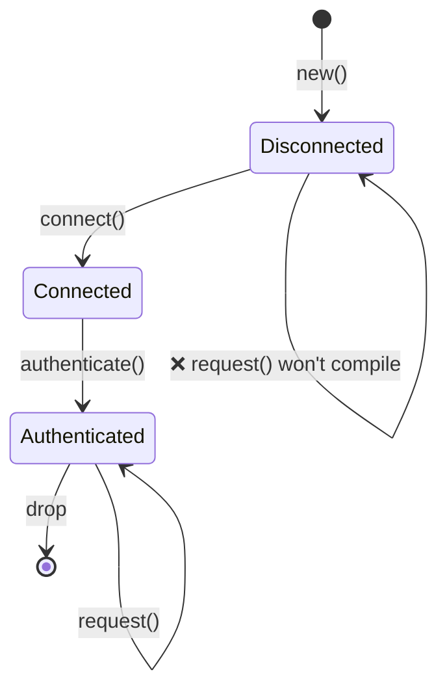

# 3. The Newtype and Type-State Patterns 🟡

> **What you'll learn:**
> - The newtype pattern for zero-cost compile-time type safety
> - Type-state pattern: making illegal state transitions unrepresentable
> - Builder pattern with type states for compile-time–enforced construction
> - Config trait pattern for taming generic parameter explosion

## Newtype: Zero-Cost Type Safety

The newtype pattern wraps an existing type in a single-field tuple struct to create a distinct type with zero runtime overhead:

```rust
// Without newtypes — easy to mix up:
fn create_user(name: String, email: String, age: u32, id: u32) { }
// create_user(name, email, id, age);  — COMPILES FINE, BUG

// With newtypes — the compiler catches mistakes:
struct UserName(String);
struct Email(String);
struct Age(u32);
struct EmployeeId(u32);

fn create_user(name: UserName, email: Email, age: Age, id: EmployeeId) { }
// create_user(name, email, EmployeeId(42), Age(30));
// ❌ Compile error: expected Age, got EmployeeId
```

### The `Deref` Pitfall

Implementing `Deref` for your newtype makes it behave like the inner type. This is convenient but **leaks the inner API**.

- **DO** implement `Deref` for smart pointers (`Box`, `Arc`).
- **DON'T** implement `Deref` for domain types with invariants (like `Email` or `Password`). Use explicit methods instead.

---

## Type-State Pattern: Correctness by Design

The type-state pattern uses the type system to enforce that operations happen in the correct order. Invalid states are **unrepresentable**.



### Implementation

```rust
struct Disconnected;
struct Connected;
struct Authenticated;

struct Connection<State> {
    _state: std::marker::PhantomData<State>,
}

impl Connection<Disconnected> {
    fn new() -> Self { Connection { _state: std::marker::PhantomData } }
    fn connect(self) -> Connection<Connected> { Connection { _state: std::marker::PhantomData } }
}

impl Connection<Connected> {
    fn authenticate(self) -> Connection<Authenticated> { Connection { _state: std::marker::PhantomData } }
}

impl Connection<Authenticated> {
    fn request(&self) { /* ... */ }
}
```

---

## Config Trait Pattern: Taming Generics

When a struct has too many generic parameters, bundle them into a single `Config` trait with associated types.

```rust
// ❌ Messy
struct Controller<S: Spi, I: I2c, G: Gpio, U: Uart> { ... }

// ✅ Clean
trait BoardConfig {
    type Spi: Spi;
    type I2c: I2c;
    type Gpio: Gpio;
    type Uart: Uart;
}

struct Controller<T: BoardConfig> {
    spi: T::Spi,
    i2c: T::I2c,
    // ...
}
```

This keeps your type signatures clean and stable even as you add more components to your system.

***
