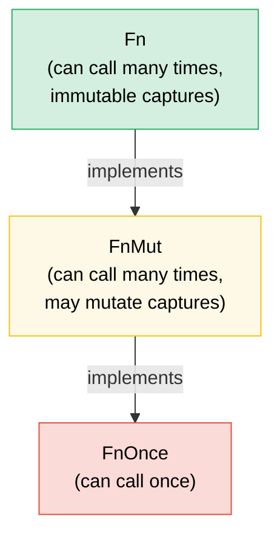

# 7. Closures and Higher-Order Functions 🟢

> **What you'll learn:**
> - The three closure traits (`Fn`, `FnMut`, `FnOnce`) and how capture works
> - Passing closures as parameters and returning them from functions
> - Combinator chains and iterator adapters for functional-style programming
> - Designing your own higher-order APIs with the right trait bounds

## Fn, FnMut, FnOnce — The Closure Traits

Every closure in Rust implements one or more of three traits, based on how it captures variables:

```rust
// FnOnce — consumes captured values (can only be called once)
let name = String::from("Alice");
let greet = move || {
    println!("Hello, {name}!"); // Takes ownership of `name`
    drop(name); // name is consumed
};
greet(); // ✅ First call
// greet(); // ❌ Can't call again — `name` was consumed

// FnMut — mutably borrows captured values (can be called many times)
let mut count = 0;
let mut increment = || {
    count += 1; // Mutably borrows `count`
};
increment(); // count == 1
increment(); // count == 2

// Fn — immutably borrows captured values (can be called many times, concurrently)
let prefix = "Result";
let display = |x: i32| {
    println!("{prefix}: {x}"); // Immutably borrows `prefix`
};
display(1);
display(2);
```

**The hierarchy**: `Fn` : `FnMut` : `FnOnce` — each is a subtrait of the next:

```text
FnOnce  ← everything can be called at least once
 ↑
FnMut   ← can be called repeatedly (may mutate state)
 ↑
Fn      ← can be called repeatedly and concurrently (no mutation)
```

If a closure implements `Fn`, it also implements `FnMut` and `FnOnce`.

### Closures as Parameters and Return Values

```rust
// --- Parameters ---

// Static dispatch (monomorphized — fastest)
fn apply_twice<F: Fn(i32) -> i32>(f: F, x: i32) -> i32 {
    f(f(x))
}

// Also written with impl Trait:
fn apply_twice_v2(f: impl Fn(i32) -> i32, x: i32) -> i32 {
    f(f(x))
}

// Dynamic dispatch (trait object — flexible, slight overhead)
fn apply_dyn(f: &dyn Fn(i32) -> i32, x: i32) -> i32 {
    f(x)
}

// --- Return Values ---

// Can't return closures by value without boxing (they have anonymous types):
fn make_adder(n: i32) -> Box<dyn Fn(i32) -> i32> {
    Box::new(move |x| x + n)
}

// With impl Trait (simpler, monomorphized, but can't be dynamic):
fn make_adder_v2(n: i32) -> impl Fn(i32) -> i32 {
    move |x| x + n
}

fn main() {
    let double = |x: i32| x * 2;
    println!("{}", apply_twice(double, 3)); // 12

    let add5 = make_adder(5);
    println!("{}", add5(10)); // 15
}
```

### Combinator Chains and Iterator Adapters

Higher-order functions shine with iterators — this is idiomatic Rust:

```rust
// C-style loop (imperative):
let data = vec![1, 2, 3, 4, 5, 6, 7, 8, 9, 10];
let mut result = Vec::new();
for x in &data {
    if x % 2 == 0 {
        result.push(x * x);
    }
}

// Idiomatic Rust (functional combinator chain):
let result: Vec<i32> = data.iter()
    .filter(|&&x| x % 2 == 0)
    .map(|&x| x * x)
    .collect();

// Same performance — iterators are lazy and optimized by LLVM
assert_eq!(result, vec![4, 16, 36, 64, 100]);
```

**Common combinators cheat sheet**:

| Combinator | What It Does | Example |
|-----------|-------------|---------|
| `.map(f)` | Transform each element | `.map(|x| x * 2)` |
| `.filter(p)` | Keep elements where predicate is true | `.filter(|x| x > &5)` |
| `.filter_map(f)` | Map + filter in one step (returns `Option`) | `.filter_map(|x| x.parse().ok())` |
| `.flat_map(f)` | Map then flatten nested iterators | `.flat_map(|s| s.chars())` |
| `.fold(init, f)` | Reduce to single value (like `Aggregate` in C#) | `.fold(0, |acc, x| acc + x)` |
| `.any(p)` / `.all(p)` | Short-circuit boolean check | `.any(|x| x > 100)` |
| `.enumerate()` | Add index | `.enumerate().map(|(i, x)| ...)` |
| `.zip(other)` | Pair with another iterator | `.zip(labels.iter())` |
| `.take(n)` / `.skip(n)` | First/skip N elements | `.take(10)` |
| `.chain(other)` | Concatenate two iterators | `.chain(extra.iter())` |
| `.peekable()` | Look ahead without consuming | `.peek()` |
| `.collect()` | Gather into a collection | `.collect::<Vec<_>>()` |

### Implementing Your Own Higher-Order APIs

Design APIs that accept closures for customization:

```rust
/// Retry an operation with a configurable strategy
fn retry<T, E, F, S>(
    mut operation: F,
    mut should_retry: S,
    max_attempts: usize,
) -> Result<T, E>
where
    F: FnMut() -> Result<T, E>,
    S: FnMut(&E, usize) -> bool, // (error, attempt) → try again?
{
    for attempt in 1..=max_attempts {
        match operation() {
            Ok(val) => return Ok(val),
            Err(e) if attempt < max_attempts && should_retry(&e, attempt) => {
                continue;
            }
            Err(e) => return Err(e),
        }
    }
    unreachable!()
}

// Usage — caller controls retry logic:
```

```rust
# fn connect_to_database() -> Result<(), String> { Ok(()) }
# fn http_get(_url: &str) -> Result<String, String> { Ok(String::new()) }
# trait TransientError { fn is_transient(&self) -> bool; }
# impl TransientError for String { fn is_transient(&self) -> bool { true } }
# let url = "http://example.com";
let result = retry(
    || connect_to_database(),
    |err, attempt| {
        eprintln!("Attempt {attempt} failed: {err}");
        true // Always retry
    },
    3,
);

// Usage — retry only specific errors:
let result = retry(
    || http_get(url),
    |err, _| err.is_transient(), // Only retry transient errors
    5,
);
```

### The `with` Pattern — Bracketed Resource Access

Sometimes you need to guarantee that a resource is in a specific state for the
duration of an operation, and restored afterward — regardless of how the caller's
code exits (early return, `?`, panic). Instead of exposing the resource directly
and hoping callers remember to set up and tear down, **lend it through a closure**:

```text
set up → call closure with resource → tear down
```

The caller never touches setup or teardown. They can't forget, can't get it wrong,
and can't hold the resource beyond the closure's scope.

#### Example: GPIO Pin Direction

A GPIO controller manages pins that support bidirectional I/O. Some callers need
the pin configured as input, others as output. Rather than exposing raw pin access
and trusting callers to set direction correctly, the controller provides
`with_pin_input` and `with_pin_output`:

```rust
/// GPIO pin direction — not public, callers never set this directly.
#[derive(Debug, Clone, Copy, PartialEq)]
enum Direction { In, Out }

/// A GPIO pin handle lent to the closure. Cannot be stored or cloned —
/// it exists only for the duration of the callback.
pub struct GpioPin<'a> {
    pin_number: u8,
    _controller: &'a GpioController,
}

impl GpioPin<'_> {
    pub fn read(&self) -> bool {
        // Read pin level from hardware register
        println!("  reading pin {}", self.pin_number);
        true // stub
    }

    pub fn write(&self, high: bool) {
        // Drive pin level via hardware register
        println!("  writing pin {} = {high}", self.pin_number);
    }
}

pub struct GpioController {
    current_direction: std::cell::Cell<Option<Direction>>,
}

impl GpioController {
    pub fn new() -> Self {
        GpioController {
            current_direction: std::cell::Cell::new(None),
        }
    }

    /// Configure pin as input, run the closure, restore state.
    /// The caller receives a `GpioPin` that lives only for the callback.
    pub fn with_pin_input<R>(
        &self,
        pin: u8,
        mut f: impl FnMut(&GpioPin<'_>) -> R,
    ) -> R {
        let prev = self.current_direction.get();
        self.set_direction(pin, Direction::In);
        let handle = GpioPin { pin_number: pin, _controller: self };
        let result = f(&handle);
        // Restore previous direction (or leave as-is — policy choice)
        if let Some(dir) = prev {
            self.set_direction(pin, dir);
        }
        result
    }

    /// Configure pin as output, run the closure, restore state.
    pub fn with_pin_output<R>(
        &self,
        pin: u8,
        mut f: impl FnMut(&GpioPin<'_>) -> R,
    ) -> R {
        let prev = self.current_direction.get();
        self.set_direction(pin, Direction::Out);
        let handle = GpioPin { pin_number: pin, _controller: self };
        let result = f(&handle);
        if let Some(dir) = prev {
            self.set_direction(pin, dir);
        }
        result
    }

    fn set_direction(&self, pin: u8, dir: Direction) {
        println!("  [hw] pin {pin} → {dir:?}");
        self.current_direction.set(Some(dir));
    }
}

fn main() {
    let gpio = GpioController::new();

    // Caller 1: needs input — doesn't know or care how direction is managed
    let level = gpio.with_pin_input(4, |pin| {
        pin.read()
    });
    println!("Pin 4 level: {level}");

    // Caller 2: needs output — same API shape, different guarantee
    gpio.with_pin_output(4, |pin| {
        pin.write(true);
        // do more work...
        pin.write(false);
    });

    // Can't use the pin handle outside the closure:
    // let escaped_pin = gpio.with_pin_input(4, |pin| pin);
    // ❌ ERROR: borrowed value does not live long enough
}
```

**What the `with` pattern guarantees:**
- Direction is **always set before** the caller's code runs
- Direction is **always restored after**, even if the closure returns early
- The `GpioPin` handle **cannot escape** the closure — the borrow checker enforces
  this via the lifetime tied to the controller reference
- Callers never import `Direction`, never call `set_direction` — the API is
  impossible to misuse

#### Where This Pattern Appears

The `with` pattern shows up throughout Rust's standard library and ecosystem:

| API | Setup | Callback | Teardown |
|-----|-------|----------|----------|
| `std::thread::scope` | Create scope | `\|s\| { s.spawn(...) }` | Join all threads |
| `Mutex::lock` | Acquire lock | Use `MutexGuard` (RAII, not closure, but same idea) | Release on drop |
| `tempfile::tempdir` | Create temp directory | Use path | Delete on drop |
| `std::io::BufWriter::new` | Buffer writes | Write operations | Flush on drop |
| GPIO `with_pin_*` (above) | Set direction | Use pin handle | Restore direction |

The closure-based variant is strongest when:
- **Setup and teardown are paired** and forgetting either is a bug
- **The resource shouldn't outlive the operation** — the borrow checker enforces
  this naturally
- **Multiple configurations exist** (`with_pin_input` vs `with_pin_output`) — each
  `with_*` method encapsulates a different setup without exposing the configuration
  to the caller

> **`with` vs RAII (Drop):** Both guarantee cleanup. Use RAII / `Drop` when the
> caller needs to hold the resource across multiple statements and function calls.
> Use `with` when the operation is **bracketed** — one setup, one block of work,
> one teardown — and you don't want the caller to be able to break the bracket.

> **FnMut vs Fn in API design**: Use `FnMut` as the default bound — it's
> the most flexible (callers can pass `Fn` or `FnMut` closures). Only
> require `Fn` if you need to call the closure concurrently (e.g., from
> multiple threads). Only require `FnOnce` if you call it exactly once.

> **Key Takeaways — Closures**
> - `Fn` borrows, `FnMut` borrows mutably, `FnOnce` consumes — accept the weakest bound your API needs
> - `impl Fn` in parameters, `Box<dyn Fn>` for storage, `impl Fn` in return (or `Box<dyn Fn>` if dynamic)
> - Combinator chains (`map`, `filter`, `and_then`) compose cleanly and inline to tight loops
> - The `with` pattern (bracketed access via closure) guarantees setup/teardown and prevents resource escape — use it when the caller shouldn't manage configuration lifecycle

> **See also:** [Ch 2 — Traits In Depth](ch02-traits-in-depth.md) for how `Fn`/`FnMut`/`FnOnce` relate to trait objects. [Ch 8 — Functional vs. Imperative](ch08-functional-vs-imperative-when-elegance-wins.md) for when to choose combinators over loops. [Ch 15 — API Design](ch15-crate-architecture-and-api-design.md) for ergonomic parameter patterns.



> Every `Fn` is also `FnMut`, and every `FnMut` is also `FnOnce`. Accept `FnMut` by default — it’s the most flexible bound for callers.

---

### Exercise: Higher-Order Combinator Pipeline ★★ (~25 min)

Create a `Pipeline` struct that chains transformations. It should support `.pipe(f)` to add a transformation and `.execute(input)` to run the full chain.

<details>
<summary>🔑 Solution</summary>

```rust
struct Pipeline<T> {
    transforms: Vec<Box<dyn Fn(T) -> T>>,
}

impl<T: 'static> Pipeline<T> {
    fn new() -> Self {
        Pipeline { transforms: Vec::new() }
    }

    fn pipe(mut self, f: impl Fn(T) -> T + 'static) -> Self {
        self.transforms.push(Box::new(f));
        self
    }

    fn execute(self, input: T) -> T {
        self.transforms.into_iter().fold(input, |val, f| f(val))
    }
}

fn main() {
    let result = Pipeline::new()
        .pipe(|s: String| s.trim().to_string())
        .pipe(|s| s.to_uppercase())
        .pipe(|s| format!(">>> {s} <<<"))
        .execute("  hello world  ".to_string());

    println!("{result}"); // >>> HELLO WORLD <<<

    let result = Pipeline::new()
        .pipe(|x: i32| x * 2)
        .pipe(|x| x + 10)
        .pipe(|x| x * x)
        .execute(5);

    println!("{result}"); // (5*2 + 10)^2 = 400
}
```

</details>

***

